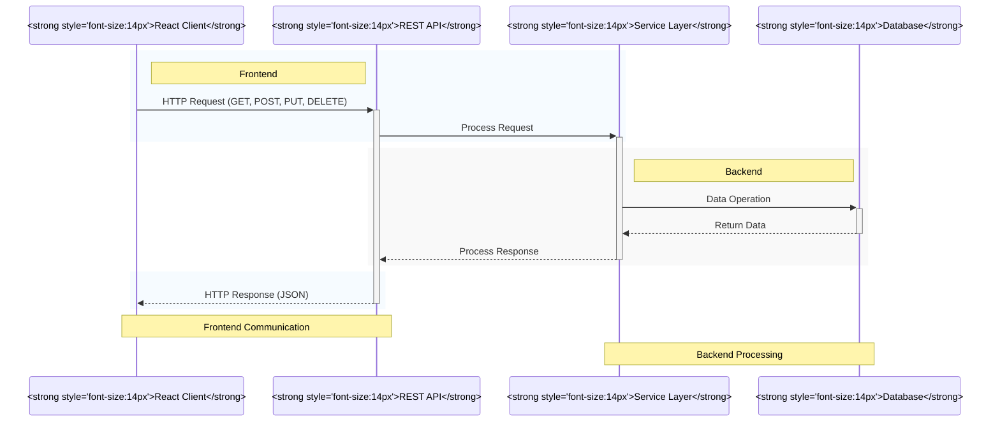
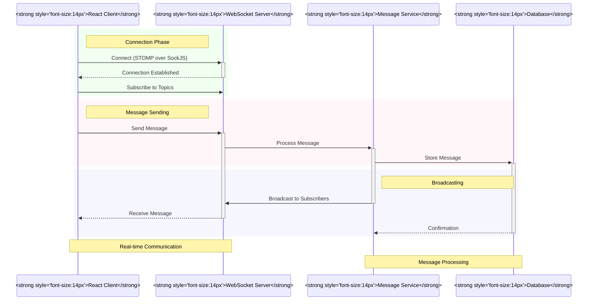
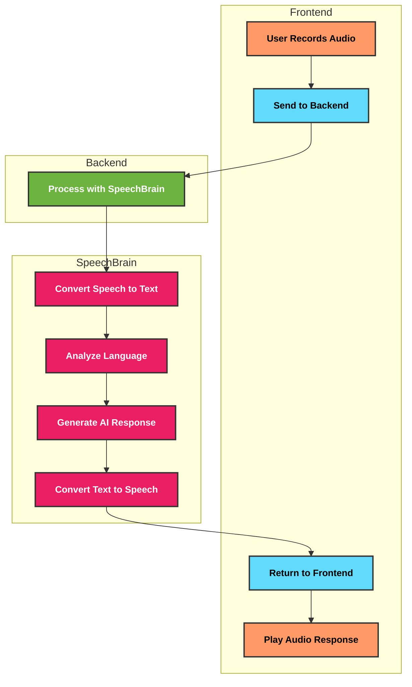

# Architecture

## Architecture Overview

The Haaga Backend Programming project follows a modern, scalable architecture that separates concerns between frontend and backend components while enabling real-time communication and integration with AI services. The system is designed to be modular, maintainable, and secure, demonstrating best practices in full-stack development.

## Key Architectural Components

### Frontend Architecture (study/typescript-react)

The frontend is built with React and TypeScript, following a component-based architecture with Redux Toolkit for state management.

Key components include:

- **React Components**: Modular UI components organized by feature
- **Redux Toolkit State Management**: Centralized state with slices for different domains
- **API Services**: Axios-based service layer for backend communication
- **WebSocket Communication**: Real-time data exchange using SockJS and STOMP
- **Custom Hooks**: Reusable logic for common operations
- **TypeScript Types**: Strong typing throughout the application

### Backend Architecture (study/study)

The backend is built with Spring Boot, following a layered architecture with controllers, services, and repositories.

Key components include:

- **REST Controllers**: API endpoints organized by domain
- **Service Layer**: Business logic implementation
- **Repository Layer**: Data access using Spring Data JPA
- **Security Layer**: JWT-based authentication with Spring Security
- **WebSocket Handlers**: Real-time message processing
- **SpeechBrain Integration**: AI-powered speech processing
- **External Services Integration**: OAuth providers and email services

## Communication Patterns

### REST API Communication

The frontend communicates with the backend primarily through RESTful API endpoints for CRUD operations and business logic. The API follows standard REST conventions with proper resource naming, HTTP methods, and status codes.

### WebSocket Communication

Real-time features like chat and notifications use WebSockets for bidirectional communication, enabling instant updates without polling.

## Data Flow

The system implements various data flows for different features:

### Authentication Flow

```mermaid
flowchart TD
    %% Styling
    classDef userAction fill:#FFD700,stroke:#333,stroke-width:2px,color:#000,font-weight:bold,font-size:14px
    classDef decision fill:#FF6347,stroke:#333,stroke-width:2px,color:#fff,font-weight:bold,font-size:14px
    classDef error fill:#DC143C,stroke:#333,stroke-width:2px,color:#fff,font-weight:bold,font-size:14px
    classDef process fill:#4169E1,stroke:#333,stroke-width:2px,color:#fff,font-weight:bold,font-size:14px
    classDef success fill:#32CD32,stroke:#333,stroke-width:2px,color:#fff,font-weight:bold,font-size:14px
    classDef token fill:#9370DB,stroke:#333,stroke-width:2px,color:#fff,font-weight:bold,font-size:14px

    %% Main Authentication Flow
    subgraph "Login Process"
        A[User Enters Credentials] --> B{Validate Input}
        B -->|Invalid| C[Show Error]
        B -->|Valid| D[Send to Auth Service]
        D --> E{Authentication}
        E -->|Failure| F[Show Error]
        E -->|Success| G[Generate JWT]
        G --> H[Store Token]
        H --> I[Redirect to Dashboard]
    end

    %% Token Refresh Flow
    subgraph "Token Management"
        J[Token Expiring] --> K[Refresh Token]
        K -->|Success| L[Update Stored Token]
        K -->|Failure| M[Logout User]
    end

    %% Apply styles
    class A,J userAction
    class B,E decision
    class C,F error
    class D,K process
    class G,H,L token
    class I,M success
```

### Speech Processing Flow

### User Management Flow

The system implements role-based access control with a comprehensive permission system:

- **User Registration**: Secure signup with email verification
- **Role Assignment**: Users can be assigned multiple roles
- **Permission Management**: Granular control over system access
- **User Administration**: Complete user lifecycle management

### Task Management Flow

The Kanban board implements a drag-and-drop task management system:

- **Board Creation**: Users can create multiple boards
- **Column Management**: Customizable workflow stages
- **Task CRUD**: Create, read, update, and delete tasks
- **Task Assignment**: Assign tasks to users
- **Priority Management**: Set and visualize task priorities