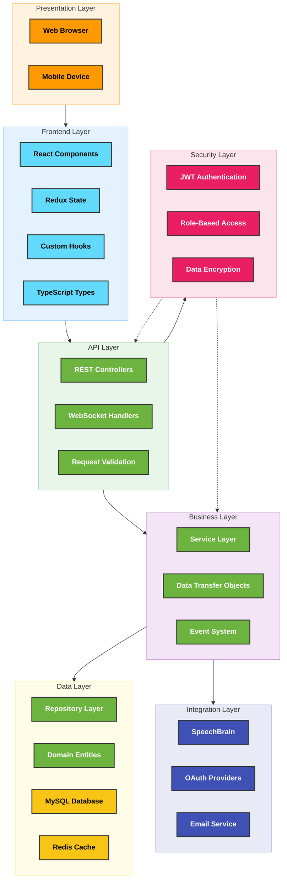
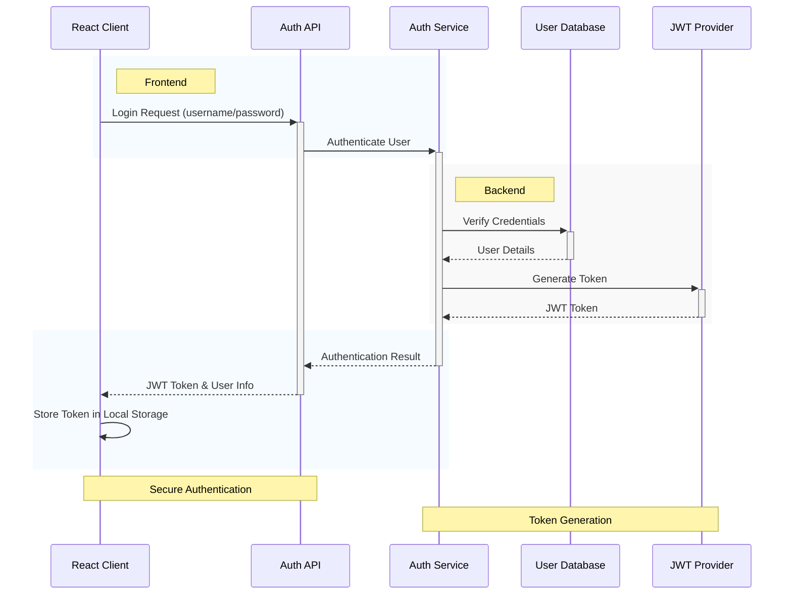
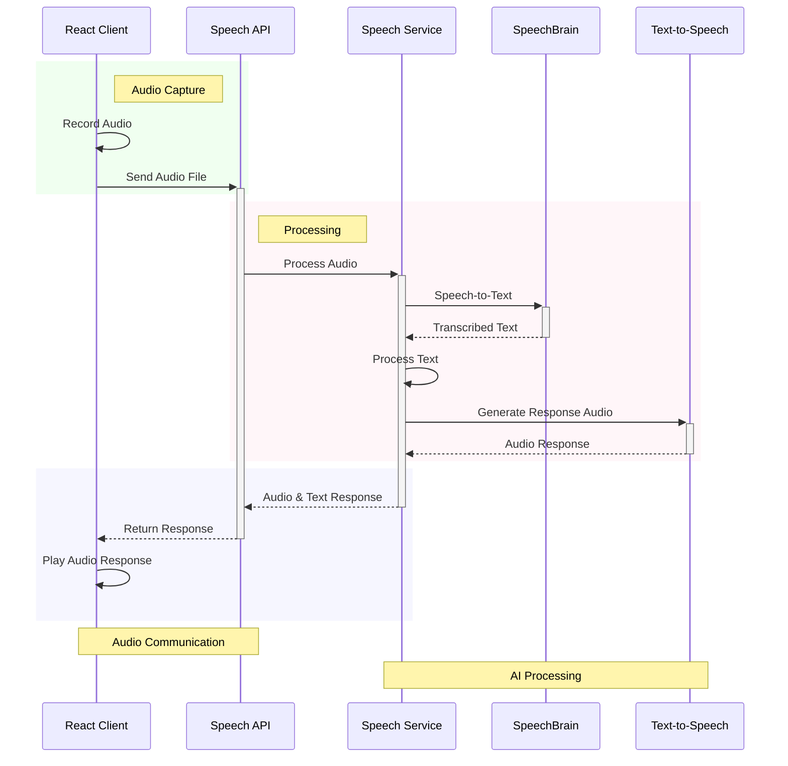
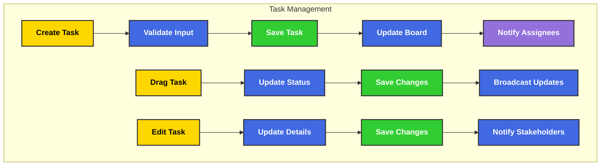

# Architecture

  

    <h2>Enterprise-Grade System Architecture</h2>
    
A modern, scalable, and secure architecture designed for optimal performance and maintainability

  

  

    
🏗️

    
5

    
Architectural Layers

  

  

    
🔄

    
3

    
Communication Patterns

  

  

    
🔌

    
10+

    
Integration Points

  

  

    
🛡️

    
4

    
Security Layers

  

## System Architecture

Enterprise Nexus implements a modern, layered architecture that ensures scalability, maintainability, and security:

  

    
🏗️

    
Architectural Layers

  

  

    

      

        
⚛️

        <h3 className="architecture-card-title">Frontend Layer</h3>
      

      

        Component-based architecture using React and TypeScript with Redux Toolkit for state management, providing a responsive and interactive user interface.
      

      

        Component Hierarchy
        Centralized State Management
        Type-Safe Development
      

    

    
    

      

        
🔌

        <h3 className="architecture-card-title">API Layer</h3>
      

      

        RESTful API endpoints and WebSocket handlers that provide a clean interface between frontend and backend, with proper validation and error handling.
      

      

        REST Controllers
        WebSocket Communication
        Request/Response Validation
      

    

    
    

      

        
⚙️

        <h3 className="architecture-card-title">Business Layer</h3>
      

      

        Core business logic implementation with service classes, DTOs for data transfer, and an event system for decoupled communication between components.
      

      

        Service-Oriented Design
        Business Logic Encapsulation
        Event-Driven Architecture
      

    

    
    

      

        
💾

        <h3 className="architecture-card-title">Data Layer</h3>
      

      

        Data access and persistence using Spring Data JPA repositories, domain entities, and a combination of MySQL for relational data and Redis for caching.
      

      

        Repository Pattern
        ORM with JPA/Hibernate
        Caching Strategy
      

    

    
    

      

        
🔒

        <h3 className="architecture-card-title">Security Layer</h3>
      

      

        Comprehensive security implementation with JWT authentication, role-based access control, and data encryption for sensitive information.
      

      

        Token-Based Authentication
        Authorization Framework
        Secure Communication
      

    

  

  

    
🔄

    
Communication Patterns

  

  

    

      

        
🔄

        <h3 className="architecture-card-title">REST Communication</h3>
      

      

        Standard HTTP-based communication for CRUD operations and business logic, following RESTful principles with proper resource naming and status codes.
      

      

        Resource-Oriented Design
        HTTP Methods (GET, POST, PUT, DELETE)
        JSON Data Exchange
      

    

    
    

      

        
⚡

        <h3 className="architecture-card-title">WebSocket Communication</h3>
      

      

        Bidirectional real-time communication for features like chat and notifications, using SockJS for cross-browser compatibility and STOMP for messaging patterns.
      

      

        Persistent Connections
        Topic Subscription
        Real-Time Updates
      

    

    
    

      

        
📨

        <h3 className="architecture-card-title">Event-Driven Communication</h3>
      

      

        Internal communication between system components using an event bus, enabling loose coupling and better scalability through asynchronous processing.
      

      

        Publisher-Subscriber Pattern
        Asynchronous Processing
        System Decoupling
      

    

  

## Data Flow Diagrams

### Authentication Flow

### Speech Processing Flow

### Task Management Flow

  

    
🔍

    
Architectural Decisions

  

  

    

      
🔄

      

        <h3>Layered Architecture</h3>
        
The system uses a clear layered architecture to separate concerns, improve maintainability, and enable independent testing of components. Each layer has a specific responsibility and communicates with adjacent layers through well-defined interfaces.

      

    

    
    

      
⚡

      

        <h3>Real-Time Communication</h3>
        
WebSockets were chosen over polling for real-time features to reduce server load, minimize latency, and provide a better user experience. The STOMP protocol adds message routing capabilities on top of the raw WebSocket connection.

      

    

    
    

      
🔒

      

        <h3>JWT Authentication</h3>
        
JWT tokens provide a stateless authentication mechanism that scales well in distributed systems. They contain all necessary user information, reducing database lookups and enabling efficient validation across services.

      

    

    
    

      
📦

      

        <h3>Centralized State Management</h3>
        
Redux Toolkit was selected for state management to provide a predictable state container with powerful debugging capabilities, middleware support, and a standardized approach to handling complex application state.

      

    

  

