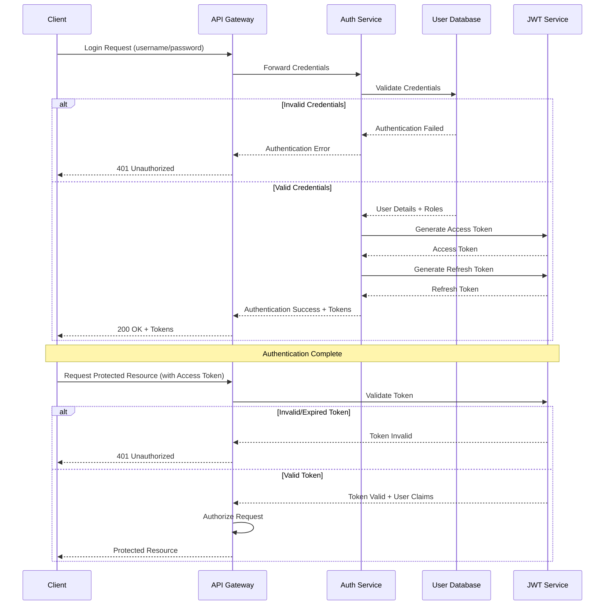
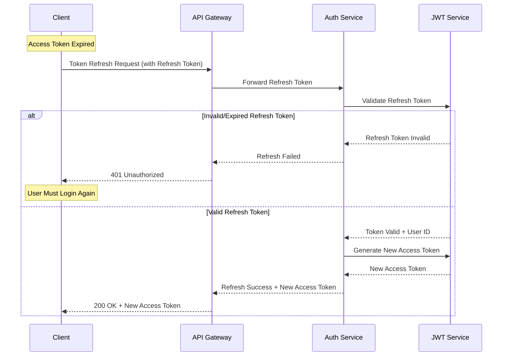
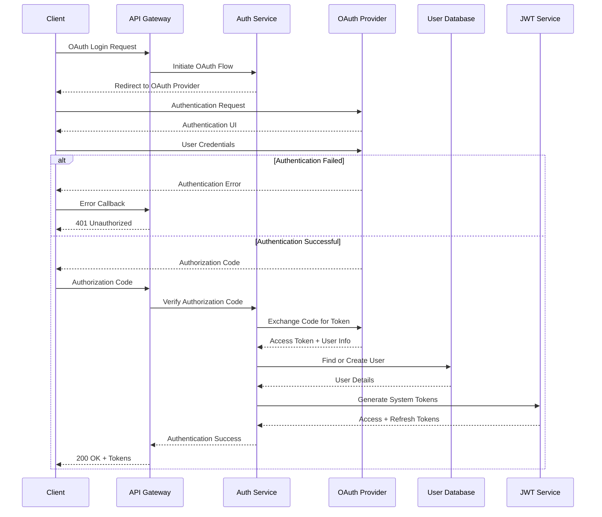
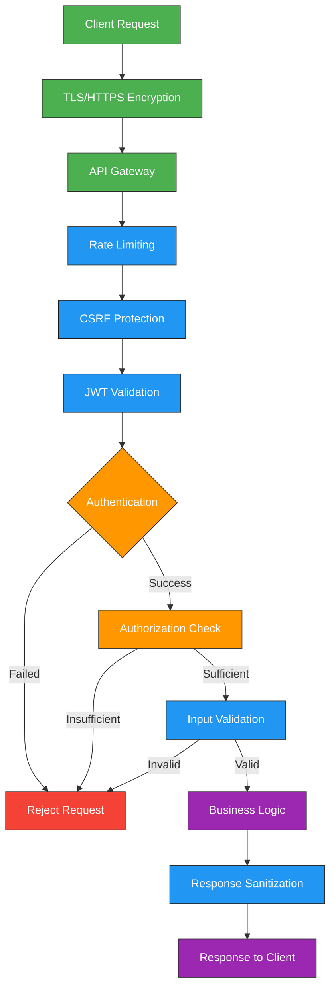
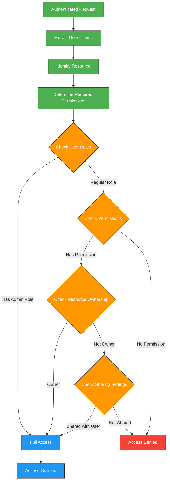
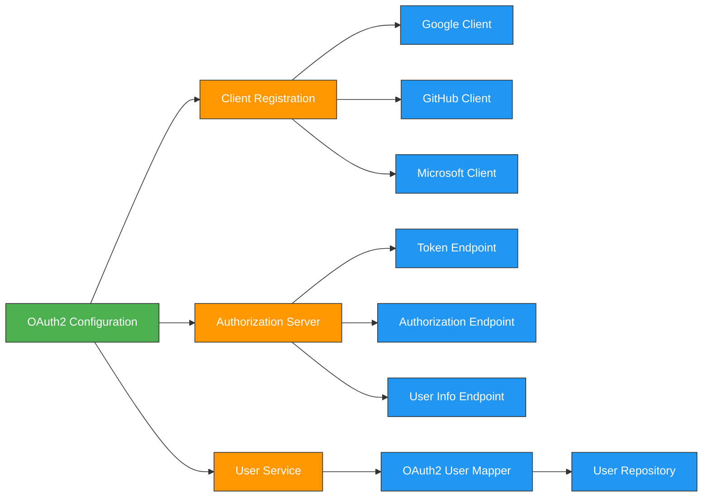
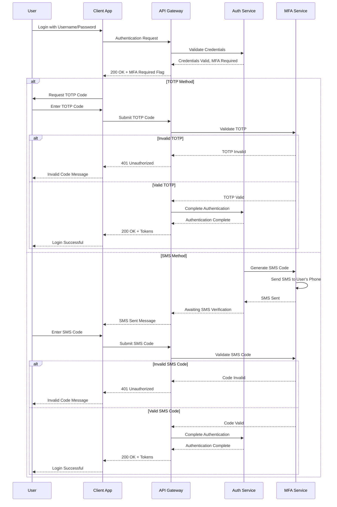
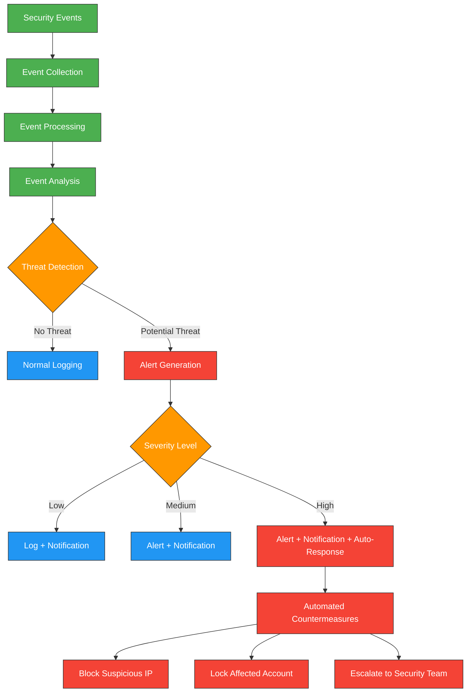

---
sidebar_position: 3
sidebar_label: "Authentication"
---

# Authentication & Security

## Authentication Architecture and Workflows

### JWT Authentication Workflow

### Token Refresh Workflow

### OAuth2 Authentication Workflow

## Authentication Overview

The Enterprise Nexus Project implements a comprehensive authentication system using JWT (JSON Web Tokens) as the primary authentication mechanism. This stateless approach provides secure, scalable authentication while supporting multiple authentication methods including username/password, OAuth2, and multi-factor authentication.

## Security Architecture

### Security Layers and Components

### Security Features

| Security Feature | Implementation | Purpose |
|------------------|----------------|---------|
| Password Security | BCrypt hashing with salt | Protect user credentials |
| Access Control | Role-based + Permission-based | Limit access to authorized users |
| Transport Security | TLS 1.3 with strong ciphers | Secure data in transit |
| CSRF Protection | Double-submit cookie pattern | Prevent cross-site request forgery |
| XSS Protection | Output encoding + Content-Security-Policy | Prevent cross-site scripting |
| Rate Limiting | IP-based + User-based throttling | Prevent brute force attacks |
| Input Validation | Server-side validation with strict schemas | Prevent injection attacks |
| Audit Logging | Comprehensive security event logging | Track security events |

### Authorization Workflow

## OAuth2 Integration

The system supports OAuth2 authentication with multiple providers, allowing users to authenticate using their existing accounts.

### Supported OAuth2 Providers

| Provider | Scope | User Data Retrieved |
|----------|-------|---------------------|
| Google | email, profile | Email, Name, Profile Picture |
| GitHub | user:email, read:user | Email, Username, Avatar |
| Microsoft | User.Read | Email, Display Name, Profile |

### OAuth2 Configuration

## Multi-Factor Authentication

The system implements multi-factor authentication (MFA) to provide an additional layer of security beyond passwords.

### MFA Workflow

### MFA Methods

| Method | Implementation | User Experience |
|--------|----------------|-----------------|
| TOTP | RFC 6238 compliant | User generates code from authenticator app |
| SMS | One-time codes sent via SMS | User receives code via text message |

## Security Monitoring and Incident Response

The system includes comprehensive security monitoring and incident response capabilities:

### Security Monitoring Workflow

