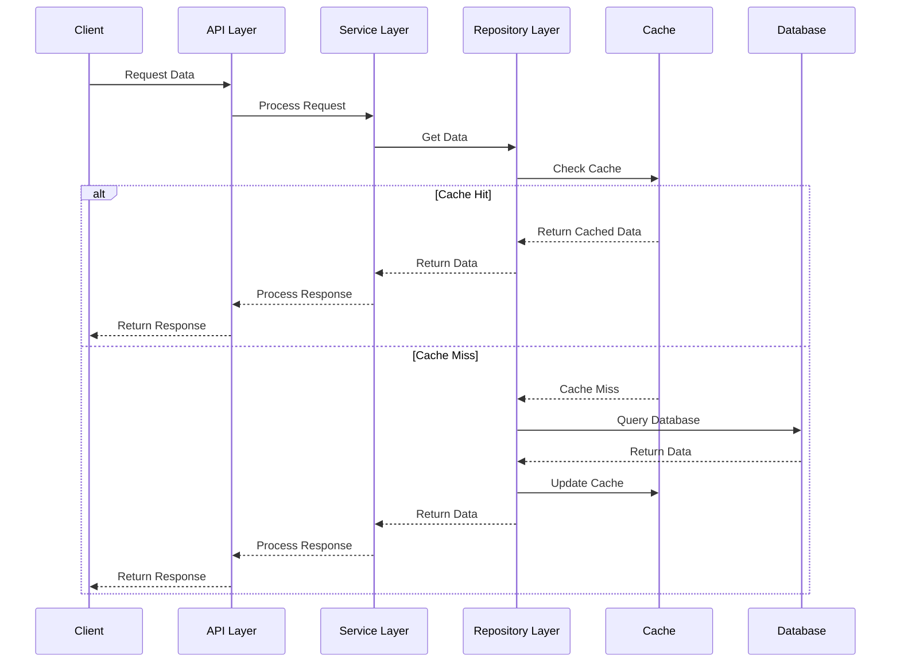

---
sidebar_position: 4
sidebar_label: "Database Design"
---

import PanzoomWrapper from '@site/src/components/MermaidDiagram/PanzoomWrapper';

# Database Design

## Database Architecture and Workflows

### Data Access Workflow

<PanzoomWrapper>
<div id="data-access-workflow">



</div>
</PanzoomWrapper>

### Database Transaction Workflow

<PanzoomWrapper>
<div id="database-transaction-workflow-diagram">
```mermaid
flowchart TD
    A[Service Method] --> B[Begin Transaction]
    B --> C[Execute Database Operations]
    C --> D{Success?}

    D -->|Yes| E[Commit Transaction]
    D -->|No| F[Rollback Transaction]

    E --> G[Return Result]
    F --> H[Throw Exception]

    subgraph "Transaction Boundary"
        B
        C
        D
        E
        F
    end

    classDef primaryServices fill:#4CAF50,stroke:#333,stroke-width:1px,color:#fff
    classDef dataStores fill:#FF9800,stroke:#333,stroke-width:1px,color:#fff
    classDef queryLayer fill:#2196F3,stroke:#333,stroke-width:1px,color:#fff
    classDef cacheLayer fill:#F44336,stroke:#333,stroke-width:1px,color:#fff

    class A,G,H primaryServices
    class B,E,F dataStores
    class C queryLayer
    class D cacheLayer

````

</div>
</PanzoomWrapper>

### Data Synchronization Workflow

<PanzoomWrapper>
<div id="data-synchronization-workflow-diagram">
```mermaid
sequenceDiagram
    participant Service as Service
    participant Queue as Message Queue
    participant Worker as Worker Service
    participant DB as Primary Database
    participant Cache as Cache
    participant Search as Search Index

    Service->>DB: Update Data
    Service->>Queue: Publish Change Event

    Queue->>Worker: Process Change Event
    Worker->>Cache: Invalidate Cache
    Worker->>Search: Update Search Index

    alt Complex Sync
        Worker->>Worker: Transform Data
        Worker->>DB: Update Related Data
        Worker->>Queue: Publish Secondary Event
    end

    Worker-->>Queue: Acknowledge Event

````

</div>
</PanzoomWrapper>

## Database Overview

The Enterprise Nexus Project uses MySQL as its primary database, with additional specialized data stores for specific use cases. The database architecture is designed for high performance, scalability, and data integrity.

## Database Schema Design

### Entity Relationship Diagram

<PanzoomWrapper>
<div id="entity-relationship-diagram">

```mermaid
erDiagram
    USERS {
        uuid id PK
        string username
        string email
        string password_hash
        string first_name
        string last_name
        enum role
        boolean is_active
        timestamp created_at
        timestamp updated_at
    }

    AUTHENTICATION {
        uuid id PK
        uuid user_id FK
        string token
        string refresh_token
        timestamp expires_at
        timestamp created_at
    }

    ROLES {
        uuid id PK
        string name
        string description
    }

    USER_ROLES {
        uuid user_id FK
        uuid role_id FK
    }

    PERMISSIONS {
        uuid id PK
        string name
        string description
        string resource
        enum permission_type
    }

    ROLE_PERMISSIONS {
        uuid role_id FK
        uuid permission_id FK
    }

    CHATS {
        uuid id PK
        string name
        enum type
        timestamp created_at
        timestamp updated_at
    }

    CHAT_PARTICIPANTS {
        uuid chat_id FK
        uuid user_id FK
        enum role
        timestamp joined_at
    }

    MESSAGES {
        uuid id PK
        uuid chat_id FK
        uuid sender_id FK
        text content
        enum content_type
        timestamp sent_at
        timestamp edited_at
    }

    MESSAGE_READS {
        uuid message_id FK
        uuid user_id FK
        timestamp read_at
    }

    BOARDS {
        uuid id PK
        string name
        string description
        uuid owner_id FK
        timestamp created_at
        timestamp updated_at
    }

    BOARD_MEMBERS {
        uuid board_id FK
        uuid user_id FK
        enum role
        timestamp joined_at
    }

    COLUMNS {
        uuid id PK
        uuid board_id FK
        string name
        int position
        timestamp created_at
    }

    TASKS {
        uuid id PK
        uuid column_id FK
        string title
        text description
        enum priority
        int position
        uuid assignee_id FK
        timestamp due_date
        uuid created_by FK
        timestamp created_at
        timestamp updated_at
    }

    TASK_TAGS {
        uuid task_id FK
        uuid tag_id FK
    }

    TAGS {
        uuid id PK
        string name
        string color
    }

    EVENTS {
        uuid id PK
        string title
        text description
        timestamp start_time
        timestamp end_time
        string location
        boolean all_day
        boolean recurring
        string recurrence_pattern
        uuid organizer_id FK
        timestamp created_at
        timestamp updated_at
    }

    EVENT_ATTENDEES {
        uuid event_id FK
        uuid user_id FK
        enum status
        timestamp responded_at
    }

    SPEECH_RECORDS {
        uuid id PK
        uuid user_id FK
        string file_path
        text transcript
        float duration
        timestamp created_at
    }

    USERS ||--o{ AUTHENTICATION : "has"
    USERS ||--o{ USER_ROLES : "has"
    ROLES ||--o{ USER_ROLES : "assigned to"
    ROLES ||--o{ ROLE_PERMISSIONS : "has"
    PERMISSIONS ||--o{ ROLE_PERMISSIONS : "granted to"

    USERS ||--o{ CHAT_PARTICIPANTS : "participates in"
    CHATS ||--o{ CHAT_PARTICIPANTS : "has"
    USERS ||--o{ MESSAGES : "sends"
    CHATS ||--o{ MESSAGES : "contains"
    MESSAGES ||--o{ MESSAGE_READS : "read by"
    USERS ||--o{ MESSAGE_READS : "reads"

    USERS ||--o{ BOARDS : "owns"
    BOARDS ||--o{ BOARD_MEMBERS : "has"
    USERS ||--o{ BOARD_MEMBERS : "member of"
    BOARDS ||--o{ COLUMNS : "contains"
    COLUMNS ||--o{ TASKS : "contains"
    USERS ||--o{ TASKS : "assigned to"
    TASKS ||--o{ TASK_TAGS : "has"
    TAGS ||--o{ TASK_TAGS : "applied to"

    USERS ||--o{ EVENTS : "organizes"
    EVENTS ||--o{ EVENT_ATTENDEES : "has"
    USERS ||--o{ EVENT_ATTENDEES : "attends"

    USERS ||--o{ SPEECH_RECORDS : "creates"
```

</div>
</PanzoomWrapper>

## Database Implementation

### Key Tables and Relationships

The database schema is organized into functional modules:

#### User Management Module

| Table              | Description                 | Key Relationships                                 |
| ------------------ | --------------------------- | ------------------------------------------------- |
| `users`            | Core user information       | One-to-many with authentication, messages, boards |
| `authentication`   | Auth tokens and credentials | Many-to-one with users                            |
| `roles`            | System roles definitions    | Many-to-many with users via user_roles            |
| `user_roles`       | User-role assignments       | Junction table between users and roles            |
| `permissions`      | System permissions          | Many-to-many with roles via role_permissions      |
| `role_permissions` | Role-permission assignments | Junction table between roles and permissions      |

#### Communication Module

| Table               | Description                  | Key Relationships                                  |
| ------------------- | ---------------------------- | -------------------------------------------------- |
| `chats`             | Chat rooms and conversations | One-to-many with messages, many-to-many with users |
| `chat_participants` | Chat membership              | Junction table between chats and users             |
| `messages`          | Individual chat messages     | Many-to-one with chats and users (sender)          |
| `message_reads`     | Message read receipts        | Junction table between messages and users          |

#### Task Management Module

| Table           | Description              | Key Relationships                                 |
| --------------- | ------------------------ | ------------------------------------------------- |
| `boards`        | Kanban boards            | One-to-many with columns, many-to-many with users |
| `board_members` | Board membership         | Junction table between boards and users           |
| `columns`       | Kanban board columns     | One-to-many with tasks, many-to-one with boards   |
| `tasks`         | Individual tasks         | Many-to-one with columns and users (assignee)     |
| `tags`          | Task categorization tags | Many-to-many with tasks via task_tags             |
| `task_tags`     | Task-tag assignments     | Junction table between tasks and tags             |

#### Calendar Module

| Table             | Description      | Key Relationships                                                       |
| ----------------- | ---------------- | ----------------------------------------------------------------------- |
| `events`          | Calendar events  | Many-to-one with users (organizer), many-to-many with users (attendees) |
| `event_attendees` | Event attendance | Junction table between events and users                                 |

#### Speech Processing Module

| Table            | Description                       | Key Relationships      |
| ---------------- | --------------------------------- | ---------------------- |
| `speech_records` | Speech recordings and transcripts | Many-to-one with users |

### Database Indexing Strategy

<PanzoomWrapper>
<div id="database-indexing-strategy">
```mermaid
flowchart TD
    A[Database Table] --> B{Access Pattern}

    B -->|Primary Key Lookup| C[Primary Key Index]
    B -->|Foreign Key Joins| D[Foreign Key Index]
    B -->|Range Queries| E[Range Index]
    B -->|Full-Text Search| F[Full-Text Index]
    B -->|Composite Queries| G[Composite Index]

    C --> H[Optimized Query]
    D --> H
    E --> H
    F --> H
    G --> H

    classDef inputQuery fill:#4CAF50,stroke:#333,stroke-width:1px,color:#fff
    classDef analyzer fill:#FF9800,stroke:#333,stroke-width:1px,color:#fff
    classDef optimizationSteps fill:#2196F3,stroke:#333,stroke-width:1px,color:#fff
    classDef finalQuery fill:#9C27B0,stroke:#333,stroke-width:1px,color:#fff

    class A inputQuery
    class B analyzer
    class C,D,E,F,G optimizationSteps
    class H finalQuery

````

</div>
</PanzoomWrapper>

The system implements the following indexing strategies:

| Index Type  | Tables              | Purpose                      | Example                        |
| ----------- | ------------------- | ---------------------------- | ------------------------------ |
| Primary Key | All tables          | Unique record identification | `users(id)`                    |
| Foreign Key | Relationship tables | Efficient joins              | `messages(sender_id)`          |
| Composite   | Filtered queries    | Multi-column filtering       | `tasks(assignee_id, status)`   |
| Full-Text   | Content tables      | Text search                  | `messages(content)`            |
| Range       | Date-based tables   | Time-range queries           | `events(start_time, end_time)` |

## Data Access Patterns

### Repository Layer Implementation

<PanzoomWrapper>
<div id="repository-layer-implementation">

```mermaid
classDiagram
    class CrudRepository~T, ID~ {
        +T findById(ID id)
        +List~T~ findAll()
        +T save(T entity)
        +void delete(T entity)
        +boolean existsById(ID id)
        +long count()
    }

    class UserRepository {
        +User findByUsername(String username)
        +User findByEmail(String email)
        +List~User~ findByRole(Role role)
    }

    class MessageRepository {
        +List~Message~ findByChatId(UUID chatId)
        +List~Message~ findBySenderId(UUID senderId)
        +List~Message~ findByContentContaining(String text)
    }

    class TaskRepository {
        +List~Task~ findByAssigneeId(UUID assigneeId)
        +List~Task~ findByStatus(TaskStatus status)
        +List~Task~ findByDueDateBefore(Date date)
    }

    CrudRepository <|-- UserRepository
    CrudRepository <|-- MessageRepository
    CrudRepository <|-- TaskRepository
````

</div>
</PanzoomWrapper>

### Query Optimization Techniques

The system employs several query optimization techniques:

1. **Prepared Statements**: All database queries use prepared statements for security and performance
2. **Query Pagination**: Large result sets are paginated to limit memory usage
3. **Eager/Lazy Loading**: Relationships are loaded based on access patterns
4. **Query Caching**: Frequently accessed data is cached at the repository layer
5. **Database Connection Pooling**: Connection management for optimal resource usage

