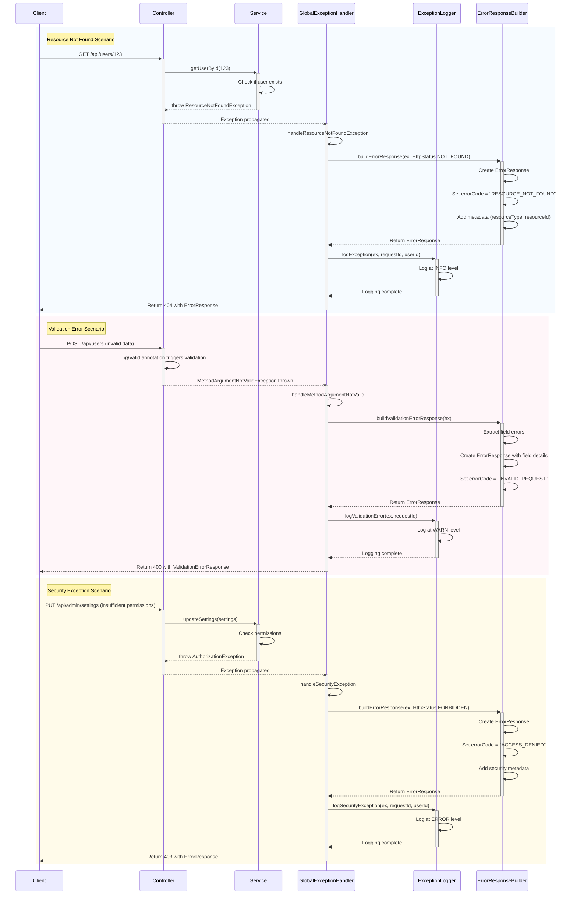

---
sidebar_position: 8
sidebar_label: "Exception Handling"
---

import PanzoomWrapper from '@site/src/components/MermaidDiagram/PanzoomWrapper';

# Exception Handling

## Exception Handling Architecture and Components

### System Architecture

<PanzoomWrapper>
<div id="exception-handling-architecture-diagram">
```mermaid
classDiagram
    class ExceptionHandlingModule {
        +GlobalExceptionHandler exceptionHandler
        +ErrorResponseBuilder responseBuilder
        +ExceptionLogger logger
        +ErrorCodeRegistry errorCodeRegistry
    }

    class GlobalExceptionHandler {
        +handleAppException(AppException ex)
        +handleResourceNotFoundException(ResourceNotFoundException ex)
        +handleValidationException(ValidationException ex)
        +handleSecurityException(SecurityException ex)
        +handleMethodArgumentNotValid(MethodArgumentNotValidException ex)
        +handleHttpMessageNotReadable(HttpMessageNotReadableException ex)
        +handleGeneralException(Exception ex)
    }

    class ErrorResponseBuilder {
        +buildErrorResponse(Exception ex, HttpStatus status)
        +buildValidationErrorResponse(MethodArgumentNotValidException ex)
        +buildApiErrorResponse(AppException ex)
        +addErrorMetadata(ErrorResponse response, Exception ex)
        +formatErrorMessage(String message, Object... args)
    }

    class ExceptionLogger {
        +logException(Exception ex, String requestId, String userId)
        +logValidationError(MethodArgumentNotValidException ex, String requestId)
        +logSecurityException(SecurityException ex, String requestId, String userId)
        +determineLogLevel(Exception ex)
        +extractRequestDetails(HttpServletRequest request)
    }

    class ErrorCodeRegistry {
        +Map~String, ErrorCodeDefinition~ errorCodes
        +getErrorCode(String code)
        +getHttpStatus(String code)
        +getSeverity(String code)
        +registerErrorCode(String code, HttpStatus status, Severity severity)
    }

    class AppException {
        +String errorCode
        +String message
        +Map~String, Object~ metadata
        +AppException(String message)
        +AppException(String errorCode, String message)
        +AppException(String errorCode, String message, Map metadata)
        +withMetadata(String key, Object value)
    }

    class ResourceNotFoundException {
        +String resourceType
        +String resourceId
        +ResourceNotFoundException(String resourceType, String resourceId)
        +ResourceNotFoundException(String message)
    }

    class ValidationException {
        +List~FieldError~ fieldErrors
        +ValidationException(String message)
        +ValidationException(String message, List~FieldError~ fieldErrors)
        +addFieldError(String field, String message)
    }

    class SecurityException {
        +String userId
        +String action
        +SecurityException(String message)
        +SecurityException(String message, String userId, String action)
    }

    class ErrorResponse {
        +String message
        +String errorCode
        +String timestamp
        +String code
        +Map~String, Object~ extraInfo
    }

    class ApiErrorResponse {
        +int code
        +String message
        +String httpStatus
        +String httpCode
        +String severity
        +Map~String, Object~ metadata
    }

    class ErrorCodeDefinition {
        +String code
        +HttpStatus httpStatus
        +Severity severity
        +String description
    }

    ExceptionHandlingModule *-- GlobalExceptionHandler
    ExceptionHandlingModule *-- ErrorResponseBuilder
    ExceptionHandlingModule *-- ExceptionLogger
    ExceptionHandlingModule *-- ErrorCodeRegistry
    GlobalExceptionHandler --> ErrorResponseBuilder : uses
    GlobalExceptionHandler --> ExceptionLogger : uses
    GlobalExceptionHandler --> ErrorCodeRegistry : uses
    ErrorResponseBuilder --> ErrorResponse : creates
    ErrorResponseBuilder --> ApiErrorResponse : creates
    AppException <|-- ResourceNotFoundException
    AppException <|-- ValidationException
    AppException <|-- SecurityException
    ErrorCodeRegistry --> ErrorCodeDefinition : contains

````

</div>
</PanzoomWrapper>

### Exception Hierarchy
<PanzoomWrapper>
<div id="exception-hierarchy-diagram">
```mermaid
classDiagram
    class RuntimeException {
        +String message
        +Throwable cause
        +RuntimeException(String message)
        +RuntimeException(String message, Throwable cause)
    }

    class AppException {
        +String errorCode
        +Map~String, Object~ metadata
        +AppException(String message)
        +AppException(String errorCode, String message)
        +withMetadata(String key, Object value)
    }

    class ResourceNotFoundException {
        +String resourceType
        +String resourceId
        +ResourceNotFoundException(String resourceType, String resourceId)
    }

    class EntityNotFoundException {
        +String entityName
        +String entityId
        +EntityNotFoundException(String entityName, String entityId)
    }

    class ValidationException {
        +List~FieldError~ fieldErrors
        +ValidationException(String message)
        +ValidationException(List~FieldError~ fieldErrors)
        +addFieldError(String field, String message)
    }

    class SecurityException {
        +String userId
        +String action
        +SecurityException(String message)
        +SecurityException(String message, String userId)
    }

    class AuthenticationException {
        +String username
        +AuthenticationException(String message)
        +AuthenticationException(String message, String username)
    }

    class AuthorizationException {
        +String requiredRole
        +AuthorizationException(String message)
        +AuthorizationException(String message, String requiredRole)
    }

    class InvalidTokenException {
        +String tokenType
        +InvalidTokenException(String message)
        +InvalidTokenException(String message, String tokenType)
    }

    class BusinessException {
        +String businessRule
        +BusinessException(String message)
        +BusinessException(String message, String businessRule)
    }

    class ExternalServiceException {
        +String serviceName
        +int statusCode
        +ExternalServiceException(String message)
        +ExternalServiceException(String message, String serviceName, int statusCode)
    }

    RuntimeException <|-- AppException
    AppException <|-- ResourceNotFoundException
    ResourceNotFoundException <|-- EntityNotFoundException
    AppException <|-- ValidationException
    AppException <|-- SecurityException
    SecurityException <|-- AuthenticationException
    SecurityException <|-- AuthorizationException
    SecurityException <|-- InvalidTokenException
    AppException <|-- BusinessException
    AppException <|-- ExternalServiceException
````

</div>
</PanzoomWrapper>

## Exception Handling Workflows

### Main Exception Handling Flow

<PanzoomWrapper>
<div id="main-exception-handling-flow-diagram">
```mermaid
flowchart TD
    %% Main components
    A[Client Request] --> B[Controller Layer]
    B --> C{Error Occurs?}
    C -->|No| D[Normal Processing]
    D --> E[Success Response]

    %% Exception flow
    C -->|Yes| F[Exception Thrown]
    F --> G[GlobalExceptionHandler]

    %% Exception types
    G --> H{Exception Type}
    H -->|AppException| I[Handle AppException]
    H -->|ResourceNotFoundException| J[Handle ResourceNotFoundException]
    H -->|ValidationException| K[Handle ValidationException]
    H -->|SecurityException| L[Handle SecurityException]
    H -->|Other| M[Handle General Exception]

    %% Response generation
    I --> N[Generate Error Response]
    J --> N
    K --> N
    L --> N
    M --> N

    %% Logging and response
    N --> O[Log Exception Details]
    O --> P[Return Error Response]

    %% Styling
    classDef process fill:#4CAF50,stroke:#333,stroke-width:1px,color:#fff
    classDef decision fill:#FF9800,stroke:#333,stroke-width:1px,color:#fff
    classDef endpoint fill:#2196F3,stroke:#333,stroke-width:1px,color:#fff
    classDef error fill:#F44336,stroke:#333,stroke-width:1px,color:#fff

    class A,B,D,E,O process
    class C,H decision
    class P endpoint
    class F,G,I,J,K,L,M,N error

````
</div>
</PanzoomWrapper>

### Validation Exception Flow
<PanzoomWrapper>
<div id="validation-exception-flow-diagram">

```mermaid
flowchart TD
    %% Main flow
    A[Client Request] --> B[Controller Method]
    B --> C[Method Parameter Validation]
    C --> D{Validation Errors?}

    %% Success path
    D -->|No| E[Process Request]
    E --> F[Return Success Response]

    %% Error path
    D -->|Yes| G[MethodArgumentNotValidException Thrown]
    G --> H[GlobalExceptionHandler.handleMethodArgumentNotValid]
    H --> I[Extract Field Errors]
    I --> J[Build Validation Error Response]
    J --> K[Log Validation Errors]
    K --> L[Return 400 Bad Request]

    %% Custom validation
    B --> M[Custom Validation Logic]
    M --> N{Custom Validation Errors?}
    N -->|No| E
    N -->|Yes| O[Throw ValidationException]
    O --> P[GlobalExceptionHandler.handleValidationException]
    P --> Q[Build Error Response]
    Q --> R[Log Validation Exception]
    R --> L

    %% Styling
    classDef process fill:#4CAF50,stroke:#333,stroke-width:1px,color:#fff
    classDef decision fill:#FF9800,stroke:#333,stroke-width:1px,color:#fff
    classDef endpoint fill:#2196F3,stroke:#333,stroke-width:1px,color:#fff
    classDef error fill:#F44336,stroke:#333,stroke-width:1px,color:#fff

    class A,B,C,E,I,J,K,M process
    class D,N decision
    class F,L endpoint
    class G,H,O,P,Q,R error
````

</div>
</PanzoomWrapper>

### Security Exception Flow

<PanzoomWrapper>
<div id="security-exception-flow-diagram">

```mermaid
flowchart TD
    %% Main flow
    A[Client Request] --> B[Security Filter Chain]
    B --> C{Valid Authentication?}

    %% Authentication path
    C -->|No| D[Throw AuthenticationException]
    D --> E[GlobalExceptionHandler.handleSecurityException]
    E --> F[Build Error Response]
    F --> G[Log Security Exception]
    G --> H[Return 401 Unauthorized]

    %% Authorization path
    C -->|Yes| I[Controller Method]
    I --> J[Authorization Check]
    J --> K{Has Permission?}
    K -->|No| L[Throw AuthorizationException]
    L --> M[GlobalExceptionHandler.handleSecurityException]
    M --> N[Build Error Response]
    N --> O[Log Security Exception]
    O --> P[Return 403 Forbidden]

    %% Success path
    K -->|Yes| Q[Process Request]
    Q --> R[Return Success Response]

    %% Token validation
    B --> S[JWT Token Validation]
    S --> T{Valid Token?}
    T -->|No| U[Throw InvalidTokenException]
    U --> V[GlobalExceptionHandler.handleSecurityException]
    V --> W[Build Error Response]
    W --> X[Log Security Exception]
    X --> H
    T -->|Yes| I

    %% Styling
    classDef process fill:#4CAF50,stroke:#333,stroke-width:1px,color:#fff
    classDef decision fill:#FF9800,stroke:#333,stroke-width:1px,color:#fff
    classDef endpoint fill:#2196F3,stroke:#333,stroke-width:1px,color:#fff
    classDef error fill:#F44336,stroke:#333,stroke-width:1px,color:#fff

    class A,B,I,J,Q,S process
    class C,K,T decision
    class H,P,R endpoint
    class D,E,F,G,L,M,N,O,U,V,W,X error
```

</div>
</PanzoomWrapper>

### Exception Handling Sequence

<PanzoomWrapper>
<div id="exception-handling-sequence-diagram">



</div>
</PanzoomWrapper>

## Exception Handling Overview

The Enterprise Nexus implements a comprehensive exception handling strategy that categorizes exceptions by HTTP status codes and provides detailed error information to clients. Our approach ensures consistent error responses across the application while maintaining detailed logging for troubleshooting.

## Implementation Details

### Global Exception Handler

The system uses Spring's `@ControllerAdvice` to handle exceptions globally through the `GlobalExceptionHandler` class. This centralized approach ensures that all exceptions are processed consistently, with appropriate HTTP status codes and structured error responses.

```java
@RestControllerAdvice
public class GlobalExceptionHandler {

    private final ErrorResponseBuilder errorResponseBuilder;
    private final ExceptionLogger exceptionLogger;
    private final ErrorCodeRegistry errorCodeRegistry;

    @Autowired
    public GlobalExceptionHandler(
            ErrorResponseBuilder errorResponseBuilder,
            ExceptionLogger exceptionLogger,
            ErrorCodeRegistry errorCodeRegistry) {
        this.errorResponseBuilder = errorResponseBuilder;
        this.exceptionLogger = exceptionLogger;
        this.errorCodeRegistry = errorCodeRegistry;
    }

    @ExceptionHandler(ResourceNotFoundException.class)
    public ResponseEntity<ErrorResponse> handleResourceNotFoundException(
            ResourceNotFoundException ex, HttpServletRequest request) {

        String requestId = request.getHeader("X-Request-ID");
        String userId = SecurityUtils.getCurrentUserId();

        // Log the exception
        exceptionLogger.logException(ex, requestId, userId);

        // Build error response
        ErrorResponse errorResponse = errorResponseBuilder.buildErrorResponse(
                ex, HttpStatus.NOT_FOUND);

        return new ResponseEntity<>(errorResponse, HttpStatus.NOT_FOUND);
    }

    @ExceptionHandler(ValidationException.class)
    public ResponseEntity<ErrorResponse> handleValidationException(
            ValidationException ex, HttpServletRequest request) {

        String requestId = request.getHeader("X-Request-ID");
        String userId = SecurityUtils.getCurrentUserId();

        // Log the exception
        exceptionLogger.logException(ex, requestId, userId);

        // Build error response
        ErrorResponse errorResponse = errorResponseBuilder.buildErrorResponse(
                ex, HttpStatus.BAD_REQUEST);

        return new ResponseEntity<>(errorResponse, HttpStatus.BAD_REQUEST);
    }

    @ExceptionHandler(MethodArgumentNotValidException.class)
    public ResponseEntity<ValidationErrorResponse> handleMethodArgumentNotValid(
            MethodArgumentNotValidException ex, HttpServletRequest request) {

        String requestId = request.getHeader("X-Request-ID");

        // Log validation errors
        exceptionLogger.logValidationError(ex, requestId);

        // Build validation error response
        ValidationErrorResponse errorResponse =
                errorResponseBuilder.buildValidationErrorResponse(ex);

        return new ResponseEntity<>(errorResponse, HttpStatus.BAD_REQUEST);
    }

    @ExceptionHandler(SecurityException.class)
    public ResponseEntity<ErrorResponse> handleSecurityException(
            SecurityException ex, HttpServletRequest request) {

        String requestId = request.getHeader("X-Request-ID");
        String userId = ex.getUserId() != null ?
                ex.getUserId() : SecurityUtils.getCurrentUserId();

        // Log security exception
        exceptionLogger.logSecurityException(ex, requestId, userId);

        // Determine HTTP status
        HttpStatus status = determineSecurityExceptionStatus(ex);

        // Build error response
        ErrorResponse errorResponse = errorResponseBuilder.buildErrorResponse(ex, status);

        return new ResponseEntity<>(errorResponse, status);
    }

    @ExceptionHandler(Exception.class)
    public ResponseEntity<ErrorResponse> handleGeneralException(
            Exception ex, HttpServletRequest request) {

        String requestId = request.getHeader("X-Request-ID");
        String userId = SecurityUtils.getCurrentUserId();

        // Log the exception
        exceptionLogger.logException(ex, requestId, userId);

        // Build error response
        ErrorResponse errorResponse = errorResponseBuilder.buildErrorResponse(
                ex, HttpStatus.INTERNAL_SERVER_ERROR);

        return new ResponseEntity<>(errorResponse, HttpStatus.INTERNAL_SERVER_ERROR);
    }

    private HttpStatus determineSecurityExceptionStatus(SecurityException ex) {
        if (ex instanceof AuthenticationException) {
            return HttpStatus.UNAUTHORIZED;
        } else if (ex instanceof AuthorizationException) {
            return HttpStatus.FORBIDDEN;
        } else if (ex instanceof InvalidTokenException) {
            return HttpStatus.UNAUTHORIZED;
        }
        return HttpStatus.FORBIDDEN;
    }
}
```

### Error Response Builder

The `ErrorResponseBuilder` class creates standardized error responses:

```java
@Component
public class ErrorResponseBuilder {

    private final ErrorCodeRegistry errorCodeRegistry;
    private final MessageSource messageSource;

    @Autowired
    public ErrorResponseBuilder(
            ErrorCodeRegistry errorCodeRegistry,
            MessageSource messageSource) {
        this.errorCodeRegistry = errorCodeRegistry;
        this.messageSource = messageSource;
    }

    public ErrorResponse buildErrorResponse(Exception ex, HttpStatus status) {
        ErrorResponse response = new ErrorResponse();

        // Set basic error information
        response.setTimestamp(new SimpleDateFormat("yyyy-MM-dd HH:mm:ss")
                .format(new Date()));
        response.setMessage(ex.getMessage());

        // Set error code
        if (ex instanceof AppException) {
            AppException appEx = (AppException) ex;
            response.setErrorCode(appEx.getErrorCode());
            response.setCode(errorCodeRegistry.getNumericCode(appEx.getErrorCode()));

            // Add metadata
            if (appEx.getMetadata() != null && !appEx.getMetadata().isEmpty()) {
                response.setExtraInfo(appEx.getMetadata());
            }
        } else {
            response.setErrorCode("GENERAL_EXCEPTION");
            response.setCode(String.valueOf(status.value()) + "0");
        }

        // Add additional metadata based on exception type
        addErrorMetadata(response, ex);

        return response;
    }

    public ValidationErrorResponse buildValidationErrorResponse(
            MethodArgumentNotValidException ex) {

        ValidationErrorResponse response = new ValidationErrorResponse();

        // Set basic error information
        response.setTimestamp(new SimpleDateFormat("yyyy-MM-dd HH:mm:ss")
                .format(new Date()));
        response.setMessage("Validation failed");
        response.setErrorCode("INVALID_REQUEST");
        response.setCode("4000");

        // Extract and add field errors
        List<FieldError> fieldErrors = new ArrayList<>();

        ex.getBindingResult().getFieldErrors().forEach(error -> {
            FieldError fieldError = new FieldError();
            fieldError.setField(error.getField());
            fieldError.setMessage(error.getDefaultMessage());
            fieldError.setRejectedValue(
                    error.getRejectedValue() != null ?
                    error.getRejectedValue().toString() : null);
            fieldErrors.add(fieldError);
        });

        response.setFieldErrors(fieldErrors);

        return response;
    }

    public ApiErrorResponse buildApiErrorResponse(AppException ex) {
        ApiErrorResponse response = new ApiErrorResponse();

        // Set error information
        response.setMessage(ex.getMessage());

        // Get error code details
        String errorCode = ex.getErrorCode();
        ErrorCodeDefinition errorDef = errorCodeRegistry.getErrorCode(errorCode);

        // Set HTTP status information
        HttpStatus status = errorDef.getHttpStatus();
        response.setHttpStatus(status.name());
        response.setHttpCode(String.valueOf(status.value()));

        // Set severity
        response.setSeverity(errorDef.getSeverity().name());

        // Set numeric code
        response.setCode(Integer.parseInt(errorCodeRegistry.getNumericCode(errorCode)));

        // Add metadata
        if (ex.getMetadata() != null && !ex.getMetadata().isEmpty()) {
            response.setMetadata(ex.getMetadata());
        }

        return response;
    }

    private void addErrorMetadata(ErrorResponse response, Exception ex) {
        Map<String, Object> metadata = new HashMap<>();

        if (ex instanceof ResourceNotFoundException) {
            ResourceNotFoundException rnfEx = (ResourceNotFoundException) ex;
            metadata.put("resourceType", rnfEx.getResourceType());
            metadata.put("resourceId", rnfEx.getResourceId());
        } else if (ex instanceof ValidationException) {
            ValidationException valEx = (ValidationException) ex;
            if (valEx.getFieldErrors() != null && !valEx.getFieldErrors().isEmpty()) {
                metadata.put("fieldErrors", valEx.getFieldErrors());
            }
        } else if (ex instanceof SecurityException) {
            SecurityException secEx = (SecurityException) ex;
            if (secEx.getUserId() != null) {
                metadata.put("userId", secEx.getUserId());
            }
            if (secEx.getAction() != null) {
                metadata.put("action", secEx.getAction());
            }
        }

        if (!metadata.isEmpty()) {
            response.setExtraInfo(metadata);
        }
    }

    public String formatErrorMessage(String messageKey, Object... args) {
        try {
            return messageSource.getMessage(messageKey, args, LocaleContextHolder.getLocale());
        } catch (NoSuchMessageException e) {
            return messageKey;
        }
    }
}
```

### Exception Logger

The `ExceptionLogger` class handles logging of exceptions:

```java
@Component
public class ExceptionLogger {

    private static final Logger logger = LoggerFactory.getLogger(ExceptionLogger.class);

    public void logException(Exception ex, String requestId, String userId) {
        // Determine log level based on exception type
        Level logLevel = determineLogLevel(ex);

        // Build log message
        StringBuilder logMessage = new StringBuilder();
        logMessage.append("Exception occurred");

        if (requestId != null) {
            logMessage.append(" - RequestID: ").append(requestId);
        }

        if (userId != null) {
            logMessage.append(" - UserID: ").append(userId);
        }

        // Add error code for AppExceptions
        if (ex instanceof AppException) {
            AppException appEx = (AppException) ex;
            logMessage.append(" - ErrorCode: ").append(appEx.getErrorCode());
        }

        // Log with appropriate level
        switch (logLevel) {
            case ERROR:
                logger.error(logMessage.toString(), ex);
                break;
            case WARN:
                logger.warn(logMessage.toString(), ex);
                break;
            case INFO:
                logger.info(logMessage.toString(), ex);
                break;
            default:
                logger.debug(logMessage.toString(), ex);
        }
    }

    public void logValidationError(MethodArgumentNotValidException ex, String requestId) {
        StringBuilder logMessage = new StringBuilder();
        logMessage.append("Validation error");

        if (requestId != null) {
            logMessage.append(" - RequestID: ").append(requestId);
        }

        // Add field errors
        List<org.springframework.validation.FieldError> fieldErrors =
                ex.getBindingResult().getFieldErrors();

        if (!fieldErrors.isEmpty()) {
            logMessage.append(" - Fields: [");
            for (int i = 0; i < fieldErrors.size(); i++) {
                org.springframework.validation.FieldError error = fieldErrors.get(i);
                logMessage.append(error.getField())
                        .append("(").append(error.getDefaultMessage()).append(")");

                if (i < fieldErrors.size() - 1) {
                    logMessage.append(", ");
                }
            }
            logMessage.append("]");
        }

        logger.warn(logMessage.toString());
    }

    public void logSecurityException(SecurityException ex, String requestId, String userId) {
        StringBuilder logMessage = new StringBuilder();
        logMessage.append("Security exception");

        if (requestId != null) {
            logMessage.append(" - RequestID: ").append(requestId);
        }

        if (userId != null) {
            logMessage.append(" - UserID: ").append(userId);
        }

        if (ex.getAction() != null) {
            logMessage.append(" - Action: ").append(ex.getAction());
        }

        if (ex instanceof AppException) {
            AppException appEx = (AppException) ex;
            logMessage.append(" - ErrorCode: ").append(appEx.getErrorCode());
        }

        logger.error(logMessage.toString(), ex);
    }

    private Level determineLogLevel(Exception ex) {
        if (ex instanceof ResourceNotFoundException) {
            return Level.INFO;
        } else if (ex instanceof ValidationException) {
            return Level.WARN;
        } else if (ex instanceof SecurityException) {
            return Level.ERROR;
        } else if (ex instanceof BusinessException) {
            return Level.WARN;
        } else {
            return Level.ERROR;
        }
    }

    private enum Level {
        ERROR, WARN, INFO, DEBUG
    }
}
```

## Exception Categories

Our exception handling system is organized into logical categories based on HTTP status codes. Each category represents a different type of error scenario and has specific handling strategies.

### Client Error Categories

#### 1. Validation Errors (400 - Bad Request)

These exceptions indicate client errors where the request contains invalid data:

| Error Code                | Description                                    | Severity |
| ------------------------- | ---------------------------------------------- | -------- |
| INVALID_REQUEST           | General invalid request                        | MEDIUM   |
| EMAIL_INVALID             | Email format is invalid                        | MEDIUM   |
| EMAIL_NOT_BLANK           | Email cannot be blank                          | MEDIUM   |
| FIRSTNAME_NOT_BLANK       | First name cannot be blank                     | MEDIUM   |
| LASTNAME_NOT_BLANK        | Last name cannot be blank                      | MEDIUM   |
| INVALID_DOB               | Date of birth is invalid                       | MEDIUM   |
| PASSWORD_MIN_LENGTH       | Password does not meet minimum length          | MEDIUM   |
| PASSWORD_VALIDATION       | Password does not meet complexity requirements | MEDIUM   |
| PASSWORD_MISMATCH         | Passwords do not match                         | MEDIUM   |
| ROLES_NOT_NULL            | Roles cannot be null                           | MEDIUM   |
| USERNAME_LENGTH           | Username length is invalid                     | MEDIUM   |
| INVALID_OPERATION         | The requested operation is invalid             | MEDIUM   |
| INVALID_OTP               | One-time password is invalid                   | MEDIUM   |
| OTP_EXPIRED               | One-time password has expired                  | MEDIUM   |
| CURRENT_PASSWORD_REQUIRED | Current password is required                   | MEDIUM   |
| RECAPTCHA_REQUIRED        | RECAPTCHA verification is required             | MEDIUM   |

#### 2. Authentication Errors (401 - Unauthorized)

These exceptions indicate authentication failures:

| Error Code                 | Description                                        | Severity |
| -------------------------- | -------------------------------------------------- | -------- |
| UNAUTHORIZED_ACCESS        | User is not authorized to access this resource     | HIGH     |
| INVALID_CREDENTIALS        | Username or password is incorrect                  | MEDIUM   |
| INVALID_TOKEN              | JWT token is invalid                               | HIGH     |
| INVALID_REFRESH_TOKEN      | Refresh token is invalid                           | HIGH     |
| REFRESH_TOKEN_EXPIRED      | Refresh token has expired                          | HIGH     |
| ACCOUNT_NOT_VERIFIED       | User account has not been verified                 | HIGH     |
| INACTIVE_USER              | User account is inactive                           | MEDIUM   |
| TOTP_REQUIRED              | Two-factor authentication is required              | HIGH     |
| TOTP_INVALID               | Two-factor authentication code is invalid          | HIGH     |
| TOTP_VERIFICATION_REQUIRED | Two-factor authentication verification is required | HIGH     |
| UNAUTHORIZED               | General unauthorized access                        | HIGH     |

#### 3. Authorization Errors (403 - Forbidden)

These exceptions indicate the user is authenticated but lacks permission:

| Error Code                   | Description                                   | Severity |
| ---------------------------- | --------------------------------------------- | -------- |
| ACCESS_DENIED                | User does not have permission for this action | HIGH     |
| FORBIDDEN                    | Access to the resource is forbidden           | HIGH     |
| ACCOUNT_BLOCKED              | User account has been blocked                 | HIGH     |
| TOTP_ADMIN_RESET_REQUIRED    | Admin reset of 2FA is required                | HIGH     |
| TOTP_CHANGE_DENIED           | Change to 2FA settings is denied              | HIGH     |
| RECAPTCHA_VALIDATION_FAILED  | RECAPTCHA validation failed                   | MEDIUM   |
| UNAUTHORIZED_ROLE_ASSIGNMENT | User cannot assign the specified role         | MEDIUM   |

#### 4. Resource Errors (404 - Not Found)

These exceptions indicate requested resources do not exist:

| Error Code                | Description                                 | Severity |
| ------------------------- | ------------------------------------------- | -------- |
| RESOURCE_NOT_FOUND        | The requested resource was not found        | LOW      |
| USER_NOT_FOUND            | The requested user was not found            | LOW      |
| USER_NOT_EXISTS           | The user does not exist                     | LOW      |
| ROLE_NOT_FOUND            | The requested role was not found            | LOW      |
| EVENT_NOT_FOUND           | The requested event was not found           | LOW      |
| CONTACT_NOT_FOUND         | The requested contact was not found         | LOW      |
| CONTACT_REQUEST_NOT_FOUND | The requested contact request was not found | LOW      |
| MESSAGE_NOT_FOUND         | The requested message was not found         | LOW      |
| KANBAN_BOARD_NOT_FOUND    | The requested Kanban board was not found    | LOW      |
| KANBAN_COLUMN_NOT_FOUND   | The requested Kanban column was not found   | LOW      |
| KANBAN_TASK_NOT_FOUND     | The requested Kanban task was not found     | LOW      |
| NOT_FOUND                 | General resource not found                  | LOW      |

#### 5. Conflict Errors (409 - Conflict)

These exceptions indicate resource conflicts:

| Error Code             | Description                                  | Severity |
| ---------------------- | -------------------------------------------- | -------- |
| USER_EXISTS            | User already exists                          | MEDIUM   |
| EMAIL_ALREADY_EXISTS   | Email is already in use                      | MEDIUM   |
| CONTACT_ALREADY_EXISTS | Contact already exists                       | MEDIUM   |
| TOTP_ALREADY_ENABLED   | Two-factor authentication is already enabled | MEDIUM   |

### Server Error Categories

#### 6. System Errors (500 - Internal Server Error)

These exceptions indicate server-side errors:

| Error Code         | Description                           | Severity |
| ------------------ | ------------------------------------- | -------- |
| GENERAL_EXCEPTION  | An unexpected error occurred          | HIGH     |
| EXTERNAL_API_ERROR | Error communicating with external API | HIGH     |

## Response Formats and Handling

### Error Response Structure

All API errors return a consistent JSON format with the following structure:

### Standard Error Response

```json
{
  "message": "Resource not found",
  "errorCode": "RESOURCE_NOT_FOUND",
  "timestamp": "2023-05-15 10:30:45",
  "code": "4044",
  "extraInfo": {
    "resourceType": "User",
    "resourceId": "123"
  }
}
```

### Validation Error Response

```json
{
  "message": "Validation failed",
  "errorCode": "INVALID_REQUEST",
  "timestamp": "2023-05-15 10:30:45",
  "code": "4000",
  "fieldErrors": [
    {
      "field": "email",
      "message": "must be a well-formed email address",
      "rejectedValue": "invalid-email"
    },
    {
      "field": "password",
      "message": "must be at least 8 characters",
      "rejectedValue": "pass"
    }
  ]
}
```

### API Response Format

For some endpoints, errors are returned in our standard API response format:

```json
{
  "code": 4044,
  "message": "User with ID 123 not found",
  "httpStatus": "NOT_FOUND",
  "httpCode": "404",
  "severity": "LOW",
  "metadata": {
    "resourceType": "User",
    "resourceId": "123"
  }
}
```

## Best Practices for Exception Handling

### 1. Use Specific Exceptions

Always throw the most specific exception type that applies to the situation:

```java
// Good - specific exception with context
if (user == null) {
    throw new ResourceNotFoundException("User", userId);
}

// Bad - generic exception with no context
if (user == null) {
    throw new RuntimeException("User not found");
}
```

### 2. Include Context in Exceptions

Add relevant metadata to exceptions to aid in troubleshooting:

```java
// Good - includes context
throw new ResourceNotFoundException("User", userId)
    .withMetadata("requestType", "profileUpdate")
    .withMetadata("timestamp", System.currentTimeMillis());

// Bad - no context
throw new ResourceNotFoundException("User not found");
```

### 3. Use Consistent Error Codes

Use the predefined error codes from the `ErrorCode` enum:

```java
// Good - uses predefined error code
throw new ValidationException(ErrorCode.PASSWORD_VALIDATION.name(),
    "Password must contain at least one uppercase letter");

// Bad - uses arbitrary string
throw new ValidationException("PASSWORD_ERROR",
    "Password must contain at least one uppercase letter");
```

### 4. Proper Exception Logging

Log exceptions with appropriate severity and context:

```java
// Good - includes context and uses appropriate level
try {
    // Code that might throw an exception
} catch (Exception e) {
    logger.error("Failed to process payment for order {}: {}",
        orderId, e.getMessage(), e);
    throw new PaymentProcessingException(e.getMessage(), orderId);
}

// Bad - generic logging with no context
try {
    // Code that might throw an exception
} catch (Exception e) {
    logger.error("Error", e);
    throw e;
}
```

### 5. Clean Exception Handling

Catch exceptions at appropriate levels and avoid exception swallowing:

```java
// Good - catches specific exception and adds context
try {
    return userRepository.findById(userId)
        .orElseThrow(() -> new ResourceNotFoundException("User", userId));
} catch (DataAccessException e) {
    throw new DatabaseException("Failed to retrieve user", e)
        .withMetadata("userId", userId);
}

// Bad - swallows exception
try {
    return userRepository.findById(userId).orElse(null);
} catch (Exception e) {
    logger.error("Error", e);
    return null; // Swallows exception and returns null
}
```

### 6. Validation Before Processing

Validate input early to prevent deeper exceptions:

```java
// Good - validates early
public void updateUser(UserUpdateRequest request) {
    // Validate request
    if (request == null) {
        throw new ValidationException("Request cannot be null");
    }

    if (request.getEmail() != null && !isValidEmail(request.getEmail())) {
        throw new ValidationException(ErrorCode.EMAIL_INVALID.name(),
            "Invalid email format");
    }

    // Process valid request
    User user = userRepository.findById(request.getId())
        .orElseThrow(() -> new ResourceNotFoundException("User", request.getId()));

    // Update user
}

// Bad - no validation, will cause NullPointerException
public void updateUser(UserUpdateRequest request) {
    User user = userRepository.findById(request.getId()).orElse(null);
    user.setEmail(request.getEmail()); // Potential NullPointerException
}
```

### 7. Transaction Management

Ensure proper transaction management with exceptions:

```java
@Transactional
public void transferFunds(String fromAccount, String toAccount, BigDecimal amount) {
    Account source = accountRepository.findById(fromAccount)
        .orElseThrow(() -> new ResourceNotFoundException("Account", fromAccount));

    Account target = accountRepository.findById(toAccount)
        .orElseThrow(() -> new ResourceNotFoundException("Account", toAccount));

    if (source.getBalance().compareTo(amount) < 0) {
        throw new InsufficientFundsException(fromAccount, amount);
    }

    source.debit(amount);
    target.credit(amount);

    accountRepository.save(source);
    accountRepository.save(target);

    // Transaction will be rolled back if any exception occurs
}
```

