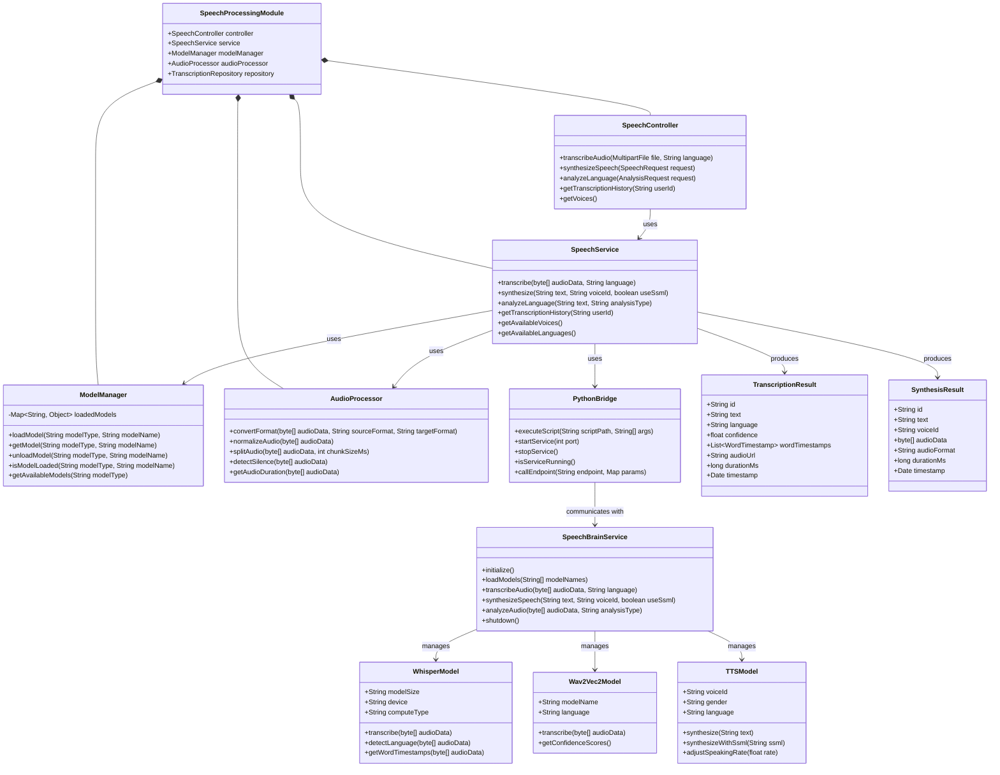
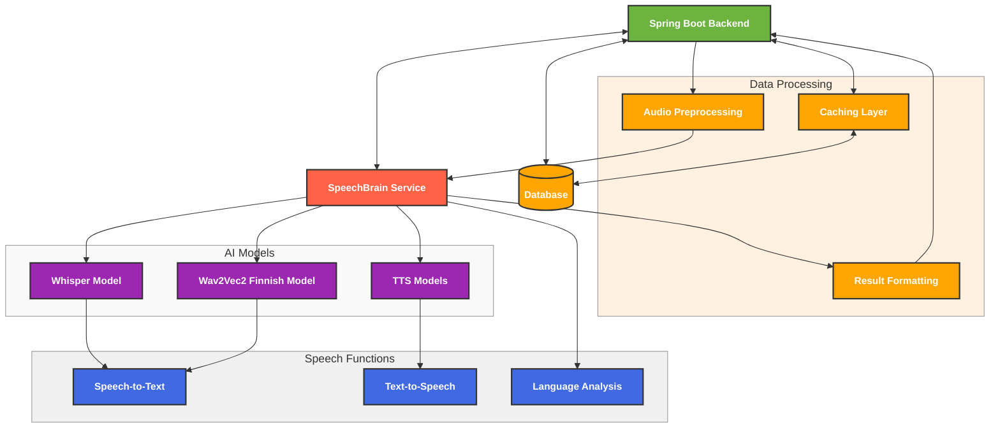
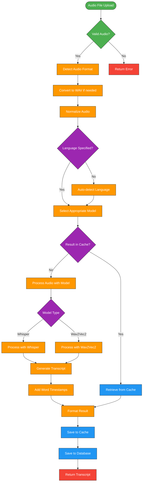
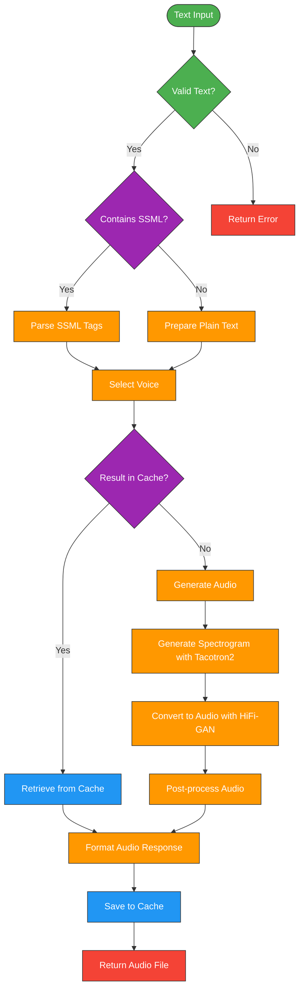
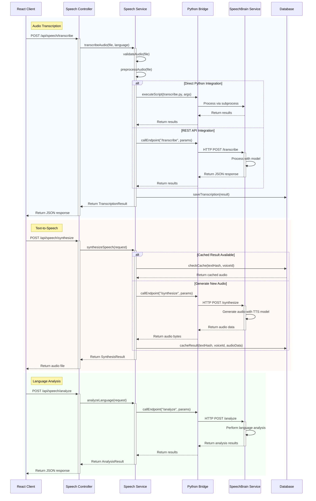

---
sidebar_position: 7
sidebar_label: "Speech Processing"
---

# Speech Processing with SpeechBrain

## Speech Processing Architecture and Components

### System Architecture



### Component Interactions



The SpeechBrain service integrates with the Spring Boot backend and manages multiple AI models for different speech processing tasks. The Whisper and Wav2Vec2 models handle speech-to-text conversion, while the TTS models provide text-to-speech capabilities. The service also performs language analysis on the processed text.

## Speech Processing Workflows

### Speech-to-Text Processing Flow



### Text-to-Speech Processing Flow



### Communication Sequence



## Key Components

### SpeechBrain Service

The SpeechBrain service is a Python-based microservice that handles speech processing tasks:

- **Model Management**: Loads, initializes, and manages AI models
- **API Interface**: Provides REST endpoints for communication with the Spring Boot backend
- **Audio Processing**: Handles audio format conversion, normalization, and segmentation
- **Result Formatting**: Standardizes output formats for consistent integration

### Python Bridge

The Python Bridge facilitates communication between Java and Python:

- **Process Management**: Starts, monitors, and stops the Python service
- **Data Transfer**: Handles serialization and deserialization of data
- **Error Handling**: Manages exceptions and timeouts
- **Resource Management**: Ensures proper cleanup of resources

### Model Manager

The Model Manager handles AI model lifecycle:

- **Model Loading**: Loads models on demand or at startup
- **Model Caching**: Keeps frequently used models in memory
- **Version Management**: Handles model updates and versioning
- **Resource Optimization**: Unloads unused models to free resources

### Audio Processor

The Audio Processor handles audio data manipulation:

- **Format Conversion**: Converts between audio formats (MP3, WAV, FLAC, etc.)
- **Normalization**: Adjusts volume and removes noise
- **Segmentation**: Splits long audio into manageable chunks
- **Feature Extraction**: Extracts audio features for model input

## Speech-to-Text Capabilities

The system uses multiple models for speech-to-text conversion:

### Whisper Model

- **Implementation**: Uses syston's Faster Whisper implementation
- **Models**: Large-v3 (primary) and Medium (fallback)
- **Features**:
  - Multilingual support (80+ languages)
  - Automatic language detection
  - Punctuation and capitalization
  - Timestamp generation for word-level alignment
  - Noise resilience

### Wav2Vec2 Finnish Model

- **Implementation**: Uses the aapot/wav2vec2-xlsr-1b-finnish-lm-v2 model
- **Features**:
  - Specialized for Finnish language recognition
  - Language model integration for improved accuracy
  - Optimized for Finnish phonetics and grammar

### Implementation Details

```python
# Example of Whisper model initialization
def initialize_whisper_model():
    model_size = "large-v3"
    model_path = os.path.join(MODELS_DIR, f"models--Systran--faster-whisper-{model_size}")

    # Check if model exists, download if needed
    if not os.path.exists(model_path):
        print(f"Downloading model {model_size}...")
        model_path = f"Systran/faster-whisper-{model_size}"

    # Load model with appropriate settings
    model = WhisperModel(
        model_path,
        device="cuda" if torch.cuda.is_available() else "cpu",
        compute_type="float16" if torch.cuda.is_available() else "int8",
        cpu_threads=4,
        num_workers=1
    )
    return model

# Example of transcription function
def transcribe_audio(model, audio_path, language=None):
    # Set language or auto-detect
    language_options = {"language": language} if language else {}
    
    # Transcribe with word-level timestamps
    segments, info = model.transcribe(
        audio_path,
        word_timestamps=True,
        **language_options
    )
    
    # Process segments
    result = {
        "text": "",
        "segments": [],
        "language": info.language if not language else language,
        "words": []
    }
    
    for segment in segments:
        result["text"] += segment.text + " "
        segment_data = {
            "id": len(result["segments"]),
            "start": segment.start,
            "end": segment.end,
            "text": segment.text
        }
        result["segments"].append(segment_data)
        
        # Add word-level data
        for word in segment.words:
            word_data = {
                "word": word.word,
                "start": word.start,
                "end": word.end,
                "probability": word.probability
            }
            result["words"].append(word_data)
    
    result["text"] = result["text"].strip()
    return result
```

## Text-to-Speech Capabilities

The system provides high-quality text-to-speech synthesis:

### TTS Models

- **Implementation**: Uses SpeechBrain's Tacotron2 and HiFi-GAN models
- **Voice Options**:
  - Male and female voices
  - Different speaking styles (neutral, formal, casual)
- **Features**:
  - Natural-sounding speech
  - Prosody control (emphasis, pauses)
  - Adjustable speaking rate
  - SSML support for advanced control

### Implementation Details

```python
# Example of TTS model initialization
def initialize_tts_models(voice_type="female"):
    # Load Tacotron2 model for text-to-spectrogram
    tacotron2 = HPARAMS_REGISTRY["tacotron2"].create_model()
    tacotron2.load_state_dict(torch.load(f"pretrained_models/tts-tacotron2-en_{voice_type}/model.pth"))
    tacotron2.eval()

    # Load HiFi-GAN model for spectrogram-to-audio
    hifigan = HPARAMS_REGISTRY["hifigan"].create_model()
    hifigan.load_state_dict(torch.load(f"pretrained_models/tts-hifigan-en_{voice_type}/model.pth"))
    hifigan.eval()

    return tacotron2, hifigan

# Example of text-to-speech function
def synthesize_speech(text, tacotron2, hifigan, voice_config, output_path=None):
    # Preprocess text
    text = preprocess_text(text)
    
    # Convert text to phonemes if needed
    if voice_config.get("use_phonemes", False):
        text = text_to_phonemes(text, voice_config["language"])
    
    # Generate spectrogram
    with torch.no_grad():
        inputs = prepare_tts_inputs(text)
        spectrogram = tacotron2(inputs)
    
    # Generate audio from spectrogram
    with torch.no_grad():
        audio = hifigan(spectrogram)
    
    # Apply post-processing
    audio = post_process_audio(audio, voice_config)
    
    # Save to file if output path provided
    if output_path:
        save_audio(audio, output_path, sample_rate=22050)
    
    return audio
```

## Language Analysis

The system provides language analysis capabilities:

### Pronunciation Assessment

- **Features**:
  - Phoneme-level accuracy scoring
  - Word-level pronunciation evaluation
  - Stress and intonation analysis
  - Dialect detection and adaptation

### Grammar Analysis

- **Features**:
  - Grammatical error detection
  - Sentence structure analysis
  - Part-of-speech tagging
  - Grammar correction suggestions

### Vocabulary Assessment

- **Features**:
  - Vocabulary richness measurement
  - Word usage appropriateness
  - Lexical diversity analysis
  - Domain-specific terminology detection

### Fluency Measurement

- **Features**:
  - Speaking rate analysis
  - Pause pattern evaluation
  - Hesitation detection
  - Overall fluency scoring

### Implementation Example

```python
# Example of language analysis function
def analyze_language(audio_path, text, analysis_type):
    result = {
        "analysis_type": analysis_type,
        "scores": {},
        "details": {}
    }
    
    if analysis_type == "pronunciation":
        # Load pronunciation assessment model
        model = load_pronunciation_model()
        
        # Analyze pronunciation
        phoneme_scores, word_scores = model.assess_pronunciation(audio_path, text)
        
        # Format results
        result["scores"]["overall"] = calculate_overall_score(phoneme_scores)
        result["scores"]["accuracy"] = calculate_accuracy_score(phoneme_scores)
        result["scores"]["fluency"] = calculate_fluency_score(word_scores)
        result["details"]["word_scores"] = word_scores
        result["details"]["phoneme_scores"] = phoneme_scores
        
    elif analysis_type == "grammar":
        # Analyze grammar
        grammar_model = load_grammar_model()
        grammar_results = grammar_model.analyze(text)
        
        # Format results
        result["scores"]["grammar"] = grammar_results["score"]
        result["details"]["errors"] = grammar_results["errors"]
        result["details"]["suggestions"] = grammar_results["suggestions"]
    
    # Add more analysis types as needed
    
    return result
```

## Integration with Spring Boot

The SpeechBrain service is integrated with the Spring Boot backend through a REST API:

### API Endpoints

#### Speech-to-Text Endpoints

- `POST /api/speech/transcribe`: Transcribe speech to text
  - Parameters:
    - `file`: Audio file (multipart/form-data)
    - `language`: Language code (optional)
    - `model`: Model name (optional)
  - Response: Transcription result with timestamps

- `GET /api/speech/transcriptions`: Get transcription history
  - Parameters:
    - `userId`: User ID (optional)
    - `limit`: Maximum number of results (optional)
  - Response: List of transcription records

#### Text-to-Speech Endpoints

- `POST /api/speech/synthesize`: Convert text to speech
  - Parameters:
    - `text`: Text to synthesize
    - `voiceId`: Voice identifier
    - `ssml`: Boolean indicating if text contains SSML
  - Response: Audio file

- `GET /api/speech/voices`: Get available voices
  - Parameters:
    - `language`: Filter by language (optional)
    - `gender`: Filter by gender (optional)
  - Response: List of available voices

#### Language Analysis Endpoints

- `POST /api/speech/analyze`: Analyze speech for language proficiency
  - Parameters:
    - `file`: Audio file (multipart/form-data)
    - `text`: Reference text
    - `analysisType`: Type of analysis
  - Response: Analysis results

### Spring Boot Controller Implementation

```java
@RestController
@RequestMapping("/api/speech")
public class SpeechController {

    private final SpeechService speechService;
    
    @Autowired
    public SpeechController(SpeechService speechService) {
        this.speechService = speechService;
    }
    
    @PostMapping("/transcribe")
    public ResponseEntity<TranscriptionResult> transcribeAudio(
            @RequestParam("file") MultipartFile file,
            @RequestParam(value = "language", required = false) String language) {
        
        try {
            // Validate file
            if (file.isEmpty()) {
                return ResponseEntity.badRequest().build();
            }
            
            // Process transcription
            TranscriptionResult result = speechService.transcribe(
                file.getBytes(), 
                language
            );
            
            return ResponseEntity.ok(result);
        } catch (Exception e) {
            log.error("Error transcribing audio", e);
            return ResponseEntity.status(HttpStatus.INTERNAL_SERVER_ERROR).build();
        }
    }
    
    @PostMapping("/synthesize")
    public ResponseEntity<Resource> synthesizeSpeech(@RequestBody SpeechRequest request) {
        try {
            // Validate request
            if (request.getText() == null || request.getText().isEmpty()) {
                return ResponseEntity.badRequest().build();
            }
            
            // Generate speech
            SynthesisResult result = speechService.synthesize(
                request.getText(),
                request.getVoiceId(),
                request.isSsml()
            );
            
            // Create resource from audio data
            ByteArrayResource resource = new ByteArrayResource(result.getAudioData());
            
            // Set appropriate headers
            return ResponseEntity.ok()
                .contentType(MediaType.parseMediaType("audio/wav"))
                .contentLength(result.getAudioData().length)
                .header(HttpHeaders.CONTENT_DISPOSITION, 
                       "attachment; filename=\"speech.wav\"")
                .body(resource);
        } catch (Exception e) {
            log.error("Error synthesizing speech", e);
            return ResponseEntity.status(HttpStatus.INTERNAL_SERVER_ERROR).build();
        }
    }
    
    @GetMapping("/voices")
    public ResponseEntity<List<Voice>> getVoices(
            @RequestParam(value = "language", required = false) String language,
            @RequestParam(value = "gender", required = false) String gender) {
        
        try {
            List<Voice> voices = speechService.getAvailableVoices();
            
            // Apply filters if provided
            if (language != null) {
                voices = voices.stream()
                    .filter(v -> v.getLanguage().equals(language))
                    .collect(Collectors.toList());
            }
            
            if (gender != null) {
                voices = voices.stream()
                    .filter(v -> v.getGender().equals(gender))
                    .collect(Collectors.toList());
            }
            
            return ResponseEntity.ok(voices);
        } catch (Exception e) {
            log.error("Error getting voices", e);
            return ResponseEntity.status(HttpStatus.INTERNAL_SERVER_ERROR).build();
        }
    }
    
    // Additional endpoints...
}
```

## Deployment Configuration

The SpeechBrain service can be deployed in multiple ways:

### Embedded Mode

In embedded mode, the SpeechBrain service runs within the Spring Boot application:

```java
@Service
public class EmbeddedPythonBridge implements PythonBridge {

    private Process pythonProcess;
    private final String pythonPath;
    private final String scriptDir;
    
    @Value("${speech.python.path}")
    private String pythonPath;
    
    @Value("${speech.script.dir}")
    private String scriptDir;
    
    @PostConstruct
    public void initialize() {
        startService(5000);
    }
    
    @PreDestroy
    public void cleanup() {
        stopService();
    }
    
    @Override
    public void startService(int port) {
        try {
            ProcessBuilder pb = new ProcessBuilder(
                pythonPath,
                scriptDir + "/speechbrain_service.py",
                "--port", String.valueOf(port),
                "--models", "whisper,wav2vec2,tts"
            );
            
            pb.redirectErrorStream(true);
            pythonProcess = pb.start();
            
            // Start a thread to read the process output
            new Thread(() -> {
                try (BufferedReader reader = new BufferedReader(
                        new InputStreamReader(pythonProcess.getInputStream()))) {
                    String line;
                    while ((line = reader.readLine()) != null) {
                        log.info("Python service: {}", line);
                    }
                } catch (IOException e) {
                    log.error("Error reading Python process output", e);
                }
            }).start();
            
            // Wait for service to start
            Thread.sleep(5000);
            
        } catch (Exception e) {
            log.error("Failed to start Python service", e);
            throw new RuntimeException("Failed to start Python service", e);
        }
    }
    
    @Override
    public void stopService() {
        if (pythonProcess != null && pythonProcess.isAlive()) {
            pythonProcess.destroy();
            try {
                // Wait for process to terminate
                if (!pythonProcess.waitFor(10, TimeUnit.SECONDS)) {
                    pythonProcess.destroyForcibly();
                }
            } catch (InterruptedException e) {
                Thread.currentThread().interrupt();
                log.warn("Interrupted while waiting for Python process to terminate", e);
            }
        }
    }
    
    // Other methods...
}
```

### Standalone Mode

In standalone mode, the SpeechBrain service runs as a separate service:

```bash
#!/bin/bash
# start_speechbrain_service.sh

# Set environment variables
export PYTHONPATH=/path/to/speechbrain
export CUDA_VISIBLE_DEVICES=0  # Use first GPU if available

# Start the service
cd /path/to/speechbrain
python speechbrain_service.py \
  --port 5000 \
  --host 0.0.0.0 \
  --models whisper,wav2vec2,tts \
  --log-level INFO \
  --cache-dir /path/to/model/cache
```

### Docker Mode

In Docker mode, the SpeechBrain service runs in a container:

```dockerfile
# Dockerfile for SpeechBrain service
FROM pytorch/pytorch:1.13.1-cuda11.6-cudnn8-runtime

# Install dependencies
RUN apt-get update && apt-get install -y \
    ffmpeg \
    libsndfile1 \
    && rm -rf /var/lib/apt/lists/*

# Install Python packages
RUN pip install --no-cache-dir \
    speechbrain==0.5.13 \
    faster-whisper==0.6.0 \
    flask==2.2.3 \
    gunicorn==20.1.0 \
    transformers==4.28.1

# Copy application code
COPY ./speechbrain /app/speechbrain
WORKDIR /app

# Set environment variables
ENV PYTHONPATH=/app
ENV MODEL_CACHE_DIR=/app/models

# Expose port
EXPOSE 5000

# Start the service
CMD ["python", "speechbrain/speechbrain_service.py", "--port", "5000", "--host", "0.0.0.0", "--models", "whisper,wav2vec2,tts"]
```

## Performance Optimization

### Model Caching

Models are loaded once and kept in memory to reduce initialization time:

```python
class ModelCache:
    def __init__(self, cache_dir=None, max_models=5):
        self.cache = {}
        self.cache_dir = cache_dir or os.path.join(os.getcwd(), "model_cache")
        self.max_models = max_models
        self.access_times = {}
        
        # Create cache directory if it doesn't exist
        os.makedirs(self.cache_dir, exist_ok=True)
    
    def get(self, model_type, model_name):
        key = f"{model_type}_{model_name}"
        
        if key in self.cache:
            # Update access time
            self.access_times[key] = time.time()
            return self.cache[key]
        
        return None
    
    def put(self, model_type, model_name, model):
        key = f"{model_type}_{model_name}"
        
        # Check if cache is full
        if len(self.cache) >= self.max_models:
            # Remove least recently used model
            lru_key = min(self.access_times, key=self.access_times.get)
            del self.cache[lru_key]
            del self.access_times[lru_key]
        
        # Add model to cache
        self.cache[key] = model
        self.access_times[key] = time.time()
    
    def clear(self):
        self.cache.clear()
        self.access_times.clear()
```

### Batch Processing

Multiple requests can be processed in batches for improved throughput:

```python
def batch_process_audio(audio_files, model, batch_size=4):
    results = []
    
    # Process in batches
    for i in range(0, len(audio_files), batch_size):
        batch = audio_files[i:i+batch_size]
        
        # Process batch in parallel
        with concurrent.futures.ThreadPoolExecutor(max_workers=batch_size) as executor:
            batch_results = list(executor.map(
                lambda file: transcribe_audio(model, file),
                batch
            ))
        
        results.extend(batch_results)
    
    return results
```

### Resource Management

The system automatically scales based on load:

```python
class ResourceManager:
    def __init__(self, max_memory_usage=0.8, max_cpu_usage=0.9):
        self.max_memory_usage = max_memory_usage
        self.max_cpu_usage = max_cpu_usage
        self.model_cache = ModelCache()
    
    def check_resources(self):
        # Check memory usage
        memory_usage = psutil.virtual_memory().percent / 100
        
        # Check CPU usage
        cpu_usage = psutil.cpu_percent(interval=0.1) / 100
        
        return {
            "memory_available": memory_usage < self.max_memory_usage,
            "cpu_available": cpu_usage < self.max_cpu_usage,
            "gpu_available": torch.cuda.is_available() and torch.cuda.device_count() > 0
        }
    
    def get_optimal_device(self):
        resources = self.check_resources()
        
        if resources["gpu_available"]:
            return "cuda"
        else:
            return "cpu"
    
    def get_optimal_model(self, model_type):
        resources = self.check_resources()
        
        if model_type == "whisper":
            if resources["gpu_available"] and resources["memory_available"]:
                return "large-v3"  # Use large model if resources available
            else:
                return "medium"    # Fall back to medium model
        
        # Similar logic for other model types
        
        return "default"
    
    def cleanup_if_needed(self):
        resources = self.check_resources()
        
        if not resources["memory_available"]:
            # Clear model cache to free memory
            self.model_cache.clear()
            
            # Force garbage collection
            gc.collect()
            
            if torch.cuda.is_available():
                torch.cuda.empty_cache()
```

## Future Enhancements

Planned enhancements to the speech processing module:

### Emotion Detection

- **Features**:
  - Identify emotions in speech (happiness, sadness, anger, etc.)
  - Emotion intensity measurement
  - Emotion change detection
  - Cultural context adaptation

### Speaker Diarization

- **Features**:
  - Distinguish between multiple speakers
  - Speaker identification
  - Speaker turn detection
  - Speaker clustering

### Custom Voice Training

- **Features**:
  - Allow users to create custom TTS voices
  - Voice cloning from samples
  - Voice style transfer
  - Voice customization parameters

### Real-time Processing

- **Features**:
  - Streaming transcription for live audio
  - Low-latency processing
  - Progressive result delivery
  - Adaptive quality based on connection speed

