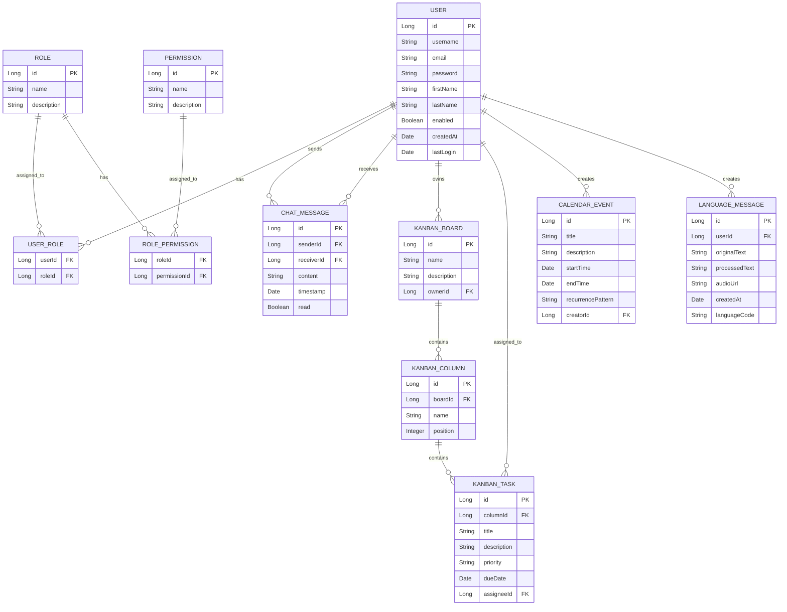

# Backend Project Structure

## Overview

The backend component of the Enterprise Nexus project is located in the `study/study` directory and follows a standard Spring Boot project structure with additional components for speech processing. The application is organized using a layered architecture pattern that separates concerns and promotes maintainability.

## Architecture Diagram


## Main Directory Structure

```
study/study/
├── src/
│   ├── main/
│   │   ├── java/
│   │   │   └── com/
│   │   │       └── study/
│   │   │           ├── config/         # Configuration classes
│   │   │           ├── controller/     # REST controllers
│   │   │           ├── dto/            # Data Transfer Objects
│   │   │           ├── exception/      # Custom exceptions
│   │   │           ├── model/          # Entity models
│   │   │           ├── repository/     # Data repositories
│   │   │           ├── security/       # Security configuration
│   │   │           ├── service/        # Business logic
│   │   │           ├── util/           # Utility classes
│   │   │           └── Application.java # Main application class
│   │   └── resources/
│   │       ├── application.yaml        # Main application properties
│   │       ├── application-dev.yaml    # Development properties
│   │       ├── application-aws.yaml    # AWS deployment properties
│   │       ├── data.sql                # Initial data script
│   │       ├── schema.sql              # Schema definition
│   │       └── templates/              # Email templates
│   └── test/
│       ├── java/                       # Test classes
│       └── resources/
│           └── application-test.properties # Test configuration
├── speechbrain/                        # Speech processing module
│   ├── models/                         # AI language models
│   │   ├── models--Systran--faster-whisper-large-v3/
│   │   ├── models--Systran--faster-whisper-medium/
│   │   └── wav2vec2-finnish/
│   ├── pretrained_models/              # TTS models
│   │   ├── tts-tacotron2-en_female/
│   │   ├── tts-tacotron2-en_male/
│   │   ├── tts-hifigan-en_female/
│   │   └── tts-hifigan-en_male/
│   ├── src/                            # Python source code
│   ├── speechbrain_service.py          # Main service script
│   ├── whisper_server.py               # Whisper model server
│   └── wav2vec2_finnish.py             # Finnish speech recognition
└── pom.xml                             # Maven configuration
```

## Request Flow


## Key Components

### Controllers

Controllers handle HTTP requests and define the API endpoints. They are organized by domain:

| Controller           | Responsibility            | Key Endpoints                                                    |
| -------------------- | ------------------------- | ---------------------------------------------------------------- |
| `AuthController`     | Authentication operations | `/api/auth/login`, `/api/auth/register`, `/api/auth/refresh`     |
| `UserController`     | User management           | `/api/users`, `/api/users/{id}`, `/api/users/profile`            |
| `RoleController`     | Role management           | `/api/roles`, `/api/roles/{id}`, `/api/roles/{id}/permissions`   |
| `ChatController`     | Chat functionality        | `/api/chats`, `/api/chats/{id}/messages`, `/api/chats/websocket` |
| `KanbanController`   | Task management           | `/api/kanban/boards`, `/api/kanban/tasks`, `/api/kanban/columns` |
| `CalendarController` | Event scheduling          | `/api/calendar/events`, `/api/calendar/recurring`                |
| `LanguageController` | Speech processing         | `/api/language/speech-to-text`, `/api/language/text-to-speech`   |

### Service Layer Architecture


### Entity Relationship Diagram



### Security Implementation

The security package implements a comprehensive authentication and authorization system:

```java
@Configuration
@EnableWebSecurity
@EnableMethodSecurity
public class SecurityConfig {

    private final JwtTokenProvider jwtTokenProvider;
    private final CustomUserDetailsService userDetailsService;
    private final TotpAuthenticationProvider totpAuthenticationProvider;
    private final OAuth2AuthenticationSuccessHandler oAuth2SuccessHandler;

    @Bean
    public SecurityFilterChain filterChain(HttpSecurity http) throws Exception {
        return http
            .csrf(csrf -> csrf.disable())
            .sessionManagement(session ->
                session.sessionCreationPolicy(SessionCreationPolicy.STATELESS))
            .authorizeHttpRequests(auth -> auth
                .requestMatchers("/api/auth/**").permitAll()
                .requestMatchers("/api/public/**").permitAll()
                .requestMatchers("/actuator/health").permitAll()
                .requestMatchers("/swagger-ui/**", "/v3/api-docs/**").permitAll()
                .requestMatchers("/api/admin/**").hasRole("ADMIN")
                .anyRequest().authenticated()
            )
            .oauth2Login(oauth2 -> oauth2
                .successHandler(oAuth2SuccessHandler)
            )
            .addFilterBefore(new JwtAuthenticationFilter(jwtTokenProvider),
                UsernamePasswordAuthenticationFilter.class)
            .build();
    }

    @Bean
    public PasswordEncoder passwordEncoder() {
        return new BCryptPasswordEncoder();
    }

    @Bean
    public AuthenticationManager authenticationManager(AuthenticationConfiguration config)
            throws Exception {
        return config.getAuthenticationManager();
    }
}
```

### SpeechBrain Integration

The SpeechBrain module provides AI-powered speech processing through a Python service that integrates with the Java backend:


#### Python Service Implementation

```python
# speechbrain_service.py
from flask import Flask, request, jsonify
import torch
import torchaudio
from speechbrain.pretrained import EncoderDecoderASR
from speechbrain.pretrained import Tacotron2
from speechbrain.pretrained import HIFIGAN
import os
import uuid

app = Flask(__name__)

# Load models
asr_model = EncoderDecoderASR.from_hparams(
    source="speechbrain/asr-wav2vec2-commonvoice-en",
    savedir="pretrained_models/asr-wav2vec2-commonvoice-en"
)

tts_model = Tacotron2.from_hparams(
    source="speechbrain/tts-tacotron2-ljspeech",
    savedir="pretrained_models/tts-tacotron2-en_female"
)

vocoder = HIFIGAN.from_hparams(
    source="speechbrain/tts-hifigan-ljspeech",
    savedir="pretrained_models/tts-hifigan-en_female"
)

@app.route('/api/speech-to-text', methods=['POST'])
def speech_to_text():
    if 'file' not in request.files:
        return jsonify({'error': 'No file provided'}), 400

    file = request.files['file']
    temp_path = f"/tmp/{uuid.uuid4()}.wav"
    file.save(temp_path)

    try:
        waveform, sr = torchaudio.load(temp_path)
        if sr != 16000:
            waveform = torchaudio.transforms.Resample(sr, 16000)(waveform)

        # Transcribe audio
        transcription = asr_model.transcribe_file(temp_path)

        return jsonify({
            'transcription': transcription,
            'confidence': 0.95  # Placeholder for confidence score
        })
    except Exception as e:
        return jsonify({'error': str(e)}), 500
    finally:
        if os.path.exists(temp_path):
            os.remove(temp_path)

@app.route('/api/text-to-speech', methods=['POST'])
def text_to_speech():
    data = request.json
    if not data or 'text' not in data:
        return jsonify({'error': 'No text provided'}), 400

    text = data['text']
    voice = data.get('voice', 'female')

    try:
        # Generate mel spectrograms
        mel_outputs, mel_lengths, alignments = tts_model.encode_text(text)

        # Convert to waveform
        waveforms = vocoder.decode_batch(mel_outputs)

        # Save to file
        output_path = f"output/{uuid.uuid4()}.wav"
        torchaudio.save(output_path, waveforms.squeeze(1), 22050)

        return jsonify({
            'audio_url': f"/audio/{os.path.basename(output_path)}",
            'duration': float(waveforms.shape[1] / 22050)
        })
    except Exception as e:
        return jsonify({'error': str(e)}), 500

if __name__ == '__main__':
    os.makedirs('output', exist_ok=True)
    app.run(host='0.0.0.0', port=5000)
```

## Configuration Management

The application uses YAML configuration files for different environments with Spring profiles:

```yaml
# application.yaml
spring:
  application:
    name: enterprise-nexus
  profiles:
    active: dev
  datasource:
    driver-class-name: com.mysql.cj.jdbc.Driver
  jpa:
    hibernate:
      ddl-auto: validate
    properties:
      hibernate:
        dialect: org.hibernate.dialect.MySQLDialect
        format_sql: true
    show-sql: false
  security:
    oauth2:
      client:
        registration:
          google:
            client-id: ${OAUTH2_GOOGLE_CLIENT_ID}
            client-secret: ${OAUTH2_GOOGLE_CLIENT_SECRET}
            scope: email, profile
          github:
            client-id: ${OAUTH2_GITHUB_CLIENT_ID}
            client-secret: ${OAUTH2_GITHUB_CLIENT_SECRET}
            scope: user:email, read:user

server:
  port: 8080
  servlet:
    context-path: /api

jwt:
  secret: ${JWT_SECRET}
  expiration: 86400000 # 24 hours
  refresh-expiration: 604800000 # 7 days

speechbrain:
  service-url: http://localhost:5000
  timeout: 30000

management:
  endpoints:
    web:
      exposure:
        include: health, info, metrics
  endpoint:
    health:
      show-details: when_authorized
```

## Testing Strategy

The application follows a comprehensive testing strategy:

| Test Type             | Tools                       | Focus Areas                                       |
| --------------------- | --------------------------- | ------------------------------------------------- |
| **Unit Tests**        | JUnit 5, Mockito            | Service logic, Utility classes                    |
| **Integration Tests** | Spring Test, TestContainers | Repository operations, Service interactions       |
| **API Tests**         | MockMvc, REST Assured       | Controller endpoints, Request/Response validation |
| **Security Tests**    | Spring Security Test        | Authentication, Authorization, Token handling     |
| **Performance Tests** | JMeter                      | Throughput, Response time, Resource usage         |

### Example Test Implementation

```java
@WebMvcTest(UserController.class)
@AutoConfigureMockMvc
public class UserControllerTest {

    @Autowired
    private MockMvc mockMvc;

    @MockBean
    private UserService userService;

    @MockBean
    private JwtTokenProvider jwtTokenProvider;

    @Test
    @WithMockUser(roles = "ADMIN")
    public void getUserById_ShouldReturnUser() throws Exception {
        // Arrange
        Long userId = 1L;
        UserDTO userDTO = new UserDTO();
        userDTO.setId(userId);
        userDTO.setUsername("testuser");
        userDTO.setEmail("test@example.com");

        when(userService.findById(userId)).thenReturn(userDTO);

        // Act & Assert
        mockMvc.perform(get("/api/users/{id}", userId)
                .contentType(MediaType.APPLICATION_JSON))
                .andExpect(status().isOk())
                .andExpect(jsonPath("$.id").value(userId))
                .andExpect(jsonPath("$.username").value("testuser"))
                .andExpect(jsonPath("$.email").value("test@example.com"));

        verify(userService, times(1)).findById(userId);
    }

    @Test
    public void createUser_WithInvalidData_ShouldReturnBadRequest() throws Exception {
        // Arrange
        UserDTO userDTO = new UserDTO();
        // Missing required fields

        // Act & Assert
        mockMvc.perform(post("/api/users")
                .contentType(MediaType.APPLICATION_JSON)
                .content(new ObjectMapper().writeValueAsString(userDTO)))
                .andExpect(status().isBadRequest())
                .andExpect(jsonPath("$.errors").isNotEmpty());

        verify(userService, never()).create(any(UserDTO.class));
    }
}
```

## Build and Deployment

The application uses Maven for build management and can be deployed to various environments:

### Maven Configuration

```xml
<!-- pom.xml -->
<project>
    <modelVersion>4.0.0</modelVersion>
    <groupId>com.study</groupId>
    <artifactId>enterprise-nexus</artifactId>
    <version>1.0.0</version>

    <parent>
        <groupId>org.springframework.boot</groupId>
        <artifactId>spring-boot-starter-parent</artifactId>
        <version>3.1.0</version>
    </parent>

    <properties>
        <java.version>17</java.version>
        <maven.compiler.source>${java.version}</maven.compiler.source>
        <maven.compiler.target>${java.version}</maven.compiler.target>
        <project.build.sourceEncoding>UTF-8</project.build.sourceEncoding>
    </properties>

    <dependencies>
        <!-- Spring Boot -->
        <dependency>
            <groupId>org.springframework.boot</groupId>
            <artifactId>spring-boot-starter-web</artifactId>
        </dependency>
        <dependency>
            <groupId>org.springframework.boot</groupId>
            <artifactId>spring-boot-starter-data-jpa</artifactId>
        </dependency>
        <dependency>
            <groupId>org.springframework.boot</groupId>
            <artifactId>spring-boot-starter-security</artifactId>
        </dependency>
        <dependency>
            <groupId>org.springframework.boot</groupId>
            <artifactId>spring-boot-starter-validation</artifactId>
        </dependency>

        <!-- Database -->
        <dependency>
            <groupId>mysql</groupId>
            <artifactId>mysql-connector-java</artifactId>
            <version>8.0.33</version>
        </dependency>
        <dependency>
            <groupId>com.h2database</groupId>
            <artifactId>h2</artifactId>
            <scope>runtime</scope>
        </dependency>

        <!-- Security -->
        <dependency>
            <groupId>io.jsonwebtoken</groupId>
            <artifactId>jjwt-api</artifactId>
            <version>0.11.5</version>
        </dependency>
        <dependency>
            <groupId>io.jsonwebtoken</groupId>
            <artifactId>jjwt-impl</artifactId>
            <version>0.11.5</version>
            <scope>runtime</scope>
        </dependency>

        <!-- Testing -->
        <dependency>
            <groupId>org.springframework.boot</groupId>
            <artifactId>spring-boot-starter-test</artifactId>
            <scope>test</scope>
        </dependency>
        <dependency>
            <groupId>org.springframework.security</groupId>
            <artifactId>spring-security-test</artifactId>
            <scope>test</scope>
        </dependency>
    </dependencies>

    <build>
        <plugins>
            <plugin>
                <groupId>org.springframework.boot</groupId>
                <artifactId>spring-boot-maven-plugin</artifactId>
                <configuration>
                    <excludes>
                        <exclude>
                            <groupId>org.projectlombok</groupId>
                            <artifactId>lombok</artifactId>
                        </exclude>
                    </excludes>
                </configuration>
            </plugin>
        </plugins>
    </build>
</project>
```

### Deployment Workflow


