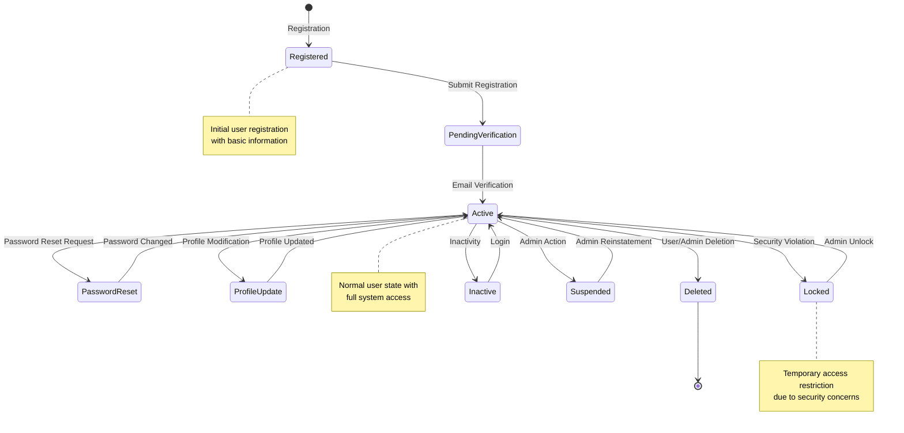
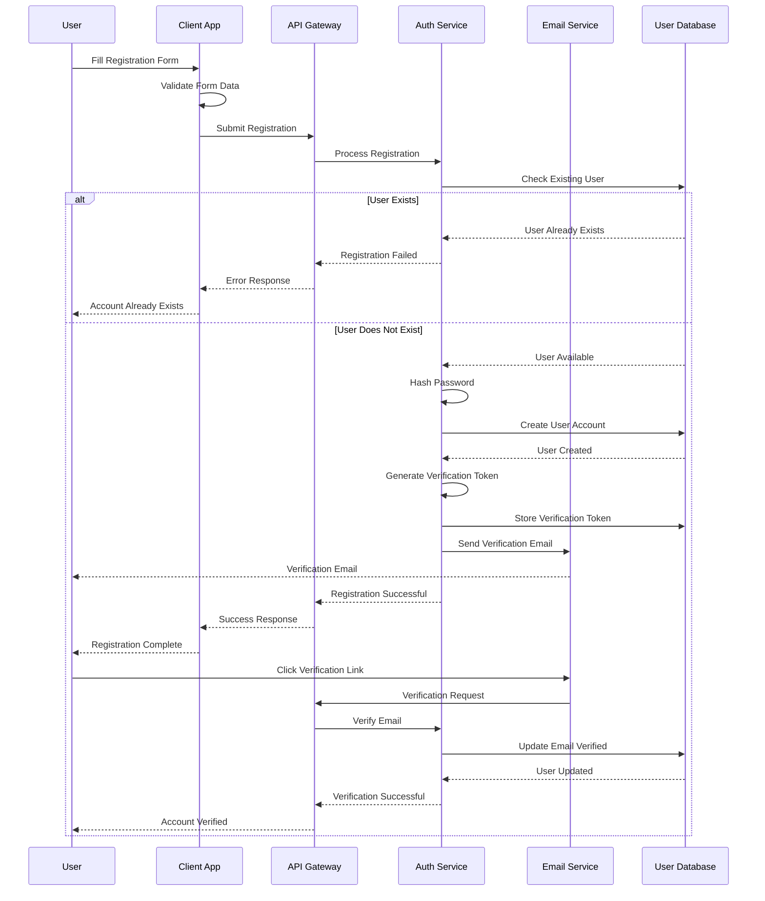
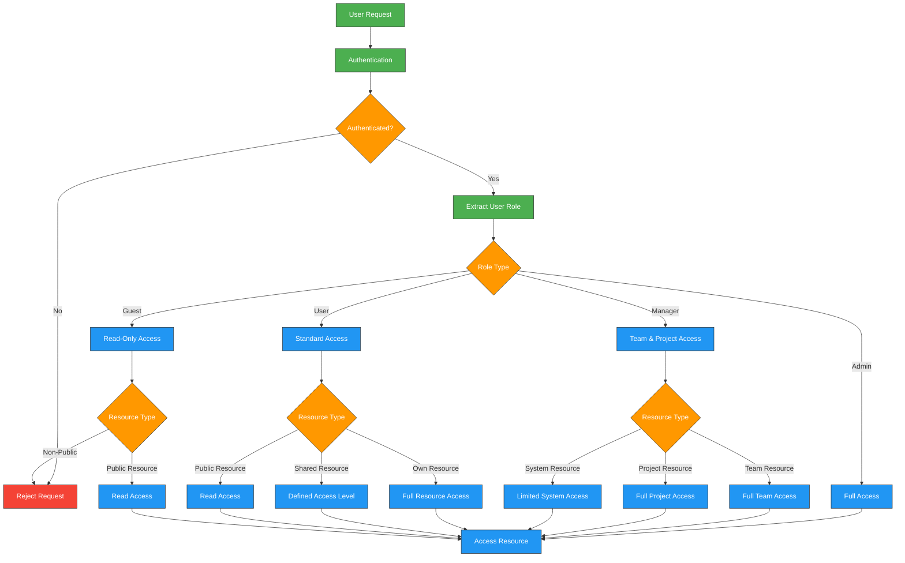
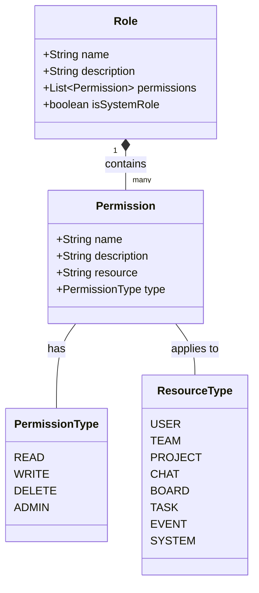
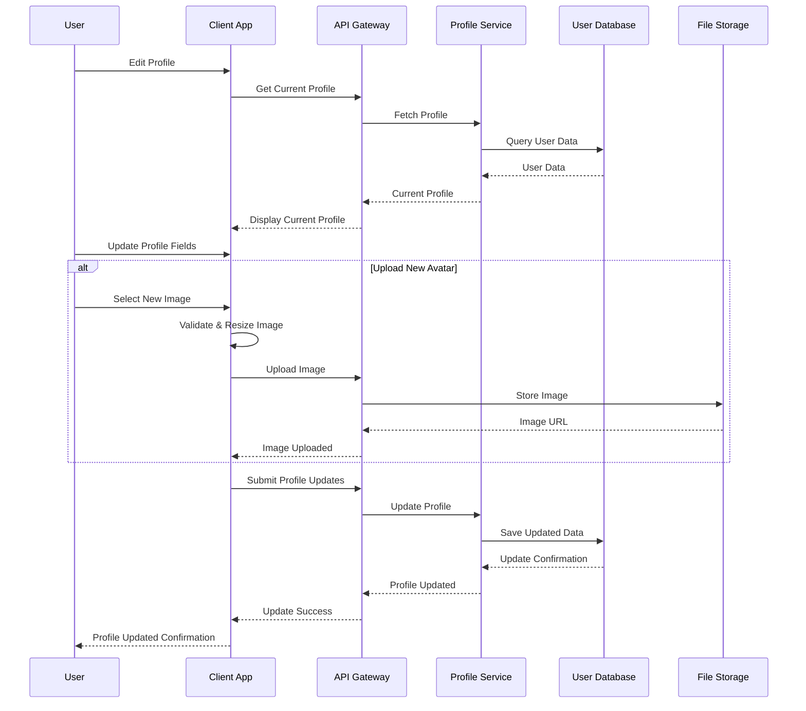
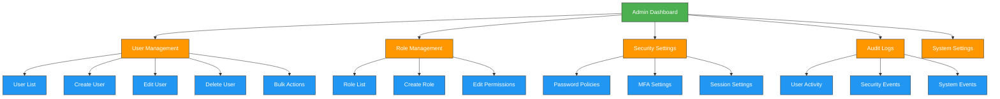
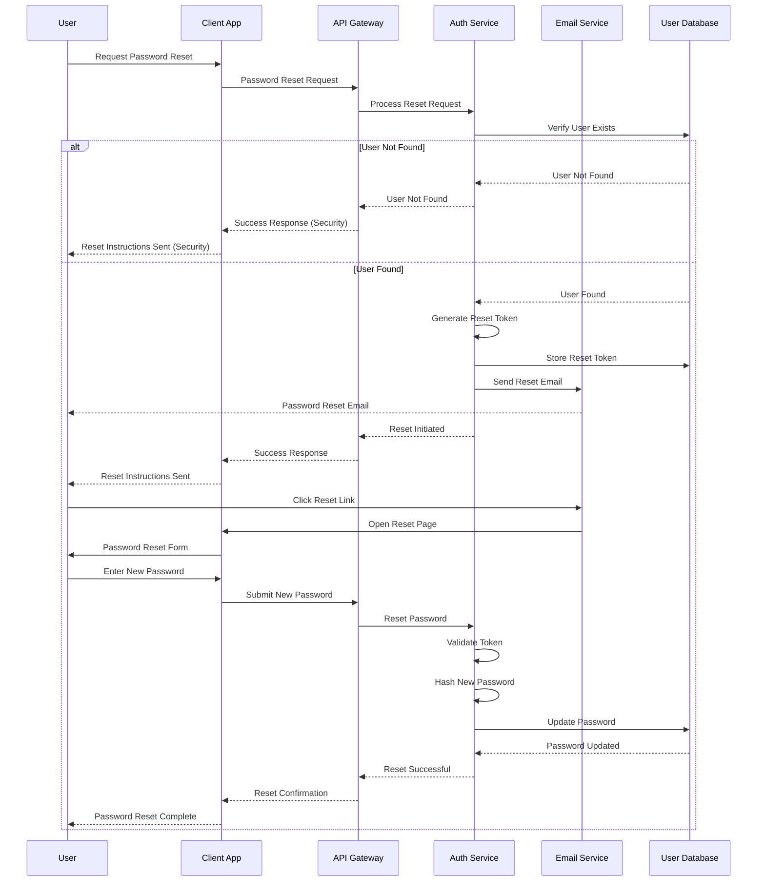

---
sidebar_position: 5
sidebar_label: "User Management"
---

# User Management

## User Management Architecture and Workflows

### User Lifecycle Workflow

### User Registration Workflow

### Role-Based Access Control Workflow

## User Management Overview

The Enterprise Nexus Project implements a comprehensive user management system that handles the complete lifecycle of users within the application. The system provides secure authentication, role-based access control, profile management, and administrative capabilities.

## User Roles and Permissions

The system implements a hierarchical role-based access control system with the following roles:

| Role | Description | Access Level | Capabilities |
|------|-------------|--------------|--------------|
| **Admin** | System administrator | Full system access | All system functions, user management, configuration |
| **Manager** | Team or project manager | Team and project management | Manage teams, projects, and resources |
| **User** | Standard system user | Standard functionality | Access core features, own content, shared resources |
| **Guest** | Limited access user | Read-only access | View public resources and shared content |

### Permission Hierarchy

## User Registration and Onboarding

### Registration Methods

Users can register through multiple channels:

| Method | Description | Verification |
|--------|-------------|--------------|
| Email & Password | Traditional registration | Email verification |
| Google OAuth | Sign in with Google | Email pre-verified |
| GitHub OAuth | Sign in with GitHub | Email pre-verified |
| Microsoft OAuth | Sign in with Microsoft | Email pre-verified |

### User Onboarding Process

## User Profile Management

### Profile Components

User profiles are comprehensive and include:

| Component | Description | Privacy Level |
|-----------|-------------|---------------|
| Basic Information | Name, email, username | Required |
| Profile Picture | User avatar | Optional |
| Contact Details | Phone, address, social links | Optional |
| Professional Info | Job title, department, skills | Optional |
| Preferences | UI settings, notifications, language | Optional |
| Activity History | Recent actions and interactions | System-tracked |

### Profile Update Workflow

## User Administration

Administrators have powerful tools to manage users across the system:

### Administrative Capabilities

| Function | Description | Access Level |
|----------|-------------|--------------|
| User Management | Create, update, delete users | Admin |
| Role Assignment | Assign and modify user roles | Admin |
| Account Recovery | Reset passwords, unlock accounts | Admin, Manager (team only) |
| User Impersonation | Temporarily access as another user | Admin (with audit) |
| Bulk Operations | Perform actions on multiple users | Admin |
| Audit Logging | View detailed user activity logs | Admin |

### Administrative Dashboard

## Security and Password Management

### Password Policies

The system enforces comprehensive password security:

| Policy | Description | Configuration |
|--------|-------------|---------------|
| Complexity | Password strength requirements | Min 8 chars, mixed case, numbers, symbols |
| Expiration | Password renewal requirements | 90-day expiration (configurable) |
| History | Prevention of password reuse | Last 5 passwords remembered |
| Lockout | Account protection after failed attempts | 5 attempts, 30-minute lockout |

### Password Reset Workflow

