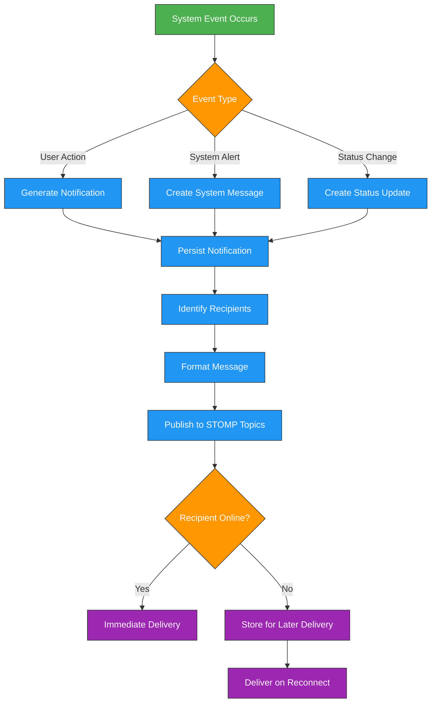
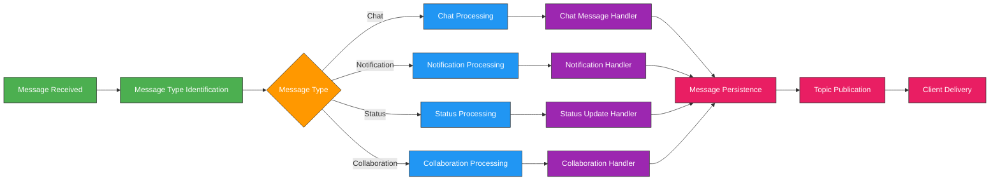
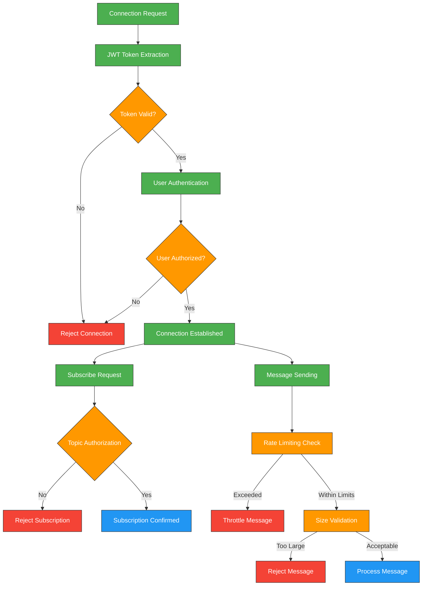
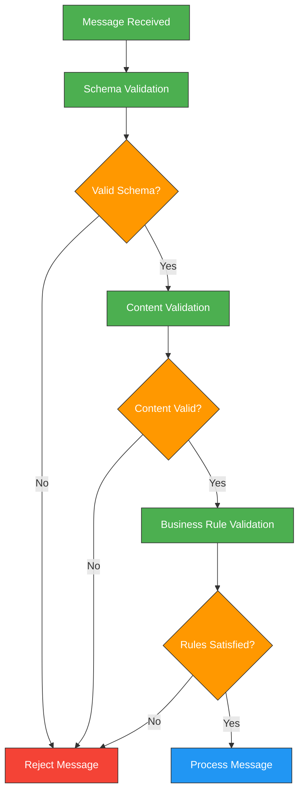

import PanzoomWrapper from '@site/src/components/MermaidDiagram/PanzoomWrapper';

# WebSockets

## WebSocket Architecture and Workflows

### Connection Establishment Workflow

<PanzoomWrapper>
<div id="websocket_connection_workflow" >


</div>
</PanzoomWrapper>

### Message Publishing Workflow

<PanzoomWrapper>
<div id="websocket_message_publishing_workflow" >


</div>
</PanzoomWrapper>

### Notification Workflow

<PanzoomWrapper>
<div id="websocket_notification_workflow" >



</div>
</PanzoomWrapper>

## WebSocket Overview

The Enterprise Nexus Project uses WebSockets for real-time communication, enabling instant updates and notifications across the application. This bidirectional communication channel allows for efficient real-time features like chat, notifications, and collaborative editing.

## WebSocket Implementation

The backend implements WebSockets using a robust stack of technologies:

- **Spring WebSocket**: Core framework for WebSocket support in Spring Boot
- **STOMP (Simple Text Oriented Messaging Protocol)**: Message protocol for WebSocket communication
- **SockJS**: Provides fallback options for browsers without WebSocket support

## Message Types and Processing

The system supports various message types, each with specific handling logic:

### Message Categories

| Category             | Description                           | Use Cases                              |
| -------------------- | ------------------------------------- | -------------------------------------- |
| Chat Messages        | Real-time communication between users | Private chats, group discussions       |
| Notifications        | System alerts and user notifications  | Task assignments, mentions, reminders  |
| Status Updates       | Changes in system or entity status    | Task status changes, user presence     |
| Collaboration Events | Real-time collaborative actions       | Kanban board updates, document editing |

### Message Processing Workflow

<PanzoomWrapper>
<div id="websocket_message_processing_workflow" >



</div>
</PanzoomWrapper>

## WebSocket Security Architecture

WebSocket connections are secured with multiple layers of protection:

### Security Measures

| Security Feature    | Implementation            | Purpose                     |
| ------------------- | ------------------------- | --------------------------- |
| Authentication      | JWT Token Validation      | Verify user identity        |
| Authorization       | Role-based access control | Control access to topics    |
| Connection Timeout  | 5-minute idle timeout     | Prevent resource exhaustion |
| Message Size Limits | 64KB maximum message size | Prevent DoS attacks         |
| Rate Limiting       | 100 messages per minute   | Prevent abuse               |
| Message Validation  | Schema validation         | Prevent malformed messages  |

### Security Workflow

<PanzoomWrapper>
<div id="websocket_security_workflow" >



</div>
</PanzoomWrapper>

## Subscription Topics and Routing

Clients can subscribe to various topics, each serving a specific purpose in the application:

### Core Topics

| Topic Pattern                   | Description                       | Access Control                   |
| ------------------------------- | --------------------------------- | -------------------------------- |
| `/topic/chat/{chatId}`          | Chat messages for a specific chat | Chat participants only           |
| `/topic/notifications/{userId}` | User notifications                | User and admins only             |
| `/topic/board/{boardId}`        | Kanban board updates              | Board members only               |
| `/topic/calendar/{userId}`      | Calendar updates                  | User and shared calendar members |
| `/topic/presence`               | User online status                | All authenticated users          |
| `/topic/announcements`          | System-wide announcements         | All authenticated users          |

### Topic Subscription Workflow

<PanzoomWrapper>
<div id="websocket_topic_subscription_workflow" >


</div>
</PanzoomWrapper>

## Message Format and Validation

WebSocket messages use a consistent JSON format with strict validation:

### Standard Message Structure

```json
{
  "type": "CHAT_MESSAGE",
  "timestamp": "2023-05-15T10:30:45Z",
  "senderId": "user123",
  "payload": {
    "chatId": "chat456",
    "content": "Hello, world!",
    "contentType": "TEXT"
  }
}
```

### Message Type Specifications

| Message Type  | Required Fields                    | Payload Structure                | Validation Rules                 |
| ------------- | ---------------------------------- | -------------------------------- | -------------------------------- |
| CHAT_MESSAGE  | type, timestamp, senderId, payload | chatId, content, contentType     | Content max length: 2000 chars   |
| NOTIFICATION  | type, timestamp, payload           | notificationType, title, message | Title max length: 100 chars      |
| STATUS_UPDATE | type, timestamp, payload           | entityId, entityType, status     | Valid status values per entity   |
| BOARD_UPDATE  | type, timestamp, senderId, payload | boardId, action, data            | Valid actions: move, add, delete |

### Message Validation Workflow

<PanzoomWrapper>
<div id="websocket_message_validation_workflow" >



</div>
</PanzoomWrapper>

## Error Handling and Recovery

The WebSocket implementation includes robust error handling and recovery mechanisms:

### Error Handling Strategies

| Error Type                | Handling Strategy                               | Client Notification                   |
| ------------------------- | ----------------------------------------------- | ------------------------------------- |
| Connection Failures       | Automatic reconnection with exponential backoff | Connection status events              |
| Message Delivery Failures | Message queuing and retry                       | Delivery status updates               |
| Invalid Messages          | Rejection with error details                    | Error message with validation details |
| Server Errors             | Graceful degradation                            | Error notification with tracking ID   |

### Reconnection Workflow

<PanzoomWrapper>
<div id="websocket_reconnection_workflow" >


</div>
</PanzoomWrapper>

