# Deployment Guide

This guide provides comprehensive instructions for deploying the TuPhung Project across various environments, from local development to production cloud infrastructure.

## Deployment Architecture and Components

### System Architecture

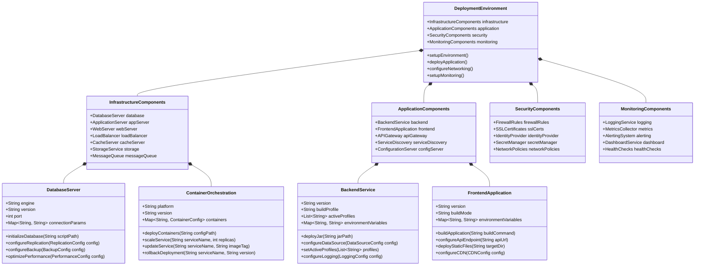

### Deployment Environments

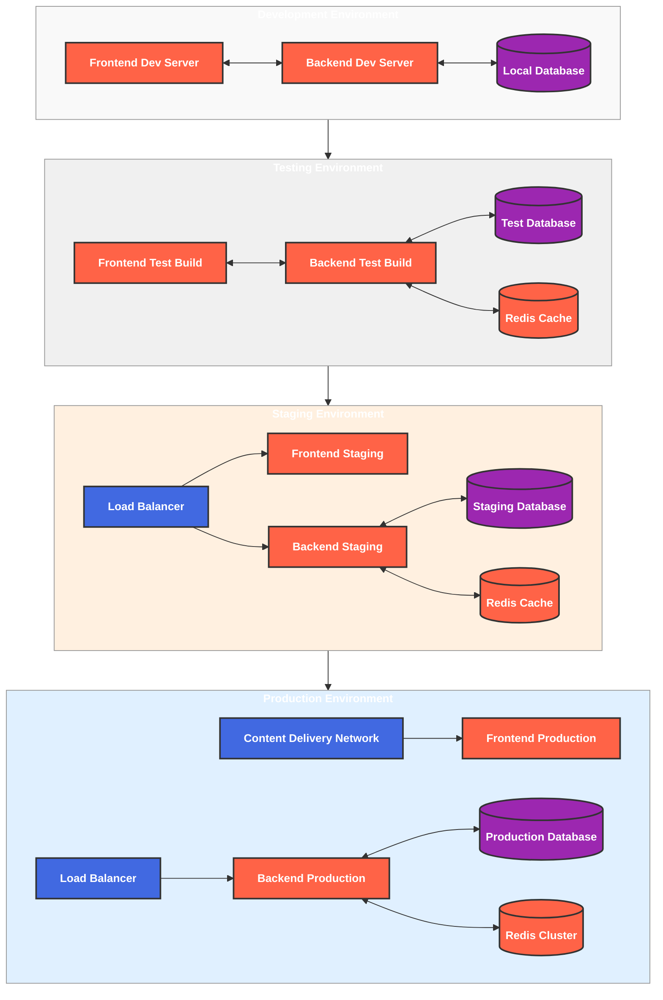

## Prerequisites

Before deploying the application, ensure you have the following:

- **Frontend Requirements**:
  - Node.js 16+ and npm 7+
  - Vite 4.0+
  - Modern web browser for development
- **Backend Requirements**:
  - Java 17+ JDK
  - Maven 3.8+
  - Spring Boot 3.0+
- **Database**:
  - MySQL 8.0+
- **Authentication & Security**:
  - OAuth2 accounts (Google, GitHub, Facebook)
  - reCAPTCHA API keys
  - Novu account for notifications
- **Containerization & Orchestration** (optional):
  - Docker 20.10+
  - Docker Compose 2.0+
  - Kubernetes 1.24+ (for production)
- **Cloud Deployment** (optional):
  - AWS CLI 2.0+
  - AWS account with appropriate permissions
  - Google Cloud SDK (for GCP deployment)
  - Terraform 1.0+ (for infrastructure as code)

## Deployment Workflows

### Local Development Workflow

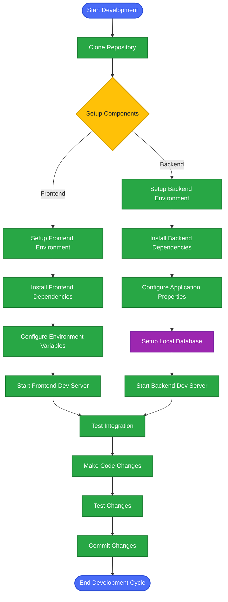

### Deployment Sequence

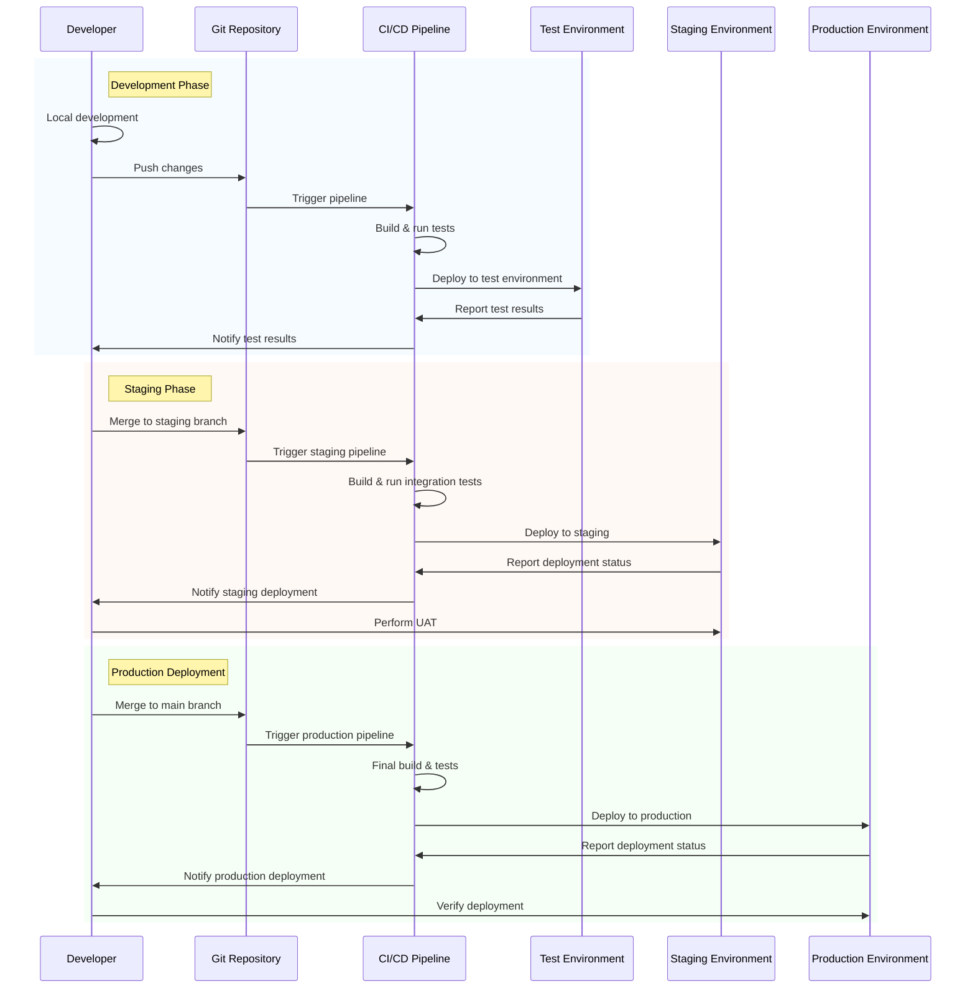

## Local Development Environment

### Frontend Setup

1. Clone the repository:

   ```powershell
   git clone https://github.com/TuPhung369/Haaga_Backend_Programming.git
   cd Haaga_Backend_Programming/study/typescript-react
   ```

2. Install dependencies:

   ```powershell
   npm install
   ```

3. Create a `.env` file with the following content:

   ```
   # OAuth2 client credentials
   VITE_OAUTH2_CLIENT_ID=190027546115-2snu9aurj5mdsum5q1tj20s2fu009uqm.apps.googleusercontent.com
   VITE_OAUTH2_CLIENT_SECRET=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

   # GitHub
   VITE_GITHUB_CLIENT_ID=Ov23liko5knZHVZo5TfZ
   VITE_GITHUB_CLIENT_SECRET=02a9cb5205fea74dd215f381576ff181ccba42a6

   # Facebook
   VITE_FACEBOOK_CLIENT_ID=1580727122556367
   VITE_FACEBOOK_CLIENT_SECRET=29f86e9b136d36687fd425d52d7d5dd1

   VITE_API_BASE_URI=http://localhost:9095/identify_service
   VITE_OAUTH2_REDIRECT_URI=http://localhost:9095/identify_service/oauth2/redirect
   VITE_GITHUB_REDIRECT_URI=http://localhost:9095/identify_service/oauthGit/redirect
   VITE_FACEBOOK_REDIRECT_URI=http://localhost:9095/identify_service/oauth2/facebook/redirect

   VITE_BASE_URI=http://localhost:3000
   VITE_CLIENT_REDIRECT_URI=http://localhost:3000/oauths/redirects
   VITE_CLIENTGIT_REDIRECT_URI=http://localhost:3000/oauths/redirect
   VITE_CLIENTFB_REDIRECT_URI=http://localhost:3000/oauths/redirect

   # Google reCAPTCHA keys
   VITE_RECAPTCHA_SITE_KEY_V3=6LeIxAcTAAAAAJcZVRqyHh71UMIEGNQ_MXjiZKhI
   VITE_RECAPTCHA_SITE_KEY_V2=6LeIxAcTAAAAAGG-vFI1TnRWxMZNFuojJ4WifJWe

   # Novu
   VITE_NOVU_APP_ID=uWb0H0wlJgOP
   VITE_NOVU_API_URL=https://api.novu.co
   VITE_NOVU_API_KEY=6ac19261e2693610c6a548c4d8fc4a19
   VITE_API_URL=http://localhost:9095/identify_service
   ```

4. For development environment, you can also create a `.env.development` file:

   ```
   # Development environment configuration
   VITE_API_BASE_URI=http://localhost:9095/identify_service
   VITE_TOTP_ISSUER=Development Auth App
   VITE_RECAPTCHA_SITE_KEY_V3=6LdummyDEVkeyXXXXXXXXXXXXXXXXfakedev123
   VITE_RECAPTCHA_SITE_KEY_V2=6LdummyDEVkeyXXXXXXXXXXXXXXXXfakedev456
   VITE_IS_DEVELOPMENT=true
   ```

5. Start the development server:

   ```powershell
   npm run dev
   ```

6. The frontend will be available at `http://localhost:3000`

### Backend Setup

1. Navigate to the backend directory:

   ```powershell
   cd Haaga_Backend_Programming/study/study
   ```

2. The project already includes configuration files in the `src/main/resources` directory:

   - `application.yaml`: Main configuration file
   - `application-dev.yaml`: Development environment configuration
   - `application-aws.yaml`: AWS deployment configuration
   - `application-google.yaml`: Google Cloud deployment configuration

3. For local development, you'll need to set up environment variables. Create a `.env` file in the root directory with the following content:

   ```
   # Database Configuration
   DB_URL_DEV=jdbc:mysql://localhost:3306/tuphung
   DB_USERNAME_DEV=root
   DB_PASSWORD_DEV=your_password

   # OAuth2 Configuration
   OAUTH2_CLIENT_ID=190027546115-2snu9aurj5mdsum5q1tj20s2fu009uqm.apps.googleusercontent.com
   OAUTH2_CLIENT_SECRET=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
   OAUTH2_REDIRECT_URI=http://localhost:9095/identify_service/oauth2/redirect

   GITHUB_CLIENT_ID=Ov23liko5knZHVZo5TfZ
   GITHUB_CLIENT_SECRET=02a9cb5205fea74dd215f381576ff181ccba42a6
   GITHUB_REDIRECT_URI=http://localhost:9095/identify_service/oauthGit/redirect

   FACEBOOK_CLIENT_ID=1580727122556367
   FACEBOOK_CLIENT_SECRET=29f86e9b136d36687fd425d52d7d5dd1
   FACEBOOK_REDIRECT_URI=http://localhost:9095/identify_service/oauth2/facebook/redirect

   # Email Configuration
   EMAIL_SERVER_HOST=smtp.gmail.com
   EMAIL_SERVER_PORT=587
   EMAIL_SERVER_USERNAME=your_email@gmail.com
   EMAIL_SERVER_PASSWORD=your_app_password

   # reCAPTCHA Configuration
   RECAPTCHA_SECRET_V3=your_recaptcha_secret_v3
   RECAPTCHA_SECRET_V2=your_recaptcha_secret_v2

   # Novu Configuration
   NOVU_API_KEY=6ac19261e2693610c6a548c4d8fc4a19
   NOVU_APP_ID=uWb0H0wlJgOP
   NOVU_BASE_URL=https://api.novu.co/v1

   # Speech Service
   SPEECH_SERVICE_URL=http://localhost:8008
   ```

4. Set up the MySQL database:

   ```powershell
   # Create the database
   mysql -u root -p -e "CREATE DATABASE tuphung;"

   # Or using MySQL Workbench
   # Create a new schema named 'tuphung'
   ```

5. Build the application:

   ```powershell
   mvn clean install -DskipTests
   ```

6. Run the application with the development profile:

   ```powershell
   mvn spring-boot:run -Dspring-boot.run.profiles=dev
   ```

7. The backend API will be available at `http://localhost:9095/identify_service`

## Docker Deployment

To containerize the application, you'll need to create Docker configuration files. Below is a guide on how to set up Docker for this project based on the actual configuration of your application.

### Containerization Architecture

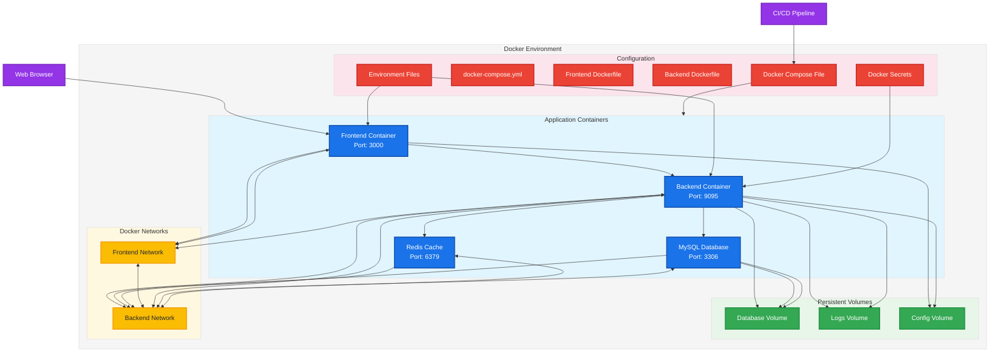

### Docker Configuration Files

#### 1. Frontend Dockerfile

Create a `Dockerfile` in the `study/typescript-react` directory:

```dockerfile
FROM node:16-alpine as build

WORKDIR /app

# Copy package.json and package-lock.json
COPY package*.json ./

# Install dependencies
RUN npm install

# Copy the rest of the application
COPY . .

# Build the application
RUN npm run build

# Production stage
FROM nginx:alpine

# Copy the build output
COPY --from=build /app/dist /usr/share/nginx/html

# Copy nginx configuration
COPY nginx.conf /etc/nginx/conf.d/default.conf

# Expose port
EXPOSE 3000

CMD ["nginx", "-g", "daemon off;"]
```

#### 2. Backend Dockerfile

Create a `Dockerfile` in the `study/study` directory:

```dockerfile
FROM maven:3.8-openjdk-17 as build

WORKDIR /app

# Copy pom.xml
COPY pom.xml .

# Copy source code
COPY src ./src

# Build the application
RUN mvn clean package -DskipTests

# Production stage
FROM openjdk:17-slim

WORKDIR /app

# Copy the built JAR file
COPY --from=build /app/target/*.jar app.jar

# Expose port
EXPOSE 9095

# Run the application with the dev profile by default
ENTRYPOINT ["java", "-jar", "-Dspring.profiles.active=dev", "app.jar"]
```

#### 3. Docker Compose File

Create a `docker-compose.yml` file in the root directory:

```yaml
version: "3.8"

services:
  frontend:
    build:
      context: ./study/typescript-react
      dockerfile: Dockerfile
    ports:
      - "3000:3000"
    environment:
      - VITE_API_BASE_URI=http://backend:9095/identify_service
      - VITE_OAUTH2_REDIRECT_URI=http://backend:9095/identify_service/oauth2/redirect
      - VITE_GITHUB_REDIRECT_URI=http://backend:9095/identify_service/oauthGit/redirect
      - VITE_FACEBOOK_REDIRECT_URI=http://backend:9095/identify_service/oauth2/facebook/redirect
    networks:
      - frontend-network
      - backend-network
    depends_on:
      - backend

  backend:
    build:
      context: ./study/study
      dockerfile: Dockerfile
    ports:
      - "9095:9095"
    environment:
      - DB_URL_DEV=jdbc:mysql://database:3306/tuphung
      - DB_USERNAME_DEV=root
      - DB_PASSWORD_DEV=your_password
      - OAUTH2_CLIENT_ID=${OAUTH2_CLIENT_ID}
      - OAUTH2_CLIENT_SECRET=${OAUTH2_CLIENT_SECRET}
      - OAUTH2_REDIRECT_URI=${OAUTH2_REDIRECT_URI}
      - GITHUB_CLIENT_ID=${GITHUB_CLIENT_ID}
      - GITHUB_CLIENT_SECRET=${GITHUB_CLIENT_SECRET}
      - GITHUB_REDIRECT_URI=${GITHUB_REDIRECT_URI}
      - FACEBOOK_CLIENT_ID=${FACEBOOK_CLIENT_ID}
      - FACEBOOK_CLIENT_SECRET=${FACEBOOK_CLIENT_SECRET}
      - FACEBOOK_REDIRECT_URI=${FACEBOOK_REDIRECT_URI}
      - SPRING_PROFILES_ACTIVE=dev
    networks:
      - backend-network
    depends_on:
      - database
      - redis
    volumes:
      - logs-volume:/app/logs

  database:
    image: mysql:8.0
    ports:
      - "3306:3306"
    environment:
      - MYSQL_ROOT_PASSWORD=your_password
      - MYSQL_DATABASE=tuphung
    volumes:
      - db-data:/var/lib/mysql
    networks:
      - backend-network

  redis:
    image: redis:alpine
    ports:
      - "6379:6379"
    networks:
      - backend-network

networks:
  frontend-network:
  backend-network:

volumes:
  db-data:
  logs-volume:
  config-volume:
```

### Running with Docker Compose

1. Create a `.env` file in the root directory with your OAuth2 credentials and other environment variables.

2. Build and start the containers:

   ```powershell
   docker-compose up -d
   ```

3. Access the application:

   - Frontend: http://localhost:3000
   - Backend API: http://localhost:9095/identify_service

4. To stop the containers:

   ```powershell
   docker-compose down
   ```

### Docker Deployment Workflow

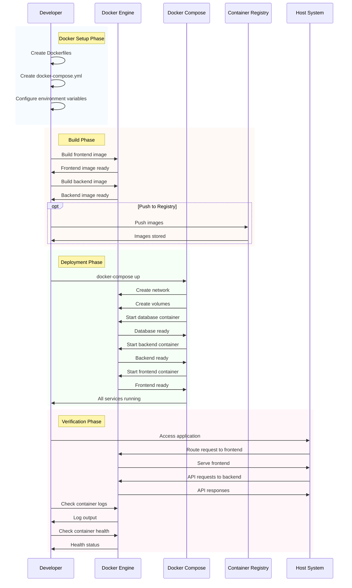

### Using Docker Compose

1. Create a `docker-compose.yml` file in the project root:

   ```yaml
   version: "3.8"

   services:
     mysql:
       image: mysql:8.0
       container_name: tuphung-mysql
       environment:
         MYSQL_DATABASE: tuphung
         MYSQL_ROOT_PASSWORD: your_password
         MYSQL_USER: tuphung
         MYSQL_PASSWORD: your_password
       volumes:
         - mysql-data:/var/lib/mysql
       ports:
         - "3306:3306"
       networks:
         - backend-network
       healthcheck:
         test:
           [
             "CMD",
             "mysqladmin",
             "ping",
             "-h",
             "localhost",
             "-u",
             "root",
             "-p$$MYSQL_ROOT_PASSWORD",
           ]
         interval: 10s
         timeout: 5s
         retries: 5

     redis:
       image: redis:7-alpine
       container_name: tuphung-redis
       ports:
         - "6379:6379"
       networks:
         - backend-network
       healthcheck:
         test: ["CMD", "redis-cli", "ping"]
         interval: 10s
         timeout: 5s
         retries: 5

     backend:
       build:
         context: ./study/study
         dockerfile: Dockerfile
       container_name: tuphung-backend
       depends_on:
         mysql:
           condition: service_healthy
         redis:
           condition: service_healthy
       environment:
         SPRING_PROFILES_ACTIVE: docker
         SPRING_DATASOURCE_URL: jdbc:mysql://mysql:3306/tuphung
         SPRING_DATASOURCE_USERNAME: tuphung
         SPRING_DATASOURCE_PASSWORD: your_password
         SPRING_REDIS_HOST: redis
         SPRING_REDIS_PORT: 6379
         JWT_SECRET: your_jwt_secret_key
         JWT_EXPIRATION: 86400000
       ports:
         - "8080:8080"
       networks:
         - frontend-network
         - backend-network
       healthcheck:
         test:
           ["CMD", "curl", "-f", "http://localhost:8080/api/actuator/health"]
         interval: 30s
         timeout: 10s
         retries: 3
         start_period: 40s

     frontend:
       build:
         context: ./study/typescript-react
         dockerfile: Dockerfile
       container_name: tuphung-frontend
       depends_on:
         backend:
           condition: service_healthy
       environment:
         VITE_API_URL: http://localhost:8080/api
         VITE_WS_URL: ws://localhost:8080/ws
       ports:
         - "3000:80"
       networks:
         - frontend-network

   networks:
     frontend-network:
       driver: bridge
     backend-network:
       driver: bridge

   volumes:
     mysql-data:
       driver: local
   ```

2. Create a Dockerfile for the backend in `study/study/Dockerfile`:

   ```dockerfile
   # Build stage
   FROM maven:3.8.6-openjdk-17-slim AS build
   WORKDIR /app

   # Copy POM and download dependencies (for better caching)
   COPY pom.xml .
   RUN mvn dependency:go-offline

   # Copy source and build
   COPY src ./src
   RUN mvn package -DskipTests

   # Runtime stage
   FROM eclipse-temurin:17-jre-alpine
   WORKDIR /app

   # Install curl for healthcheck
   RUN apk --no-cache add curl

   # Create non-root user
   RUN addgroup -S appgroup && adduser -S appuser -G appgroup
   USER appuser

   # Copy JAR from build stage
   COPY --from=build --chown=appuser:appgroup /app/target/*.jar app.jar

   # Set JVM options
   ENV JAVA_OPTS="-Xms512m -Xmx1024m"

   # Expose port
   EXPOSE 8080

   # Health check
   HEALTHCHECK --interval=30s --timeout=10s --start-period=30s --retries=3 \
     CMD curl -f http://localhost:8080/api/actuator/health || exit 1

   # Run application
   ENTRYPOINT ["sh", "-c", "java $JAVA_OPTS -jar app.jar"]
   ```

3. Create a Dockerfile for the frontend in `study/typescript-react/Dockerfile`:

   ```dockerfile
   # Build stage
   FROM node:16-alpine AS build
   WORKDIR /app

   # Copy package files and install dependencies
   COPY package*.json ./
   RUN npm ci

   # Copy source and build
   COPY . .
   RUN npm run build

   # Runtime stage
   FROM nginx:alpine

   # Copy custom nginx config
   COPY nginx.conf /etc/nginx/conf.d/default.conf

   # Copy built files from build stage
   COPY --from=build /app/dist /usr/share/nginx/html

   # Add healthcheck
   HEALTHCHECK --interval=30s --timeout=10s --start-period=5s --retries=3 \
     CMD wget -q --spider http://localhost:80/ || exit 1

   # Expose port
   EXPOSE 80

   # Start nginx
   CMD ["nginx", "-g", "daemon off;"]
   ```

4. Create an nginx configuration file in `study/typescript-react/nginx.conf`:

   ```nginx
   server {
     listen 80;
     server_name localhost;
     root /usr/share/nginx/html;
     index index.html;

     # Enable gzip compression
     gzip on;
     gzip_types text/plain text/css application/json application/javascript text/xml application/xml application/xml+rss text/javascript;
     gzip_min_length 1000;

     # Cache static assets
     location ~* \.(jpg|jpeg|png|gif|ico|css|js)$ {
       expires 1d;
       add_header Cache-Control "public, max-age=86400";
     }

     # Handle SPA routing
     location / {
       try_files $uri $uri/ /index.html;
     }

     # Proxy API requests
     location /api {
       proxy_pass http://backend:8080/api;
       proxy_set_header Host $host;
       proxy_set_header X-Real-IP $remote_addr;
       proxy_set_header X-Forwarded-For $proxy_add_x_forwarded_for;
       proxy_set_header X-Forwarded-Proto $scheme;

       # Timeout settings
       proxy_connect_timeout 300s;
       proxy_send_timeout 300s;
       proxy_read_timeout 300s;
     }

     # Proxy WebSocket connections
     location /ws {
       proxy_pass http://backend:8080/ws;
       proxy_http_version 1.1;
       proxy_set_header Upgrade $http_upgrade;
       proxy_set_header Connection "upgrade";
       proxy_set_header Host $host;
       proxy_set_header X-Real-IP $remote_addr;
       proxy_set_header X-Forwarded-For $proxy_add_x_forwarded_for;

       # WebSocket timeout settings
       proxy_connect_timeout 7d;
       proxy_send_timeout 7d;
       proxy_read_timeout 7d;
     }

     # Error handling
     error_page 404 /index.html;
     error_page 500 502 503 504 /50x.html;
     location = /50x.html {
       root /usr/share/nginx/html;
     }
   }
   ```

5. Create a `.dockerignore` file in both frontend and backend directories:

   ```
   # Frontend .dockerignore
   node_modules
   dist
   .git
   .github
   .vscode
   .env
   .env.*
   *.log

   # Backend .dockerignore
   target
   .git
   .github
   .vscode
   *.log
   ```

6. Start the containers:

   ```powershell
   docker-compose up -d
   ```

7. Monitor container logs:

   ```powershell
   docker-compose logs -f
   ```

8. Access the application:
   - Frontend: http://localhost:3000
   - Backend API: http://localhost:8080/api

## AWS Deployment

### AWS Architecture

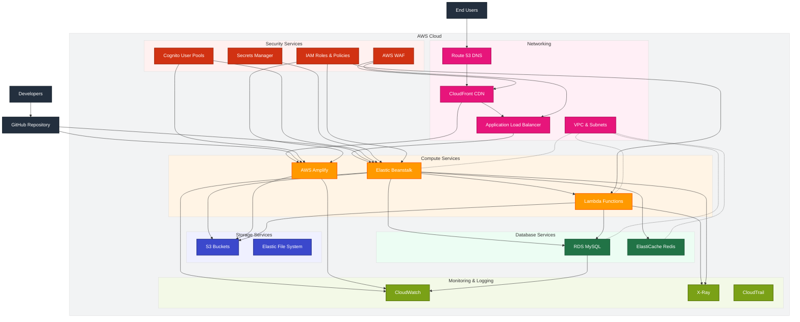

### AWS Deployment Workflow

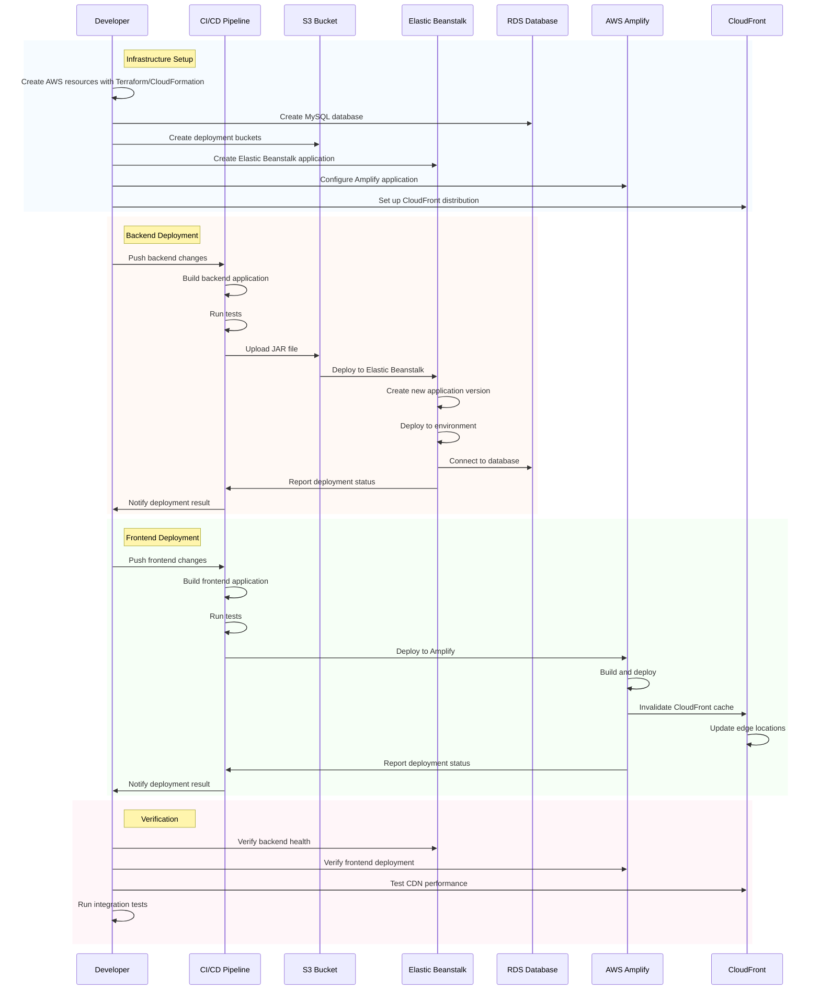

### Backend Deployment to AWS Elastic Beanstalk

1. Set up AWS CLI with your credentials:

   ```powershell
   aws configure
   ```

2. Create an S3 bucket for deployment artifacts:

   ```powershell
   aws s3 mb s3://tuphung-deployment-artifacts
   ```

3. Create an Elastic Beanstalk application:

   ```powershell
   aws elasticbeanstalk create-application --application-name tuphung-backend
   ```

4. Create an `eb-options.json` file with environment configuration:

   ```json
   [
     {
       "Namespace": "aws:elasticbeanstalk:environment",
       "OptionName": "EnvironmentType",
       "Value": "LoadBalanced"
     },
     {
       "Namespace": "aws:elasticbeanstalk:environment",
       "OptionName": "LoadBalancerType",
       "Value": "application"
     },
     {
       "Namespace": "aws:autoscaling:launchconfiguration",
       "OptionName": "InstanceType",
       "Value": "t2.small"
     },
     {
       "Namespace": "aws:autoscaling:asg",
       "OptionName": "MinSize",
       "Value": "1"
     },
     {
       "Namespace": "aws:autoscaling:asg",
       "OptionName": "MaxSize",
       "Value": "3"
     },
     {
       "Namespace": "aws:elasticbeanstalk:application:environment",
       "OptionName": "SPRING_PROFILES_ACTIVE",
       "Value": "prod"
     },
     {
       "Namespace": "aws:elasticbeanstalk:application:environment",
       "OptionName": "SPRING_DATASOURCE_URL",
       "Value": "jdbc:mysql://your-rds-endpoint:3306/tuphung"
     },
     {
       "Namespace": "aws:elasticbeanstalk:application:environment",
       "OptionName": "SPRING_DATASOURCE_USERNAME",
       "Value": "admin"
     },
     {
       "Namespace": "aws:elasticbeanstalk:application:environment",
       "OptionName": "SPRING_DATASOURCE_PASSWORD",
       "Value": "{{resolve:secretsmanager:tuphung/db:SecretString:password}}"
     },
     {
       "Namespace": "aws:elasticbeanstalk:application:environment",
       "OptionName": "JWT_SECRET",
       "Value": "{{resolve:secretsmanager:tuphung/jwt:SecretString:secret}}"
     },
     {
       "Namespace": "aws:elasticbeanstalk:cloudwatch:logs",
       "OptionName": "StreamLogs",
       "Value": "true"
     },
     {
       "Namespace": "aws:elasticbeanstalk:cloudwatch:logs",
       "OptionName": "DeleteOnTerminate",
       "Value": "false"
     },
     {
       "Namespace": "aws:elasticbeanstalk:cloudwatch:logs",
       "OptionName": "RetentionInDays",
       "Value": "30"
     },
     {
       "Namespace": "aws:elasticbeanstalk:healthreporting:system",
       "OptionName": "SystemType",
       "Value": "enhanced"
     }
   ]
   ```

5. Create an environment:

   ```powershell
   aws elasticbeanstalk create-environment `
     --application-name tuphung-backend `
     --environment-name tuphung-backend-prod `
     --solution-stack-name "64bit Amazon Linux 2 v3.4.0 running Corretto 17" `
     --option-settings file://eb-options.json
   ```

6. Create a `Procfile` in the backend project root:

   ```
   web: java -Dserver.port=$PORT $JAVA_OPTS -jar target/study-0.0.1-SNAPSHOT.jar
   ```

7. Package the application:

   ```powershell
   cd study/study
   mvn clean package -DskipTests
   ```

8. Upload the JAR file to S3:

   ```powershell
   aws s3 cp target/study-0.0.1-SNAPSHOT.jar s3://tuphung-deployment-artifacts/tuphung-backend.jar
   ```

9. Create an application version and deploy:

   ```powershell
   aws elasticbeanstalk create-application-version `
     --application-name tuphung-backend `
     --version-label v1 `
     --source-bundle S3Bucket="tuphung-deployment-artifacts",S3Key="tuphung-backend.jar"

   aws elasticbeanstalk update-environment `
     --application-name tuphung-backend `
     --environment-name tuphung-backend-prod `
     --version-label v1
   ```

10. Monitor the deployment:

    ```powershell
    aws elasticbeanstalk describe-environments `
      --environment-names tuphung-backend-prod `
      --query "Environments[0].Status"
    ```

### Frontend Deployment to AWS Amplify

1. Create a build specification file `amplify.yml` in the project root:

   ```yaml
   version: 1
   frontend:
     phases:
       preBuild:
         commands:
           - cd study/typescript-react
           - npm ci
       build:
         commands:
           - echo "VITE_API_URL=$API_URL" >> .env
           - echo "VITE_WS_URL=$WS_URL" >> .env
           - npm run build
     artifacts:
       baseDirectory: study/typescript-react/dist
       files:
         - "**/*"
     cache:
       paths:
         - study/typescript-react/node_modules/**/*

   customHeaders:
     - pattern: "**/*"
       headers:
         - key: "Strict-Transport-Security"
           value: "max-age=31536000; includeSubDomains"
         - key: "X-Content-Type-Options"
           value: "nosniff"
         - key: "X-XSS-Protection"
           value: "1; mode=block"
         - key: "X-Frame-Options"
           value: "SAMEORIGIN"

     - pattern: "/index.html"
       headers:
         - key: "Cache-Control"
           value: "no-cache"

     - pattern: "/*.js"
       headers:
         - key: "Cache-Control"
           value: "public, max-age=31536000, immutable"

     - pattern: "/*.css"
       headers:
         - key: "Cache-Control"
           value: "public, max-age=31536000, immutable"
   ```

2. Create an Amplify app using the AWS Management Console or CLI:

   ```powershell
   aws amplify create-app `
     --name tuphung-frontend `
     --repository https://github.com/TuPhung369/Haaga_Backend_Programming `
     --access-token your_github_access_token
   ```

3. Add environment variables:

   ```powershell
   aws amplify create-backend-environment `
     --app-id your_amplify_app_id `
     --environment-name prod

   aws amplify update-app `
     --app-id your_amplify_app_id `
     --environment-variables "API_URL=https://api.tuphung.com/api,WS_URL=wss://api.tuphung.com/ws"
   ```

4. Create a branch:

   ```powershell
   aws amplify create-branch `
     --app-id your_amplify_app_id `
     --branch-name main `
     --framework "React" `
     --stage PRODUCTION
   ```

5. Start the deployment:

   ```powershell
   aws amplify start-job `
     --app-id your_amplify_app_id `
     --branch-name main `
     --job-type RELEASE
   ```

6. Set up a custom domain (optional):

   ```powershell
   aws amplify create-domain-association `
     --app-id your_amplify_app_id `
     --domain-name tuphung.com `
     --sub-domain-settings subDomainSetting="www",branchName="main"
   ```

7. Monitor the deployment:

   ```powershell
   aws amplify get-job `
     --app-id your_amplify_app_id `
     --branch-name main `
     --job-id your_job_id
   ```

## Documentation Deployment

### Documentation Deployment Architecture

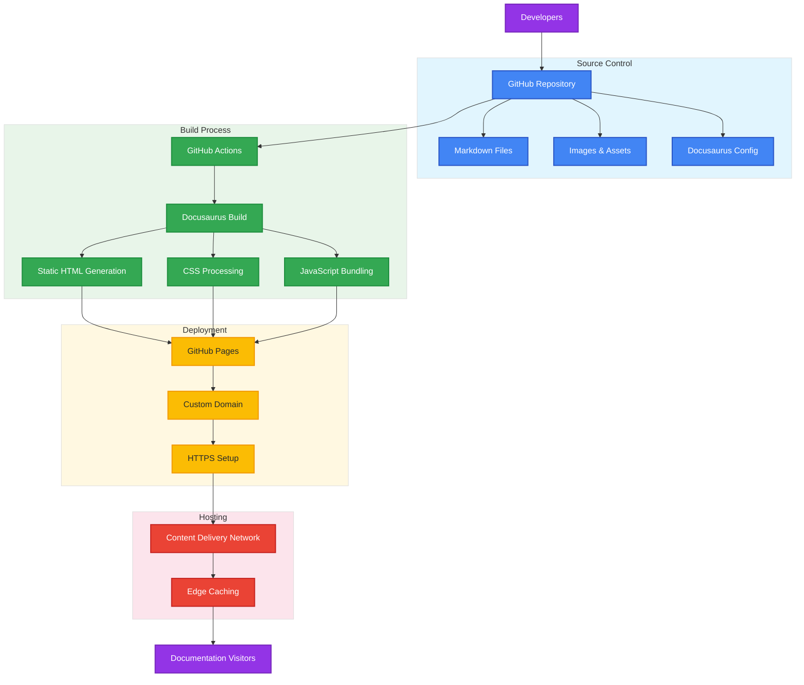

### Documentation Deployment Workflow

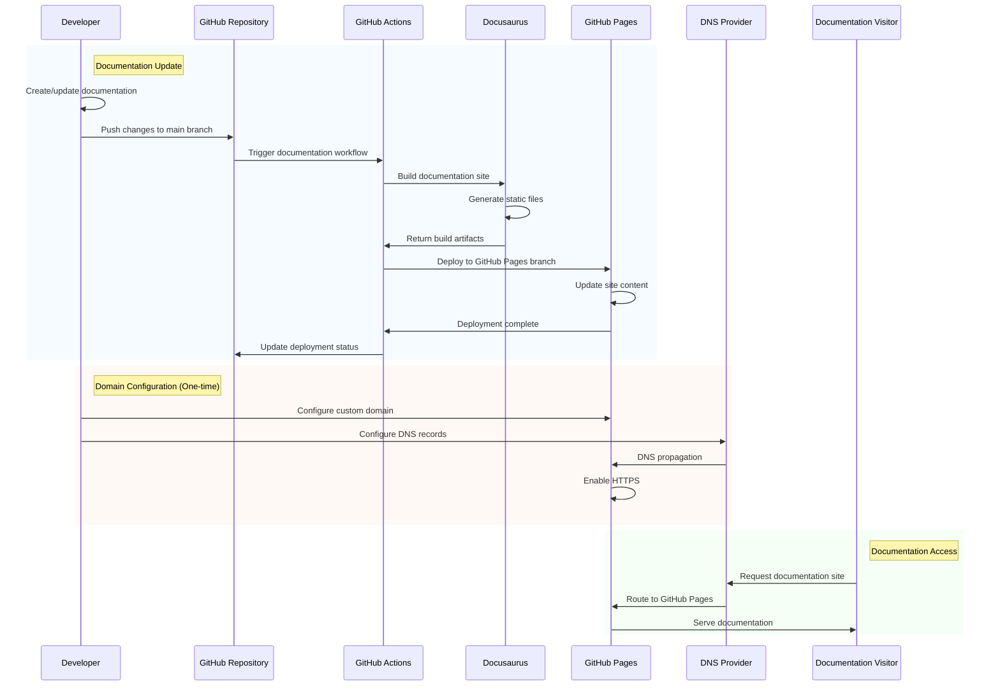

### GitHub Pages Deployment

To deploy the documentation to GitHub Pages:

1. Update the `package.json` in the `TuPhung_Docs` directory:

   ```json
   {
     "name": "tuphung-docs",
     "version": "1.0.0",
     "private": true,
     "scripts": {
       "docusaurus": "docusaurus",
       "start": "docusaurus start",
       "build": "docusaurus build",
       "swizzle": "docusaurus swizzle",
       "deploy": "docusaurus deploy",
       "clear": "docusaurus clear",
       "serve": "docusaurus serve",
       "write-translations": "docusaurus write-translations",
       "write-heading-ids": "docusaurus write-heading-ids"
     },
     "dependencies": {
       "@docusaurus/core": "^2.4.1",
       "@docusaurus/preset-classic": "^2.4.1",
       "@mdx-js/react": "^1.6.22",
       "clsx": "^1.2.1",
       "prism-react-renderer": "^1.3.5",
       "react": "^17.0.2",
       "react-dom": "^17.0.2"
     },
     "browserslist": {
       "production": [">0.5%", "not dead", "not op_mini all"],
       "development": [
         "last 1 chrome version",
         "last 1 firefox version",
         "last 1 safari version"
       ]
     }
   }
   ```

2. Configure the `docusaurus.config.js` file:

   ```javascript
   // @ts-check
   // Note: type annotations allow type checking and IDEs autocompletion

   /** @type {import('@docusaurus/types').Config} */
   const config = {
     title: "TuPhung Project Documentation",
     tagline: "Comprehensive documentation for the TuPhung Project",
     url: "https://tuphung369.github.io",
     baseUrl: "/Haaga_Backend_Programming/",
     onBrokenLinks: "throw",
     onBrokenMarkdownLinks: "warn",
     favicon: "img/favicon.ico",
     organizationName: "TuPhung369", // Usually your GitHub org/user name.
     projectName: "Haaga_Backend_Programming", // Usually your repo name.

     presets: [
       [
         "classic",
         /** @type {import('@docusaurus/preset-classic').Options} */
         ({
           docs: {
             sidebarPath: require.resolve("./sidebars.js"),
             routeBasePath: "/",
             editUrl:
               "https://github.com/TuPhung369/Haaga_Backend_Programming/tree/main/TuPhung_Docs/",
           },
           theme: {
             customCss: require.resolve("./src/css/custom.css"),
           },
         }),
       ],
     ],

     themeConfig:
       /** @type {import('@docusaurus/preset-classic').ThemeConfig} */
       ({
         navbar: {
           title: "TuPhung Project",
           logo: {
             alt: "TuPhung Logo",
             src: "img/logo.svg",
           },
           items: [
             {
               type: "doc",
               docId: "intro",
               position: "left",
               label: "Documentation",
             },
             {
               href: "https://github.com/TuPhung369/Haaga_Backend_Programming",
               label: "GitHub",
               position: "right",
             },
           ],
         },
         footer: {
           style: "dark",
           links: [
             {
               title: "Docs",
               items: [
                 {
                   label: "Introduction",
                   to: "/",
                 },
                 {
                   label: "Architecture",
                   to: "/architecture",
                 },
                 {
                   label: "Deployment",
                   to: "/deployment",
                 },
               ],
             },
             {
               title: "More",
               items: [
                 {
                   label: "GitHub",
                   href: "https://github.com/TuPhung369/Haaga_Backend_Programming",
                 },
               ],
             },
           ],
           copyright: `Copyright © ${new Date().getFullYear()} TuPhung Project. Built with Docusaurus.`,
         },
         prism: {
           theme: require("prism-react-renderer/themes/github"),
           darkTheme: require("prism-react-renderer/themes/dracula"),
           additionalLanguages: ["java", "bash", "json", "yaml"],
         },
       }),
   };

   module.exports = config;
   ```

3. Configure GitHub Actions by creating a `.github/workflows/documentation.yml` file:

   ```yaml
   name: Deploy Documentation

   on:
     push:
       branches:
         - main
       paths:
         - "TuPhung_Docs/**"
     workflow_dispatch:

   jobs:
     deploy:
       name: Deploy to GitHub Pages
       runs-on: ubuntu-latest
       steps:
         - uses: actions/checkout@v3
         - uses: actions/setup-node@v3
           with:
             node-version: 18
             cache: npm
             cache-dependency-path: TuPhung_Docs/package-lock.json

         - name: Install dependencies
           run: |
             cd TuPhung_Docs
             npm ci

         - name: Build website
           run: |
             cd TuPhung_Docs
             npm run build

         - name: Deploy to GitHub Pages
           uses: peaceiris/actions-gh-pages@v3
           with:
             github_token: ${{ secrets.GITHUB_TOKEN }}
             publish_dir: ./TuPhung_Docs/build
             user_name: "github-actions[bot]"
             user_email: "github-actions[bot]@users.noreply.github.com"
             commit_message: "docs: deploy documentation updates"
   ```

4. Enable GitHub Pages in your repository settings:

   - Go to Settings > Pages
   - Set Source to "Deploy from a branch"
   - Select the `gh-pages` branch and `/` (root) folder
   - Click Save

5. (Optional) Configure a custom domain:

   - Add a CNAME file to the `TuPhung_Docs/static` directory with your domain
   - Configure DNS settings with your domain provider:
     - Add an A record pointing to GitHub Pages IP addresses
     - Add a CNAME record for www subdomain
   - Enable HTTPS in the GitHub Pages settings

6. Push your changes to the main branch:
   ```powershell
   git add .
   git commit -m "Add documentation deployment configuration"
   git push origin main
   ```

## Continuous Integration/Continuous Deployment

### CI/CD Architecture

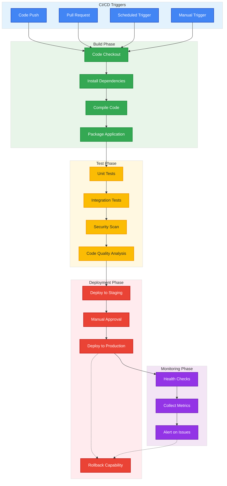

### GitHub Actions Workflow

Create a `.github/workflows/ci-cd.yml` file:

```yaml
name: CI/CD Pipeline

on:
  push:
    branches: [main, develop]
  pull_request:
    branches: [main, develop]
  workflow_dispatch:
    inputs:
      environment:
        description: "Environment to deploy to"
        required: true
        default: "staging"
        type: choice
        options:
          - staging
          - production

jobs:
  backend-build:
    name: Backend Build & Test
    runs-on: ubuntu-latest
    steps:
      - name: Checkout code
        uses: actions/checkout@v3

      - name: Set up JDK 17
        uses: actions/setup-java@v3
        with:
          java-version: "17"
          distribution: "temurin"
          cache: maven

      - name: Cache Maven packages
        uses: actions/cache@v3
        with:
          path: ~/.m2
          key: ${{ runner.os }}-m2-${{ hashFiles('**/pom.xml') }}
          restore-keys: ${{ runner.os }}-m2

      - name: Build with Maven
        run: |
          cd study/study
          mvn clean verify

      - name: Run tests
        run: |
          cd study/study
          mvn test

      - name: Run code quality analysis
        run: |
          cd study/study
          mvn sonar:sonar -Dsonar.projectKey=tuphung-backend -Dsonar.organization=tuphung -Dsonar.host.url=https://sonarcloud.io -Dsonar.login=${{ secrets.SONAR_TOKEN }}
        if: github.event_name != 'pull_request'

      - name: Upload build artifact
        uses: actions/upload-artifact@v3
        with:
          name: backend-jar
          path: study/study/target/*.jar
          retention-days: 5

  frontend-build:
    name: Frontend Build & Test
    runs-on: ubuntu-latest
    steps:
      - name: Checkout code
        uses: actions/checkout@v3

      - name: Set up Node.js
        uses: actions/setup-node@v3
        with:
          node-version: "16"
          cache: "npm"
          cache-dependency-path: study/typescript-react/package-lock.json

      - name: Install dependencies
        run: |
          cd study/typescript-react
          npm ci

      - name: Lint code
        run: |
          cd study/typescript-react
          npm run lint

      - name: Build
        run: |
          cd study/typescript-react
          npm run build

      - name: Run tests
        run: |
          cd study/typescript-react
          npm test

      - name: Upload build artifact
        uses: actions/upload-artifact@v3
        with:
          name: frontend-build
          path: study/typescript-react/dist
          retention-days: 5

  deploy-staging:
    name: Deploy to Staging
    needs: [backend-build, frontend-build]
    if: github.event_name == 'push' || (github.event_name == 'workflow_dispatch' && github.event.inputs.environment == 'staging')
    runs-on: ubuntu-latest
    environment: staging
    steps:
      - name: Checkout code
        uses: actions/checkout@v3

      - name: Download backend artifact
        uses: actions/download-artifact@v3
        with:
          name: backend-jar
          path: backend-jar

      - name: Download frontend artifact
        uses: actions/download-artifact@v3
        with:
          name: frontend-build
          path: frontend-build

      - name: Configure AWS credentials
        uses: aws-actions/configure-aws-credentials@v2
        with:
          aws-access-key-id: ${{ secrets.AWS_ACCESS_KEY_ID }}
          aws-secret-access-key: ${{ secrets.AWS_SECRET_ACCESS_KEY }}
          aws-region: us-east-1

      - name: Deploy backend to Elastic Beanstalk
        uses: einaregilsson/beanstalk-deploy@v21
        with:
          aws_access_key: ${{ secrets.AWS_ACCESS_KEY_ID }}
          aws_secret_key: ${{ secrets.AWS_SECRET_ACCESS_KEY }}
          application_name: tuphung-backend
          environment_name: tuphung-backend-staging
          version_label: staging-${{ github.sha }}
          region: us-east-1
          deployment_package: backend-jar/study-0.0.1-SNAPSHOT.jar

      - name: Deploy frontend to Amplify
        run: |
          aws amplify start-deployment \
            --app-id ${{ secrets.AMPLIFY_APP_ID }} \
            --branch-name staging \
            --source-url s3://${{ secrets.DEPLOY_BUCKET }}/frontend-${{ github.sha }}.zip

      - name: Run health checks
        run: |
          echo "Running health checks on staging environment"
          curl -f https://api-staging.tuphung.com/api/actuator/health || exit 1

      - name: Notify deployment status
        uses: slackapi/slack-github-action@v1.24.0
        with:
          payload: |
            {
              "text": "Staging Deployment ${{ job.status }}\nCommit: ${{ github.sha }}\nRepo: ${{ github.repository }}"
            }
        env:
          SLACK_WEBHOOK_URL: ${{ secrets.SLACK_WEBHOOK_URL }}
        if: always()

  deploy-production:
    name: Deploy to Production
    needs: [backend-build, frontend-build]
    if: github.event_name == 'workflow_dispatch' && github.event.inputs.environment == 'production'
    runs-on: ubuntu-latest
    environment:
      name: production
      url: https://tuphung.com
    steps:
      - name: Checkout code
        uses: actions/checkout@v3

      - name: Download backend artifact
        uses: actions/download-artifact@v3
        with:
          name: backend-jar
          path: backend-jar

      - name: Download frontend artifact
        uses: actions/download-artifact@v3
        with:
          name: frontend-build
          path: frontend-build

      - name: Configure AWS credentials
        uses: aws-actions/configure-aws-credentials@v2
        with:
          aws-access-key-id: ${{ secrets.AWS_ACCESS_KEY_ID }}
          aws-secret-access-key: ${{ secrets.AWS_SECRET_ACCESS_KEY }}
          aws-region: us-east-1

      - name: Deploy backend to Elastic Beanstalk
        uses: einaregilsson/beanstalk-deploy@v21
        with:
          aws_access_key: ${{ secrets.AWS_ACCESS_KEY_ID }}
          aws_secret_key: ${{ secrets.AWS_SECRET_ACCESS_KEY }}
          application_name: tuphung-backend
          environment_name: tuphung-backend-prod
          version_label: prod-${{ github.sha }}
          region: us-east-1
          deployment_package: backend-jar/study-0.0.1-SNAPSHOT.jar

      - name: Deploy frontend to Amplify
        run: |
          aws amplify start-deployment \
            --app-id ${{ secrets.AMPLIFY_APP_ID }} \
            --branch-name main \
            --source-url s3://${{ secrets.DEPLOY_BUCKET }}/frontend-${{ github.sha }}.zip

      - name: Run health checks
        run: |
          echo "Running health checks on production environment"
          curl -f https://api.tuphung.com/api/actuator/health || exit 1

      - name: Notify deployment status
        uses: slackapi/slack-github-action@v1.24.0
        with:
          payload: |
            {
              "text": "Production Deployment ${{ job.status }}\nCommit: ${{ github.sha }}\nRepo: ${{ github.repository }}"
            }
        env:
          SLACK_WEBHOOK_URL: ${{ secrets.SLACK_WEBHOOK_URL }}
        if: always()
```

## Monitoring and Logging

### Monitoring Architecture

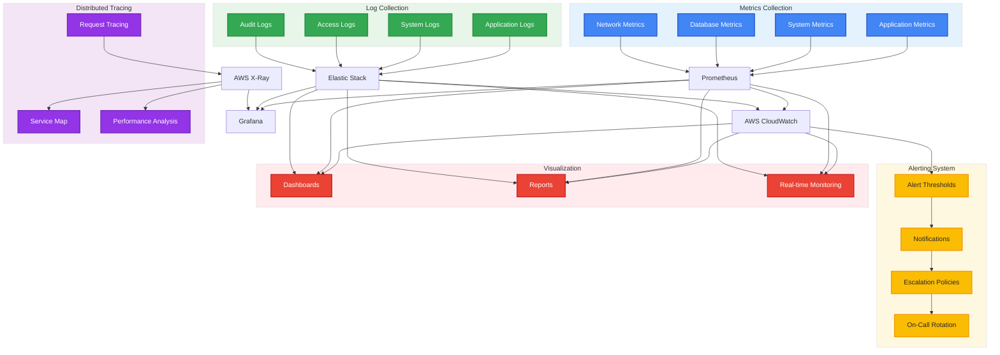

### Monitoring Workflow

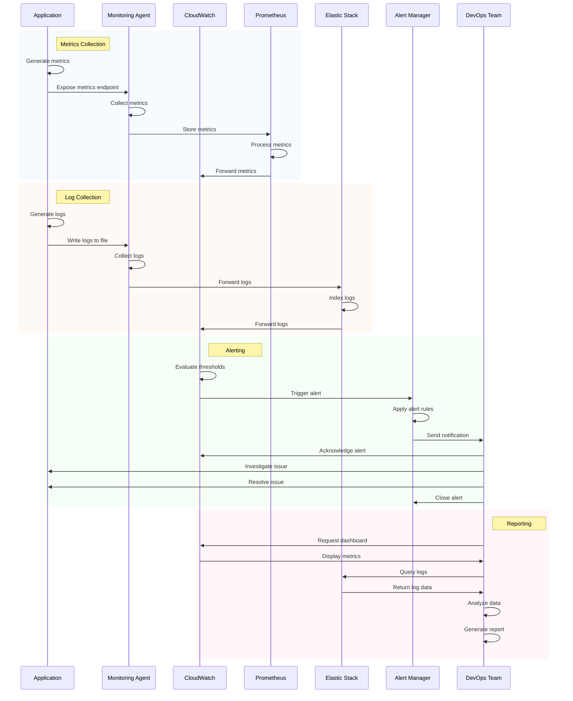

### AWS CloudWatch Setup

1. Add CloudWatch dependencies to the backend `pom.xml`:

   ```xml
   <dependency>
     <groupId>io.micrometer</groupId>
     <artifactId>micrometer-registry-cloudwatch2</artifactId>
   </dependency>
   <dependency>
     <groupId>org.springframework.cloud</groupId>
     <artifactId>spring-cloud-starter-aws</artifactId>
   </dependency>
   <dependency>
     <groupId>org.springframework.boot</groupId>
     <artifactId>spring-boot-starter-actuator</artifactId>
   </dependency>
   <dependency>
     <groupId>io.micrometer</groupId>
     <artifactId>micrometer-registry-prometheus</artifactId>
   </dependency>
   ```

2. Configure CloudWatch in `application-prod.yaml`:

   ```yaml
   management:
     endpoints:
       web:
         exposure:
           include: health,info,metrics,prometheus
     endpoint:
       health:
         show-details: when_authorized
         show-components: always
       metrics:
         enabled: true
     metrics:
       export:
         cloudwatch:
           namespace: TuPhung/Backend
           batch-size: 20
           step: 1m
         prometheus:
           enabled: true
     tracing:
       sampling:
         probability: 1.0

   logging:
     level:
       root: INFO
       com.database.study: INFO
       org.springframework.web: INFO
       org.hibernate: WARN
     pattern:
       console: "%d{yyyy-MM-dd HH:mm:ss} [%thread] [%X{traceId}/%X{spanId}] %-5level %logger{36} - %msg%n"
       file: "%d{yyyy-MM-dd HH:mm:ss} [%thread] [%X{traceId}/%X{spanId}] %-5level %logger{36} - %msg%n"
     file:
       name: /var/log/tuphung-backend.log
       max-size: 10MB
       max-history: 7
       total-size-cap: 100MB

   cloud:
     aws:
       region:
         static: us-east-1
       stack:
         auto: false
   ```

3. Create a custom metrics configuration class:

   ```java
   @Configuration
   public class MetricsConfig {

       @Bean
       public MeterRegistryCustomizer<MeterRegistry> metricsCommonTags(
               @Value("${spring.application.name}") String applicationName) {
           return registry -> registry.config().commonTags(
               "application", applicationName,
               "environment", "${spring.profiles.active:default}"
           );
       }

       @Bean
       public TimedAspect timedAspect(MeterRegistry registry) {
           return new TimedAspect(registry);
       }
   }
   ```

4. Create CloudWatch alarms using PowerShell:

   ```powershell
   aws cloudwatch put-metric-alarm `
     --alarm-name tuphung-backend-high-cpu `
     --alarm-description "High CPU utilization" `
     --metric-name CPUUtilization `
     --namespace AWS/EC2 `
     --statistic Average `
     --period 300 `
     --threshold 80 `
     --comparison-operator GreaterThanThreshold `
     --dimensions Name=InstanceId,Value=i-12345678 `
     --evaluation-periods 2 `
     --alarm-actions arn:aws:sns:us-east-1:123456789012:tuphung-alerts
   ```

5. Set up a CloudWatch dashboard:

   ```powershell
   aws cloudwatch put-dashboard `
     --dashboard-name TuPhung-Backend-Dashboard `
     --dashboard-body file://dashboard.json
   ```

6. Create a `dashboard.json` file:

   ```json
   {
     "widgets": [
       {
         "type": "metric",
         "x": 0,
         "y": 0,
         "width": 12,
         "height": 6,
         "properties": {
           "metrics": [
             [
               "TuPhung/Backend",
               "http.server.requests.count",
               "uri",
               "/api/users",
               "status",
               "200"
             ],
             [
               ".",
               "http.server.requests.count",
               "uri",
               "/api/auth/login",
               "status",
               "200"
             ]
           ],
           "view": "timeSeries",
           "stacked": false,
           "region": "us-east-1",
           "title": "API Requests",
           "period": 300,
           "stat": "Sum"
         }
       },
       {
         "type": "metric",
         "x": 12,
         "y": 0,
         "width": 12,
         "height": 6,
         "properties": {
           "metrics": [
             ["TuPhung/Backend", "jvm.memory.used", "area", "heap"],
             ["...", "nonheap"]
           ],
           "view": "timeSeries",
           "stacked": false,
           "region": "us-east-1",
           "title": "JVM Memory Usage",
           "period": 300
         }
       },
       {
         "type": "metric",
         "x": 0,
         "y": 6,
         "width": 12,
         "height": 6,
         "properties": {
           "metrics": [
             [
               "TuPhung/Backend",
               "http.server.requests.max",
               "uri",
               "/api/users",
               "status",
               "200"
             ],
             [
               ".",
               "http.server.requests.max",
               "uri",
               "/api/auth/login",
               "status",
               "200"
             ]
           ],
           "view": "timeSeries",
           "stacked": false,
           "region": "us-east-1",
           "title": "API Response Time (max)",
           "period": 300
         }
       },
       {
         "type": "log",
         "x": 12,
         "y": 6,
         "width": 12,
         "height": 6,
         "properties": {
           "query": "SOURCE '/aws/elasticbeanstalk/tuphung-backend-prod/var/log/tuphung-backend.log' | fields @timestamp, @message\n| filter @message like /ERROR/\n| sort @timestamp desc\n| limit 20",
           "region": "us-east-1",
           "title": "Backend Error Logs",
           "view": "table"
         }
       }
     ]
   }
   ```

7. Configure X-Ray for distributed tracing:

   ```xml
   <!-- Add to pom.xml -->
   <dependency>
     <groupId>org.springframework.cloud</groupId>
     <artifactId>spring-cloud-starter-aws-xray</artifactId>
   </dependency>
   ```

   ```java
   // Add to main application class
   @Configuration
   public class XRayConfig {
       static {
           AWSXRayRecorderBuilder builder = AWSXRayRecorderBuilder.standard()
               .withSegmentListener(new SLF4JSegmentListener("com.database.study.xray"));
           AWSXRay.setGlobalRecorder(builder.build());
       }

       @Bean
       public Filter xrayFilter() {
           return new AWSXRayServletFilter("tuphung-backend");
       }
   }
   ```

## Backup and Disaster Recovery

### Backup and Recovery Architecture

```mermaid
flowchart TD
    %% Styling
    classDef backup fill:#4285F4,stroke:#2A56C6,color:white,stroke-width:2px
    classDef storage fill:#34A853,stroke:#1E8E3E,color:white,stroke-width:2px
    classDef recovery fill:#FBBC04,stroke:#F29900,color:#24292e,stroke-width:2px
    classDef testing fill:#EA4335,stroke:#C5221F,color:white,stroke-width:2px
    classDef policy fill:#9334E6,stroke:#7627BB,color:white,stroke-width:2px

    %% Main components
    subgraph BackupSources["Backup Sources"]
        DBSource[Database]:::backup
        AppSource[Application Files]:::backup
        ConfigSource[Configuration]:::backup
        LogSource[Log Files]:::backup
    end

    subgraph BackupStorage["Backup Storage"]
        S3Primary[S3 Primary Bucket]:::storage
        S3Secondary[S3 Cross-Region Bucket]:::storage
        GlacierArchive[Glacier Archive]:::storage
    end

    subgraph RecoveryProcess["Recovery Process"]
        DRP[Disaster Recovery Plan]:::recovery
        RecoveryScripts[Recovery Scripts]:::recovery
        FailoverSystem[Failover System]:::recovery
        Restoration[Data Restoration]:::recovery
    end

    subgraph BackupTesting["Backup Testing"]
        RegularTests[Regular Recovery Tests]:::testing
        ValidationChecks[Validation Checks]:::testing
        SimulatedFailures[Simulated Failures]:::testing
    end

    subgraph BackupPolicies["Backup Policies"]
        RetentionPolicy[Retention Policy]:::policy
        EncryptionPolicy[Encryption Policy]:::policy
        SchedulingPolicy[Scheduling Policy]:::policy
        CompliancePolicy[Compliance Policy]:::policy
    end

    %% Connections
    DBSource --> AutomatedBackup[Automated Backup]:::backup
    AppSource & ConfigSource & LogSource --> ManualBackup[Manual Backup]:::backup

    AutomatedBackup --> S3Primary
    ManualBackup --> S3Primary

    S3Primary --> S3Secondary
    S3Primary --> GlacierArchive

    S3Primary & S3Secondary --> Restoration
    GlacierArchive -.-> Restoration

    DRP --> RecoveryScripts
    RecoveryScripts --> FailoverSystem
    RecoveryScripts --> Restoration

    RetentionPolicy & EncryptionPolicy & SchedulingPolicy & CompliancePolicy --> AutomatedBackup
    RetentionPolicy & EncryptionPolicy & SchedulingPolicy & CompliancePolicy --> ManualBackup

    RegularTests --> ValidationChecks
    SimulatedFailures --> ValidationChecks
    ValidationChecks --> DRP

    %% Apply styles
    class DBSource,AppSource,ConfigSource,LogSource,AutomatedBackup,ManualBackup backup
    class S3Primary,S3Secondary,GlacierArchive storage
    class DRP,RecoveryScripts,FailoverSystem,Restoration recovery
    class RegularTests,ValidationChecks,SimulatedFailures testing
    class RetentionPolicy,EncryptionPolicy,SchedulingPolicy,CompliancePolicy policy

    %% Styling for subgraphs
    style BackupSources fill:#E3F2FD,stroke:#ddd,stroke-width:1px
    style BackupStorage fill:#E8F5E9,stroke:#ddd,stroke-width:1px
    style RecoveryProcess fill:#FFF8E1,stroke:#ddd,stroke-width:1px
    style BackupTesting fill:#FFEBEE,stroke:#ddd,stroke-width:1px
    style BackupPolicies fill:#F3E5F5,stroke:#ddd,stroke-width:1px
```

### Backup and Recovery Workflow

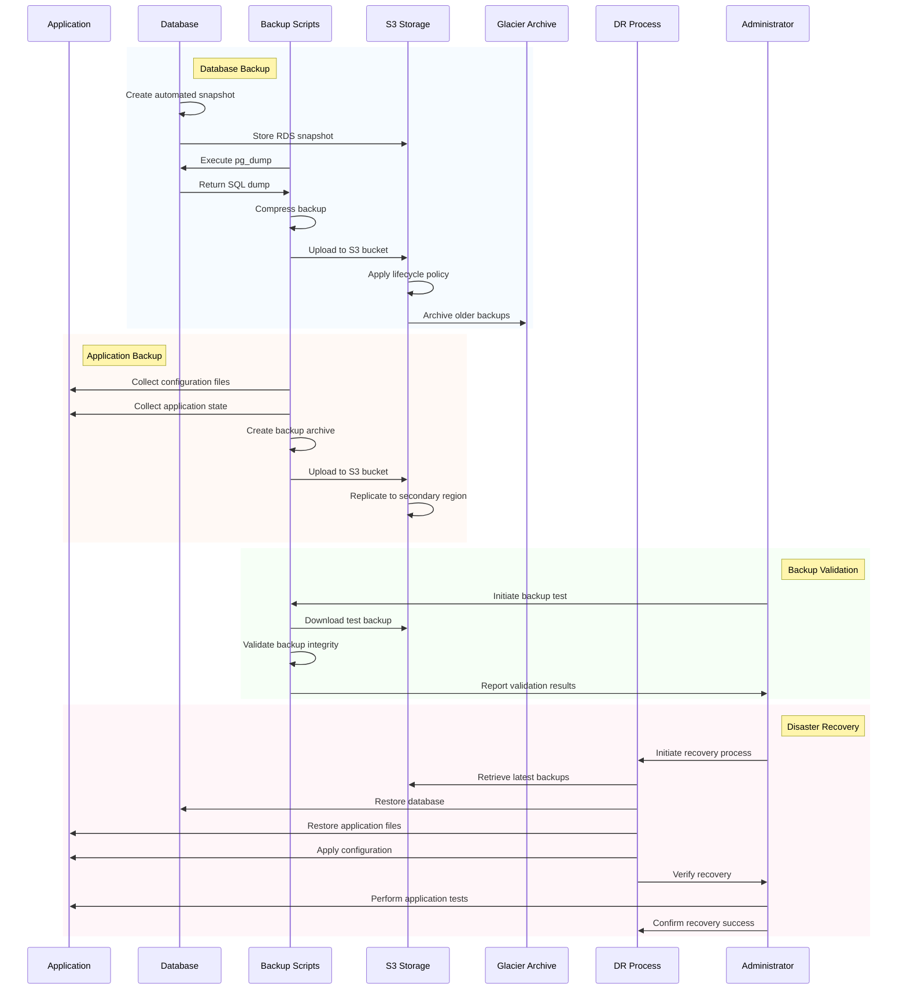

### Database Backup

1. Set up automated MySQL backups in AWS RDS:

   ```powershell
   # Create a read replica for high availability
   aws rds create-db-instance-read-replica `
     --db-instance-identifier tuphung-db-replica `
     --source-db-instance-identifier tuphung-db `
     --availability-zone us-east-1b
   ```

2. Configure automated snapshots:

   ```powershell
   # Configure automated backups
   aws rds modify-db-instance `
     --db-instance-identifier tuphung-db `
     --backup-retention-period 14 `
     --preferred-backup-window "03:00-04:00" `
     --copy-tags-to-snapshot `
     --deletion-protection `
     --apply-immediately
   ```

3. Set up point-in-time recovery:

   ```powershell
   # Enable point-in-time recovery
   aws rds modify-db-instance `
     --db-instance-identifier tuphung-db `
     --backup-retention-period 14 `
     --enable-cloudwatch-logs-exports '["error","general","slowquery","audit"]' `
     --apply-immediately
   ```

4. Create a manual database backup script:

   ```powershell
   # backup-database.ps1
   $date = Get-Date -Format "yyyy-MM-dd"
   $backupDir = "C:\Backups\tuphung-$date"

   # Create backup directory
   New-Item -ItemType Directory -Force -Path $backupDir

   # Backup database using mysqldump
   mysqldump -h your-db-host -u admin -p tuphung > "$backupDir\tuphung-db-$date.sql"

   # Compress backup
   Compress-Archive -Path $backupDir -DestinationPath "$backupDir.zip"

   # Upload to S3
   aws s3 cp "$backupDir.zip" s3://tuphung-backups/database/

   # Cleanup
   Remove-Item -Recurse -Force $backupDir
   Remove-Item -Force "$backupDir.zip"

   # Delete backups older than 30 days from S3
   aws s3 ls s3://tuphung-backups/database/ --recursive | ForEach-Object {
       if ($_ -match "tuphung-(\d{4}-\d{2}-\d{2}).zip") {
           $backupDate = [DateTime]::ParseExact($matches[1], "yyyy-MM-dd", $null)
           if ((Get-Date) - $backupDate).Days -gt 30) {
               aws s3 rm "s3://tuphung-backups/database/$($_.Split(' ')[-1])"
           }
       }
   }
   ```

### Application Backup

1. Create S3 buckets for application backups with versioning and cross-region replication:

   ```powershell
   # Create primary backup bucket
   aws s3 mb s3://tuphung-backups --region us-east-1

   # Enable versioning
   aws s3api put-bucket-versioning `
     --bucket tuphung-backups `
     --versioning-configuration Status=Enabled

   # Create secondary backup bucket in another region
   aws s3 mb s3://tuphung-backups-dr --region us-west-2

   # Enable versioning on secondary bucket
   aws s3api put-bucket-versioning `
     --bucket tuphung-backups-dr `
     --versioning-configuration Status=Enabled

   # Set up cross-region replication
   aws s3api put-bucket-replication `
     --bucket tuphung-backups `
     --replication-configuration file://replication-config.json
   ```

2. Create a `replication-config.json` file:

   ```json
   {
     "Role": "arn:aws:iam::123456789012:role/s3-replication-role",
     "Rules": [
       {
         "Status": "Enabled",
         "Priority": 1,
         "DeleteMarkerReplication": { "Status": "Enabled" },
         "Filter": {},
         "Destination": {
           "Bucket": "arn:aws:s3:::tuphung-backups-dr",
           "StorageClass": "STANDARD"
         }
       }
     ]
   }
   ```

3. Create a comprehensive application backup script:

   ```powershell
   # backup-application.ps1
   param (
       [string]$environment = "prod",
       [string]$backupType = "full"
   )

   $date = Get-Date -Format "yyyy-MM-dd"
   $backupDir = "C:\Backups\tuphung-app-$environment-$date"

   # Create backup directory
   New-Item -ItemType Directory -Force -Path $backupDir
   New-Item -ItemType Directory -Force -Path "$backupDir\config"
   New-Item -ItemType Directory -Force -Path "$backupDir\logs"
   New-Item -ItemType Directory -Force -Path "$backupDir\data"

   # Backup configuration files
   Copy-Item "C:\Applications\tuphung\$environment\config\*" -Destination "$backupDir\config" -Recurse

   # Backup logs if requested
   if ($backupType -eq "full") {
       Copy-Item "C:\Applications\tuphung\$environment\logs\*" -Destination "$backupDir\logs" -Recurse
   }

   # Backup application data
   Copy-Item "C:\Applications\tuphung\$environment\data\*" -Destination "$backupDir\data" -Recurse

   # Create metadata file
   $metadata = @{
       "timestamp" = (Get-Date -Format "yyyy-MM-ddTHH:mm:ssZ")
       "environment" = $environment
       "backupType" = $backupType
       "version" = (Get-Content "C:\Applications\tuphung\$environment\version.txt")
   } | ConvertTo-Json

   Set-Content -Path "$backupDir\metadata.json" -Value $metadata

   # Compress backup
   Compress-Archive -Path $backupDir -DestinationPath "$backupDir.zip"

   # Upload to S3
   aws s3 cp "$backupDir.zip" "s3://tuphung-backups/application/$environment/"

   # Cleanup
   Remove-Item -Recurse -Force $backupDir
   Remove-Item -Force "$backupDir.zip"

   Write-Host "Backup completed and uploaded to S3"
   ```

4. Schedule the backup scripts using Windows Task Scheduler:

   ```powershell
   # Create a scheduled task for database backup
   $action = New-ScheduledTaskAction -Execute "PowerShell.exe" -Argument "-File C:\Scripts\backup-database.ps1"
   $trigger = New-ScheduledTaskTrigger -Daily -At 2am
   Register-ScheduledTask -TaskName "TuPhung-DB-Backup" -Action $action -Trigger $trigger -RunLevel Highest

   # Create a scheduled task for application backup
   $action = New-ScheduledTaskAction -Execute "PowerShell.exe" -Argument "-File C:\Scripts\backup-application.ps1 -environment prod -backupType full"
   $trigger = New-ScheduledTaskTrigger -Weekly -DaysOfWeek Sunday -At 3am
   Register-ScheduledTask -TaskName "TuPhung-App-Backup-Full" -Action $action -Trigger $trigger -RunLevel Highest

   # Create a scheduled task for daily incremental application backup
   $action = New-ScheduledTaskAction -Execute "PowerShell.exe" -Argument "-File C:\Scripts\backup-application.ps1 -environment prod -backupType incremental"
   $trigger = New-ScheduledTaskTrigger -Daily -At 3am
   Register-ScheduledTask -TaskName "TuPhung-App-Backup-Incremental" -Action $action -Trigger $trigger -RunLevel Highest
   ```

5. Create a disaster recovery test script:

   ```powershell
   # test-recovery.ps1
   param (
       [string]$environment = "test",
       [string]$backupDate = (Get-Date -Format "yyyy-MM-dd")
   )

   $testDir = "C:\Recovery\test-$backupDate"

   # Create test directory
   New-Item -ItemType Directory -Force -Path $testDir

   # Download backup from S3
   aws s3 cp "s3://tuphung-backups/application/prod/tuphung-app-prod-$backupDate.zip" "$testDir\backup.zip"

   # Extract backup
   Expand-Archive -Path "$testDir\backup.zip" -DestinationPath $testDir

   # Validate backup contents
   $configFiles = Get-ChildItem -Path "$testDir\tuphung-app-prod-$backupDate\config" -Recurse
   $dataFiles = Get-ChildItem -Path "$testDir\tuphung-app-prod-$backupDate\data" -Recurse

   Write-Host "Backup validation:"
   Write-Host "Config files: $($configFiles.Count)"
   Write-Host "Data files: $($dataFiles.Count)"

   # Check critical files
   $criticalFiles = @(
       "application.yaml",
       "security-config.json",
       "database-config.properties"
   )

   foreach ($file in $criticalFiles) {
       $path = "$testDir\tuphung-app-prod-$backupDate\config\$file"
       if (Test-Path $path) {
           Write-Host "Critical file $file: FOUND" -ForegroundColor Green
       } else {
           Write-Host "Critical file $file: MISSING" -ForegroundColor Red
       }
   }

   # Cleanup
   Remove-Item -Recurse -Force $testDir

   Write-Host "Recovery test completed"
   ```

6. Schedule monthly recovery tests:

   ```powershell
   # Create a scheduled task for recovery testing
   $action = New-ScheduledTaskAction -Execute "PowerShell.exe" -Argument "-File C:\Scripts\test-recovery.ps1"
   $trigger = New-ScheduledTaskTrigger -Monthly -DaysOfMonth 15 -At 4am
   Register-ScheduledTask -TaskName "TuPhung-Recovery-Test" -Action $action -Trigger $trigger -RunLevel Highest
   ```

