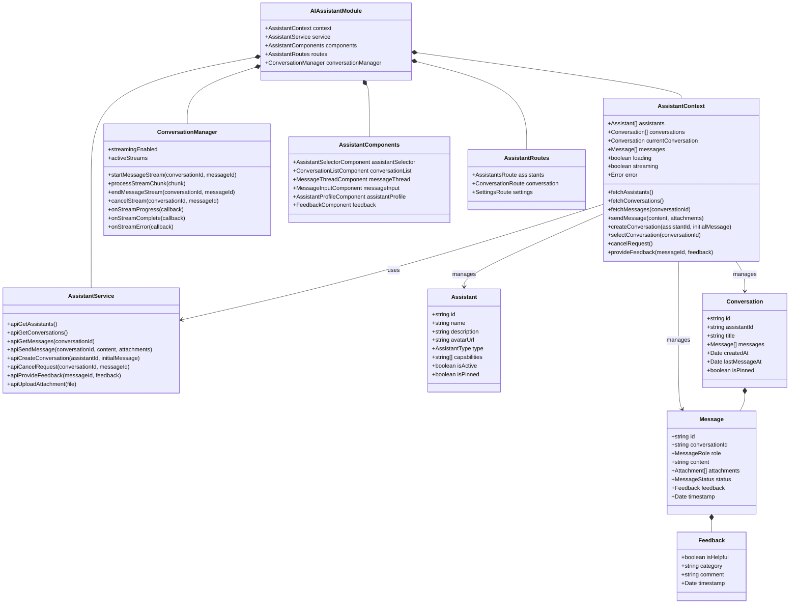
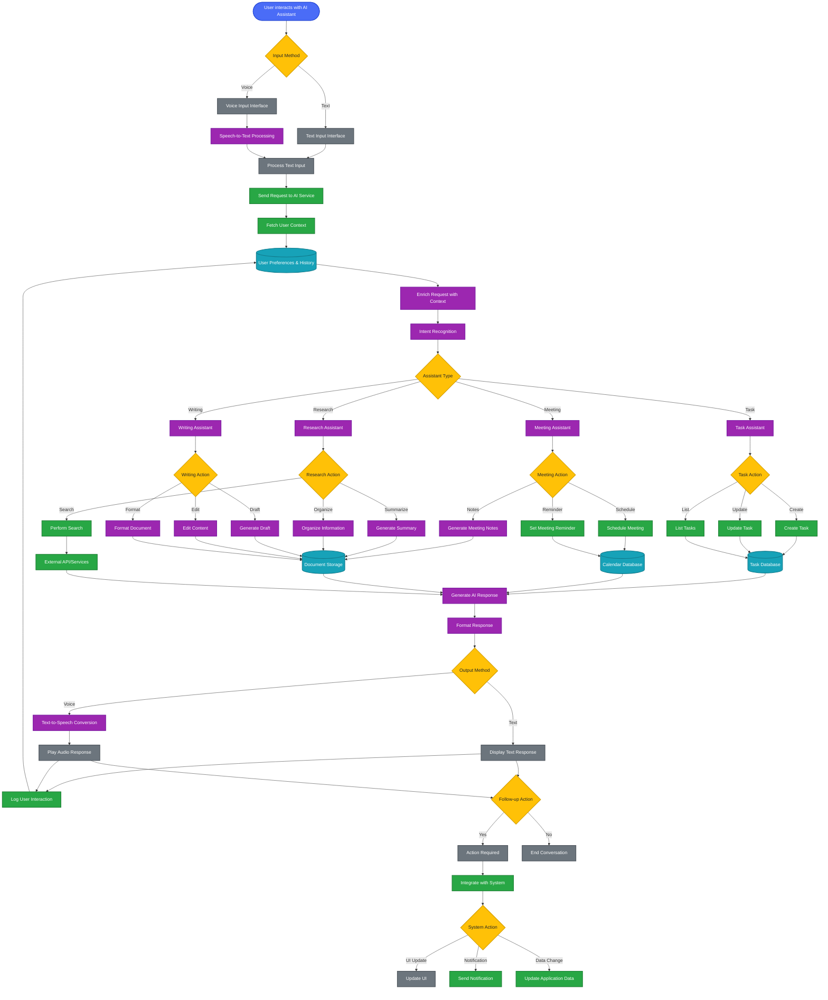
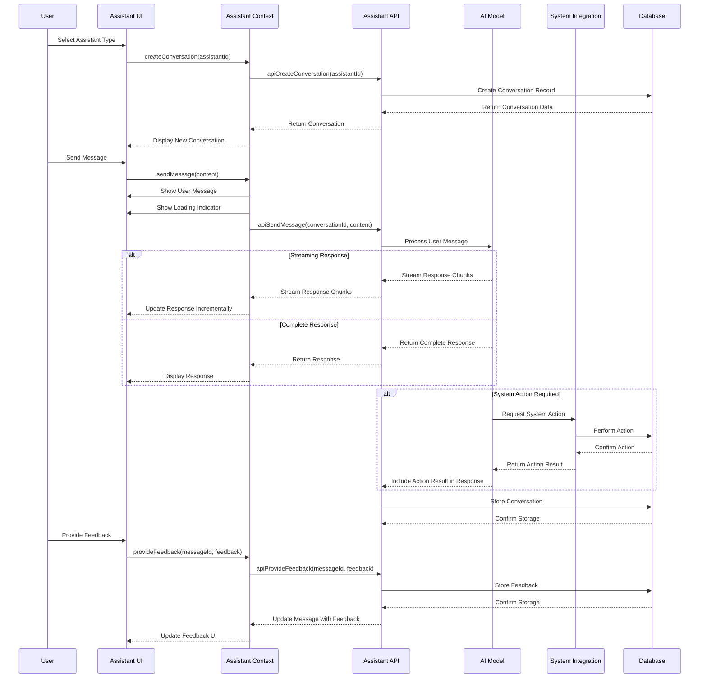
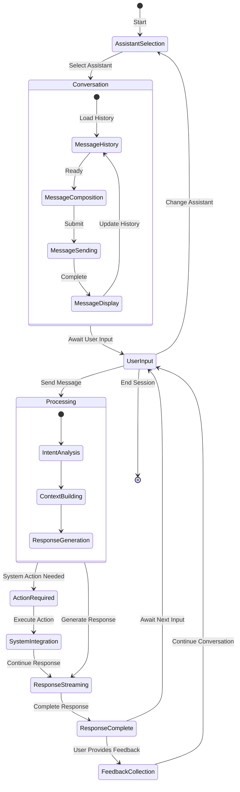
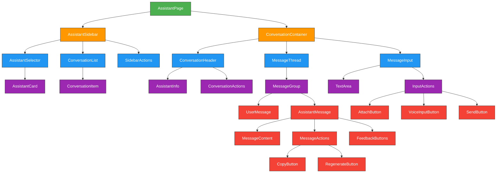

---
sidebar_position: 7
sidebar_label: "AI Assistants"
---

# AI Assistants

## AI Assistants Architecture and Workflows

### AI Assistants System Architecture



### AI Assistants Workflow

This diagram illustrates how AI assistants process user requests and integrate with other system components.



### Conversation Sequence Diagram



### Assistant State Diagram



## User Interface Components

### AI Assistant Interface Architecture



| Component | Description | Features |
| --------- | ----------- | -------- |
| **AssistantSelector** | Assistant type chooser | Visual cards for different assistant types |
| **ConversationList** | List of past conversations | Conversation history with search and filtering |
| **MessageThread** | Conversation display | User and assistant messages with formatting |
| **AssistantMessage** | AI response display | Rich text, code blocks, links, and images |
| **MessageInput** | User input area | Text entry, voice input, attachments |
| **FeedbackButtons** | Response rating | Thumbs up/down, category selection, comments |
| **MessageActions** | Message operations | Copy, regenerate, share, save |
| **ConversationActions** | Conversation controls | Rename, delete, export conversation |

## Component Implementations

### Assistant Context Provider

```typescript
import React, { createContext, useContext, useReducer, useEffect } from 'react';
import { AssistantService } from '../services/AssistantService';
import { ConversationManager } from '../services/ConversationManager';

// Define the context state type
interface AssistantState {
  assistants: Assistant[];
  conversations: Conversation[];
  currentConversation: Conversation | null;
  messages: Message[];
  loading: boolean;
  streaming: boolean;
  error: string | null;
}

// Define the context value type
interface AssistantContextValue {
  state: AssistantState;
  fetchAssistants: () => Promise<void>;
  fetchConversations: () => Promise<void>;
  fetchMessages: (conversationId: string) => Promise<void>;
  sendMessage: (content: string, attachments?: File[]) => Promise<void>;
  createConversation: (assistantId: string, initialMessage?: string) => Promise<Conversation>;
  selectConversation: (conversationId: string) => Promise<void>;
  cancelRequest: () => void;
  provideFeedback: (messageId: string, feedback: Feedback) => Promise<void>;
  uploadAttachment: (file: File) => Promise<string>;
}

// Create the context
const AssistantContext = createContext<AssistantContextValue | undefined>(undefined);

// Initial state
const initialState: AssistantState = {
  assistants: [],
  conversations: [],
  currentConversation: null,
  messages: [],
  loading: false,
  streaming: false,
  error: null
};

// Reducer function
function assistantReducer(state: AssistantState, action: any): AssistantState {
  switch (action.type) {
    case 'SET_LOADING':
      return { ...state, loading: action.payload };
    case 'SET_STREAMING':
      return { ...state, streaming: action.payload };
    case 'SET_ERROR':
      return { ...state, error: action.payload, loading: false };
    case 'SET_ASSISTANTS':
      return { ...state, assistants: action.payload, loading: false };
    case 'SET_CONVERSATIONS':
      return { ...state, conversations: action.payload, loading: false };
    case 'SET_CURRENT_CONVERSATION':
      return { ...state, currentConversation: action.payload };
    case 'SET_MESSAGES':
      return { ...state, messages: action.payload, loading: false };
    case 'ADD_MESSAGE':
      return { 
        ...state, 
        messages: [...state.messages, action.payload],
        conversations: state.conversations.map(conv => 
          conv.id === action.payload.conversationId 
            ? { 
                ...conv, 
                lastMessageAt: new Date(),
                title: conv.title || generateConversationTitle(action.payload.content)
              }
            : conv
        )
      };
    case 'UPDATE_MESSAGE':
      return {
        ...state,
        messages: state.messages.map(message => 
          message.id === action.payload.id ? action.payload : message
        )
      };
    case 'ADD_CONVERSATION':
      return {
        ...state,
        conversations: [action.payload, ...state.conversations],
        currentConversation: action.payload
      };
    case 'UPDATE_CONVERSATION':
      return {
        ...state,
        conversations: state.conversations.map(conv => 
          conv.id === action.payload.id ? action.payload : conv
        ),
        currentConversation: state.currentConversation?.id === action.payload.id 
          ? action.payload 
          : state.currentConversation
      };
    default:
      return state;
  }
}

// Helper function to generate a conversation title from the first message
function generateConversationTitle(content: string): string {
  // Take first 30 characters of content and add ellipsis if needed
  return content.length > 30 ? `${content.substring(0, 30)}...` : content;
}

// Provider component
export const AssistantProvider: React.FC<{ children: React.ReactNode }> = ({ children }) => {
  const [state, dispatch] = useReducer(assistantReducer, initialState);
  const assistantService = new AssistantService();
  const conversationManager = new ConversationManager();

  // Set up streaming handlers
  useEffect(() => {
    conversationManager.onStreamProgress((messageId, content) => {
      // Find the message and update its content
      const message = state.messages.find(m => m.id === messageId);
      if (message) {
        dispatch({
          type: 'UPDATE_MESSAGE',
          payload: { ...message, content: message.content + content }
        });
      }
    });

    conversationManager.onStreamComplete((messageId) => {
      // Find the message and update its status
      const message = state.messages.find(m => m.id === messageId);
      if (message) {
        dispatch({
          type: 'UPDATE_MESSAGE',
          payload: { ...message, status: 'completed' }
        });
      }
      dispatch({ type: 'SET_STREAMING', payload: false });
    });

    conversationManager.onStreamError((messageId, error) => {
      // Find the message and update its status
      const message = state.messages.find(m => m.id === messageId);
      if (message) {
        dispatch({
          type: 'UPDATE_MESSAGE',
          payload: { ...message, status: 'error', content: message.content + '\n\nError: ' + error }
        });
      }
      dispatch({ type: 'SET_STREAMING', payload: false });
      dispatch({ type: 'SET_ERROR', payload: error });
    });
  }, [state.messages]);

  // Fetch all assistants
  const fetchAssistants = async () => {
    try {
      dispatch({ type: 'SET_LOADING', payload: true });
      const assistants = await assistantService.apiGetAssistants();
      dispatch({ type: 'SET_ASSISTANTS', payload: assistants });
    } catch (error) {
      dispatch({ type: 'SET_ERROR', payload: 'Failed to fetch assistants' });
    }
  };

  // Fetch all conversations
  const fetchConversations = async () => {
    try {
      dispatch({ type: 'SET_LOADING', payload: true });
      const conversations = await assistantService.apiGetConversations();
      dispatch({ type: 'SET_CONVERSATIONS', payload: conversations });
    } catch (error) {
      dispatch({ type: 'SET_ERROR', payload: 'Failed to fetch conversations' });
    }
  };

  // Fetch messages for a conversation
  const fetchMessages = async (conversationId: string) => {
    try {
      dispatch({ type: 'SET_LOADING', payload: true });
      const messages = await assistantService.apiGetMessages(conversationId);
      dispatch({ type: 'SET_MESSAGES', payload: messages });
    } catch (error) {
      dispatch({ type: 'SET_ERROR', payload: 'Failed to fetch messages' });
    }
  };

  // Send a message in the current conversation
  const sendMessage = async (content: string, attachments?: File[]) => {
    if (!state.currentConversation) {
      dispatch({ type: 'SET_ERROR', payload: 'No active conversation' });
      return;
    }

    try {
      // Add user message to UI immediately
      const userMessage: Message = {
        id: `temp-user-${Date.now()}`,
        conversationId: state.currentConversation.id,
        role: 'user',
        content,
        status: 'sent',
        timestamp: new Date(),
        attachments: attachments ? await Promise.all(
          attachments.map(async file => ({
            id: `temp-${file.name}`,
            fileName: file.name,
            fileType: file.type,
            fileSize: file.size,
            url: await uploadAttachment(file)
          }))
        ) : []
      };
      
      dispatch({ type: 'ADD_MESSAGE', payload: userMessage });
      
      // Add assistant message placeholder
      const assistantMessage: Message = {
        id: `temp-assistant-${Date.now()}`,
        conversationId: state.currentConversation.id,
        role: 'assistant',
        content: '',
        status: 'generating',
        timestamp: new Date(),
        attachments: []
      };
      
      dispatch({ type: 'ADD_MESSAGE', payload: assistantMessage });
      dispatch({ type: 'SET_STREAMING', payload: true });
      
      // Send the message to the API
      const response = await assistantService.apiSendMessage(
        state.currentConversation.id, 
        content,
        userMessage.attachments
      );
      
      // Update the temporary messages with the real ones
      dispatch({
        type: 'UPDATE_MESSAGE',
        payload: { ...userMessage, id: response.userMessageId }
      });
      
      // If streaming is enabled, start the stream
      if (conversationManager.streamingEnabled) {
        conversationManager.startMessageStream(
          state.currentConversation.id,
          response.assistantMessageId
        );
      } else {
        // Otherwise, update with the complete response
        dispatch({
          type: 'UPDATE_MESSAGE',
          payload: { 
            ...assistantMessage, 
            id: response.assistantMessageId,
            content: response.assistantMessageContent,
            status: 'completed'
          }
        });
        dispatch({ type: 'SET_STREAMING', payload: false });
      }
    } catch (error) {
      dispatch({ type: 'SET_ERROR', payload: 'Failed to send message' });
      dispatch({ type: 'SET_STREAMING', payload: false });
    }
  };

  // Create a new conversation
  const createConversation = async (assistantId: string, initialMessage?: string) => {
    try {
      dispatch({ type: 'SET_LOADING', payload: true });
      const conversation = await assistantService.apiCreateConversation(assistantId, initialMessage);
      dispatch({ type: 'ADD_CONVERSATION', payload: conversation });
      
      // If there's an initial message, fetch the messages
      if (initialMessage) {
        await fetchMessages(conversation.id);
      } else {
        dispatch({ type: 'SET_MESSAGES', payload: [] });
      }
      
      return conversation;
    } catch (error) {
      dispatch({ type: 'SET_ERROR', payload: 'Failed to create conversation' });
      throw error;
    }
  };

  // Select an existing conversation
  const selectConversation = async (conversationId: string) => {
    try {
      const conversation = state.conversations.find(c => c.id === conversationId);
      if (conversation) {
        dispatch({ type: 'SET_CURRENT_CONVERSATION', payload: conversation });
        await fetchMessages(conversationId);
      } else {
        throw new Error('Conversation not found');
      }
    } catch (error) {
      dispatch({ type: 'SET_ERROR', payload: 'Failed to select conversation' });
    }
  };

  // Cancel an ongoing request
  const cancelRequest = () => {
    if (state.streaming && state.currentConversation) {
      const pendingMessage = state.messages.find(m => m.status === 'generating');
      if (pendingMessage) {
        conversationManager.cancelStream(state.currentConversation.id, pendingMessage.id);
        dispatch({
          type: 'UPDATE_MESSAGE',
          payload: { ...pendingMessage, status: 'cancelled', content: pendingMessage.content + ' [cancelled]' }
        });
      }
      dispatch({ type: 'SET_STREAMING', payload: false });
    }
  };

  // Provide feedback for a message
  const provideFeedback = async (messageId: string, feedback: Feedback) => {
    try {
      await assistantService.apiProvideFeedback(messageId, feedback);
      
      // Update the message with the feedback
      const message = state.messages.find(m => m.id === messageId);
      if (message) {
        dispatch({
          type: 'UPDATE_MESSAGE',
          payload: { ...message, feedback }
        });
      }
    } catch (error) {
      dispatch({ type: 'SET_ERROR', payload: 'Failed to provide feedback' });
    }
  };

  // Upload an attachment
  const uploadAttachment = async (file: File) => {
    try {
      return await assistantService.apiUploadAttachment(file);
    } catch (error) {
      dispatch({ type: 'SET_ERROR', payload: 'Failed to upload attachment' });
      throw error;
    }
  };

  // Context value
  const value = {
    state,
    fetchAssistants,
    fetchConversations,
    fetchMessages,
    sendMessage,
    createConversation,
    selectConversation,
    cancelRequest,
    provideFeedback,
    uploadAttachment
  };

  return <AssistantContext.Provider value={value}>{children}</AssistantContext.Provider>;
};

// Custom hook for using the assistant context
export const useAssistant = () => {
  const context = useContext(AssistantContext);
  if (context === undefined) {
    throw new Error('useAssistant must be used within an AssistantProvider');
  }
  return context;
};
```

### Assistant Message Component

```typescript
import React, { useState } from 'react';
import { useAssistant } from '../contexts/AssistantContext';
import { formatTime } from '../utils/dateUtils';
import { Avatar } from '../ui/Avatar';
import { Button } from '../ui/Button';
import { Tooltip } from '../ui/Tooltip';
import { CodeBlock } from '../ui/CodeBlock';
import { MarkdownRenderer } from '../ui/MarkdownRenderer';

interface AssistantMessageProps {
  message: Message;
  assistant: Assistant;
}

export const AssistantMessage: React.FC<AssistantMessageProps> = ({ 
  message, 
  assistant 
}) => {
  const { provideFeedback } = useAssistant();
  const [showFeedbackForm, setShowFeedbackForm] = useState(false);
  const [feedbackComment, setFeedbackComment] = useState('');
  const [feedbackCategory, setFeedbackCategory] = useState<string | null>(null);
  
  // Format timestamp
  const time = formatTime(message.timestamp);
  
  // Handle feedback submission
  const handleFeedback = async (isHelpful: boolean) => {
    if (message.feedback) {
      // Already has feedback, toggle the form to edit
      setShowFeedbackForm(!showFeedbackForm);
      return;
    }
    
    // Simple thumbs up/down without additional info
    await provideFeedback(message.id, {
      isHelpful,
      category: null,
      comment: '',
      timestamp: new Date()
    });
    
    // If thumbs down, show the feedback form
    if (!isHelpful) {
      setShowFeedbackForm(true);
    }
  };
  
  // Handle detailed feedback submission
  const handleFeedbackSubmit = async () => {
    await provideFeedback(message.id, {
      isHelpful: false,
      category: feedbackCategory,
      comment: feedbackComment,
      timestamp: new Date()
    });
    
    setShowFeedbackForm(false);
    setFeedbackComment('');
    setFeedbackCategory(null);
  };
  
  // Handle copy to clipboard
  const handleCopy = () => {
    navigator.clipboard.writeText(message.content);
    // Show a toast or some feedback
  };
  
  // Render loading indicator if message is still generating
  const renderLoadingIndicator = () => {
    if (message.status === 'generating') {
      return (
        <div className="loading-indicator flex items-center mt-2">
          <div className="typing-indicator">
            <span></span>
            <span></span>
            <span></span>
          </div>
        </div>
      );
    }
    return null;
  };
  
  return (
    <div className="assistant-message flex mb-4">
      <div className="avatar-container mr-3 mt-1">
        <Avatar 
          src={assistant.avatarUrl} 
          name={assistant.name} 
          size="md" 
        />
      </div>
      
      <div className="message-content flex-grow">
        <div className="message-header flex items-center mb-1">
          <span className="assistant-name font-medium text-gray-800">{assistant.name}</span>
          <span className="message-time text-xs text-gray-500 ml-2">{time}</span>
          
          {message.status === 'error' && (
            <span className="error-badge text-xs bg-red-100 text-red-800 px-2 py-0.5 rounded ml-2">
              Error
            </span>
          )}
          
          {message.status === 'cancelled' && (
            <span className="cancelled-badge text-xs bg-gray-100 text-gray-800 px-2 py-0.5 rounded ml-2">
              Cancelled
            </span>
          )}
        </div>
        
        <div className="message-body bg-gray-100 rounded-lg p-3">
          <MarkdownRenderer content={message.content} />
          {renderLoadingIndicator()}
        </div>
        
        {message.attachments && message.attachments.length > 0 && (
          <div className="message-attachments mt-2">
            {message.attachments.map(attachment => (
              <div key={attachment.id} className="attachment-item">
                {/* Render attachment based on type */}
                {attachment.fileType.startsWith('image/') ? (
                  
                ) : (
                  <a 
                    href={attachment.url} 
                    target="_blank" 
                    rel="noopener noreferrer"
                    className="attachment-link flex items-center p-2 bg-gray-50 rounded-md hover:bg-gray-100"
                  >
                    <span className="attachment-icon mr-2">📎</span>
                    <span className="attachment-name">{attachment.fileName}</span>
                  </a>
                )}
              </div>
            ))}
          </div>
        )}
        
        <div className="message-actions flex mt-2">
          <div className="feedback-buttons flex items-center">
            <Tooltip content={message.feedback?.isHelpful === true ? "Helpful" : "Mark as helpful"}>
              <button 
                className={`p-1 rounded ${message.feedback?.isHelpful === true ? 'text-green-600' : 'text-gray-400 hover:text-gray-600'}`}
                onClick={() => handleFeedback(true)}
              >
                👍
              </button>
            </Tooltip>
            
            <Tooltip content={message.feedback?.isHelpful === false ? "Not helpful" : "Mark as not helpful"}>
              <button 
                className={`p-1 rounded ml-1 ${message.feedback?.isHelpful === false ? 'text-red-600' : 'text-gray-400 hover:text-gray-600'}`}
                onClick={() => handleFeedback(false)}
              >
                👎
              </button>
            </Tooltip>
          </div>
          
          <div className="message-utilities flex ml-auto">
            <Tooltip content="Copy to clipboard">
              <button 
                className="p-1 rounded text-gray-400 hover:text-gray-600"
                onClick={handleCopy}
              >
                📋
              </button>
            </Tooltip>
          </div>
        </div>
        
        {showFeedbackForm && (
          <div className="feedback-form mt-2 p-3 bg-gray-50 rounded-md">
            <h4 className="text-sm font-medium mb-2">What was wrong with this response?</h4>
            
            <div className="feedback-categories flex flex-wrap gap-2 mb-2">
              {['Incorrect information', 'Not helpful', 'Harmful content', 'Biased content', 'Other'].map(category => (
                <button
                  key={category}
                  className={`px-2 py-1 text-xs rounded-full ${feedbackCategory === category ? 'bg-blue-100 text-blue-800' : 'bg-gray-200 text-gray-800'}`}
                  onClick={() => setFeedbackCategory(category)}
                >
                  {category}
                </button>
              ))}
            </div>
            
            <textarea
              className="w-full p-2 border rounded-md text-sm"
              placeholder="Additional comments (optional)"
              rows={3}
              value={feedbackComment}
              onChange={(e) => setFeedbackComment(e.target.value)}
            />
            
            <div className="flex justify-end mt-2">
              <Button
                variant="secondary"
                size="sm"
                onClick={() => setShowFeedbackForm(false)}
                className="mr-2"
              >
                Cancel
              </Button>
              
              <Button
                variant="primary"
                size="sm"
                onClick={handleFeedbackSubmit}
                disabled={!feedbackCategory}
              >
                Submit
              </Button>
            </div>
          </div>
        )}
      </div>
    </div>
  );
};
```

## AI Assistants Overview

TheEnterprise Nexus integrates AI assistants to enhance user productivity by providing intelligent assistance across various domains and tasks.

## Assistant Types

The system offers multiple specialized AI assistant types:

### Task Assistant
- **Purpose**: Helps with task management and prioritization
- **Capabilities**: Create tasks, update status, set priorities, suggest task organization
- **Integration**: Deeply integrated with the Kanban board and task management system
- **Use Cases**: Daily planning, task prioritization, deadline management

### Meeting Assistant
- **Purpose**: Assists with scheduling and meeting management
- **Capabilities**: Schedule meetings, generate agendas, take notes, set reminders
- **Integration**: Works with the calendar system and document storage
- **Use Cases**: Meeting preparation, note-taking, follow-up action tracking

### Research Assistant
- **Purpose**: Helps gather and organize information
- **Capabilities**: Search internal and external sources, summarize content, organize findings
- **Integration**: Connects with search APIs and document management
- **Use Cases**: Market research, competitive analysis, information gathering

### Writing Assistant
- **Purpose**: Assists with content creation and editing
- **Capabilities**: Draft documents, edit content, suggest improvements, format text
- **Integration**: Works with the document editor and content management system
- **Use Cases**: Email drafting, report writing, content polishing

## Key Features

### Natural Language Understanding
- **Command Interpretation**: Understands natural language requests and commands
- **Context Awareness**: Maintains conversation context for coherent multi-turn interactions
- **Intent Recognition**: Identifies user intentions to provide appropriate responses
- **Entity Extraction**: Recognizes important entities like dates, names, and locations

### Response Generation
- **Streaming Responses**: Real-time streaming of AI responses for immediate feedback
- **Rich Formatting**: Markdown support for structured, readable responses
- **Code Formatting**: Syntax highlighting for code snippets and examples
- **Multi-modal Responses**: Combines text, images, and interactive elements

### System Integration
- **Action Execution**: Performs system actions like creating tasks or scheduling meetings
- **Data Retrieval**: Fetches relevant information from connected systems
- **Contextual Awareness**: Understands user's workspace context and preferences
- **Cross-application Workflow**: Enables seamless workflows across different system components

### Personalization
- **User Preference Learning**: Adapts to individual user preferences over time
- **Work Pattern Recognition**: Identifies and supports user's work patterns
- **Customizable Responses**: Adjusts response style and detail level based on user preferences
- **Feedback Incorporation**: Uses explicit and implicit feedback to improve responses

## Conversation Management

The AI assistant system implements sophisticated conversation management:

### Conversation Features
- **Persistent History**: Maintains conversation history for context and reference
- **Conversation Naming**: Automatically generates descriptive titles for conversations
- **Conversation Organization**: Groups and categorizes conversations by topic or assistant type
- **Search and Filtering**: Enables finding past conversations and information

### Message Handling
- **Message Types**: Supports text, code blocks, images, and file attachments
- **Message Status Tracking**: Shows message state (sending, generating, completed, error)
- **Message Editing**: Allows editing messages for clarification
- **Message Actions**: Copy, regenerate, share, and provide feedback on messages

## Feedback System

The AI assistants include a comprehensive feedback system:

### Feedback Collection
- **Binary Feedback**: Simple thumbs up/down for quick rating
- **Category Selection**: Specific feedback categories for detailed input
- **Comment Entry**: Free-form comments for detailed feedback
- **Implicit Signals**: Tracking of message regeneration, copying, and other actions

### Feedback Usage
- **Response Improvement**: Feedback used to improve future responses
- **Assistant Training**: Aggregate feedback informs assistant model improvements
- **User Preference Learning**: Individual feedback shapes personalized experiences
- **Quality Monitoring**: System-wide feedback analysis for quality assurance

