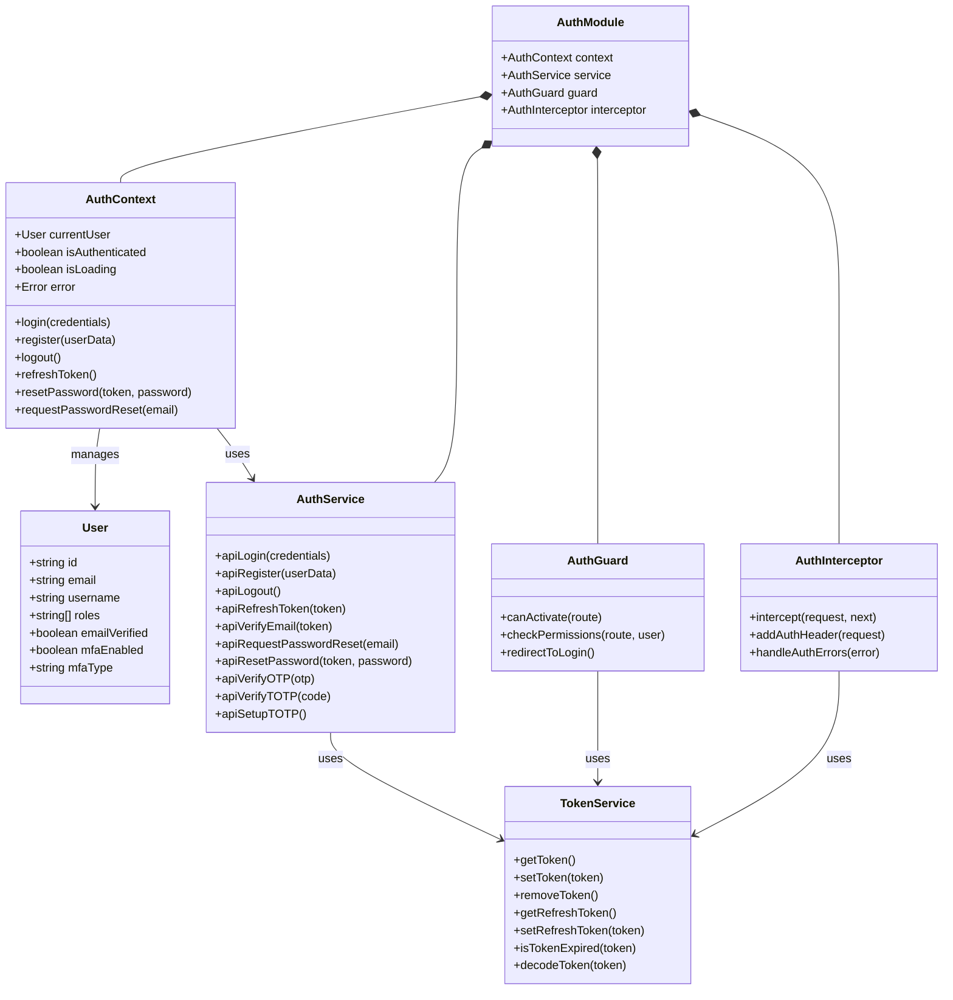
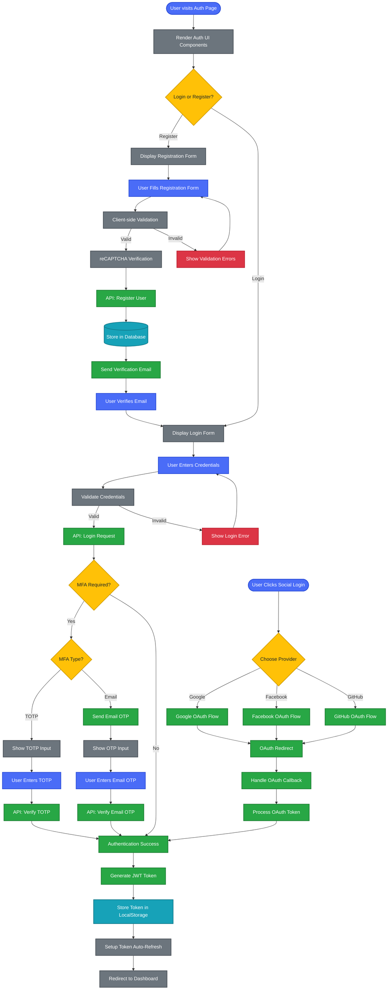
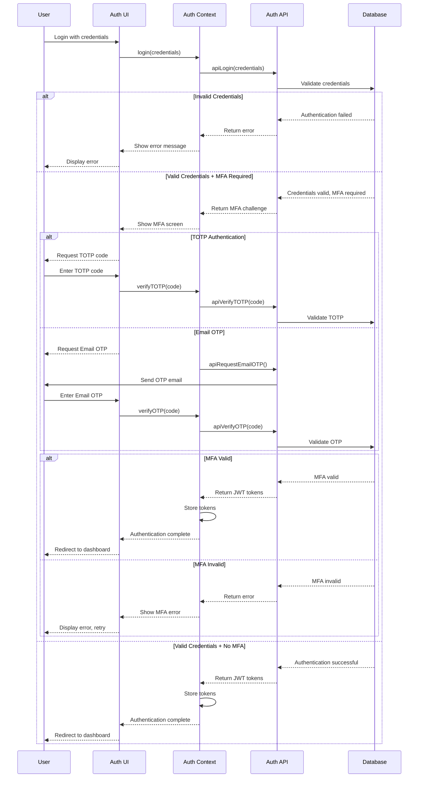
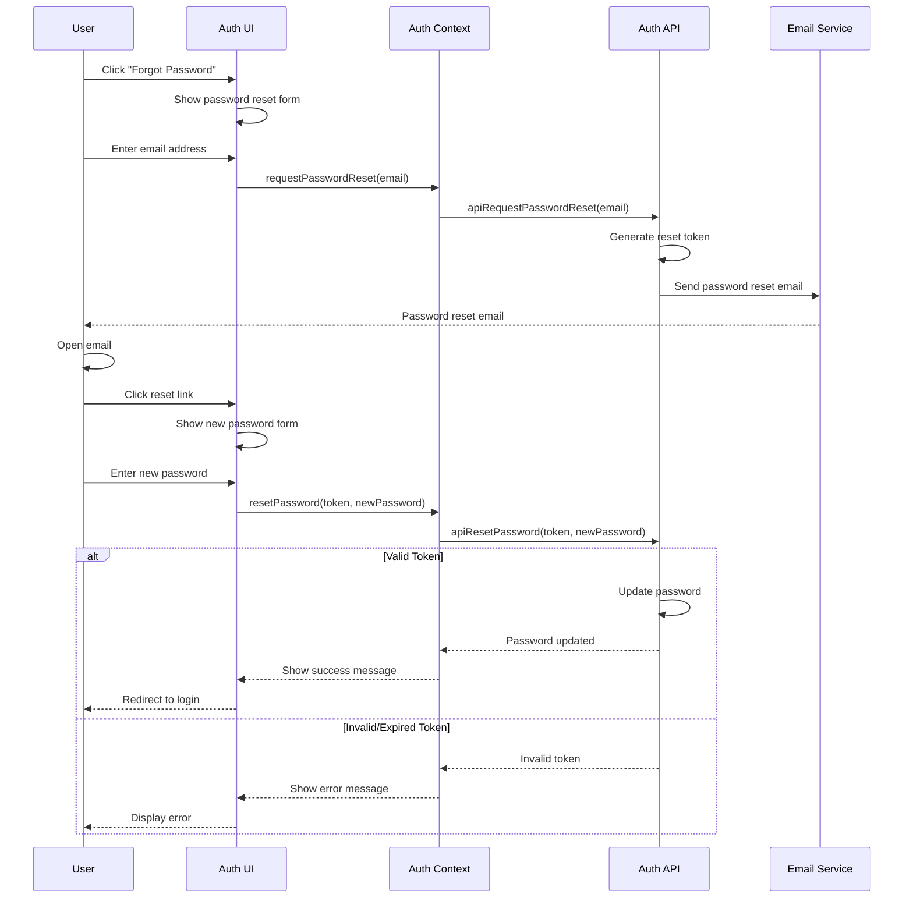
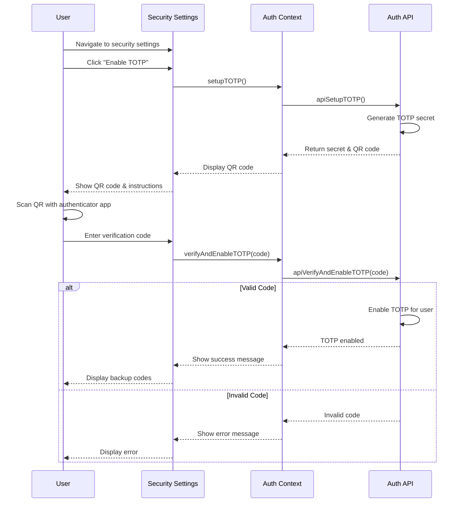
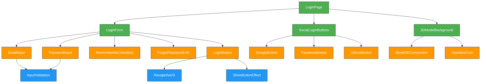
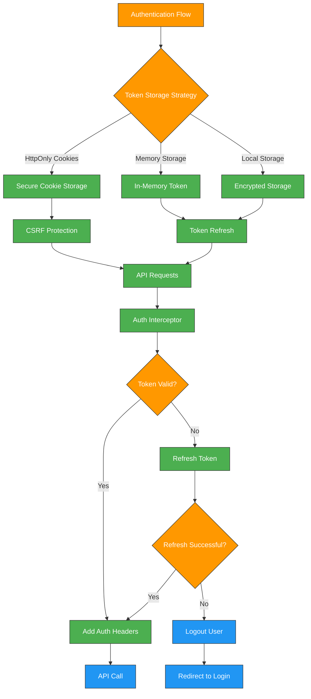

---
sidebar_position: 3
sidebar_label: "Authentication"
---

# Authentication

## Authentication Architecture and Workflows

### Authentication System Architecture



### Authentication Workflow

This diagram illustrates the complete authentication flow, from user login/registration to token management.



### Multi-Factor Authentication Workflow



### Password Reset Workflow



### TOTP Setup Workflow



## Authentication Components and Features

### Interactive Authentication UI Components

The Enterprise Nexus frontend implements a modern, secure authentication system with an engaging user interface that combines functionality with visual appeal:

#### Login Component Architecture



| Component              | Description                              | Features                                                     |
| ---------------------- | ---------------------------------------- | ------------------------------------------------------------ |
| **LoginForm**          | Core form component for credential entry | Form validation, error handling, submission state management |
| **SocialLoginButtons** | OAuth provider login options             | Integrated authentication with multiple providers            |
| **3DModelBackground**  | Interactive 3D background                | WebGL-powered animation that responds to user interaction    |
| **SparklesCore**       | Particle animation system                | Creates dynamic visual effects around interactive elements   |
| **ShineButtonEffect**  | Button enhancement                       | Adds animated shine effect on hover and focus states         |
| **RecaptchaV3**        | Invisible CAPTCHA                        | Protects against bots without user interaction               |

#### Registration Component Implementation

```typescript
import React, { useState } from "react";
import { useAuth } from "../contexts/AuthContext";
import { Model3D } from "../components/ui/Model3D";
import { SparklesText } from "../components/ui/SparklesText";
import { ShineBorder } from "../components/ui/ShineBorder";
import { useRecaptchaV3 } from "../hooks/useRecaptchaV3";

export const RegistrationForm: React.FC = () => {
  const [formData, setFormData] = useState({
    username: "",
    email: "",
    password: "",
    confirmPassword: "",
    acceptTerms: false,
  });
  const [errors, setErrors] = useState<Record<string, string>>({});
  const [isSubmitting, setIsSubmitting] = useState(false);

  const { register } = useAuth();
  const { executeRecaptcha } = useRecaptchaV3();

  const handleSubmit = async (e: React.FormEvent) => {
    e.preventDefault();

    // Form validation
    const validationErrors = validateForm(formData);
    if (Object.keys(validationErrors).length > 0) {
      setErrors(validationErrors);
      return;
    }

    setIsSubmitting(true);

    try {
      // Execute reCAPTCHA
      const recaptchaToken = await executeRecaptcha("registration");

      // Register user
      await register({
        username: formData.username,
        email: formData.email,
        password: formData.password,
        recaptchaToken,
      });

      // Registration successful - show verification message
    } catch (error) {
      setErrors({
        submit: error instanceof Error ? error.message : "Registration failed",
      });
    } finally {
      setIsSubmitting(false);
    }
  };

  // Form validation function
  const validateForm = (data: typeof formData) => {
    const errors: Record<string, string> = {};

    if (!data.username.trim()) errors.username = "Username is required";
    if (!data.email.trim()) errors.email = "Email is required";
    else if (!/\S+@\S+\.\S+/.test(data.email))
      errors.email = "Email is invalid";

    if (!data.password) errors.password = "Password is required";
    else if (data.password.length < 8)
      errors.password = "Password must be at least 8 characters";

    if (data.password !== data.confirmPassword) {
      errors.confirmPassword = "Passwords do not match";
    }

    if (!data.acceptTerms)
      errors.acceptTerms = "You must accept the terms and conditions";

    return errors;
  };

  return (
    <div className="registration-container">
      <div className="registration-content">
        <SparklesText className="registration-title">
          Create Your Account
        </SparklesText>

        <ShineBorder>
          <form onSubmit={handleSubmit} className="registration-form">
            {/* Form fields */}
            {/* ... */}
            <button
              type="submit"
              disabled={isSubmitting}
              className="registration-button"
            >
              {isSubmitting ? "Creating Account..." : "Sign Up"}
            </button>
          </form>
        </ShineBorder>
      </div>

      <div className="registration-model">
        <Model3D modelPath="/models/registration-scene.glb" />
      </div>
    </div>
  );
};
```

### Visual Enhancement Components

The authentication UI incorporates several advanced visual components that enhance user experience while maintaining performance:

| Component          | Description                         | Implementation                                                     |
| ------------------ | ----------------------------------- | ------------------------------------------------------------------ |
| **Model3D**        | Interactive 3D model renderer       | Uses Three.js to render GLTF/GLB models with optimized performance |
| **SparklesCore**   | Particle system for visual effects  | Canvas-based particle animation with configurable parameters       |
| **SparklesText**   | Text with animated particle effects | Combines text rendering with particle effects for engaging headers |
| **ShineBorder**    | Animated border effect              | CSS-based animation that creates a moving gradient border          |
| **GradientButton** | Enhanced button component           | Button with animated gradient background and hover effects         |

#### SparklesCore Implementation

```typescript
import React, { useRef, useEffect } from "react";
import { random } from "../utils/math";

interface Particle {
  x: number;
  y: number;
  size: number;
  speedX: number;
  speedY: number;
  color: string;
  alpha: number;
}

interface SparklesCoreProps {
  background?: string;
  minSize?: number;
  maxSize?: number;
  particleCount?: number;
  particleSpeed?: number;
  className?: string;
  colors?: string[];
}

export const SparklesCore: React.FC<SparklesCoreProps> = ({
  background = "transparent",
  minSize = 0.4,
  maxSize = 1.5,
  particleCount = 25,
  particleSpeed = 0.5,
  className = "",
  colors = ["#FFC700", "#FF0044", "#00FFFF"],
}) => {
  const canvasRef = useRef<HTMLCanvasElement>(null);
  const particlesRef = useRef<Particle[]>([]);

  useEffect(() => {
    const canvas = canvasRef.current;
    if (!canvas) return;

    const ctx = canvas.getContext("2d");
    if (!ctx) return;

    // Set canvas dimensions
    const setCanvasDimensions = () => {
      const { width, height } = canvas.getBoundingClientRect();
      canvas.width = width;
      canvas.height = height;
    };

    // Initialize particles
    const initParticles = () => {
      particlesRef.current = [];
      for (let i = 0; i < particleCount; i++) {
        particlesRef.current.push({
          x: random(0, canvas.width),
          y: random(0, canvas.height),
          size: random(minSize, maxSize),
          speedX: random(-particleSpeed, particleSpeed),
          speedY: random(-particleSpeed, particleSpeed),
          color: colors[Math.floor(random(0, colors.length))],
          alpha: random(0.1, 1),
        });
      }
    };

    // Animation loop
    const animate = () => {
      ctx.clearRect(0, 0, canvas.width, canvas.height);

      // Update and draw particles
      particlesRef.current.forEach((particle) => {
        // Update position
        particle.x += particle.speedX;
        particle.y += particle.speedY;

        // Boundary check
        if (particle.x < 0 || particle.x > canvas.width) particle.speedX *= -1;
        if (particle.y < 0 || particle.y > canvas.height) particle.speedY *= -1;

        // Draw particle
        ctx.globalAlpha = particle.alpha;
        ctx.fillStyle = particle.color;
        ctx.beginPath();
        ctx.arc(particle.x, particle.y, particle.size, 0, Math.PI * 2);
        ctx.fill();
      });

      requestAnimationFrame(animate);
    };

    // Initialize
    setCanvasDimensions();
    initParticles();
    animate();

    // Handle resize
    window.addEventListener("resize", () => {
      setCanvasDimensions();
      initParticles();
    });

    return () => {
      window.removeEventListener("resize", setCanvasDimensions);
    };
  }, [background, colors, maxSize, minSize, particleCount, particleSpeed]);

  return (
    <canvas
      ref={canvasRef}
      className={`sparkles-core ${className}`}
      style={{ background }}
    />
  );
};
```

## Security Implementation

### Token Management and Security

The Enterprise Nexus frontend implements a comprehensive security architecture to protect user authentication and session management:



| Security Feature       | Implementation                        | Purpose                                                   |
| ---------------------- | ------------------------------------- | --------------------------------------------------------- |
| **HttpOnly Cookies**   | Server-set cookies with HttpOnly flag | Prevents JavaScript access to authentication tokens       |
| **CSRF Protection**    | Custom headers and CSRF tokens        | Protects against cross-site request forgery attacks       |
| **Token Refresh**      | Automatic refresh of expiring tokens  | Maintains session without requiring re-authentication     |
| **JWE Encryption**     | Encrypted JWT tokens                  | Adds an additional layer of security for sensitive claims |
| **Secure Headers**     | Security-focused HTTP headers         | Protects against various web vulnerabilities              |
| **Inactivity Timeout** | Automatic session termination         | Logs out inactive users after a configurable period       |

### Auth Interceptor Implementation

```typescript
import { Injectable } from "@angular/core";
import {
  HttpRequest,
  HttpHandler,
  HttpEvent,
  HttpInterceptor,
  HttpErrorResponse,
} from "@angular/common/http";
import { Observable, throwError, BehaviorSubject } from "rxjs";
import { catchError, filter, take, switchMap } from "rxjs/operators";
import { TokenService } from "./token.service";
import { AuthService } from "./auth.service";

@Injectable()
export class AuthInterceptor implements HttpInterceptor {
  private isRefreshing = false;
  private refreshTokenSubject: BehaviorSubject<any> = new BehaviorSubject<any>(
    null
  );

  constructor(
    private tokenService: TokenService,
    private authService: AuthService
  ) {}

  intercept(
    request: HttpRequest<any>,
    next: HttpHandler
  ): Observable<HttpEvent<any>> {
    // Skip interceptor for authentication endpoints
    if (this.isAuthRequest(request)) {
      return next.handle(request);
    }

    // Add auth token to request
    const token = this.tokenService.getToken();
    if (token) {
      request = this.addTokenHeader(request, token);
    }

    // Handle the request and catch errors
    return next.handle(request).pipe(
      catchError((error) => {
        if (error instanceof HttpErrorResponse && error.status === 401) {
          return this.handle401Error(request, next);
        }
        return throwError(error);
      })
    );
  }

  private isAuthRequest(request: HttpRequest<any>): boolean {
    return (
      request.url.includes("/auth/login") ||
      request.url.includes("/auth/register") ||
      request.url.includes("/auth/refresh-token")
    );
  }

  private addTokenHeader(
    request: HttpRequest<any>,
    token: string
  ): HttpRequest<any> {
    return request.clone({
      setHeaders: {
        Authorization: `Bearer ${token}`,
      },
    });
  }

  private handle401Error(
    request: HttpRequest<any>,
    next: HttpHandler
  ): Observable<HttpEvent<any>> {
    if (!this.isRefreshing) {
      this.isRefreshing = true;
      this.refreshTokenSubject.next(null);

      const refreshToken = this.tokenService.getRefreshToken();

      if (refreshToken) {
        return this.authService.refreshToken(refreshToken).pipe(
          switchMap((token) => {
            this.isRefreshing = false;
            this.tokenService.setToken(token.accessToken);
            this.refreshTokenSubject.next(token.accessToken);

            return next.handle(this.addTokenHeader(request, token.accessToken));
          }),
          catchError((err) => {
            this.isRefreshing = false;
            this.authService.logout();
            return throwError(err);
          })
        );
      }
    }

    return this.refreshTokenSubject.pipe(
      filter((token) => token !== null),
      take(1),
      switchMap((token) => next.handle(this.addTokenHeader(request, token)))
    );
  }
}
```

