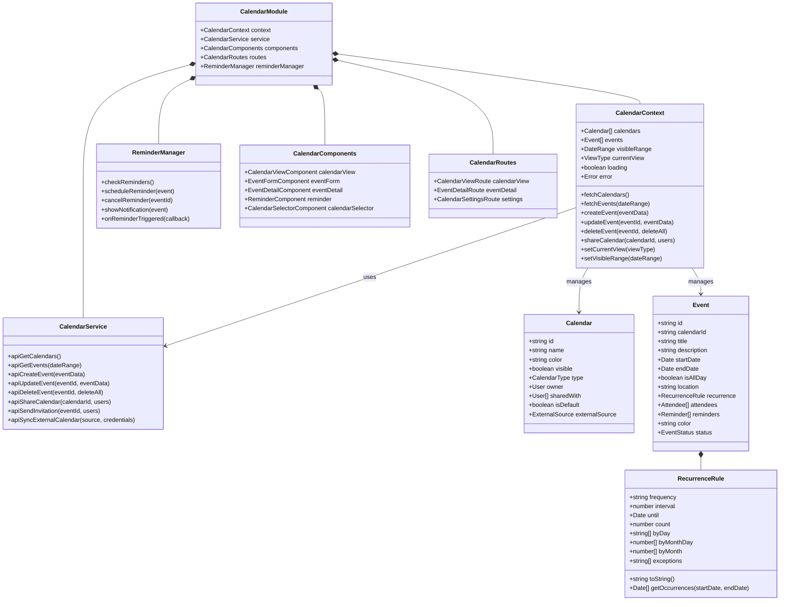
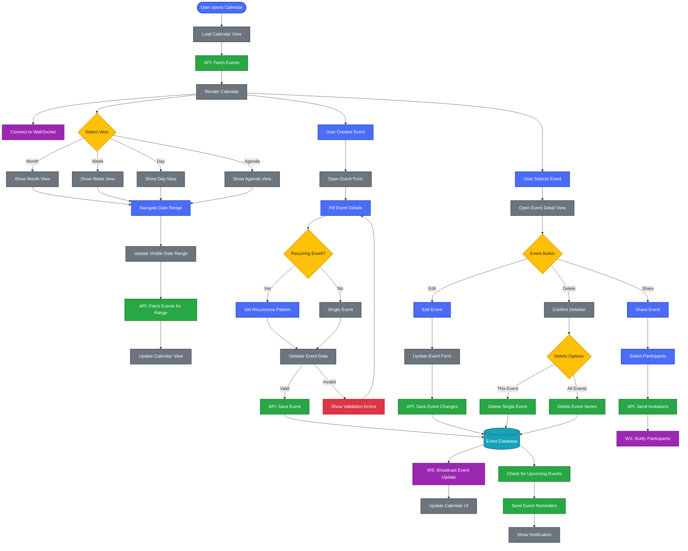
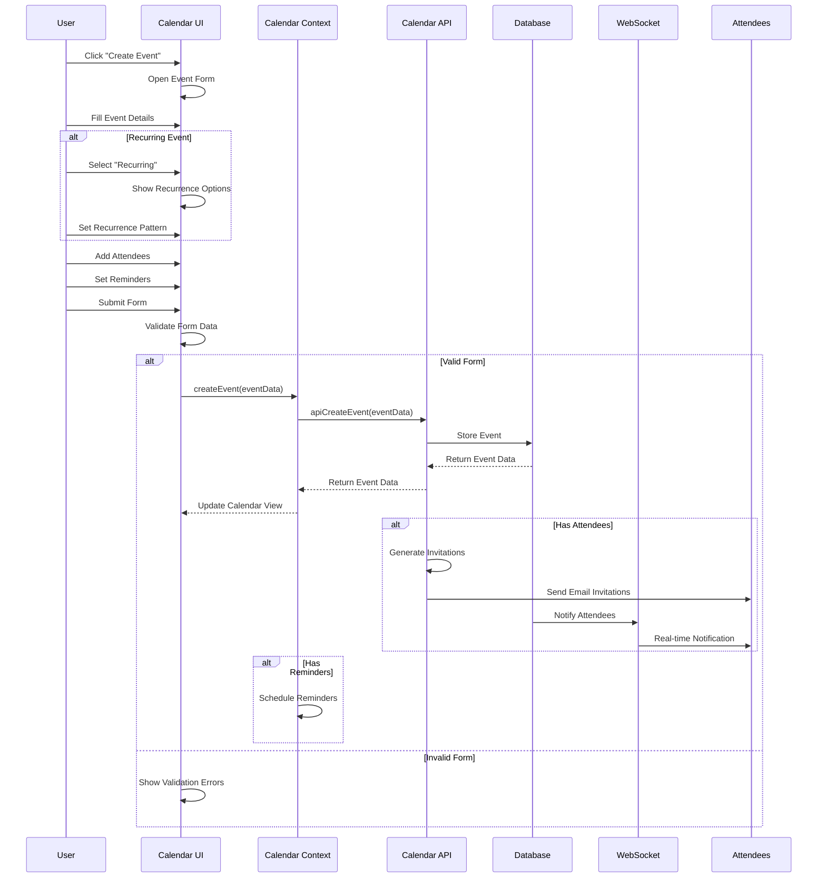
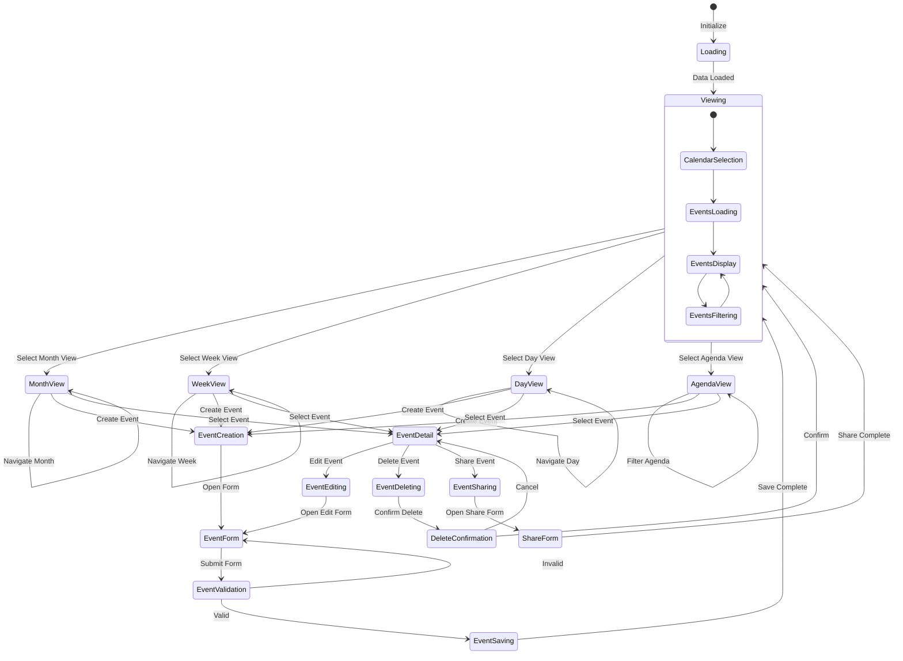
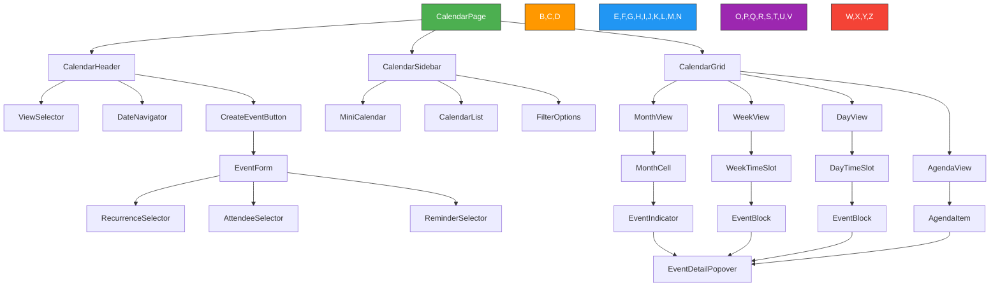

---
sidebar_position: 5
sidebar_label: "Calendar"
---

# Calendar

## Calendar Architecture and Workflows

### Calendar System Architecture



### Calendar Workflow

This diagram illustrates the calendar system workflow, including event creation, viewing, and management.



### Event Creation Sequence



### Calendar State Diagram



## User Interface Components

### Calendar Interface Architecture



| Component | Description | Features |
| --------- | ----------- | -------- |
| **CalendarHeader** | Top navigation bar | View selection, date navigation, create button |
| **CalendarSidebar** | Left sidebar panel | Mini calendar, calendar list, filters |
| **CalendarGrid** | Main calendar display | Different view layouts, event rendering |
| **MonthView** | Monthly calendar grid | Month cells with day numbers and event indicators |
| **WeekView** | Weekly time grid | Hour slots with event blocks spanning time periods |
| **DayView** | Single day time grid | Detailed hour slots with event blocks |
| **AgendaView** | List-based event view | Chronological list of events with details |
| **EventForm** | Event creation/editing | Form fields, recurrence options, attendees, reminders |
| **EventDetailPopover** | Event details popup | Event information, action buttons, attendee list |

## Component Implementations

### Calendar Context Provider

```typescript
import React, { createContext, useContext, useReducer, useEffect } from 'react';
import { CalendarService } from '../services/CalendarService';
import { ReminderManager } from '../services/ReminderManager';
import { addDays, startOfMonth, endOfMonth, startOfWeek, endOfWeek, startOfDay, endOfDay } from 'date-fns';

// Define the context state type
interface CalendarState {
  calendars: Calendar[];
  events: Event[];
  visibleRange: {
    start: Date;
    end: Date;
  };
  currentView: 'month' | 'week' | 'day' | 'agenda';
  loading: boolean;
  error: string | null;
  selectedEvent: Event | null;
  selectedDate: Date;
}

// Define the context value type
interface CalendarContextValue {
  state: CalendarState;
  fetchCalendars: () => Promise<void>;
  fetchEvents: (start: Date, end: Date) => Promise<void>;
  createEvent: (eventData: Partial<Event>) => Promise<Event>;
  updateEvent: (eventId: string, eventData: Partial<Event>) => Promise<Event>;
  deleteEvent: (eventId: string, deleteAll: boolean) => Promise<void>;
  shareCalendar: (calendarId: string, userIds: string[]) => Promise<void>;
  setCurrentView: (view: 'month' | 'week' | 'day' | 'agenda') => void;
  setSelectedDate: (date: Date) => void;
  selectEvent: (event: Event | null) => void;
}

// Create the context
const CalendarContext = createContext<CalendarContextValue | undefined>(undefined);

// Initial state
const initialState: CalendarState = {
  calendars: [],
  events: [],
  visibleRange: {
    start: startOfMonth(new Date()),
    end: endOfMonth(new Date())
  },
  currentView: 'month',
  loading: false,
  error: null,
  selectedEvent: null,
  selectedDate: new Date()
};

// Reducer function
function calendarReducer(state: CalendarState, action: any): CalendarState {
  switch (action.type) {
    case 'SET_LOADING':
      return { ...state, loading: action.payload };
    case 'SET_ERROR':
      return { ...state, error: action.payload, loading: false };
    case 'SET_CALENDARS':
      return { ...state, calendars: action.payload, loading: false };
    case 'SET_EVENTS':
      return { ...state, events: action.payload, loading: false };
    case 'ADD_EVENT':
      return { ...state, events: [...state.events, action.payload] };
    case 'UPDATE_EVENT':
      return {
        ...state,
        events: state.events.map(event => 
          event.id === action.payload.id ? action.payload : event
        ),
        selectedEvent: state.selectedEvent?.id === action.payload.id 
          ? action.payload 
          : state.selectedEvent
      };
    case 'REMOVE_EVENT':
      return {
        ...state,
        events: state.events.filter(event => 
          event.id !== action.payload.id || 
          (action.payload.instanceDate && event.id === action.payload.id && 
           event.startDate.getTime() !== new Date(action.payload.instanceDate).getTime())
        ),
        selectedEvent: state.selectedEvent?.id === action.payload.id ? null : state.selectedEvent
      };
    case 'SET_CURRENT_VIEW':
      return { ...state, currentView: action.payload };
    case 'SET_VISIBLE_RANGE':
      return { ...state, visibleRange: action.payload };
    case 'SET_SELECTED_DATE':
      return { ...state, selectedDate: action.payload };
    case 'SET_SELECTED_EVENT':
      return { ...state, selectedEvent: action.payload };
    default:
      return state;
  }
}

// Provider component
export const CalendarProvider: React.FC<{ children: React.ReactNode }> = ({ children }) => {
  const [state, dispatch] = useReducer(calendarReducer, initialState);
  const calendarService = new CalendarService();
  const reminderManager = new ReminderManager();

  // Initialize reminder checking
  useEffect(() => {
    reminderManager.checkReminders();
    
    // Set up reminder event listener
    reminderManager.onReminderTriggered((event) => {
      // Show notification for the event
      reminderManager.showNotification(event);
    });
    
    return () => {
      // Clean up reminder manager
    };
  }, []);

  // Update visible range when view or selected date changes
  useEffect(() => {
    const { currentView, selectedDate } = state;
    let start: Date, end: Date;
    
    switch (currentView) {
      case 'month':
        start = startOfMonth(selectedDate);
        end = endOfMonth(selectedDate);
        // Expand to include full weeks
        start = startOfWeek(start);
        end = endOfWeek(end);
        break;
      case 'week':
        start = startOfWeek(selectedDate);
        end = endOfWeek(selectedDate);
        break;
      case 'day':
        start = startOfDay(selectedDate);
        end = endOfDay(selectedDate);
        break;
      case 'agenda':
        start = startOfDay(selectedDate);
        end = addDays(start, 30); // Show next 30 days in agenda
        break;
      default:
        start = startOfMonth(selectedDate);
        end = endOfMonth(selectedDate);
    }
    
    dispatch({ 
      type: 'SET_VISIBLE_RANGE', 
      payload: { start, end } 
    });
    
    // Fetch events for the new range
    fetchEvents(start, end);
  }, [state.currentView, state.selectedDate]);

  // Fetch all calendars
  const fetchCalendars = async () => {
    try {
      dispatch({ type: 'SET_LOADING', payload: true });
      const calendars = await calendarService.apiGetCalendars();
      dispatch({ type: 'SET_CALENDARS', payload: calendars });
    } catch (error) {
      dispatch({ type: 'SET_ERROR', payload: 'Failed to fetch calendars' });
    }
  };

  // Fetch events for a date range
  const fetchEvents = async (start: Date, end: Date) => {
    try {
      dispatch({ type: 'SET_LOADING', payload: true });
      const events = await calendarService.apiGetEvents({ start, end });
      dispatch({ type: 'SET_EVENTS', payload: events });
    } catch (error) {
      dispatch({ type: 'SET_ERROR', payload: 'Failed to fetch events' });
    }
  };

  // Create a new event
  const createEvent = async (eventData: Partial<Event>) => {
    try {
      const newEvent = await calendarService.apiCreateEvent(eventData);
      dispatch({ type: 'ADD_EVENT', payload: newEvent });
      
      // Schedule reminders for the new event
      if (newEvent.reminders && newEvent.reminders.length > 0) {
        reminderManager.scheduleReminder(newEvent);
      }
      
      return newEvent;
    } catch (error) {
      dispatch({ type: 'SET_ERROR', payload: 'Failed to create event' });
      throw error;
    }
  };

  // Update an existing event
  const updateEvent = async (eventId: string, eventData: Partial<Event>) => {
    try {
      const updatedEvent = await calendarService.apiUpdateEvent(eventId, eventData);
      dispatch({ type: 'UPDATE_EVENT', payload: updatedEvent });
      
      // Update reminders for the event
      reminderManager.cancelReminder(eventId);
      if (updatedEvent.reminders && updatedEvent.reminders.length > 0) {
        reminderManager.scheduleReminder(updatedEvent);
      }
      
      return updatedEvent;
    } catch (error) {
      dispatch({ type: 'SET_ERROR', payload: 'Failed to update event' });
      throw error;
    }
  };

  // Delete an event
  const deleteEvent = async (eventId: string, deleteAll: boolean) => {
    try {
      await calendarService.apiDeleteEvent(eventId, deleteAll);
      
      if (deleteAll) {
        // Remove all instances of recurring event
        dispatch({ 
          type: 'REMOVE_EVENT', 
          payload: { id: eventId } 
        });
      } else {
        // Remove only the specific instance
        const selectedEvent = state.selectedEvent;
        dispatch({ 
          type: 'REMOVE_EVENT', 
          payload: { 
            id: eventId, 
            instanceDate: selectedEvent?.startDate 
          } 
        });
      }
      
      // Cancel reminders for the deleted event
      reminderManager.cancelReminder(eventId);
    } catch (error) {
      dispatch({ type: 'SET_ERROR', payload: 'Failed to delete event' });
      throw error;
    }
  };

  // Share a calendar with other users
  const shareCalendar = async (calendarId: string, userIds: string[]) => {
    try {
      await calendarService.apiShareCalendar(calendarId, userIds);
      // Refresh calendars to get updated sharing info
      fetchCalendars();
    } catch (error) {
      dispatch({ type: 'SET_ERROR', payload: 'Failed to share calendar' });
      throw error;
    }
  };

  // Set the current calendar view
  const setCurrentView = (view: 'month' | 'week' | 'day' | 'agenda') => {
    dispatch({ type: 'SET_CURRENT_VIEW', payload: view });
  };

  // Set the selected date
  const setSelectedDate = (date: Date) => {
    dispatch({ type: 'SET_SELECTED_DATE', payload: date });
  };

  // Select an event
  const selectEvent = (event: Event | null) => {
    dispatch({ type: 'SET_SELECTED_EVENT', payload: event });
  };

  // Context value
  const value = {
    state,
    fetchCalendars,
    fetchEvents,
    createEvent,
    updateEvent,
    deleteEvent,
    shareCalendar,
    setCurrentView,
    setSelectedDate,
    selectEvent
  };

  return <CalendarContext.Provider value={value}>{children}</CalendarContext.Provider>;
};

// Custom hook for using the calendar context
export const useCalendar = () => {
  const context = useContext(CalendarContext);
  if (context === undefined) {
    throw new Error('useCalendar must be used within a CalendarProvider');
  }
  return context;
};
```

### Month View Component

```typescript
import React, { useMemo } from 'react';
import { format, isToday, isSameMonth, isWithinInterval, addDays, startOfMonth, endOfMonth, startOfWeek, endOfWeek, eachDayOfInterval, isSameDay } from 'date-fns';
import { useCalendar } from '../contexts/CalendarContext';
import { EventIndicator } from './EventIndicator';
import { EventDetailPopover } from './EventDetailPopover';

export const MonthView: React.FC = () => {
  const { state, setSelectedDate, selectEvent } = useCalendar();
  const { events, selectedDate, visibleRange } = state;
  
  // Generate days for the month grid
  const days = useMemo(() => {
    const monthStart = startOfMonth(selectedDate);
    const monthEnd = endOfMonth(selectedDate);
    const calendarStart = startOfWeek(monthStart);
    const calendarEnd = endOfWeek(monthEnd);
    
    return eachDayOfInterval({ start: calendarStart, end: calendarEnd });
  }, [selectedDate]);
  
  // Group events by day
  const eventsByDay = useMemo(() => {
    const grouped: Record<string, Event[]> = {};
    
    days.forEach(day => {
      const dateStr = format(day, 'yyyy-MM-dd');
      grouped[dateStr] = [];
    });
    
    events.forEach(event => {
      // Handle multi-day events
      if (event.isAllDay || event.startDate.getDate() !== event.endDate.getDate()) {
        const eventStart = new Date(Math.max(event.startDate.getTime(), visibleRange.start.getTime()));
        const eventEnd = new Date(Math.min(event.endDate.getTime(), visibleRange.end.getTime()));
        
        let currentDate = eventStart;
        while (currentDate <= eventEnd) {
          const dateStr = format(currentDate, 'yyyy-MM-dd');
          if (grouped[dateStr]) {
            grouped[dateStr].push(event);
          }
          currentDate = addDays(currentDate, 1);
        }
      } else {
        // Single-day events
        const dateStr = format(event.startDate, 'yyyy-MM-dd');
        if (grouped[dateStr]) {
          grouped[dateStr].push(event);
        }
      }
    });
    
    return grouped;
  }, [events, days, visibleRange]);
  
  // Handle day click
  const handleDayClick = (day: Date) => {
    setSelectedDate(day);
  };
  
  // Handle event click
  const handleEventClick = (event: Event, e: React.MouseEvent) => {
    e.stopPropagation();
    selectEvent(event);
  };
  
  return (
    <div className="month-view">
      {/* Weekday headers */}
      <div className="grid grid-cols-7 border-b">
        {['Sun', 'Mon', 'Tue', 'Wed', 'Thu', 'Fri', 'Sat'].map(day => (
          <div key={day} className="p-2 text-center font-medium">
            {day}
          </div>
        ))}
      </div>
      
      {/* Calendar grid */}
      <div className="grid grid-cols-7 grid-rows-6 h-full">
        {days.map(day => {
          const dateStr = format(day, 'yyyy-MM-dd');
          const dayEvents = eventsByDay[dateStr] || [];
          const isCurrentMonth = isSameMonth(day, selectedDate);
          const isSelected = isSameDay(day, selectedDate);
          
          return (
            <div 
              key={dateStr}
              className={`
                border p-1 min-h-[100px] relative
                ${isToday(day) ? 'bg-blue-50' : ''}
                ${!isCurrentMonth ? 'text-gray-400 bg-gray-50' : ''}
                ${isSelected ? 'border-blue-500 border-2' : ''}
              `}
              onClick={() => handleDayClick(day)}
            >
              <div className="text-right">
                {format(day, 'd')}
              </div>
              
              <div className="event-container mt-1 overflow-y-auto max-h-[80px]">
                {dayEvents.slice(0, 3).map(event => (
                  <EventIndicator 
                    key={`${event.id}-${dateStr}`}
                    event={event}
                    onClick={(e) => handleEventClick(event, e)}
                  />
                ))}
                
                {dayEvents.length > 3 && (
                  <div className="text-xs text-gray-500 mt-1">
                    +{dayEvents.length - 3} more
                  </div>
                )}
              </div>
            </div>
          );
        })}
      </div>
      
      {/* Event detail popover */}
      <EventDetailPopover />
    </div>
  );
};
```

### Event Form Component

```typescript
import React, { useState, useEffect } from 'react';
import { useCalendar } from '../contexts/CalendarContext';
import { format, addHours, setHours, setMinutes } from 'date-fns';
import { Button } from '../ui/Button';
import { Input } from '../ui/Input';
import { Textarea } from '../ui/Textarea';
import { Checkbox } from '../ui/Checkbox';
import { DatePicker } from '../ui/DatePicker';
import { TimePicker } from '../ui/TimePicker';
import { ColorPicker } from '../ui/ColorPicker';
import { RecurrenceSelector } from './RecurrenceSelector';
import { AttendeeSelector } from './AttendeeSelector';
import { ReminderSelector } from './ReminderSelector';
import { CalendarSelector } from './CalendarSelector';

interface EventFormProps {
  event?: Event;
  initialDate?: Date;
  onClose: () => void;
}

export const EventForm: React.FC<EventFormProps> = ({ 
  event, 
  initialDate = new Date(),
  onClose 
}) => {
  const { state, createEvent, updateEvent } = useCalendar();
  const { calendars } = state;
  
  // Form state
  const [title, setTitle] = useState(event?.title || '');
  const [description, setDescription] = useState(event?.description || '');
  const [startDate, setStartDate] = useState(event?.startDate || initialDate);
  const [endDate, setEndDate] = useState(event?.endDate || addHours(initialDate, 1));
  const [isAllDay, setIsAllDay] = useState(event?.isAllDay || false);
  const [location, setLocation] = useState(event?.location || '');
  const [calendarId, setCalendarId] = useState(event?.calendarId || calendars[0]?.id || '');
  const [color, setColor] = useState(event?.color || '#3788d8');
  const [recurrence, setRecurrence] = useState(event?.recurrence || null);
  const [attendees, setAttendees] = useState(event?.attendees || []);
  const [reminders, setReminders] = useState(event?.reminders || []);
  const [isSubmitting, setIsSubmitting] = useState(false);
  const [errors, setErrors] = useState<Record<string, string>>({});
  
  // Handle all-day event time adjustment
  useEffect(() => {
    if (isAllDay) {
      // Set times to midnight for all-day events
      setStartDate(setMinutes(setHours(startDate, 0), 0));
      setEndDate(setMinutes(setHours(endDate, 23), 59));
    }
  }, [isAllDay]);
  
  // Validate form
  const validateForm = () => {
    const newErrors: Record<string, string> = {};
    
    if (!title.trim()) {
      newErrors.title = 'Title is required';
    }
    
    if (!calendarId) {
      newErrors.calendarId = 'Calendar is required';
    }
    
    if (endDate < startDate) {
      newErrors.endDate = 'End date must be after start date';
    }
    
    setErrors(newErrors);
    return Object.keys(newErrors).length === 0;
  };
  
  // Handle form submission
  const handleSubmit = async (e: React.FormEvent) => {
    e.preventDefault();
    
    if (!validateForm()) {
      return;
    }
    
    setIsSubmitting(true);
    
    try {
      const eventData = {
        title,
        description,
        startDate,
        endDate,
        isAllDay,
        location,
        calendarId,
        color,
        recurrence,
        attendees,
        reminders
      };
      
      if (event) {
        // Update existing event
        await updateEvent(event.id, eventData);
      } else {
        // Create new event
        await createEvent(eventData);
      }
      
      onClose();
    } catch (error) {
      console.error('Failed to save event', error);
    } finally {
      setIsSubmitting(false);
    }
  };
  
  return (
    <form onSubmit={handleSubmit} className="event-form p-4">
      <h2 className="text-xl font-bold mb-4">
        {event ? 'Edit Event' : 'Create Event'}
      </h2>
      
      <div className="mb-4">
        <Input
          label="Title"
          value={title}
          onChange={(e) => setTitle(e.target.value)}
          error={errors.title}
          required
        />
      </div>
      
      <div className="mb-4">
        <CalendarSelector
          value={calendarId}
          onChange={setCalendarId}
          error={errors.calendarId}
        />
      </div>
      
      <div className="mb-4">
        <Checkbox
          label="All day"
          checked={isAllDay}
          onChange={(e) => setIsAllDay(e.target.checked)}
        />
      </div>
      
      <div className="grid grid-cols-2 gap-4 mb-4">
        <div>
          <DatePicker
            label="Start date"
            value={startDate}
            onChange={setStartDate}
          />
        </div>
        {!isAllDay && (
          <div>
            <TimePicker
              label="Start time"
              value={startDate}
              onChange={setStartDate}
            />
          </div>
        )}
      </div>
      
      <div className="grid grid-cols-2 gap-4 mb-4">
        <div>
          <DatePicker
            label="End date"
            value={endDate}
            onChange={setEndDate}
            error={errors.endDate}
          />
        </div>
        {!isAllDay && (
          <div>
            <TimePicker
              label="End time"
              value={endDate}
              onChange={setEndDate}
            />
          </div>
        )}
      </div>
      
      <div className="mb-4">
        <Input
          label="Location"
          value={location}
          onChange={(e) => setLocation(e.target.value)}
          placeholder="Add location"
        />
      </div>
      
      <div className="mb-4">
        <Textarea
          label="Description"
          value={description}
          onChange={(e) => setDescription(e.target.value)}
          rows={3}
          placeholder="Add description"
        />
      </div>
      
      <div className="mb-4">
        <ColorPicker
          label="Color"
          value={color}
          onChange={setColor}
        />
      </div>
      
      <div className="mb-4">
        <RecurrenceSelector
          value={recurrence}
          onChange={setRecurrence}
          startDate={startDate}
        />
      </div>
      
      <div className="mb-4">
        <AttendeeSelector
          value={attendees}
          onChange={setAttendees}
        />
      </div>
      
      <div className="mb-4">
        <ReminderSelector
          value={reminders}
          onChange={setReminders}
        />
      </div>
      
      <div className="flex justify-end space-x-2">
        <Button
          type="button"
          variant="secondary"
          onClick={onClose}
          disabled={isSubmitting}
        >
          Cancel
        </Button>
        <Button
          type="submit"
          variant="primary"
          loading={isSubmitting}
        >
          {event ? 'Update' : 'Create'}
        </Button>
      </div>
    </form>
  );
};
```

## Calendar System Overview

TheEnterprise Nexus includes a comprehensive calendar system for event management that enables users to organize their schedule, plan meetings, and coordinate with team members.

## Calendar Features

### Event Management
- **Event creation and editing**: Create and modify events with detailed information
- **Multiple calendar views**: Month, week, day, and agenda views for different planning needs
- **Recurring events**: Set up repeating events with complex recurrence patterns
- **Event categories**: Organize events by type with color coding
- **Reminders and notifications**: Get alerted before events with customizable reminders
- **Sharing and collaboration**: Share calendars and invite attendees to events

### Advanced Features
- **Multiple calendars**: Create and manage multiple calendars for different purposes
- **Calendar overlays**: View multiple calendars simultaneously with visual distinction
- **External calendar integration**: Sync with Google Calendar, Outlook, and other providers
- **Drag-and-drop scheduling**: Easily move and resize events in the calendar interface
- **Time zone support**: Handle events across different time zones
- **Availability checking**: See attendee availability when scheduling meetings
- **Resource booking**: Reserve rooms and equipment alongside event scheduling
- **Print and export**: Generate printable views and export calendar data

## Recurrence Rules

The calendar system implements the RFC 5545 (iCalendar) specification for recurring events:

### Supported Recurrence Patterns

| Pattern | Description | Example |
| ------- | ----------- | ------- |
| **Daily** | Repeats every day or every N days | Every 2 days |
| **Weekly** | Repeats weekly on specified days | Every Monday, Wednesday, Friday |
| **Monthly** | Repeats monthly by day or date | Every 15th of the month or Every first Monday |
| **Yearly** | Repeats yearly | Every March 15 or Every first Monday in April |

### Recurrence Options
- **Frequency**: How often the event repeats (daily, weekly, monthly, yearly)
- **Interval**: Number of units between occurrences (every 2 weeks, every 3 months)
- **End condition**: Until a specific date, for a number of occurrences, or indefinitely
- **Exceptions**: Specific dates to exclude from the pattern
- **Day selection**: For weekly patterns, which days of the week to include
- **Position selection**: For monthly patterns, which occurrence of the day (first Monday, last Friday)

## Reminder System

The calendar system implements a flexible reminder system:

### Reminder Types
- **In-app notifications**: Alerts within the application
- **Email notifications**: Reminders sent via email
- **Push notifications**: Alerts sent to mobile devices
- **SMS notifications**: Text message reminders (optional)

### Reminder Timing
- **Time-based**: Set reminders for specific times before events (5 minutes, 30 minutes, 1 hour, 1 day)
- **Multiple reminders**: Configure several reminders for a single event
- **Smart reminders**: Contextual reminders based on location and travel time

## State Management

The calendar uses a context-based state management approach:

### State Structure
- **Normalized data**: Efficient storage and retrieval of calendars and events
- **Date range management**: Smart loading of events based on visible date range
- **View-specific state**: Optimized rendering for different calendar views
- **Recurrence expansion**: On-demand calculation of recurring event instances
- **Optimistic updates**: Immediate UI feedback before server confirmation

### Performance Optimizations
- **Virtualized rendering**: Only render visible portions of the calendar
- **Memoized calculations**: Cache expensive computations like date generation
- **Lazy loading**: Load events as needed when navigating the calendar
- **Batch updates**: Group multiple state changes for efficiency

