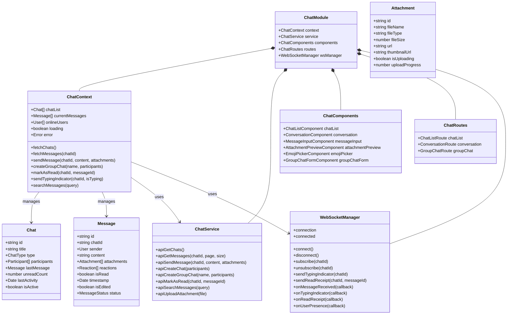
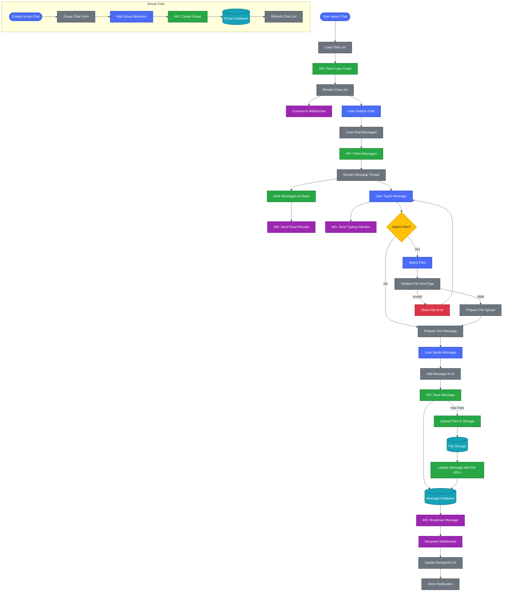
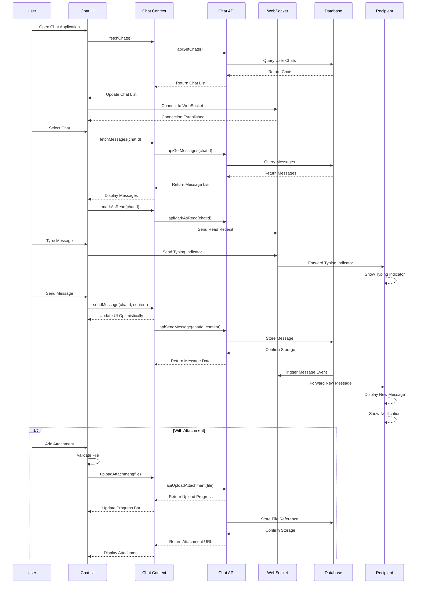
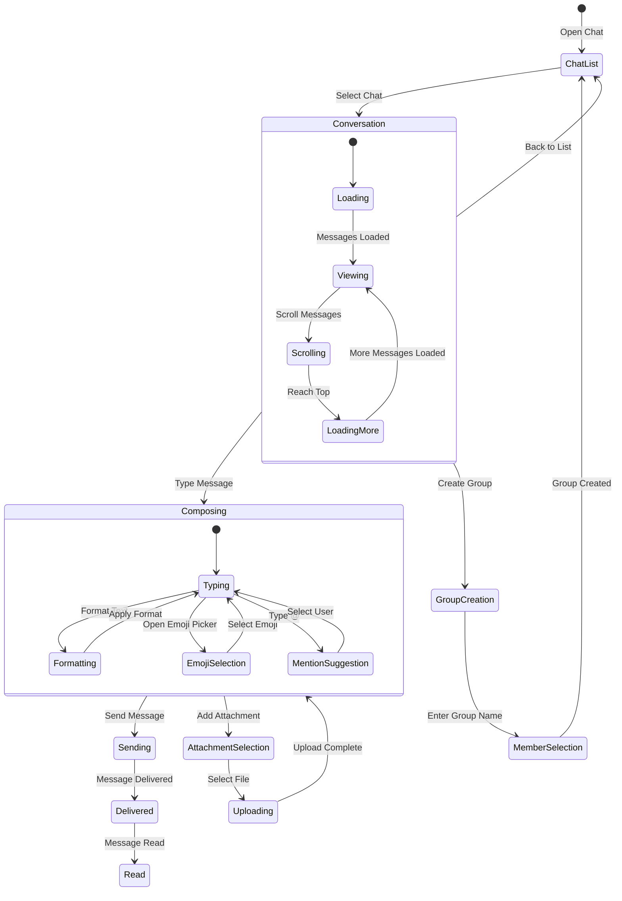
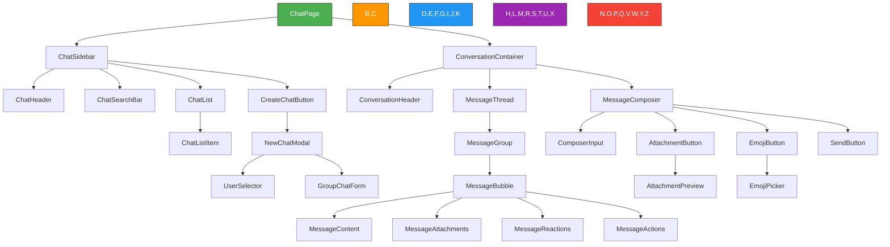

---
sidebar_position: 9
sidebar_label: "Chat System"
---

# Chat System

## Chat System Architecture and Workflows

### Chat System Architecture



### Chat System Workflow

This diagram illustrates the real-time chat system flow, from message creation to delivery and storage.



### Message Sequence Diagram



### Chat State Diagram



## User Interface Components

### Chat Interface Architecture



| Component | Description | Features |
| --------- | ----------- | -------- |
| **ChatSidebar** | Left panel with chat list | Search, filtering, chat selection |
| **ChatList** | List of user's conversations | Unread indicators, last message preview, timestamps |
| **ConversationHeader** | Header for current conversation | Participant info, online status, actions menu |
| **MessageThread** | Container for message history | Infinite scroll, message grouping, timestamps |
| **MessageBubble** | Individual message display | Sender info, content, status indicators |
| **MessageComposer** | Input area for new messages | Text formatting, attachments, emoji picker |
| **AttachmentPreview** | Preview for attached files | Thumbnail display, remove option, upload progress |
| **EmojiPicker** | Emoji selection interface | Categories, search, frequently used |
| **GroupChatForm** | Interface for creating groups | Name input, member selection, avatar upload |

## Component Implementations

### Chat Context Provider

```typescript
import React, { createContext, useContext, useReducer, useEffect } from 'react';
import { ChatService } from '../services/ChatService';
import { WebSocketManager } from '../services/WebSocketManager';

// Define the context state type
interface ChatState {
  chats: Chat[];
  currentChat: Chat | null;
  messages: Message[];
  loading: boolean;
  error: string | null;
  onlineUsers: string[];
  typingUsers: Record<string, string[]>;
}

// Define the context value type
interface ChatContextValue {
  state: ChatState;
  fetchChats: () => Promise<void>;
  fetchMessages: (chatId: string) => Promise<void>;
  sendMessage: (chatId: string, content: string, attachments?: File[]) => Promise<void>;
  createChat: (participantIds: string[]) => Promise<void>;
  createGroupChat: (name: string, participantIds: string[]) => Promise<void>;
  markAsRead: (chatId: string, messageId: string) => Promise<void>;
  sendTypingIndicator: (chatId: string, isTyping: boolean) => void;
  searchMessages: (query: string) => Promise<Message[]>;
  uploadAttachment: (file: File) => Promise<string>;
}

// Create the context
const ChatContext = createContext<ChatContextValue | undefined>(undefined);

// Initial state
const initialState: ChatState = {
  chats: [],
  currentChat: null,
  messages: [],
  loading: false,
  error: null,
  onlineUsers: [],
  typingUsers: {},
};

// Reducer function
function chatReducer(state: ChatState, action: any): ChatState {
  switch (action.type) {
    case 'SET_LOADING':
      return { ...state, loading: action.payload };
    case 'SET_ERROR':
      return { ...state, error: action.payload, loading: false };
    case 'SET_CHATS':
      return { ...state, chats: action.payload, loading: false };
    case 'SET_CURRENT_CHAT':
      return { ...state, currentChat: action.payload };
    case 'SET_MESSAGES':
      return { ...state, messages: action.payload, loading: false };
    case 'ADD_MESSAGE':
      return {
        ...state,
        messages: [...state.messages, action.payload],
        chats: state.chats.map(chat => 
          chat.id === action.payload.chatId 
            ? { ...chat, lastMessage: action.payload, lastActivity: new Date() }
            : chat
        ),
      };
    case 'SET_ONLINE_USERS':
      return { ...state, onlineUsers: action.payload };
    case 'SET_TYPING_USERS':
      return { 
        ...state, 
        typingUsers: { 
          ...state.typingUsers, 
          [action.payload.chatId]: action.payload.users 
        } 
      };
    default:
      return state;
  }
}

// Provider component
export const ChatProvider: React.FC<{ children: React.ReactNode }> = ({ children }) => {
  const [state, dispatch] = useReducer(chatReducer, initialState);
  const chatService = new ChatService();
  const wsManager = new WebSocketManager();

  // Initialize WebSocket connection
  useEffect(() => {
    wsManager.connect();
    
    // Set up WebSocket event listeners
    wsManager.onMessageReceived((message) => {
      dispatch({ type: 'ADD_MESSAGE', payload: message });
    });
    
    wsManager.onTypingIndicator((chatId, users) => {
      dispatch({ type: 'SET_TYPING_USERS', payload: { chatId, users } });
    });
    
    wsManager.onUserPresence((users) => {
      dispatch({ type: 'SET_ONLINE_USERS', payload: users });
    });
    
    return () => {
      wsManager.disconnect();
    };
  }, []);

  // Fetch all chats
  const fetchChats = async () => {
    try {
      dispatch({ type: 'SET_LOADING', payload: true });
      const chats = await chatService.apiGetChats();
      dispatch({ type: 'SET_CHATS', payload: chats });
    } catch (error) {
      dispatch({ type: 'SET_ERROR', payload: 'Failed to fetch chats' });
    }
  };

  // Fetch messages for a specific chat
  const fetchMessages = async (chatId: string) => {
    try {
      dispatch({ type: 'SET_LOADING', payload: true });
      const chat = state.chats.find(c => c.id === chatId) || null;
      dispatch({ type: 'SET_CURRENT_CHAT', payload: chat });
      
      const messages = await chatService.apiGetMessages(chatId);
      dispatch({ type: 'SET_MESSAGES', payload: messages });
      
      // Subscribe to this chat's WebSocket channel
      wsManager.subscribe(chatId);
    } catch (error) {
      dispatch({ type: 'SET_ERROR', payload: 'Failed to fetch messages' });
    }
  };

  // Send a new message
  const sendMessage = async (chatId: string, content: string, attachments?: File[]) => {
    try {
      // Create optimistic message
      const optimisticMessage = {
        id: `temp-${Date.now()}`,
        chatId,
        content,
        sender: { id: 'currentUser' }, // Replace with actual current user
        timestamp: new Date(),
        isRead: false,
        status: 'sending',
        attachments: attachments ? attachments.map(file => ({
          id: `temp-${file.name}`,
          fileName: file.name,
          fileType: file.type,
          fileSize: file.size,
          isUploading: true,
          uploadProgress: 0
        })) : []
      };
      
      // Add optimistic message to UI
      dispatch({ type: 'ADD_MESSAGE', payload: optimisticMessage });
      
      // Upload attachments if any
      let attachmentUrls: string[] = [];
      if (attachments && attachments.length > 0) {
        attachmentUrls = await Promise.all(
          attachments.map(file => chatService.apiUploadAttachment(file))
        );
      }
      
      // Send the actual message
      const message = await chatService.apiSendMessage(
        chatId, 
        content, 
        attachmentUrls.map(url => ({ url }))
      );
      
      // Replace optimistic message with actual message
      dispatch({ type: 'SET_MESSAGES', payload: state.messages.map(msg => 
        msg.id === optimisticMessage.id ? message : msg
      )});
    } catch (error) {
      dispatch({ type: 'SET_ERROR', payload: 'Failed to send message' });
    }
  };

  // Create a new one-on-one chat
  const createChat = async (participantIds: string[]) => {
    try {
      dispatch({ type: 'SET_LOADING', payload: true });
      const newChat = await chatService.apiCreateChat(participantIds);
      dispatch({ type: 'SET_CHATS', payload: [...state.chats, newChat] });
      return newChat;
    } catch (error) {
      dispatch({ type: 'SET_ERROR', payload: 'Failed to create chat' });
      throw error;
    }
  };

  // Create a new group chat
  const createGroupChat = async (name: string, participantIds: string[]) => {
    try {
      dispatch({ type: 'SET_LOADING', payload: true });
      const newChat = await chatService.apiCreateGroupChat(name, participantIds);
      dispatch({ type: 'SET_CHATS', payload: [...state.chats, newChat] });
      return newChat;
    } catch (error) {
      dispatch({ type: 'SET_ERROR', payload: 'Failed to create group chat' });
      throw error;
    }
  };

  // Mark a message as read
  const markAsRead = async (chatId: string, messageId: string) => {
    try {
      await chatService.apiMarkAsRead(chatId, messageId);
      wsManager.sendReadReceipt(chatId, messageId);
      
      // Update local state
      dispatch({
        type: 'SET_CHATS',
        payload: state.chats.map(chat => 
          chat.id === chatId 
            ? { ...chat, unreadCount: 0 }
            : chat
        )
      });
    } catch (error) {
      console.error('Failed to mark message as read', error);
    }
  };

  // Send typing indicator
  const sendTypingIndicator = (chatId: string, isTyping: boolean) => {
    wsManager.sendTypingIndicator(chatId, isTyping);
  };

  // Search messages
  const searchMessages = async (query: string) => {
    try {
      return await chatService.apiSearchMessages(query);
    } catch (error) {
      dispatch({ type: 'SET_ERROR', payload: 'Failed to search messages' });
      return [];
    }
  };

  // Upload attachment
  const uploadAttachment = async (file: File) => {
    try {
      return await chatService.apiUploadAttachment(file);
    } catch (error) {
      dispatch({ type: 'SET_ERROR', payload: 'Failed to upload attachment' });
      throw error;
    }
  };

  // Context value
  const value = {
    state,
    fetchChats,
    fetchMessages,
    sendMessage,
    createChat,
    createGroupChat,
    markAsRead,
    sendTypingIndicator,
    searchMessages,
    uploadAttachment
  };

  return <ChatContext.Provider value={value}>{children}</ChatContext.Provider>;
};

// Custom hook for using the chat context
export const useChat = () => {
  const context = useContext(ChatContext);
  if (context === undefined) {
    throw new Error('useChat must be used within a ChatProvider');
  }
  return context;
};
```

### Message Bubble Component

```typescript
import React, { useState } from 'react';
import { formatTime, formatDate } from '../utils/dateUtils';
import { Avatar } from '../ui/Avatar';
import { Tooltip } from '../ui/Tooltip';
import { EmojiReaction } from './EmojiReaction';
import { AttachmentPreview } from './AttachmentPreview';
import { useUser } from '../contexts/UserContext';

interface MessageBubbleProps {
  message: Message;
  showSender: boolean;
  isFirstInGroup: boolean;
  isLastInGroup: boolean;
  onReactionClick: (messageId: string, emoji: string) => void;
}

export const MessageBubble: React.FC<MessageBubbleProps> = ({
  message,
  showSender,
  isFirstInGroup,
  isLastInGroup,
  onReactionClick
}) => {
  const { currentUser } = useUser();
  const [showActions, setShowActions] = useState(false);
  
  const isCurrentUser = message.sender.id === currentUser?.id;
  
  // Format timestamp
  const time = formatTime(message.timestamp);
  const date = formatDate(message.timestamp);
  
  // Message status indicator
  const getStatusIndicator = () => {
    if (!isCurrentUser) return null;
    
    switch (message.status) {
      case 'sending':
        return <span className="text-gray-400 text-xs">Sending...</span>;
      case 'sent':
        return <span className="text-gray-400 text-xs">✓</span>;
      case 'delivered':
        return <span className="text-gray-400 text-xs">✓✓</span>;
      case 'read':
        return <span className="text-blue-400 text-xs">✓✓</span>;
      default:
        return null;
    }
  };
  
  return (
    <div 
      className={`message-container flex ${isCurrentUser ? 'justify-end' : 'justify-start'} mb-1`}
      onMouseEnter={() => setShowActions(true)}
      onMouseLeave={() => setShowActions(false)}
    >
      {!isCurrentUser && showSender && isFirstInGroup && (
        <div className="avatar-container mr-2 mt-auto">
          <Avatar 
            src={message.sender.avatarUrl} 
            name={message.sender.displayName} 
            size="small" 
          />
        </div>
      )}
      
      <div className={`message-content-container ${!isCurrentUser && !isFirstInGroup ? 'ml-8' : ''}`}>
        {!isCurrentUser && isFirstInGroup && (
          <div className="sender-name text-xs text-gray-600 mb-1 ml-1">
            {message.sender.displayName}
          </div>
        )}
        
        <div className="message-content-wrapper flex flex-col">
          <div 
            className={`
              message-bubble px-3 py-2 rounded-lg max-w-xs md:max-w-md lg:max-w-lg
              ${isCurrentUser 
                ? 'bg-blue-500 text-white rounded-br-none' 
                : 'bg-gray-200 text-gray-800 rounded-bl-none'}
              ${isFirstInGroup && isCurrentUser ? 'rounded-tr-lg' : ''}
              ${isFirstInGroup && !isCurrentUser ? 'rounded-tl-lg' : ''}
              ${isLastInGroup && isCurrentUser ? 'rounded-br-none' : ''}
              ${isLastInGroup && !isCurrentUser ? 'rounded-bl-none' : ''}
            `}
          >
            {/* Message text content */}
            <div className="message-text whitespace-pre-wrap break-words">
              {message.content}
            </div>
            
            {/* Attachments */}
            {message.attachments && message.attachments.length > 0 && (
              <div className="message-attachments mt-2">
                {message.attachments.map(attachment => (
                  <AttachmentPreview 
                    key={attachment.id} 
                    attachment={attachment} 
                    isUploading={attachment.isUploading}
                    uploadProgress={attachment.uploadProgress}
                  />
                ))}
              </div>
            )}
            
            {/* Edited indicator */}
            {message.isEdited && (
              <span className="edited-indicator text-xs opacity-70 ml-1">
                (edited)
              </span>
            )}
          </div>
          
          {/* Reactions */}
          {message.reactions && message.reactions.length > 0 && (
            <div className={`message-reactions flex mt-1 ${isCurrentUser ? 'justify-end' : 'justify-start'}`}>
              {message.reactions.map((reaction, index) => (
                <EmojiReaction 
                  key={`${reaction.emoji}-${index}`}
                  emoji={reaction.emoji}
                  count={reaction.count}
                  users={reaction.users}
                  isSelected={reaction.users.includes(currentUser?.id || '')}
                  onClick={() => onReactionClick(message.id, reaction.emoji)}
                />
              ))}
            </div>
          )}
          
          {/* Time and status */}
          <div className={`message-meta flex items-center mt-1 text-xs text-gray-500 ${isCurrentUser ? 'justify-end' : 'justify-start'}`}>
            <Tooltip content={date}>
              <span className="message-time">{time}</span>
            </Tooltip>
            <span className="message-status ml-1">
              {getStatusIndicator()}
            </span>
          </div>
        </div>
      </div>
      
      {/* Message actions */}
      {showActions && (
        <div className={`message-actions absolute ${isCurrentUser ? 'left-0' : 'right-0'} top-0 bg-white shadow-md rounded-md p-1`}>
          <button className="action-button p-1 hover:bg-gray-100 rounded">
            <span role="img" aria-label="React">😀</span>
          </button>
          {isCurrentUser && (
            <>
              <button className="action-button p-1 hover:bg-gray-100 rounded">
                <span role="img" aria-label="Edit">✏️</span>
              </button>
              <button className="action-button p-1 hover:bg-gray-100 rounded">
                <span role="img" aria-label="Delete">🗑️</span>
              </button>
            </>
          )}
          <button className="action-button p-1 hover:bg-gray-100 rounded">
            <span role="img" aria-label="Reply">↩️</span>
          </button>
        </div>
      )}
    </div>
  );
};
```

### Message Composer Component

```typescript
import React, { useState, useRef, useEffect } from 'react';
import { useChat } from '../contexts/ChatContext';
import { Button } from '../ui/Button';
import { EmojiPicker } from './EmojiPicker';
import { AttachmentPreview } from './AttachmentPreview';
import { FormatToolbar } from './FormatToolbar';

interface MessageComposerProps {
  chatId: string;
}

export const MessageComposer: React.FC<MessageComposerProps> = ({ chatId }) => {
  const [message, setMessage] = useState('');
  const [attachments, setAttachments] = useState<File[]>([]);
  const [showEmojiPicker, setShowEmojiPicker] = useState(false);
  const [showFormatToolbar, setShowFormatToolbar] = useState(false);
  const [isTyping, setIsTyping] = useState(false);
  const [typingTimeout, setTypingTimeout] = useState<NodeJS.Timeout | null>(null);
  
  const fileInputRef = useRef<HTMLInputElement>(null);
  const textAreaRef = useRef<HTMLTextAreaElement>(null);
  
  const { sendMessage, sendTypingIndicator, uploadAttachment } = useChat();
  
  // Handle typing indicator
  useEffect(() => {
    if (message && !isTyping) {
      setIsTyping(true);
      sendTypingIndicator(chatId, true);
    }
    
    // Clear previous timeout
    if (typingTimeout) {
      clearTimeout(typingTimeout);
    }
    
    // Set new timeout
    const timeout = setTimeout(() => {
      if (isTyping) {
        setIsTyping(false);
        sendTypingIndicator(chatId, false);
      }
    }, 3000);
    
    setTypingTimeout(timeout);
    
    return () => {
      if (typingTimeout) {
        clearTimeout(typingTimeout);
      }
    };
  }, [message, chatId, isTyping, sendTypingIndicator]);
  
  // Auto-resize textarea
  useEffect(() => {
    if (textAreaRef.current) {
      textAreaRef.current.style.height = 'auto';
      textAreaRef.current.style.height = `${textAreaRef.current.scrollHeight}px`;
    }
  }, [message]);
  
  const handleSendMessage = async () => {
    if (!message.trim() && attachments.length === 0) return;
    
    try {
      await sendMessage(chatId, message, attachments);
      setMessage('');
      setAttachments([]);
      setIsTyping(false);
      sendTypingIndicator(chatId, false);
      
      // Focus back on textarea
      if (textAreaRef.current) {
        textAreaRef.current.focus();
      }
    } catch (error) {
      console.error('Failed to send message', error);
    }
  };
  
  const handleKeyDown = (e: React.KeyboardEvent<HTMLTextAreaElement>) => {
    // Send message on Enter (without Shift)
    if (e.key === 'Enter' && !e.shiftKey) {
      e.preventDefault();
      handleSendMessage();
    }
  };
  
  const handleAttachmentClick = () => {
    if (fileInputRef.current) {
      fileInputRef.current.click();
    }
  };
  
  const handleFileChange = (e: React.ChangeEvent<HTMLInputElement>) => {
    if (e.target.files) {
      const newFiles = Array.from(e.target.files);
      
      // Validate files (size, type, etc.)
      const validFiles = newFiles.filter(file => {
        // Max file size: 10MB
        if (file.size > 10 * 1024 * 1024) {
          console.error(`File too large: ${file.name}`);
          return false;
        }
        
        // Allowed file types
        const allowedTypes = [
          'image/jpeg', 'image/png', 'image/gif', 
          'application/pdf', 'application/msword', 
          'application/vnd.openxmlformats-officedocument.wordprocessingml.document',
          'text/plain'
        ];
        
        if (!allowedTypes.includes(file.type)) {
          console.error(`File type not allowed: ${file.type}`);
          return false;
        }
        
        return true;
      });
      
      setAttachments(prev => [...prev, ...validFiles]);
      
      // Reset file input
      e.target.value = '';
    }
  };
  
  const handleRemoveAttachment = (index: number) => {
    setAttachments(prev => prev.filter((_, i) => i !== index));
  };
  
  const handleEmojiSelect = (emoji: string) => {
    setMessage(prev => prev + emoji);
    setShowEmojiPicker(false);
    
    // Focus back on textarea
    if (textAreaRef.current) {
      textAreaRef.current.focus();
    }
  };
  
  const handleFormatText = (formatType: string) => {
    if (!textAreaRef.current) return;
    
    const textarea = textAreaRef.current;
    const start = textarea.selectionStart;
    const end = textarea.selectionEnd;
    const selectedText = message.substring(start, end);
    
    let formattedText = '';
    let newCursorPos = 0;
    
    switch (formatType) {
      case 'bold':
        formattedText = `**${selectedText}**`;
        newCursorPos = start + 2;
        break;
      case 'italic':
        formattedText = `_${selectedText}_`;
        newCursorPos = start + 1;
        break;
      case 'code':
        formattedText = `\`${selectedText}\``;
        newCursorPos = start + 1;
        break;
      case 'link':
        formattedText = `[${selectedText}](url)`;
        newCursorPos = end + 3;
        break;
      default:
        return;
    }
    
    const newMessage = message.substring(0, start) + formattedText + message.substring(end);
    setMessage(newMessage);
    
    // Set cursor position after formatting
    setTimeout(() => {
      textarea.focus();
      if (selectedText) {
        textarea.setSelectionRange(end + formattedText.length - selectedText.length, end + formattedText.length - selectedText.length);
      } else {
        textarea.setSelectionRange(newCursorPos, newCursorPos);
      }
    }, 0);
  };
  
  return (
    <div className="message-composer border-t p-3">
      {/* Format toolbar */}
      {showFormatToolbar && (
        <FormatToolbar onFormatClick={handleFormatText} />
      )}
      
      {/* Attachment previews */}
      {attachments.length > 0 && (
        <div className="attachment-previews flex flex-wrap gap-2 mb-2">
          {attachments.map((file, index) => (
            <div key={index} className="attachment-preview-container">
              <AttachmentPreview
                attachment={{
                  id: `temp-${index}`,
                  fileName: file.name,
                  fileType: file.type,
                  fileSize: file.size,
                  isUploading: false,
                  uploadProgress: 0
                }}
                onRemove={() => handleRemoveAttachment(index)}
              />
            </div>
          ))}
        </div>
      )}
      
      {/* Composer input area */}
      <div className="composer-input-container flex items-end">
        <div className="composer-buttons flex items-center mr-2">
          <button 
            className="format-button p-2 rounded-full hover:bg-gray-100"
            onClick={() => setShowFormatToolbar(!showFormatToolbar)}
          >
            <span role="img" aria-label="Format">Aa</span>
          </button>
          
          <button 
            className="attachment-button p-2 rounded-full hover:bg-gray-100"
            onClick={handleAttachmentClick}
          >
            <span role="img" aria-label="Attach">📎</span>
          </button>
          
          <input
            type="file"
            ref={fileInputRef}
            className="hidden"
            multiple
            onChange={handleFileChange}
          />
          
          <button 
            className="emoji-button p-2 rounded-full hover:bg-gray-100 relative"
            onClick={() => setShowEmojiPicker(!showEmojiPicker)}
          >
            <span role="img" aria-label="Emoji">😀</span>
            
            {showEmojiPicker && (
              <div className="absolute bottom-10 left-0">
                <EmojiPicker onEmojiSelect={handleEmojiSelect} />
              </div>
            )}
          </button>
        </div>
        
        <div className="composer-input flex-grow">
          <textarea
            ref={textAreaRef}
            className="w-full border rounded-md px-3 py-2 focus:outline-none focus:ring-2 focus:ring-blue-300 resize-none"
            placeholder="Type a message..."
            rows={1}
            value={message}
            onChange={(e) => setMessage(e.target.value)}
            onKeyDown={handleKeyDown}
          />
        </div>
        
        <div className="send-button ml-2">
          <Button
            onClick={handleSendMessage}
            disabled={!message.trim() && attachments.length === 0}
            variant="primary"
            size="sm"
            rounded
          >
            <span role="img" aria-label="Send">📤</span>
          </Button>
        </div>
      </div>
    </div>
  );
};
```

## Chat System Overview

TheEnterprise Nexus includes a real-time chat system for communication that enables seamless messaging between users and groups. The system is built with a focus on performance, reliability, and user experience.

## Chat Features

### Messaging Capabilities
- **One-on-one messaging**: Private conversations between two users
- **Group chats**: Conversations with multiple participants
- **File sharing**: Support for images, documents, and other file types
- **Message formatting**: Rich text formatting with markdown support
- **Read receipts**: Visual indicators when messages are read
- **Typing indicators**: Shows when someone is typing a message
- **Message search**: Full-text search across all conversations
- **Emoji and reactions**: Express emotions with emoji reactions to messages

### Advanced Features
- **Message threading**: Reply to specific messages to create conversation threads
- **Message editing**: Edit sent messages within a time window
- **Message deletion**: Remove sent messages from the conversation
- **Mentions**: Tag users with @mentions to notify them
- **Link previews**: Rich previews for shared URLs
- **Offline support**: Queue messages when offline and send when connection is restored
- **End-to-end encryption**: Optional encryption for sensitive conversations
- **Message translation**: Translate messages to different languages

## Real-time Communication

The chat system uses WebSockets for real-time features:

### WebSocket Implementation
- **Connection management**: Automatic reconnection with exponential backoff
- **Event-based architecture**: Publish-subscribe pattern for message delivery
- **Optimistic updates**: UI updates immediately while waiting for server confirmation
- **Presence tracking**: Real-time online status of users
- **Typing indicators**: Real-time notification when users are typing
- **Read receipts**: Instant notification when messages are read

### Performance Optimizations
- **Message batching**: Group multiple messages for efficient transmission
- **Selective updates**: Only send changes rather than full message objects
- **Compression**: Minimize payload size for faster transmission
- **Connection pooling**: Reuse connections for multiple channels

## State Management

The chat system uses a context-based state management approach:

### State Structure
- **Normalized data**: Efficient storage and retrieval of chats and messages
- **Optimistic updates**: Immediate UI feedback before server confirmation
- **Pagination support**: Efficient loading of large message histories
- **Real-time synchronization**: WebSocket updates merged with local state
- **Error handling**: Graceful recovery from network issues

### Caching Strategy
- **In-memory cache**: Recent messages and chats for quick access
- **Persistent storage**: IndexedDB for offline access to message history
- **Cache invalidation**: Smart updating of cache based on server events
- **Prefetching**: Load likely-to-be-needed data in advance

## Security Considerations

The chat system implements several security measures:

- **Authentication**: All chat operations require authenticated users
- **Authorization**: Users can only access conversations they're part of
- **Input validation**: All user inputs are validated and sanitized
- **Content security**: File scanning and content moderation
- **Rate limiting**: Prevents abuse of the messaging system
- **Audit logging**: Security-relevant events are logged for review

