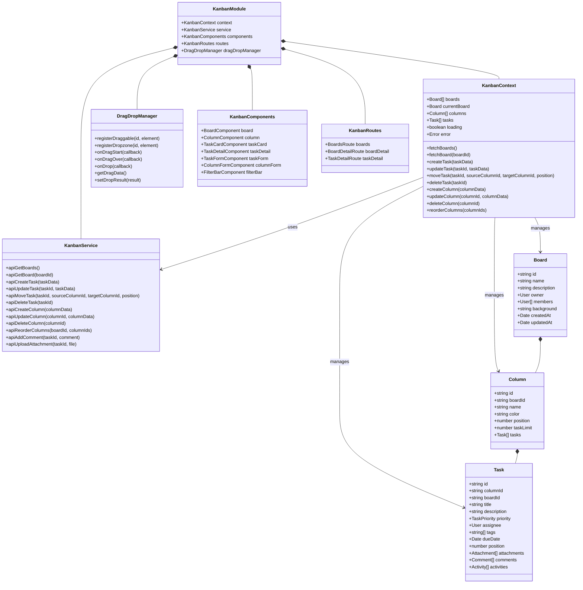
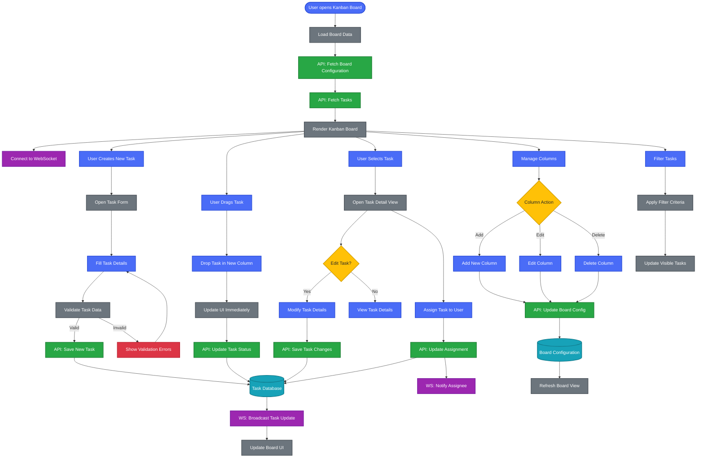
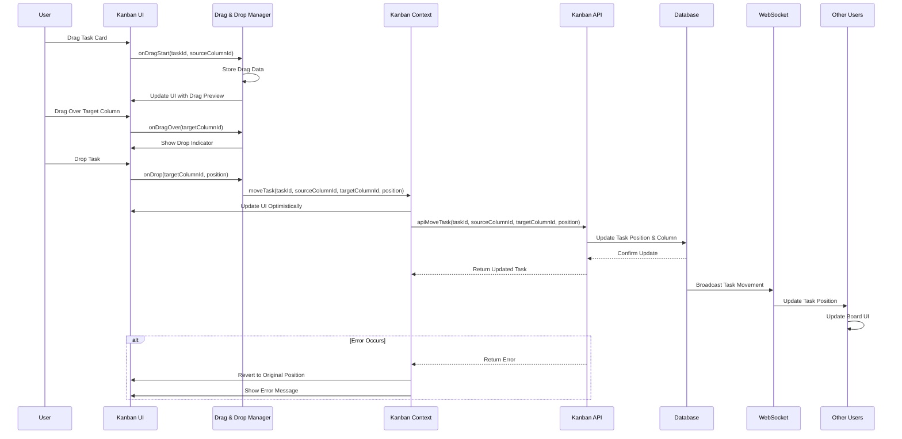
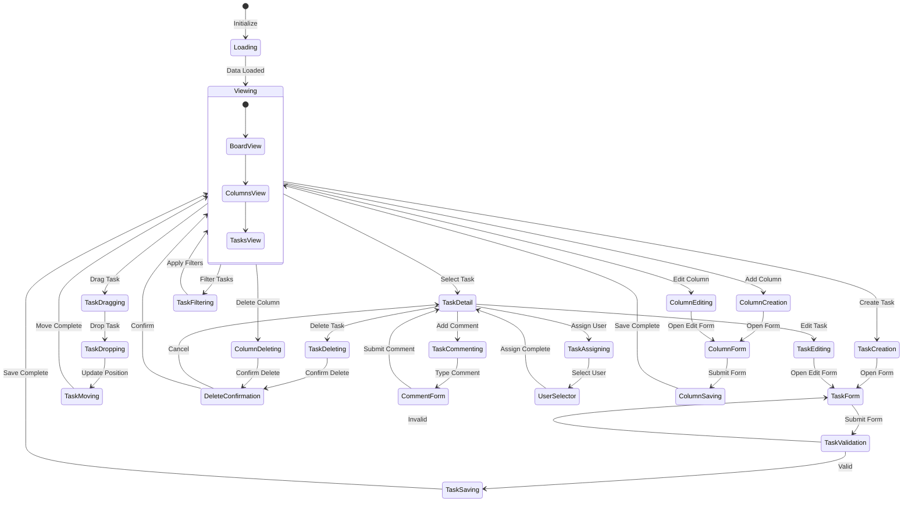
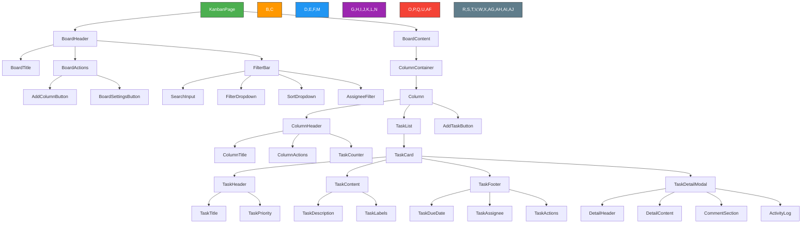

---
sidebar_position: 6
sidebar_label: "Kanban Board"
---

# Kanban Board

## Kanban Board Architecture and Workflows

### Kanban System Architecture



### Kanban Board Workflow

This diagram illustrates the Kanban board functionality, including task creation, movement, and updates.



### Task Movement Sequence



### Kanban State Diagram



## User Interface Components

### Kanban Interface Architecture



| Component | Description | Features |
| --------- | ----------- | -------- |
| **BoardHeader** | Top section of the board | Board title, actions, filters |
| **ColumnContainer** | Horizontal scrollable container | Houses all columns in the board |
| **Column** | Vertical container for tasks | Column header, task list, add task button |
| **TaskCard** | Individual task representation | Title, description, metadata, drag handle |
| **FilterBar** | Task filtering interface | Search, filters by various criteria |
| **TaskDetailModal** | Expanded task view | Full details, comments, activity log |
| **CommentSection** | Task discussion area | Comment list, comment form |
| **ActivityLog** | Task history tracking | Chronological list of changes |

## Component Implementations

### Kanban Context Provider

```typescript
import React, { createContext, useContext, useReducer, useEffect } from 'react';
import { KanbanService } from '../services/KanbanService';
import { DragDropManager } from '../services/DragDropManager';

// Define the context state type
interface KanbanState {
  boards: Board[];
  currentBoard: Board | null;
  columns: Column[];
  tasks: Task[];
  loading: boolean;
  error: string | null;
  selectedTask: Task | null;
  filters: {
    search: string;
    assignee: string | null;
    priority: TaskPriority | null;
    dueDate: string | null;
    tags: string[];
  };
}

// Define the context value type
interface KanbanContextValue {
  state: KanbanState;
  fetchBoards: () => Promise<void>;
  fetchBoard: (boardId: string) => Promise<void>;
  createTask: (taskData: Partial<Task>) => Promise<Task>;
  updateTask: (taskId: string, taskData: Partial<Task>) => Promise<Task>;
  moveTask: (taskId: string, sourceColumnId: string, targetColumnId: string, position: number) => Promise<void>;
  deleteTask: (taskId: string) => Promise<void>;
  createColumn: (columnData: Partial<Column>) => Promise<Column>;
  updateColumn: (columnId: string, columnData: Partial<Column>) => Promise<Column>;
  deleteColumn: (columnId: string) => Promise<void>;
  reorderColumns: (columnIds: string[]) => Promise<void>;
  addComment: (taskId: string, comment: string) => Promise<void>;
  uploadAttachment: (taskId: string, file: File) => Promise<void>;
  selectTask: (task: Task | null) => void;
  setFilters: (filters: Partial<KanbanState['filters']>) => void;
}

// Create the context
const KanbanContext = createContext<KanbanContextValue | undefined>(undefined);

// Initial state
const initialState: KanbanState = {
  boards: [],
  currentBoard: null,
  columns: [],
  tasks: [],
  loading: false,
  error: null,
  selectedTask: null,
  filters: {
    search: '',
    assignee: null,
    priority: null,
    dueDate: null,
    tags: []
  }
};

// Reducer function
function kanbanReducer(state: KanbanState, action: any): KanbanState {
  switch (action.type) {
    case 'SET_LOADING':
      return { ...state, loading: action.payload };
    case 'SET_ERROR':
      return { ...state, error: action.payload, loading: false };
    case 'SET_BOARDS':
      return { ...state, boards: action.payload, loading: false };
    case 'SET_CURRENT_BOARD':
      return { ...state, currentBoard: action.payload, loading: false };
    case 'SET_COLUMNS':
      return { ...state, columns: action.payload };
    case 'SET_TASKS':
      return { ...state, tasks: action.payload };
    case 'ADD_TASK':
      return { ...state, tasks: [...state.tasks, action.payload] };
    case 'UPDATE_TASK':
      return {
        ...state,
        tasks: state.tasks.map(task => 
          task.id === action.payload.id ? action.payload : task
        ),
        selectedTask: state.selectedTask?.id === action.payload.id 
          ? action.payload 
          : state.selectedTask
      };
    case 'MOVE_TASK':
      return {
        ...state,
        tasks: state.tasks.map(task => {
          if (task.id === action.payload.taskId) {
            return {
              ...task,
              columnId: action.payload.targetColumnId,
              position: action.payload.position
            };
          }
          // Adjust positions of other tasks in source and target columns
          if (
            (task.columnId === action.payload.sourceColumnId || 
             task.columnId === action.payload.targetColumnId) &&
            task.id !== action.payload.taskId
          ) {
            // Complex position adjustment logic here
            return { ...task, position: action.payload.newPositions[task.id] || task.position };
          }
          return task;
        })
      };
    case 'REMOVE_TASK':
      return {
        ...state,
        tasks: state.tasks.filter(task => task.id !== action.payload),
        selectedTask: state.selectedTask?.id === action.payload ? null : state.selectedTask
      };
    case 'ADD_COLUMN':
      return { ...state, columns: [...state.columns, action.payload] };
    case 'UPDATE_COLUMN':
      return {
        ...state,
        columns: state.columns.map(column => 
          column.id === action.payload.id ? action.payload : column
        )
      };
    case 'REMOVE_COLUMN':
      return {
        ...state,
        columns: state.columns.filter(column => column.id !== action.payload)
      };
    case 'REORDER_COLUMNS':
      return {
        ...state,
        columns: state.columns.map(column => ({
          ...column,
          position: action.payload.positions[column.id] || column.position
        })).sort((a, b) => a.position - b.position)
      };
    case 'SET_SELECTED_TASK':
      return { ...state, selectedTask: action.payload };
    case 'SET_FILTERS':
      return { 
        ...state, 
        filters: { ...state.filters, ...action.payload } 
      };
    default:
      return state;
  }
}

// Provider component
export const KanbanProvider: React.FC<{ children: React.ReactNode }> = ({ children }) => {
  const [state, dispatch] = useReducer(kanbanReducer, initialState);
  const kanbanService = new KanbanService();
  const dragDropManager = new DragDropManager();

  // Fetch all boards
  const fetchBoards = async () => {
    try {
      dispatch({ type: 'SET_LOADING', payload: true });
      const boards = await kanbanService.apiGetBoards();
      dispatch({ type: 'SET_BOARDS', payload: boards });
    } catch (error) {
      dispatch({ type: 'SET_ERROR', payload: 'Failed to fetch boards' });
    }
  };

  // Fetch a specific board with columns and tasks
  const fetchBoard = async (boardId: string) => {
    try {
      dispatch({ type: 'SET_LOADING', payload: true });
      const board = await kanbanService.apiGetBoard(boardId);
      dispatch({ type: 'SET_CURRENT_BOARD', payload: board });
      dispatch({ type: 'SET_COLUMNS', payload: board.columns });
      
      // Flatten tasks from all columns
      const tasks = board.columns.flatMap(column => column.tasks);
      dispatch({ type: 'SET_TASKS', payload: tasks });
    } catch (error) {
      dispatch({ type: 'SET_ERROR', payload: 'Failed to fetch board' });
    }
  };

  // Create a new task
  const createTask = async (taskData: Partial<Task>) => {
    try {
      const newTask = await kanbanService.apiCreateTask(taskData);
      dispatch({ type: 'ADD_TASK', payload: newTask });
      return newTask;
    } catch (error) {
      dispatch({ type: 'SET_ERROR', payload: 'Failed to create task' });
      throw error;
    }
  };

  // Update an existing task
  const updateTask = async (taskId: string, taskData: Partial<Task>) => {
    try {
      const updatedTask = await kanbanService.apiUpdateTask(taskId, taskData);
      dispatch({ type: 'UPDATE_TASK', payload: updatedTask });
      return updatedTask;
    } catch (error) {
      dispatch({ type: 'SET_ERROR', payload: 'Failed to update task' });
      throw error;
    }
  };

  // Move a task between columns or within a column
  const moveTask = async (taskId: string, sourceColumnId: string, targetColumnId: string, position: number) => {
    try {
      // Optimistic update
      const sourceColumn = state.columns.find(col => col.id === sourceColumnId);
      const targetColumn = state.columns.find(col => col.id === targetColumnId);
      
      if (!sourceColumn || !targetColumn) {
        throw new Error('Column not found');
      }
      
      // Calculate new positions for affected tasks
      const newPositions = calculateNewPositions(
        state.tasks,
        taskId,
        sourceColumnId,
        targetColumnId,
        position
      );
      
      dispatch({
        type: 'MOVE_TASK',
        payload: {
          taskId,
          sourceColumnId,
          targetColumnId,
          position,
          newPositions
        }
      });
      
      // API call
      await kanbanService.apiMoveTask(taskId, sourceColumnId, targetColumnId, position);
    } catch (error) {
      // Revert optimistic update by re-fetching the board
      if (state.currentBoard) {
        await fetchBoard(state.currentBoard.id);
      }
      dispatch({ type: 'SET_ERROR', payload: 'Failed to move task' });
    }
  };

  // Helper function to calculate new positions when moving tasks
  const calculateNewPositions = (
    tasks: Task[],
    taskId: string,
    sourceColumnId: string,
    targetColumnId: string,
    newPosition: number
  ) => {
    const newPositions: Record<string, number> = {};
    
    // Implementation of position calculation logic
    // This is a simplified version - actual implementation would be more complex
    
    return newPositions;
  };

  // Delete a task
  const deleteTask = async (taskId: string) => {
    try {
      await kanbanService.apiDeleteTask(taskId);
      dispatch({ type: 'REMOVE_TASK', payload: taskId });
    } catch (error) {
      dispatch({ type: 'SET_ERROR', payload: 'Failed to delete task' });
      throw error;
    }
  };

  // Create a new column
  const createColumn = async (columnData: Partial<Column>) => {
    try {
      const newColumn = await kanbanService.apiCreateColumn(columnData);
      dispatch({ type: 'ADD_COLUMN', payload: newColumn });
      return newColumn;
    } catch (error) {
      dispatch({ type: 'SET_ERROR', payload: 'Failed to create column' });
      throw error;
    }
  };

  // Update an existing column
  const updateColumn = async (columnId: string, columnData: Partial<Column>) => {
    try {
      const updatedColumn = await kanbanService.apiUpdateColumn(columnId, columnData);
      dispatch({ type: 'UPDATE_COLUMN', payload: updatedColumn });
      return updatedColumn;
    } catch (error) {
      dispatch({ type: 'SET_ERROR', payload: 'Failed to update column' });
      throw error;
    }
  };

  // Delete a column
  const deleteColumn = async (columnId: string) => {
    try {
      await kanbanService.apiDeleteColumn(columnId);
      dispatch({ type: 'REMOVE_COLUMN', payload: columnId });
    } catch (error) {
      dispatch({ type: 'SET_ERROR', payload: 'Failed to delete column' });
      throw error;
    }
  };

  // Reorder columns
  const reorderColumns = async (columnIds: string[]) => {
    try {
      // Create a map of column id to position
      const positions: Record<string, number> = {};
      columnIds.forEach((id, index) => {
        positions[id] = index;
      });
      
      // Optimistic update
      dispatch({
        type: 'REORDER_COLUMNS',
        payload: { positions }
      });
      
      // API call
      if (state.currentBoard) {
        await kanbanService.apiReorderColumns(state.currentBoard.id, columnIds);
      }
    } catch (error) {
      // Revert optimistic update by re-fetching the board
      if (state.currentBoard) {
        await fetchBoard(state.currentBoard.id);
      }
      dispatch({ type: 'SET_ERROR', payload: 'Failed to reorder columns' });
    }
  };

  // Add a comment to a task
  const addComment = async (taskId: string, comment: string) => {
    try {
      const updatedTask = await kanbanService.apiAddComment(taskId, comment);
      dispatch({ type: 'UPDATE_TASK', payload: updatedTask });
    } catch (error) {
      dispatch({ type: 'SET_ERROR', payload: 'Failed to add comment' });
      throw error;
    }
  };

  // Upload an attachment to a task
  const uploadAttachment = async (taskId: string, file: File) => {
    try {
      const updatedTask = await kanbanService.apiUploadAttachment(taskId, file);
      dispatch({ type: 'UPDATE_TASK', payload: updatedTask });
    } catch (error) {
      dispatch({ type: 'SET_ERROR', payload: 'Failed to upload attachment' });
      throw error;
    }
  };

  // Select a task for detailed view
  const selectTask = (task: Task | null) => {
    dispatch({ type: 'SET_SELECTED_TASK', payload: task });
  };

  // Set filters for tasks
  const setFilters = (filters: Partial<KanbanState['filters']>) => {
    dispatch({ type: 'SET_FILTERS', payload: filters });
  };

  // Context value
  const value = {
    state,
    fetchBoards,
    fetchBoard,
    createTask,
    updateTask,
    moveTask,
    deleteTask,
    createColumn,
    updateColumn,
    deleteColumn,
    reorderColumns,
    addComment,
    uploadAttachment,
    selectTask,
    setFilters
  };

  return <KanbanContext.Provider value={value}>{children}</KanbanContext.Provider>;
};

// Custom hook for using the kanban context
export const useKanban = () => {
  const context = useContext(KanbanContext);
  if (context === undefined) {
    throw new Error('useKanban must be used within a KanbanProvider');
  }
  return context;
};
```

### Task Card Component

```typescript
import React, { useRef } from 'react';
import { useKanban } from '../contexts/KanbanContext';
import { Avatar } from '../ui/Avatar';
import { Badge } from '../ui/Badge';
import { formatDate } from '../utils/dateUtils';
import { getPriorityColor } from '../utils/taskUtils';

interface TaskCardProps {
  task: Task;
}

export const TaskCard: React.FC<TaskCardProps> = ({ task }) => {
  const { selectTask } = useKanban();
  const cardRef = useRef<HTMLDivElement>(null);
  
  // Set up drag and drop
  const handleDragStart = (e: React.DragEvent) => {
    e.dataTransfer.setData('application/json', JSON.stringify({
      id: task.id,
      columnId: task.columnId
    }));
    
    // Add a class to style the dragged element
    if (cardRef.current) {
      cardRef.current.classList.add('dragging');
      
      // Create a custom drag image
      const dragImage = cardRef.current.cloneNode(true) as HTMLElement;
      dragImage.style.width = `${cardRef.current.offsetWidth}px`;
      dragImage.style.transform = 'rotate(3deg)';
      dragImage.style.opacity = '0.8';
      
      document.body.appendChild(dragImage);
      e.dataTransfer.setDragImage(dragImage, 20, 20);
      
      // Remove the element after drag starts
      setTimeout(() => {
        document.body.removeChild(dragImage);
      }, 0);
    }
  };
  
  const handleDragEnd = () => {
    if (cardRef.current) {
      cardRef.current.classList.remove('dragging');
    }
  };
  
  // Handle click to open task details
  const handleClick = () => {
    selectTask(task);
  };
  
  // Get priority color
  const priorityColor = getPriorityColor(task.priority);
  
  // Format due date
  const formattedDueDate = task.dueDate ? formatDate(new Date(task.dueDate)) : null;
  
  // Check if task is overdue
  const isOverdue = task.dueDate && new Date(task.dueDate) < new Date();
  
  return (
    <div
      ref={cardRef}
      className={`
        task-card bg-white rounded-md shadow-sm p-3 mb-2 cursor-pointer
        border-l-4 hover:shadow-md transition-shadow
        ${isOverdue ? 'border-red-500' : `border-${priorityColor}-500`}
      `}
      draggable
      onDragStart={handleDragStart}
      onDragEnd={handleDragEnd}
      onClick={handleClick}
    >
      <div className="task-header flex justify-between items-start mb-2">
        <h3 className="task-title font-medium text-gray-800 text-sm">{task.title}</h3>
        <div className={`priority-indicator w-2 h-2 rounded-full bg-${priorityColor}-500`} />
      </div>
      
      {task.description && (
        <div className="task-description text-gray-600 text-xs mb-2 line-clamp-2">
          {task.description}
        </div>
      )}
      
      {task.tags && task.tags.length > 0 && (
        <div className="task-tags flex flex-wrap gap-1 mb-2">
          {task.tags.map(tag => (
            <Badge key={tag} color="gray" size="sm">{tag}</Badge>
          ))}
        </div>
      )}
      
      <div className="task-footer flex justify-between items-center mt-2">
        {formattedDueDate && (
          <div className={`due-date text-xs ${isOverdue ? 'text-red-500 font-medium' : 'text-gray-500'}`}>
            {isOverdue ? 'Overdue: ' : 'Due: '}{formattedDueDate}
          </div>
        )}
        
        {task.assignee && (
          <div className="assignee">
            <Avatar 
              src={task.assignee.avatarUrl} 
              name={task.assignee.displayName} 
              size="xs" 
            />
          </div>
        )}
      </div>
      
      {task.attachments && task.attachments.length > 0 && (
        <div className="attachment-indicator flex items-center text-gray-500 text-xs mt-1">
          <span className="icon mr-1">📎</span>
          <span>{task.attachments.length}</span>
        </div>
      )}
      
      {task.comments && task.comments.length > 0 && (
        <div className="comment-indicator flex items-center text-gray-500 text-xs mt-1">
          <span className="icon mr-1">💬</span>
          <span>{task.comments.length}</span>
        </div>
      )}
    </div>
  );
};
```

### Column Component

```typescript
import React, { useState, useRef } from 'react';
import { useKanban } from '../contexts/KanbanContext';
import { TaskCard } from './TaskCard';
import { Button } from '../ui/Button';
import { Menu, MenuItem } from '../ui/Menu';
import { ColumnForm } from './ColumnForm';
import { Modal } from '../ui/Modal';
import { TaskForm } from './TaskForm';

interface ColumnProps {
  column: Column;
}

export const Column: React.FC<ColumnProps> = ({ column }) => {
  const { state, createTask, updateColumn, deleteColumn, moveTask } = useKanban();
  const { tasks } = state;
  
  const [showColumnMenu, setShowColumnMenu] = useState(false);
  const [showColumnForm, setShowColumnForm] = useState(false);
  const [showTaskForm, setShowTaskForm] = useState(false);
  const [showDeleteConfirm, setShowDeleteConfirm] = useState(false);
  
  const columnRef = useRef<HTMLDivElement>(null);
  const menuButtonRef = useRef<HTMLButtonElement>(null);
  
  // Get tasks for this column
  const columnTasks = tasks.filter(task => task.columnId === column.id)
    .sort((a, b) => a.position - b.position);
  
  // Handle column drop (for task movement)
  const handleDragOver = (e: React.DragEvent) => {
    e.preventDefault();
    if (columnRef.current) {
      columnRef.current.classList.add('drag-over');
    }
  };
  
  const handleDragLeave = () => {
    if (columnRef.current) {
      columnRef.current.classList.remove('drag-over');
    }
  };
  
  const handleDrop = (e: React.DragEvent) => {
    e.preventDefault();
    if (columnRef.current) {
      columnRef.current.classList.remove('drag-over');
    }
    
    try {
      const data = JSON.parse(e.dataTransfer.getData('application/json'));
      if (data.id && data.columnId) {
        // Calculate drop position
        const taskElements = columnRef.current?.querySelectorAll('.task-card');
        let dropPosition = columnTasks.length;
        
        if (taskElements && taskElements.length > 0) {
          const columnRect = columnRef.current.getBoundingClientRect();
          const mouseY = e.clientY - columnRect.top;
          
          // Find the closest task to drop position
          for (let i = 0; i < taskElements.length; i++) {
            const taskRect = taskElements[i].getBoundingClientRect();
            const taskMiddle = taskRect.top + taskRect.height / 2 - columnRect.top;
            
            if (mouseY < taskMiddle) {
              dropPosition = i;
              break;
            }
          }
        }
        
        // Move the task
        moveTask(data.id, data.columnId, column.id, dropPosition);
      }
    } catch (error) {
      console.error('Error parsing drag data', error);
    }
  };
  
  // Handle column menu actions
  const handleEditColumn = () => {
    setShowColumnMenu(false);
    setShowColumnForm(true);
  };
  
  const handleDeleteColumn = () => {
    setShowColumnMenu(false);
    setShowDeleteConfirm(true);
  };
  
  const confirmDeleteColumn = async () => {
    try {
      await deleteColumn(column.id);
      setShowDeleteConfirm(false);
    } catch (error) {
      console.error('Failed to delete column', error);
    }
  };
  
  // Handle column form submission
  const handleColumnFormSubmit = async (data: Partial<Column>) => {
    try {
      await updateColumn(column.id, data);
      setShowColumnForm(false);
    } catch (error) {
      console.error('Failed to update column', error);
    }
  };
  
  // Handle task form submission
  const handleTaskFormSubmit = async (data: Partial<Task>) => {
    try {
      await createTask({
        ...data,
        columnId: column.id,
        boardId: column.boardId,
        position: columnTasks.length
      });
      setShowTaskForm(false);
    } catch (error) {
      console.error('Failed to create task', error);
    }
  };
  
  return (
    <div
      ref={columnRef}
      className="kanban-column bg-gray-100 rounded-md p-2 w-72 flex flex-col h-full"
      onDragOver={handleDragOver}
      onDragLeave={handleDragLeave}
      onDrop={handleDrop}
    >
      <div className="column-header flex justify-between items-center mb-2 p-2">
        <div className="flex items-center">
          <div 
            className="column-color-indicator w-3 h-3 rounded-full mr-2"
            style={{ backgroundColor: column.color || '#6B7280' }}
          />
          <h2 className="column-title font-medium">{column.name}</h2>
          <span className="task-count ml-2 text-xs text-gray-500">
            {columnTasks.length}{column.taskLimit ? `/${column.taskLimit}` : ''}
          </span>
        </div>
        
        <button
          ref={menuButtonRef}
          className="column-menu-button p-1 text-gray-500 hover:text-gray-700 rounded"
          onClick={() => setShowColumnMenu(!showColumnMenu)}
        >
          ⋮
        </button>
        
        {showColumnMenu && (
          <Menu
            anchorEl={menuButtonRef.current}
            onClose={() => setShowColumnMenu(false)}
          >
            <MenuItem onClick={handleEditColumn}>Edit Column</MenuItem>
            <MenuItem onClick={handleDeleteColumn} className="text-red-500">Delete Column</MenuItem>
          </Menu>
        )}
      </div>
      
      <div className="task-list flex-grow overflow-y-auto mb-2">
        {columnTasks.map(task => (
          <TaskCard key={task.id} task={task} />
        ))}
      </div>
      
      <div className="add-task-button">
        <Button
          variant="ghost"
          size="sm"
          className="w-full text-gray-500 hover:text-gray-700"
          onClick={() => setShowTaskForm(true)}
        >
          + Add Task
        </Button>
      </div>
      
      {/* Column Edit Modal */}
      <Modal
        isOpen={showColumnForm}
        onClose={() => setShowColumnForm(false)}
        title="Edit Column"
      >
        <ColumnForm
          column={column}
          onSubmit={handleColumnFormSubmit}
          onCancel={() => setShowColumnForm(false)}
        />
      </Modal>
      
      {/* Task Create Modal */}
      <Modal
        isOpen={showTaskForm}
        onClose={() => setShowTaskForm(false)}
        title="Create Task"
      >
        <TaskForm
          initialColumnId={column.id}
          onSubmit={handleTaskFormSubmit}
          onCancel={() => setShowTaskForm(false)}
        />
      </Modal>
      
      {/* Delete Confirmation Modal */}
      <Modal
        isOpen={showDeleteConfirm}
        onClose={() => setShowDeleteConfirm(false)}
        title="Delete Column"
      >
        <div className="p-4">
          <p className="mb-4">
            Are you sure you want to delete the column "{column.name}"?
            {columnTasks.length > 0 && (
              <span className="text-red-500 block mt-2">
                This will also delete {columnTasks.length} tasks in this column.
              </span>
            )}
          </p>
          
          <div className="flex justify-end space-x-2">
            <Button
              variant="secondary"
              onClick={() => setShowDeleteConfirm(false)}
            >
              Cancel
            </Button>
            <Button
              variant="danger"
              onClick={confirmDeleteColumn}
            >
              Delete
            </Button>
          </div>
        </div>
      </Modal>
    </div>
  );
};
```

## Kanban Board Overview

TheEnterprise Nexus includes a Kanban board for visual task management that enables teams to track work progress, manage workflows, and collaborate effectively.

## Kanban Features

### Board Management
- **Customizable columns**: Create, edit, and arrange columns to match your workflow (To Do, In Progress, Done, etc.)
- **Drag-and-drop task movement**: Intuitively move tasks between columns as work progresses
- **Task creation and editing**: Create detailed tasks with rich information and update them as needed
- **Task filtering and sorting**: Find tasks quickly with powerful filtering and sorting options
- **Task assignment**: Assign tasks to team members and track ownership
- **Due dates and priorities**: Set deadlines and importance levels for proper work prioritization
- **Labels and categories**: Organize tasks with custom tags and categories

### Advanced Features
- **WIP limits**: Set maximum task limits for columns to prevent overloading
- **Swimlanes**: Group tasks horizontally by epic, assignee, or other criteria
- **Task dependencies**: Define relationships between tasks
- **Time tracking**: Record time spent on tasks
- **Attachments**: Add files and documents to tasks
- **Comments and discussions**: Collaborate on tasks with threaded comments
- **Activity history**: View complete audit trail of task changes
- **Board templates**: Create reusable board layouts for different projects

## Drag and Drop System

The Kanban board implements a sophisticated drag and drop system:

### Drag and Drop Features
- **Smooth animations**: Visual feedback during drag operations
- **Position indicators**: Clear indicators of where tasks will be placed
- **Cross-column movement**: Drag tasks between different columns
- **Position calculation**: Intelligent positioning of tasks within columns
- **Touch support**: Works on touch devices with gesture recognition
- **Keyboard accessibility**: Can be operated via keyboard for accessibility

### Optimistic Updates
1. UI updates immediately when a task is moved
2. Position calculations happen client-side for instant feedback
3. API call is made in the background to persist changes
4. If the API call fails, the UI reverts to the previous state
5. Conflict resolution handles simultaneous edits by different users

## Task Prioritization

The Kanban board supports multiple methods for task prioritization:

### Priority Indicators
- **Visual indicators**: Color-coded borders and icons for different priority levels
- **Priority levels**: Critical, High, Medium, Low, and None
- **Custom sorting**: Sort tasks by priority within columns
- **Priority filtering**: Filter the board to show only tasks of certain priorities
- **Priority statistics**: View distribution of tasks by priority level

## State Management

The Kanban board uses a context-based state management approach:

### State Structure
- **Normalized data**: Efficient storage and retrieval of boards, columns, and tasks
- **Optimistic updates**: Immediate UI feedback before server confirmation
- **Position tracking**: Specialized handling of task and column positions
- **Undo/redo support**: Track state history for reverting changes
- **Real-time synchronization**: WebSocket updates merged with local state

### Performance Optimizations
- **Virtualized rendering**: Only render visible portions of large boards
- **Lazy loading**: Load task details on demand
- **Batch updates**: Group multiple state changes for efficiency
- **Memoized calculations**: Cache expensive computations

