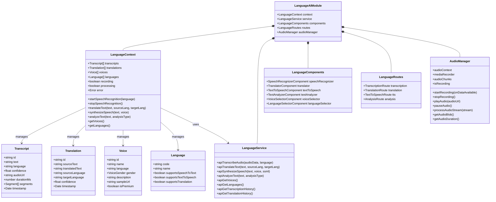
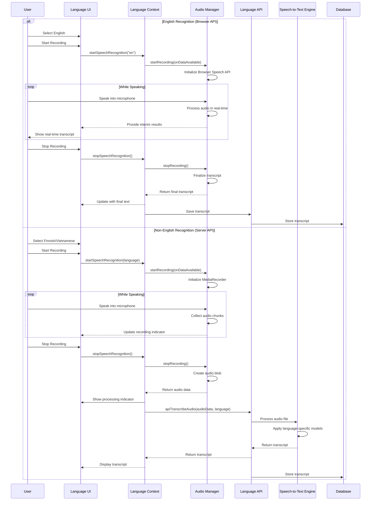
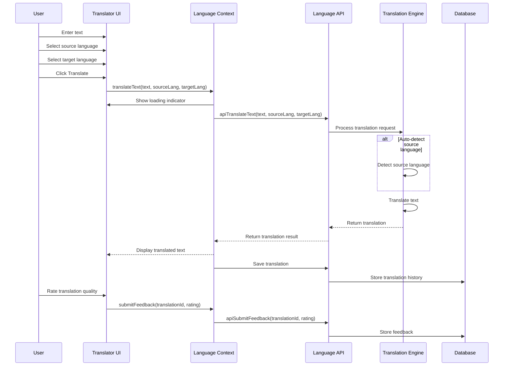

---
sidebar_position: 8
sidebar_label: "Language AI"
---

# Language AI

## Language AI Architecture and Workflows

### Language AI System Architecture



### Language AI Workflow

This diagram illustrates the Language AI processing flow, including speech recognition, natural language processing, and text-to-speech conversion, with different paths for English and other languages.

```mermaid
flowchart TD
    %% Define node styles with colors
    classDef userAction fill:#4a6cf7,stroke:#2a4cd7,color:white,stroke-width:2px
    classDef uiComponent fill:#6c757d,stroke:#495057,color:white,stroke-width:2px
    classDef apiCall fill:#28a745,stroke:#1e7e34,color:white,stroke-width:2px
    classDef decision fill:#ffc107,stroke:#d39e00,color:#212529,stroke-width:2px
    classDef dataStore fill:#17a2b8,stroke:#117a8b,color:white,stroke-width:2px
    classDef aiProcess fill:#9c27b0,stroke:#7b1fa2,color:white,stroke-width:2px
    classDef websocket fill:#e83e8c,stroke:#d6336c,color:white,stroke-width:2px
    classDef error fill:#dc3545,stroke:#bd2130,color:white,stroke-width:2px
    classDef browserAPI fill:#fd7e14,stroke:#dc6502,color:white,stroke-width:2px

    %% Main flow entry points
    Start([User interacts with Language AI]):::userAction --> InputType{Input Type}:::decision

    %% Speech Recognition flow - Language selection
    InputType -->|Voice| LanguageSelect{Language Selection}:::decision

    %% English flow - Browser Web API (Real-time)
    LanguageSelect -->|English| StartBrowserAPI[Start Browser Speech API]:::browserAPI
    StartBrowserAPI --> CaptureAudioStream[Capture Audio Stream]:::browserAPI
    CaptureAudioStream --> RealtimeProcessing[Real-time Processing]:::browserAPI
    RealtimeProcessing --> IntermediateText[Generate Intermediate Text]:::browserAPI
    IntermediateText --> DisplayRealtimeEnglish[Display Real-time Text]:::uiComponent

    RealtimeProcessing --> FinalEnglishText[Generate Final Text]:::browserAPI
    FinalEnglishText --> EnglishPunctuation[Add Punctuation & Formatting]:::browserAPI
    EnglishPunctuation --> EnglishComplete[Complete English Transcript]:::browserAPI
    EnglishComplete --> SendEnglishToNLP[Send to NLP Pipeline]:::apiCall

    %% Other languages flow (Finnish, Vietnamese) - Record then Convert
    LanguageSelect -->|Finnish/Vietnamese| StartRecording[Start Voice Recording]:::uiComponent
    StartRecording --> RecordFullAudio[Record Complete Audio]:::uiComponent
    RecordFullAudio --> FinishRecording[Finish Recording]:::userAction
    FinishRecording --> ProcessingIndicator[Show Processing Indicator]:::uiComponent
    ProcessingIndicator --> SendToServer[Send Audio to Server]:::apiCall

    SendToServer --> ServerSpeechRecognition[Server Speech Recognition]:::aiProcess
    ServerSpeechRecognition --> LanguageSpecificProcessing[Language-Specific Processing]:::aiProcess
    LanguageSpecificProcessing --> NoiseReduction[Noise Reduction]:::aiProcess
    NoiseReduction --> TranscriptionEngine[Transcription Engine]:::aiProcess

    TranscriptionEngine --> NonEnglishTranscript[Generate Non-English Transcript]:::aiProcess
    NonEnglishTranscript --> AddPunctuation[Add Punctuation & Formatting]:::aiProcess
    AddPunctuation --> TranscriptComplete[Complete Transcript]:::aiProcess
    TranscriptComplete --> DisplayNonEnglishText[Display Complete Text]:::uiComponent
    TranscriptComplete --> SendToNLP[Send to NLP Pipeline]:::apiCall

    %% Text Input flow
    InputType -->|Text| TextEntry[Text Entry Interface]:::uiComponent
    TextEntry --> ValidateText[Validate Text Input]:::uiComponent
    ValidateText --> SendToNLP

    %% NLP Processing flow - Common for all languages
    SendToNLP & SendEnglishToNLP --> LanguageDetection[Language Detection]:::aiProcess
    LanguageDetection --> ProcessingType{Processing Type}:::decision

    ProcessingType -->|Understanding| NLU[Natural Language Understanding]:::aiProcess
    NLU --> IntentRecognition[Intent Recognition]:::aiProcess
    NLU --> EntityExtraction[Entity Extraction]:::aiProcess
    IntentRecognition & EntityExtraction --> ContextAnalysis[Context Analysis]:::aiProcess

    ProcessingType -->|Sentiment| SentimentAnalysis[Sentiment Analysis]:::aiProcess
    SentimentAnalysis --> EmotionDetection[Emotion Detection]:::aiProcess
    EmotionDetection --> ToneIdentification[Tone Identification]:::aiProcess

    ProcessingType -->|Translation| SourceLanguage[Identify Source Language]:::aiProcess
    SourceLanguage --> TranslationEngine[Translation Engine]:::aiProcess
    TranslationEngine --> TargetLanguage[Generate Target Language]:::aiProcess

    ProcessingType -->|Summarization| TextAnalysis[Text Analysis]:::aiProcess
    TextAnalysis --> KeyPointExtraction[Key Point Extraction]:::aiProcess
    KeyPointExtraction --> SummaryGeneration[Summary Generation]:::aiProcess

    %% Results processing
    ContextAnalysis & ToneIdentification & TargetLanguage & SummaryGeneration --> ProcessResults[Process Results]:::aiProcess
    ProcessResults --> StoreResults[Store in Database]:::dataStore
    ProcessResults --> OutputType{Output Type}:::decision

    %% Text output flow
    OutputType -->|Text| FormatTextOutput[Format Text Output]:::aiProcess
    FormatTextOutput --> DisplayResults[Display Results]:::uiComponent

    %% Speech output flow
    OutputType -->|Speech| TextToSpeech[Text-to-Speech Engine]:::aiProcess
    TextToSpeech --> VoiceSelection[Voice Selection]:::aiProcess
    VoiceSelection --> SSMLProcessing[SSML Processing]:::aiProcess
    SSMLProcessing --> AudioGeneration[Generate Audio]:::aiProcess
    AudioGeneration --> StreamAudioOutput[Stream Audio to Client]:::websocket
    StreamAudioOutput --> PlayAudio[Play Audio Response]:::uiComponent

    %% Integration points
    DisplayResults & PlayAudio --> IntegrationPoint{Integration Point}:::decision
    IntegrationPoint -->|Chat| ChatSystem[Chat System]:::uiComponent
    IntegrationPoint -->|Meeting| MeetingNotes[Meeting Transcription]:::uiComponent
    IntegrationPoint -->|Command| SystemCommand[Execute System Command]:::apiCall
    IntegrationPoint -->|Content| ContentAssistance[Content Creation]:::uiComponent

    %% Error handling
    ServerSpeechRecognition & TranscriptionEngine & NLU & TranslationEngine & TextToSpeech --> ErrorCheck{Error?}:::decision
    ErrorCheck -->|Yes| ErrorHandling[Error Handling]:::error
    ErrorHandling --> RetryProcess[Retry Process]:::apiCall
    ErrorHandling --> NotifyUser[Notify User]:::uiComponent
    ErrorCheck -->|No| ContinueProcess[Continue Process]:::aiProcess
```



### Speech Recognition Sequence



### Translation Sequence



## User Interface Components

### Language AI Interface Architecture

```mermaid
flowchart TD
    A[LanguageAIPage] --> B[LanguageNavigation]
    A --> C[LanguageContent]

    B --> D[SpeechRecognitionTab]
    B --> E[TranslationTab]
    B --> F[TextToSpeechTab]
    B --> G[TextAnalysisTab]

    C --> H[SpeechRecognitionView]
    C --> I[TranslationView]
    C --> J[TextToSpeechView]
    C --> K[TextAnalysisView]

    H --> L[LanguageSelector]
    H --> M[RecordingControls]
    H --> N[TranscriptDisplay]
    H --> O[TranscriptHistory]

    M --> P[RecordButton]
    M --> Q[StopButton]
    M --> R[RecordingIndicator]

    I --> S[SourceLanguageSelector]
    I --> T[TargetLanguageSelector]
    I --> U[SourceTextArea]
    I --> V[TranslateButton]
    I --> W[TranslatedTextArea]

    J --> X[TextInput]
    J --> Y[VoiceSelector]
    J --> Z[SSMLEditor]
    J --> AA[SynthesizeButton]
    J --> AB[AudioPlayer]

    K --> AC[AnalysisTextArea]
    K --> AD[AnalysisTypeSelector]
    K --> AE[AnalyzeButton]
    K --> AF[AnalysisResults]

    style A fill:#4CAF50,stroke:#333,stroke-width:1px,color:#fff
    style B,C fill:#FF9800,stroke:#333,stroke-width:1px,color:#fff
    style D,E,F,G,H,I,J,K fill:#2196F3,stroke:#333,stroke-width:1px,color:#fff
    style L,M,N,O,S,T,U,V,W,X,Y,Z,AA,AB,AC,AD,AE,AF fill:#9C27B0,stroke:#333,stroke-width:1px,color:#fff
    style P,Q,R fill:#F44336,stroke:#333,stroke-width:1px,color:#fff
```



| Component                 | Description                | Features                                                   |
| ------------------------- | -------------------------- | ---------------------------------------------------------- |
| **SpeechRecognitionView** | Voice-to-text interface    | Language selection, recording controls, transcript display |
| **TranslationView**       | Text translation interface | Source/target language selection, text input/output areas  |
| **TextToSpeechView**      | Text-to-voice interface    | Text input, voice selection, SSML editing, audio playback  |
| **TextAnalysisView**      | Text analysis interface    | Text input, analysis type selection, results visualization |
| **RecordingControls**     | Audio capture controls     | Record, pause, stop buttons with visual feedback           |
| **TranscriptDisplay**     | Speech recognition output  | Real-time updates, formatting, editing capabilities        |
| **VoiceSelector**         | TTS voice chooser          | Voice samples, language filtering, gender selection        |
| **AnalysisResults**       | NLP output display         | Sentiment visualization, entity highlighting, summaries    |

## Component Implementations

### Language Context Provider

```typescript
import React, { createContext, useContext, useReducer, useEffect } from "react";
import { LanguageService } from "../services/LanguageService";
import { AudioManager } from "../services/AudioManager";

// Define the context state type
interface LanguageState {
  transcripts: Transcript[];
  translations: Translation[];
  voices: Voice[];
  languages: Language[];
  currentTranscript: Transcript | null;
  currentTranslation: Translation | null;
  recording: boolean;
  processing: boolean;
  error: string | null;
}

// Define the context value type
interface LanguageContextValue {
  state: LanguageState;
  startSpeechRecognition: (language: string) => Promise<void>;
  stopSpeechRecognition: () => Promise<Transcript>;
  translateText: (
    text: string,
    sourceLang: string,
    targetLang: string
  ) => Promise<Translation>;
  synthesizeSpeech: (
    text: string,
    voiceId: string,
    ssml?: boolean
  ) => Promise<string>;
  analyzeText: (text: string, analysisType: string) => Promise<any>;
  getVoices: () => Promise<Voice[]>;
  getLanguages: () => Promise<Language[]>;
  getTranscriptionHistory: () => Promise<Transcript[]>;
  getTranslationHistory: () => Promise<Translation[]>;
}

// Create the context
const LanguageContext = createContext<LanguageContextValue | undefined>(
  undefined
);

// Initial state
const initialState: LanguageState = {
  transcripts: [],
  translations: [],
  voices: [],
  languages: [],
  currentTranscript: null,
  currentTranslation: null,
  recording: false,
  processing: false,
  error: null,
};

// Reducer function
function languageReducer(state: LanguageState, action: any): LanguageState {
  switch (action.type) {
    case "SET_RECORDING":
      return { ...state, recording: action.payload };
    case "SET_PROCESSING":
      return { ...state, processing: action.payload };
    case "SET_ERROR":
      return { ...state, error: action.payload };
    case "SET_VOICES":
      return { ...state, voices: action.payload };
    case "SET_LANGUAGES":
      return { ...state, languages: action.payload };
    case "SET_TRANSCRIPTS":
      return { ...state, transcripts: action.payload };
    case "SET_TRANSLATIONS":
      return { ...state, translations: action.payload };
    case "SET_CURRENT_TRANSCRIPT":
      return { ...state, currentTranscript: action.payload };
    case "SET_CURRENT_TRANSLATION":
      return { ...state, currentTranslation: action.payload };
    case "ADD_TRANSCRIPT":
      return {
        ...state,
        transcripts: [action.payload, ...state.transcripts],
        currentTranscript: action.payload,
      };
    case "ADD_TRANSLATION":
      return {
        ...state,
        translations: [action.payload, ...state.translations],
        currentTranslation: action.payload,
      };
    default:
      return state;
  }
}

// Provider component
export const LanguageProvider: React.FC<{ children: React.ReactNode }> = ({
  children,
}) => {
  const [state, dispatch] = useReducer(languageReducer, initialState);
  const languageService = new LanguageService();
  const audioManager = new AudioManager();

  // Initialize by loading voices and languages
  useEffect(() => {
    getVoices();
    getLanguages();
  }, []);

  // Speech recognition - start recording
  const startSpeechRecognition = async (language: string) => {
    try {
      dispatch({ type: "SET_RECORDING", payload: true });
      dispatch({ type: "SET_ERROR", payload: null });

      // For English, use browser's Speech Recognition API
      if (language === "en") {
        await audioManager.startBrowserSpeechRecognition(
          (interimTranscript) => {
            // Update UI with interim results
            if (state.currentTranscript) {
              dispatch({
                type: "SET_CURRENT_TRANSCRIPT",
                payload: {
                  ...state.currentTranscript,
                  text: interimTranscript,
                },
              });
            } else {
              dispatch({
                type: "SET_CURRENT_TRANSCRIPT",
                payload: {
                  id: "interim",
                  text: interimTranscript,
                  language: "en",
                  confidence: 0,
                  timestamp: new Date(),
                },
              });
            }
          },
          (finalTranscript) => {
            // Handle final transcript
            const transcript: Transcript = {
              id: `local-${Date.now()}`,
              text: finalTranscript,
              language: "en",
              confidence: 0.9, // Browser API doesn't provide confidence scores
              timestamp: new Date(),
            };

            dispatch({ type: "ADD_TRANSCRIPT", payload: transcript });
            dispatch({ type: "SET_RECORDING", payload: false });

            // Save transcript to server
            languageService
              .apiSaveTranscript(transcript)
              .then((savedTranscript) => {
                dispatch({
                  type: "SET_CURRENT_TRANSCRIPT",
                  payload: savedTranscript,
                });
              })
              .catch((error) => {
                console.error("Failed to save transcript", error);
              });
          }
        );
      } else {
        // For other languages, use MediaRecorder API to capture audio
        await audioManager.startRecording();
      }
    } catch (error) {
      dispatch({ type: "SET_RECORDING", payload: false });
      dispatch({
        type: "SET_ERROR",
        payload: "Failed to start speech recognition",
      });
      console.error("Speech recognition error:", error);
    }
  };

  // Speech recognition - stop recording
  const stopSpeechRecognition = async (): Promise<Transcript> => {
    try {
      dispatch({ type: "SET_PROCESSING", payload: true });

      // For English, the browser API handles this via callback
      if (audioManager.isBrowserSpeechActive()) {
        audioManager.stopBrowserSpeechRecognition();
        dispatch({ type: "SET_RECORDING", payload: false });

        // Return the current transcript
        return state.currentTranscript as Transcript;
      }

      // For other languages, process the recorded audio
      const audioBlob = await audioManager.stopRecording();
      dispatch({ type: "SET_RECORDING", payload: false });

      // Create a temporary transcript while processing
      const tempTranscript: Transcript = {
        id: `temp-${Date.now()}`,
        text: "Processing audio...",
        language: audioManager.getRecordingLanguage() || "unknown",
        confidence: 0,
        audioUrl: URL.createObjectURL(audioBlob),
        durationMs: audioManager.getAudioDuration(),
        timestamp: new Date(),
      };

      dispatch({ type: "SET_CURRENT_TRANSCRIPT", payload: tempTranscript });

      // Send audio to server for transcription
      const formData = new FormData();
      formData.append("audio", audioBlob);
      formData.append(
        "language",
        audioManager.getRecordingLanguage() || "auto"
      );

      const transcript = await languageService.apiTranscribeAudio(formData);
      dispatch({ type: "ADD_TRANSCRIPT", payload: transcript });
      dispatch({ type: "SET_PROCESSING", payload: false });

      return transcript;
    } catch (error) {
      dispatch({ type: "SET_PROCESSING", payload: false });
      dispatch({ type: "SET_ERROR", payload: "Failed to process speech" });
      console.error("Speech processing error:", error);
      throw error;
    }
  };

  // Text translation
  const translateText = async (
    text: string,
    sourceLang: string,
    targetLang: string
  ): Promise<Translation> => {
    try {
      dispatch({ type: "SET_PROCESSING", payload: true });
      dispatch({ type: "SET_ERROR", payload: null });

      const translation = await languageService.apiTranslateText(
        text,
        sourceLang,
        targetLang
      );
      dispatch({ type: "ADD_TRANSLATION", payload: translation });
      dispatch({ type: "SET_PROCESSING", payload: false });

      return translation;
    } catch (error) {
      dispatch({ type: "SET_PROCESSING", payload: false });
      dispatch({ type: "SET_ERROR", payload: "Failed to translate text" });
      console.error("Translation error:", error);
      throw error;
    }
  };

  // Text-to-speech synthesis
  const synthesizeSpeech = async (
    text: string,
    voiceId: string,
    ssml: boolean = false
  ): Promise<string> => {
    try {
      dispatch({ type: "SET_PROCESSING", payload: true });
      dispatch({ type: "SET_ERROR", payload: null });

      const audioUrl = await languageService.apiSynthesizeSpeech(
        text,
        voiceId,
        ssml
      );
      dispatch({ type: "SET_PROCESSING", payload: false });

      return audioUrl;
    } catch (error) {
      dispatch({ type: "SET_PROCESSING", payload: false });
      dispatch({ type: "SET_ERROR", payload: "Failed to synthesize speech" });
      console.error("Speech synthesis error:", error);
      throw error;
    }
  };

  // Text analysis
  const analyzeText = async (
    text: string,
    analysisType: string
  ): Promise<any> => {
    try {
      dispatch({ type: "SET_PROCESSING", payload: true });
      dispatch({ type: "SET_ERROR", payload: null });

      const result = await languageService.apiAnalyzeText(text, analysisType);
      dispatch({ type: "SET_PROCESSING", payload: false });

      return result;
    } catch (error) {
      dispatch({ type: "SET_PROCESSING", payload: false });
      dispatch({ type: "SET_ERROR", payload: "Failed to analyze text" });
      console.error("Text analysis error:", error);
      throw error;
    }
  };

  // Get available voices
  const getVoices = async (): Promise<Voice[]> => {
    try {
      const voices = await languageService.apiGetVoices();
      dispatch({ type: "SET_VOICES", payload: voices });
      return voices;
    } catch (error) {
      dispatch({ type: "SET_ERROR", payload: "Failed to fetch voices" });
      console.error("Voice fetching error:", error);
      return [];
    }
  };

  // Get supported languages
  const getLanguages = async (): Promise<Language[]> => {
    try {
      const languages = await languageService.apiGetLanguages();
      dispatch({ type: "SET_LANGUAGES", payload: languages });
      return languages;
    } catch (error) {
      dispatch({ type: "SET_ERROR", payload: "Failed to fetch languages" });
      console.error("Language fetching error:", error);
      return [];
    }
  };

  // Get transcription history
  const getTranscriptionHistory = async (): Promise<Transcript[]> => {
    try {
      const transcripts = await languageService.apiGetTranscriptionHistory();
      dispatch({ type: "SET_TRANSCRIPTS", payload: transcripts });
      return transcripts;
    } catch (error) {
      dispatch({
        type: "SET_ERROR",
        payload: "Failed to fetch transcription history",
      });
      console.error("Transcription history error:", error);
      return [];
    }
  };

  // Get translation history
  const getTranslationHistory = async (): Promise<Translation[]> => {
    try {
      const translations = await languageService.apiGetTranslationHistory();
      dispatch({ type: "SET_TRANSLATIONS", payload: translations });
      return translations;
    } catch (error) {
      dispatch({
        type: "SET_ERROR",
        payload: "Failed to fetch translation history",
      });
      console.error("Translation history error:", error);
      return [];
    }
  };

  // Context value
  const value = {
    state,
    startSpeechRecognition,
    stopSpeechRecognition,
    translateText,
    synthesizeSpeech,
    analyzeText,
    getVoices,
    getLanguages,
    getTranscriptionHistory,
    getTranslationHistory,
  };

  return (
    <LanguageContext.Provider value={value}>
      {children}
    </LanguageContext.Provider>
  );
};

// Custom hook for using the language context
export const useLanguage = () => {
  const context = useContext(LanguageContext);
  if (context === undefined) {
    throw new Error("useLanguage must be used within a LanguageProvider");
  }
  return context;
};
```

### Speech Recognition Component

```typescript
import React, { useState, useEffect } from "react";
import { useLanguage } from "../contexts/LanguageContext";
import { Button } from "../ui/Button";
import { Select } from "../ui/Select";
import { Spinner } from "../ui/Spinner";
import { TranscriptDisplay } from "./TranscriptDisplay";
import { TranscriptHistory } from "./TranscriptHistory";
import { MicrophoneIcon, StopIcon } from "../icons";

export const SpeechRecognizer: React.FC = () => {
  const {
    state,
    startSpeechRecognition,
    stopSpeechRecognition,
    getLanguages,
    getTranscriptionHistory,
  } = useLanguage();

  const { languages, recording, processing, currentTranscript, transcripts } =
    state;

  const [selectedLanguage, setSelectedLanguage] = useState("en");
  const [recordingTime, setRecordingTime] = useState(0);
  const [timer, setTimer] = useState<NodeJS.Timeout | null>(null);

  // Load languages and transcription history on mount
  useEffect(() => {
    getLanguages();
    getTranscriptionHistory();
  }, []);

  // Handle recording timer
  useEffect(() => {
    if (recording) {
      const interval = setInterval(() => {
        setRecordingTime((prev) => prev + 1);
      }, 1000);
      setTimer(interval);
    } else {
      if (timer) {
        clearInterval(timer);
        setTimer(null);
      }
      setRecordingTime(0);
    }

    return () => {
      if (timer) {
        clearInterval(timer);
      }
    };
  }, [recording]);

  // Format recording time as MM:SS
  const formatTime = (seconds: number): string => {
    const mins = Math.floor(seconds / 60);
    const secs = seconds % 60;
    return `${mins.toString().padStart(2, "0")}:${secs
      .toString()
      .padStart(2, "0")}`;
  };

  // Handle language change
  const handleLanguageChange = (e: React.ChangeEvent<HTMLSelectElement>) => {
    setSelectedLanguage(e.target.value);
  };

  // Start recording
  const handleStartRecording = async () => {
    try {
      await startSpeechRecognition(selectedLanguage);
    } catch (error) {
      console.error("Failed to start recording", error);
    }
  };

  // Stop recording
  const handleStopRecording = async () => {
    try {
      await stopSpeechRecognition();
    } catch (error) {
      console.error("Failed to stop recording", error);
    }
  };

  // Filter languages that support speech-to-text
  const sttLanguages = languages.filter((lang) => lang.supportsSpeechToText);

  return (
    <div className="speech-recognizer">
      <div className="controls-container bg-white p-4 rounded-lg shadow-sm mb-4">
        <div className="flex items-center mb-4">
          <div className="language-selector flex-grow mr-4">
            <label className="block text-sm font-medium text-gray-700 mb-1">
              Language
            </label>
            <Select
              value={selectedLanguage}
              onChange={handleLanguageChange}
              disabled={recording || processing}
              className="w-full"
            >
              {sttLanguages.map((language) => (
                <option key={language.code} value={language.code}>
                  {language.name}
                </option>
              ))}
            </Select>
          </div>

          <div className="recording-controls flex items-center">
            {!recording ? (
              <Button
                onClick={handleStartRecording}
                disabled={processing}
                variant="primary"
                size="lg"
                className="flex items-center"
              >
                <MicrophoneIcon className="mr-2" />
                Start Recording
              </Button>
            ) : (
              <Button
                onClick={handleStopRecording}
                variant="danger"
                size="lg"
                className="flex items-center"
              >
                <StopIcon className="mr-2" />
                Stop Recording
              </Button>
            )}
          </div>
        </div>

        {recording && (
          <div className="recording-indicator flex items-center justify-center p-2 bg-red-50 rounded-md">
            <div className="pulse-dot bg-red-500 h-3 w-3 rounded-full mr-2"></div>
            <span className="text-red-700 font-medium">Recording</span>
            <span className="ml-2 text-gray-600">
              {formatTime(recordingTime)}
            </span>
          </div>
        )}

        {processing && (
          <div className="processing-indicator flex items-center justify-center p-2 bg-blue-50 rounded-md">
            <Spinner size="sm" className="mr-2" />
            <span className="text-blue-700 font-medium">
              Processing audio...
            </span>
          </div>
        )}
      </div>

      <div className="transcript-container bg-white p-4 rounded-lg shadow-sm mb-4">
        <h2 className="text-lg font-medium mb-2">Transcript</h2>
        {currentTranscript ? (
          <TranscriptDisplay transcript={currentTranscript} />
        ) : (
          <div className="empty-state text-center p-8 text-gray-500">
            <p>No transcript yet. Start recording to transcribe speech.</p>
          </div>
        )}
      </div>

      {transcripts.length > 0 && (
        <div className="history-container bg-white p-4 rounded-lg shadow-sm">
          <h2 className="text-lg font-medium mb-2">Recent Transcripts</h2>
          <TranscriptHistory transcripts={transcripts} />
        </div>
      )}
    </div>
  );
};
```

### Translation Component

```typescript
import React, { useState, useEffect } from "react";
import { useLanguage } from "../contexts/LanguageContext";
import { Button } from "../ui/Button";
import { Select } from "../ui/Select";
import { Textarea } from "../ui/Textarea";
import { Spinner } from "../ui/Spinner";
import { TranslationHistory } from "./TranslationHistory";
import { SwapIcon, TranslateIcon, CopyIcon } from "../icons";

export const Translator: React.FC = () => {
  const { state, translateText, getLanguages, getTranslationHistory } =
    useLanguage();

  const { languages, processing, currentTranslation, translations } = state;

  const [sourceText, setSourceText] = useState("");
  const [sourceLanguage, setSourceLanguage] = useState("en");
  const [targetLanguage, setTargetLanguage] = useState("fi");
  const [translatedText, setTranslatedText] = useState("");
  const [copySuccess, setCopySuccess] = useState(false);

  // Load languages and translation history on mount
  useEffect(() => {
    getLanguages();
    getTranslationHistory();
  }, []);

  // Update translated text when current translation changes
  useEffect(() => {
    if (currentTranslation) {
      setTranslatedText(currentTranslation.translatedText);
    }
  }, [currentTranslation]);

  // Handle source language change
  const handleSourceLanguageChange = (
    e: React.ChangeEvent<HTMLSelectElement>
  ) => {
    setSourceLanguage(e.target.value);
  };

  // Handle target language change
  const handleTargetLanguageChange = (
    e: React.ChangeEvent<HTMLSelectElement>
  ) => {
    setTargetLanguage(e.target.value);
  };

  // Swap languages
  const handleSwapLanguages = () => {
    const temp = sourceLanguage;
    setSourceLanguage(targetLanguage);
    setTargetLanguage(temp);

    // Also swap text if there's a translation
    if (translatedText) {
      setSourceText(translatedText);
      setTranslatedText("");
    }
  };

  // Handle translation
  const handleTranslate = async () => {
    if (!sourceText.trim()) return;

    try {
      const translation = await translateText(
        sourceText,
        sourceLanguage,
        targetLanguage
      );
      setTranslatedText(translation.translatedText);
    } catch (error) {
      console.error("Translation failed", error);
    }
  };

  // Copy translated text to clipboard
  const handleCopyTranslation = () => {
    navigator.clipboard.writeText(translatedText);
    setCopySuccess(true);
    setTimeout(() => setCopySuccess(false), 2000);
  };

  // Filter languages that support translation
  const translationLanguages = languages.filter(
    (lang) => lang.supportsTranslation
  );

  return (
    <div className="translator">
      <div className="translation-container bg-white p-4 rounded-lg shadow-sm mb-4">
        <div className="language-selectors flex items-center mb-4">
          <div className="source-language flex-grow mr-2">
            <label className="block text-sm font-medium text-gray-700 mb-1">
              From
            </label>
            <Select
              value={sourceLanguage}
              onChange={handleSourceLanguageChange}
              disabled={processing}
              className="w-full"
            >
              {translationLanguages.map((language) => (
                <option key={language.code} value={language.code}>
                  {language.name}
                </option>
              ))}
            </Select>
          </div>

          <div className="swap-button flex items-center justify-center px-2">
            <Button
              onClick={handleSwapLanguages}
              variant="ghost"
              size="sm"
              disabled={processing}
              className="rounded-full p-2"
              title="Swap languages"
            >
              <SwapIcon />
            </Button>
          </div>

          <div className="target-language flex-grow ml-2">
            <label className="block text-sm font-medium text-gray-700 mb-1">
              To
            </label>
            <Select
              value={targetLanguage}
              onChange={handleTargetLanguageChange}
              disabled={processing}
              className="w-full"
            >
              {translationLanguages.map((language) => (
                <option key={language.code} value={language.code}>
                  {language.name}
                </option>
              ))}
            </Select>
          </div>
        </div>

        <div className="translation-content">
          <div className="source-text mb-4">
            <label className="block text-sm font-medium text-gray-700 mb-1">
              Source Text
            </label>
            <Textarea
              value={sourceText}
              onChange={(e) => setSourceText(e.target.value)}
              placeholder="Enter text to translate"
              rows={5}
              disabled={processing}
              className="w-full"
            />
          </div>

          <div className="translate-button-container flex justify-center mb-4">
            <Button
              onClick={handleTranslate}
              variant="primary"
              size="lg"
              disabled={!sourceText.trim() || processing}
              className="flex items-center"
            >
              {processing ? (
                <Spinner size="sm" className="mr-2" />
              ) : (
                <TranslateIcon className="mr-2" />
              )}
              Translate
            </Button>
          </div>

          <div className="translated-text">
            <div className="flex justify-between items-center mb-1">
              <label className="block text-sm font-medium text-gray-700">
                Translation
              </label>
              {translatedText && (
                <Button
                  onClick={handleCopyTranslation}
                  variant="ghost"
                  size="sm"
                  className="flex items-center text-gray-500 hover:text-gray-700"
                >
                  <CopyIcon className="mr-1" />
                  {copySuccess ? "Copied!" : "Copy"}
                </Button>
              )}
            </div>
            <div className="bg-gray-50 rounded-md p-3 min-h-[120px] border border-gray-200">
              {translatedText ? (
                <p className="whitespace-pre-wrap">{translatedText}</p>
              ) : (
                <p className="text-gray-400 italic">
                  Translation will appear here
                </p>
              )}
            </div>
          </div>
        </div>
      </div>

      {translations.length > 0 && (
        <div className="history-container bg-white p-4 rounded-lg shadow-sm">
          <h2 className="text-lg font-medium mb-2">Recent Translations</h2>
          <TranslationHistory translations={translations} />
        </div>
      )}
    </div>
  );
};
```

## Language AI Overview

TheEnterprise Nexus integrates advanced language AI capabilities to enable multilingual communication, content processing, and voice interaction.

## Speech Recognition

### Features

- **Real-time speech-to-text conversion**: Convert spoken language to text as you speak
- **Multiple language support**: English, Finnish, Vietnamese, and other languages
- **Speaker identification**: Distinguish between different speakers in conversations
- **Noise cancellation**: Filter out background noise for clearer transcriptions
- **Punctuation and formatting**: Automatically add punctuation and format text properly

### Implementation Approaches

- **Browser API for English**: Uses the Web Speech API for real-time English transcription
- **Server API for other languages**: Sends audio recordings to specialized language models
- **Hybrid approach**: Combines client and server processing for optimal performance
- **Streaming transcription**: Provides interim results during speech for immediate feedback

## Text-to-Speech

### Features

- **Natural-sounding voice synthesis**: Generate human-like speech from text
- **Multiple voices and languages**: Various voice options across supported languages
- **Adjustable speech parameters**: Control speed, pitch, and emphasis
- **SSML support**: Speech Synthesis Markup Language for advanced control
- **Voice customization**: Select voices that match content tone and purpose

### Voice Options

- **English voices**: Multiple accents (American, British, Australian) and gender options
- **Finnish voices**: Natural pronunciation of Finnish with proper intonation
- **Vietnamese voices**: Accurate tone reproduction for Vietnamese language
- **Specialized voices**: Voices optimized for different contexts (news, conversation, narration)

## Language Processing

### Natural Language Understanding

- **Intent recognition**: Identify the purpose behind text
- **Entity extraction**: Recognize names, dates, locations, and other entities
- **Context awareness**: Understand meaning based on surrounding content
- **Language detection**: Automatically identify the language of text

### Translation Capabilities

- **Neural machine translation**: Advanced models for accurate translations
- **Context preservation**: Maintain meaning across languages
- **Specialized domain handling**: Technical, medical, legal, and other specialized content
- **Terminology consistency**: Maintain consistent translations of key terms

### Text Analysis

- **Sentiment analysis**: Determine emotional tone of text
- **Emotion detection**: Identify specific emotions (joy, anger, sadness, etc.)
- **Key phrase extraction**: Identify important concepts and topics
- **Text summarization**: Generate concise summaries of longer content

## Integration Points

Language AI is deeply integrated with other system components:

### Chat System Integration

- **Voice messages**: Record and transcribe voice messages in chat
- **Message translation**: Translate messages between languages
- **Voice replies**: Convert text responses to speech
- **Multilingual support**: Enable conversations across language barriers

### Meeting Support

- **Real-time transcription**: Create live transcripts during meetings
- **Meeting notes**: Generate summaries and action items
- **Multi-speaker recognition**: Identify different participants
- **Translation for international meetings**: Bridge language gaps in global teams

### Accessibility Features

- **Voice navigation**: Control the application using voice commands
- **Text-to-speech reading**: Have content read aloud
- **Language simplification**: Simplify complex text for easier understanding
- **Alternative communication methods**: Support users with different abilities

### Content Creation

- **Dictation**: Create documents by speaking
- **Content translation**: Translate documents between languages
- **Style and tone analysis**: Analyze and adjust content tone
- **Grammar and spelling assistance**: Improve text quality automatically

## Technical Implementation

### Client-Side Processing

- **Web Speech API**: Browser-based speech recognition for English
- **MediaRecorder API**: Audio capture for non-English languages
- **Web Audio API**: Audio processing and visualization
- **WebSocket streaming**: Real-time communication for speech processing

### Server-Side Processing

- **Language-specific models**: Specialized models for each supported language
- **Neural network pipelines**: Deep learning for advanced language processing
- **Caching mechanisms**: Performance optimization for common operations
- **Batch processing**: Efficient handling of large content volumes

### Performance Optimizations

- **Progressive enhancement**: Graceful degradation based on device capabilities
- **Lazy loading**: Load language models only when needed
- **Compression**: Minimize data transfer for audio and text
- **Offline capabilities**: Basic functionality without internet connection

