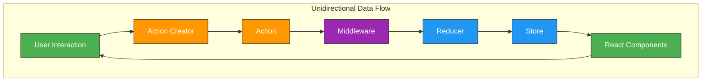
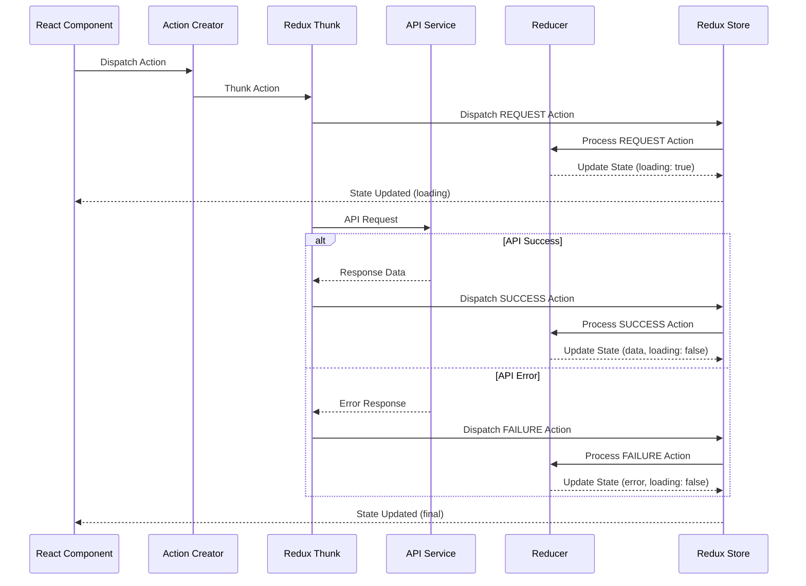
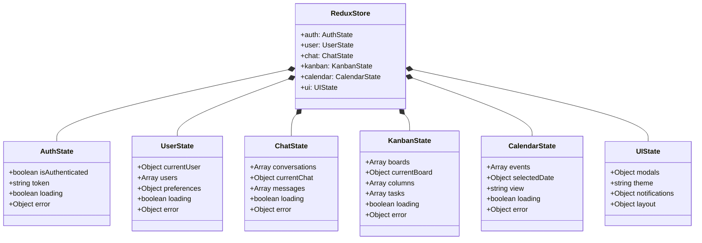
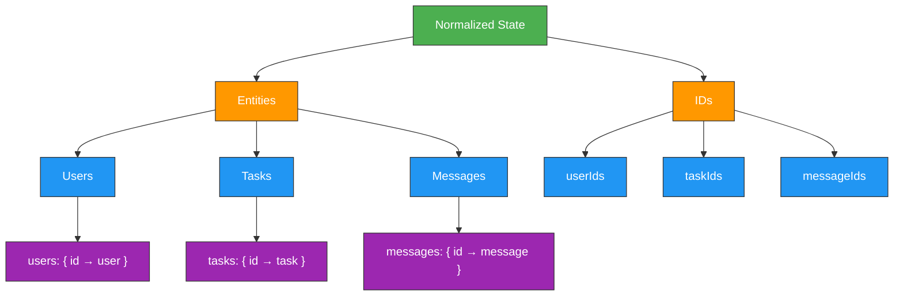
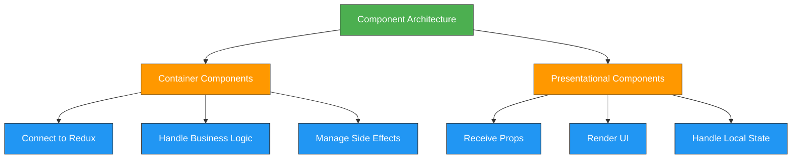

---
sidebar_position: 2
sidebar_label: "State Management"
---

# State Management

## State Management Architecture and Workflows

### Redux Data Flow



### Async Action Workflow



### State Slice Architecture



## State Management Overview

The Enterprise Nexus frontend implements a robust state management architecture using Redux, following industry best practices for scalable and maintainable application state. This architecture provides a centralized, predictable state container with a unidirectional data flow that enhances debugging capabilities and ensures consistent application behavior.

## Redux Architecture Components

The Redux architecture in Enterprise Nexus is built on five core components that work together to create a predictable state management system:

| Component      | Description                                                                          | Implementation                                                              |
| -------------- | ------------------------------------------------------------------------------------ | --------------------------------------------------------------------------- |
| **Store**      | Centralized state container that holds the complete application state tree           | Configured with middleware and enhancers for optimal performance            |
| **Actions**    | Plain JavaScript objects that represent events occurring in the application          | Follows Flux Standard Action (FSA) pattern with type and payload properties |
| **Reducers**   | Pure functions that specify how the application state changes in response to actions | Implemented using Redux Toolkit's `createSlice` for immutable updates       |
| **Selectors**  | Functions that extract and compute derived data from the store                       | Optimized with memoization to prevent unnecessary re-renders                |
| **Middleware** | Intercepts actions before they reach the reducers to handle side effects             | Configured for async operations, logging, and real-time communication       |

### Action Types Pattern

```typescript
// Action type constants follow a consistent pattern
export const ACTION_TYPES = {
  // Request/Success/Failure pattern for async operations
  FETCH_DATA_REQUEST: "data/fetchRequest",
  FETCH_DATA_SUCCESS: "data/fetchSuccess",
  FETCH_DATA_FAILURE: "data/fetchFailure",

  // Simple actions
  UPDATE_FIELD: "data/updateField",
  CLEAR_STATE: "data/clearState",
};
```

### Reducer Implementation

```typescript
// Slice implementation with Redux Toolkit
import { createSlice, PayloadAction } from "@reduxjs/toolkit";

const dataSlice = createSlice({
  name: "data",
  initialState: {
    items: [],
    loading: false,
    error: null,
  },
  reducers: {
    fetchRequest: (state) => {
      state.loading = true;
      state.error = null;
    },
    fetchSuccess: (state, action: PayloadAction<any[]>) => {
      state.items = action.payload;
      state.loading = false;
    },
    fetchFailure: (state, action: PayloadAction<Error>) => {
      state.error = action.payload;
      state.loading = false;
    },
  },
});
```

## State Structure and Organization

The Redux store is organized into domain-specific slices, each responsible for a distinct area of functionality. This modular approach enhances maintainability and allows for targeted performance optimizations.

### State Slices

| Slice        | Purpose                          | Key State Properties                                     |
| ------------ | -------------------------------- | -------------------------------------------------------- |
| **Auth**     | Manages authentication state     | `isAuthenticated`, `token`, `refreshToken`, `expiresAt`  |
| **User**     | Stores user data and preferences | `currentUser`, `profile`, `preferences`, `notifications` |
| **Chat**     | Handles chat functionality       | `conversations`, `messages`, `activeChat`, `unreadCount` |
| **Kanban**   | Manages task management          | `boards`, `columns`, `tasks`, `labels`, `filters`        |
| **Calendar** | Controls calendar functionality  | `events`, `view`, `selectedDate`, `reminders`            |
| **UI**       | Maintains UI-related state       | `theme`, `modals`, `sidebar`, `alerts`, `layout`         |

### Normalized State Shape



## Middleware Configuration

The application leverages several middleware packages to enhance Redux's capabilities:

| Middleware          | Purpose                                                | Configuration                                           |
| ------------------- | ------------------------------------------------------ | ------------------------------------------------------- |
| **Redux Thunk**     | Enables asynchronous action creators                   | Configured with extra argument for API services         |
| **Redux Logger**    | Provides detailed logging of actions and state changes | Enabled only in development environment                 |
| **Redux Persist**   | Persists and rehydrates store to local storage         | Configured with whitelist/blacklist for specific slices |
| **Redux WebSocket** | Manages real-time communication                        | Integrated with authentication for secure connections   |

### Middleware Setup

```typescript
import { configureStore } from "@reduxjs/toolkit";
import thunk from "redux-thunk";
import logger from "redux-logger";
import { persistStore, persistReducer } from "redux-persist";
import storage from "redux-persist/lib/storage";
import createSocketMiddleware from "./middleware/socket";
import rootReducer from "./reducers";
import api from "../services/api";

const persistConfig = {
  key: "root",
  storage,
  whitelist: ["auth", "user", "ui"],
};

const socketMiddleware = createSocketMiddleware();
const persistedReducer = persistReducer(persistConfig, rootReducer);

export const store = configureStore({
  reducer: persistedReducer,
  middleware: (getDefaultMiddleware) =>
    getDefaultMiddleware({
      serializableCheck: {
        ignoredActions: ["persist/PERSIST"],
      },
    })
      .concat(thunk.withExtraArgument(api))
      .concat(socketMiddleware)
      .concat(process.env.NODE_ENV === "development" ? logger : []),
});

export const persistor = persistStore(store);
```

## Performance Optimization Strategies

The Enterprise Nexus frontend implements several advanced performance optimization techniques to ensure efficient state management:

| Technique                  | Implementation                                   | Benefit                                                            |
| -------------------------- | ------------------------------------------------ | ------------------------------------------------------------------ |
| **Normalized State Shape** | Entities stored in lookup tables with references | Reduces data duplication and improves update efficiency            |
| **Memoized Selectors**     | Implemented with Reselect library                | Prevents unnecessary recalculations and re-renders                 |
| **Optimistic Updates**     | Immediate UI updates before API confirmation     | Enhances perceived performance and responsiveness                  |
| **Lazy Loading State**     | Dynamic imports with code splitting              | Reduces initial bundle size and improves load time                 |
| **Debounced Actions**      | Throttling for high-frequency events             | Prevents excessive dispatches for performance-intensive operations |

### Selector Optimization Example

```typescript
import { createSelector } from "@reduxjs/toolkit";

// Base selectors
const selectTasksEntities = (state) => state.tasks.entities;
const selectTaskIds = (state) => state.tasks.ids;
const selectCurrentFilter = (state) => state.tasks.filter;

// Memoized selector for filtered tasks
export const selectFilteredTasks = createSelector(
  [selectTasksEntities, selectTaskIds, selectCurrentFilter],
  (tasksEntities, taskIds, filter) => {
    return taskIds
      .map((id) => tasksEntities[id])
      .filter((task) => {
        if (filter === "all") return true;
        if (filter === "completed") return task.completed;
        if (filter === "active") return !task.completed;
        return true;
      });
  }
);
```

## Advanced State Management Patterns

The application implements several architectural patterns to enhance maintainability and performance:

### Component State Management Patterns



| Pattern                      | Implementation                                            | Use Case                                               |
| ---------------------------- | --------------------------------------------------------- | ------------------------------------------------------ |
| **Container/Presentational** | Separation of data fetching and presentation              | Complex components with significant business logic     |
| **Redux Hooks**              | `useSelector` and `useDispatch` for functional components | Modern React components with Redux integration         |
| **Action Creators**          | Factory functions that create action objects              | Complex actions with payload transformations           |
| **Selector Composition**     | Building complex selectors from simpler ones              | Derived data that depends on multiple state slices     |
| **State Machines**           | Finite state machines for complex UI flows                | Multi-step forms, wizards, and complex UI interactions |

### Redux Hooks Implementation

```typescript
import React from "react";
import { useSelector, useDispatch } from "react-redux";
import { selectFilteredTasks } from "../selectors/taskSelectors";
import { fetchTasks, toggleTask } from "../actions/taskActions";

const TaskList = () => {
  const dispatch = useDispatch();
  const tasks = useSelector(selectFilteredTasks);
  const loading = useSelector((state) => state.tasks.loading);

  React.useEffect(() => {
    dispatch(fetchTasks());
  }, [dispatch]);

  const handleToggle = (taskId) => {
    dispatch(toggleTask(taskId));
  };

  if (loading) return <div>Loading tasks...</div>;

  return (
    <ul>
      {tasks.map((task) => (
        <li key={task.id} onClick={() => handleToggle(task.id)}>
          {task.completed ? "✓" : "○"} {task.title}
        </li>
      ))}
    </ul>
  );
};
```

