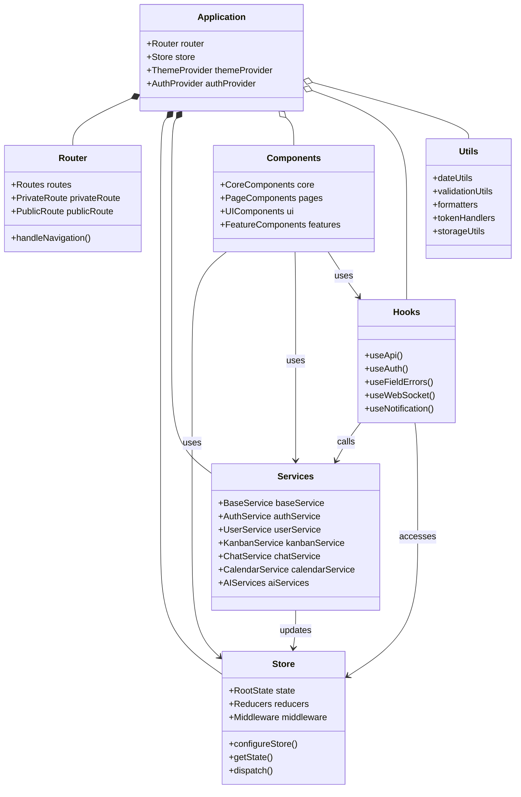
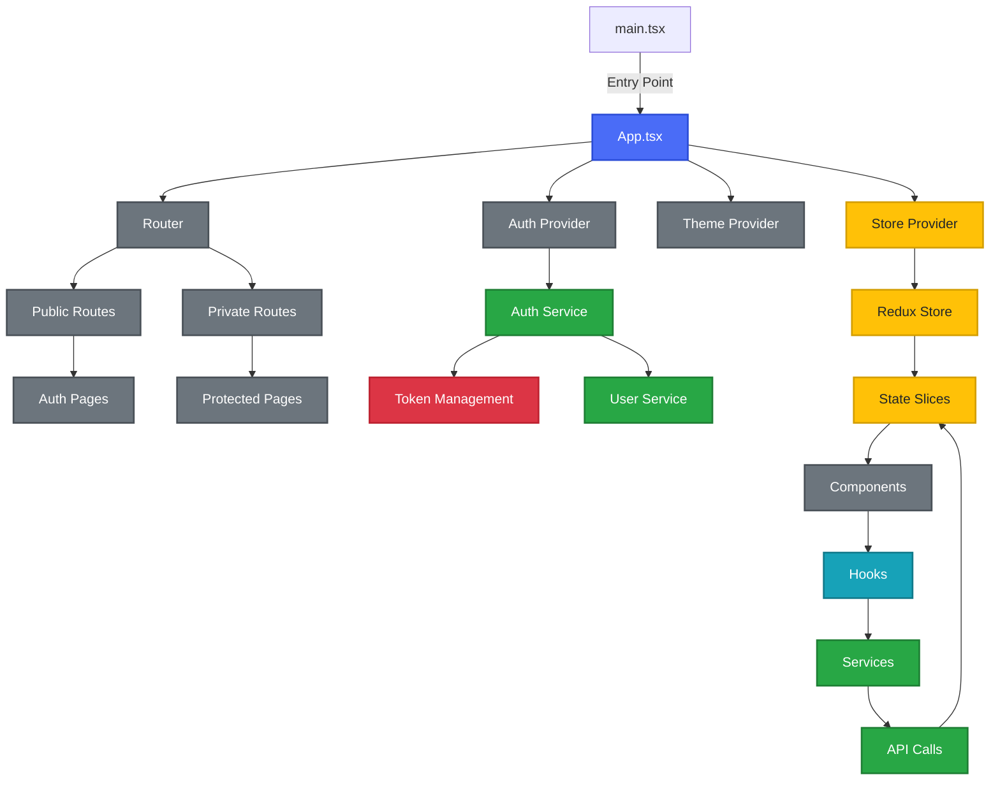
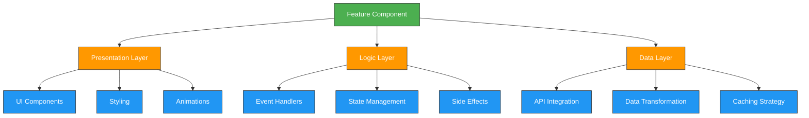
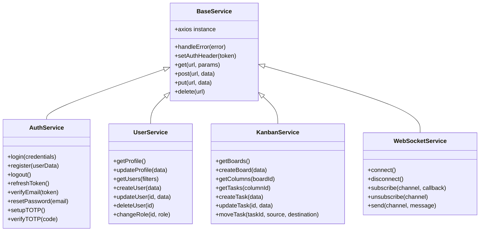
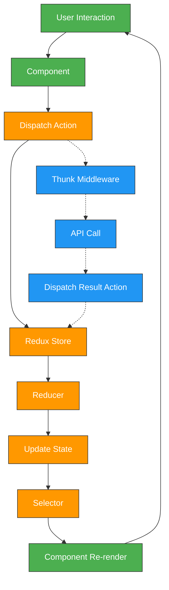
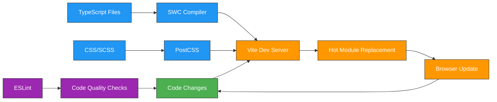

import PanzoomWrapper from '@site/src/components/MermaidDiagram/PanzoomWrapper';

# Frontend Project Structure

## Overview

The frontend component of the Enterprise Nexus project is located in the `study/typescript-react` directory and is built with React, TypeScript, and Redux Toolkit. The application follows a modern component-based architecture with a focus on type safety, reusability, and maintainability.

## Architecture Diagram

<PanzoomWrapper>
<div id="architecture-diagram" >



</div>
</PanzoomWrapper>

## Main Directory Structure

```
study/typescript-react/
├── public/                # Static assets and HTML template
├── src/
│   ├── assets/            # Static assets (images, fonts, etc.)
│   ├── components/        # Reusable UI components
│   │   ├── AssistantAI.tsx        # AI assistant component
│   │   ├── ColumnKanban.tsx       # Kanban column component
│   │   ├── EmailOtpAuthComponent.tsx # Email OTP authentication
│   │   ├── HeaderCustom.tsx       # Application header
│   │   ├── LanguageAIComponent.tsx # Language AI interface
│   │   ├── Sidebar.tsx            # Navigation sidebar
│   │   ├── TaskCardKanban.tsx     # Kanban task card
│   │   ├── TotpAuthComponent.tsx  # TOTP authentication
│   │   └── ...                    # Other components
│   ├── hooks/             # Custom React hooks
│   │   ├── useApi.ts      # API interaction hook
│   │   └── useFieldErrors.ts # Form validation hook
│   ├── pages/             # Page components
│   │   ├── AdminDashBoardPage.tsx # Admin dashboard
│   │   ├── AssistantAIPage.tsx    # AI assistant page
│   │   ├── AuthPage.tsx           # Authentication page
│   │   ├── CalendarPage.tsx       # Calendar page
│   │   ├── ChatPage.tsx           # Chat interface
│   │   ├── HomePage.tsx           # Home page
│   │   ├── KanbanPage.tsx         # Kanban board
│   │   ├── LanguageAIPage.tsx     # Language AI page
│   │   ├── ProfilePage.tsx        # User profile
│   │   └── ...                    # Other pages
│   ├── services/          # API services
│   │   ├── authService.ts         # Authentication API
│   │   ├── baseService.ts         # Base API service
│   │   ├── calendarService.ts     # Calendar API
│   │   ├── chatService.ts         # Chat API
│   │   ├── kanbanService.ts       # Kanban API
│   │   ├── languageService.ts     # Language AI API
│   │   ├── totpService.ts         # TOTP API
│   │   ├── userService.ts         # User management API
│   │   └── websocketService.ts    # WebSocket service
│   ├── store/             # Redux store
│   │   ├── assistantAISlice.ts    # AI assistant state
│   │   ├── authSlice.ts           # Authentication state
│   │   ├── chatSlice.ts           # Chat state
│   │   ├── index.ts               # Store exports
│   │   ├── kanbanSlice.ts         # Kanban state
│   │   ├── languageSlice.ts       # Language AI state
│   │   ├── resetActions.ts        # State reset actions
│   │   ├── rootState.ts           # Root state type
│   │   ├── store.ts               # Store configuration
│   │   └── userSlice.ts           # User state
│   ├── styles/            # CSS styles
│   │   ├── AssistantAI.css        # AI assistant styles
│   │   ├── AuthPage.css           # Authentication styles
│   │   ├── ChatPage.css           # Chat styles
│   │   ├── HomePage.css           # Home page styles
│   │   └── ...                    # Other styles
│   ├── types/             # TypeScript type definitions
│   │   ├── ApiTypes.ts            # API response types
│   │   ├── AssistantAITypes.ts    # AI assistant types
│   │   ├── AuthTypes.ts           # Authentication types
│   │   ├── CalendarTypes.ts       # Calendar event types
│   │   ├── ChatTypes.ts           # Chat message types
│   │   ├── KanbanTypes.ts         # Kanban board types
│   │   ├── LanguageAITypes.ts     # Language AI types
│   │   ├── RootStateTypes.ts      # Redux state types
│   │   └── UserTypes.ts           # User types
│   ├── utils/             # Utility functions
│   │   ├── authSetup.ts           # Authentication setup
│   │   ├── axios-customize.ts     # Axios configuration
│   │   ├── constant.ts            # Constants
│   │   ├── dateUtils.ts           # Date manipulation
│   │   ├── function.ts            # General utilities
│   │   ├── tokenRefresh.ts        # Token refresh logic
│   │   └── validateInput.ts       # Input validation
│   ├── App.tsx            # Main App component
│   ├── index.css          # Global styles
│   ├── index.tsx          # Application entry point
│   └── main.tsx           # Vite entry point
├── .eslintrc.js           # ESLint configuration
├── package.json           # Dependencies and scripts
├── postcss.config.js      # PostCSS configuration
├── tailwind.config.cjs    # Tailwind CSS configuration
├── tsconfig.json          # TypeScript configuration
└── vite.config.ts         # Vite configuration
```

## Application Flow

<PanzoomWrapper>
<div id="application-flow" >



</div>
</PanzoomWrapper>

## Key Components

### Core Components

The application includes various reusable components organized by functionality:

| Component Type      | Description                  | Examples                                                              |
| ------------------- | ---------------------------- | --------------------------------------------------------------------- |
| **Authentication**  | User identity and access     | `TotpAuthComponent`, `EmailOtpAuthComponent`, `OAuth2RedirectHandler` |
| **Navigation**      | App navigation and structure | `Sidebar`, `HeaderCustom`, `DockMenu`, `Breadcrumbs`                  |
| **Data Display**    | Information presentation     | `DataTable`, `CardView`, `Timeline`, `StatisticWidget`                |
| **Data Entry**      | User input collection        | `FormBuilder`, `RichTextEditor`, `FileUploader`, `DatePicker`         |
| **Feedback**        | User interaction response    | `Notification`, `ProgressIndicator`, `Modal`, `Tooltip`               |
| **AI Features**     | AI-powered functionality     | `LanguageAIComponent`, `AssistantAI`, `VoiceRecognition`              |
| **Task Management** | Project and task tools       | `ColumnKanban`, `TaskCardKanban`, `TaskFilter`, `PrioritySelector`    |
| **UI Enhancement**  | Visual improvements          | `SparklesCore`, `ShineBorder`, `LoadingState`, `ThemeSwitcher`        |

### Feature Component Architecture

<PanzoomWrapper>
<div id="feature-component-architecture" >



</div>
</PanzoomWrapper>

### Pages

The application is organized into page components that serve specific user needs:

- **User Management**

  - `AuthPage`: Authentication (login, register, password reset)
  - `ProfilePage`: User profile management and preferences
  - `UserListPage`: Administrative user management
  - `RolesPage`: Role and permission management

- **Productivity Tools**

  - `KanbanPage`: Visual task management with drag-and-drop
  - `CalendarPage`: Event scheduling and time management
  - `ChatPage`: Real-time communication platform

- **AI Integration**

  - `LanguageAIPage`: Natural language processing interface
  - `AssistantAIPage`: AI-powered virtual assistant
  - `SpeechRecognitionPage`: Voice-to-text capabilities

- **Administration**
  - `AdminDashBoardPage`: System overview and metrics
  - `PermissionsPage`: Access control management
  - `SettingPage`: Application configuration

### Services Architecture

<PanzoomWrapper>
<div id="services-architecture" >



</div>
</PanzoomWrapper>

### State Management Architecture and Workflows

The application uses Redux Toolkit for centralized state management with a well-defined architecture:

<PanzoomWrapper>
<div id="state-management-architecture-and-workflows" >



</div>
</PanzoomWrapper>

#### Redux Data Flow

```mermaid
flowchart LR
    A["User Event"] --> B["Action Creator"]
    B --> C["Action"]
    C --> D["Middleware"]
    D --> E["Reducer"]
    E --> F["Store"]
    F --> G["UI Update"]

    classDef event fill:#E91E63,stroke:#333,stroke-width:1px,color:#fff
    classDef action fill:#9C27B0,stroke:#333,stroke-width:1px,color:#fff
    classDef processing fill:#2196F3,stroke:#333,stroke-width:1px,color:#fff
    classDef state fill:#4CAF50,stroke:#333,stroke-width:1px,color:#fff
    classDef ui fill:#FF9800,stroke:#333,stroke-width:1px,color:#fff

    class A event
    class B,C action
    class D,E processing
    class F state
    class G ui
```

<PanzoomWrapper>
<div id="redux-data-flow" >



</div>
</PanzoomWrapper>

#### Redux Slice Implementation

```typescript
// Example of a Redux slice with TypeScript
import { createSlice, PayloadAction } from "@reduxjs/toolkit";
import { User, UserState } from "../types/UserTypes";

const initialState: UserState = {
  currentUser: null,
  userList: [],
  loading: false,
  error: null,
};

const userSlice = createSlice({
  name: "user",
  initialState,
  reducers: {
    fetchUserStart(state) {
      state.loading = true;
      state.error = null;
    },
    fetchUserSuccess(state, action: PayloadAction<User>) {
      state.loading = false;
      state.currentUser = action.payload;
    },
    fetchUserFailure(state, action: PayloadAction<string>) {
      state.loading = false;
      state.error = action.payload;
    },
    updateUserProfile(state, action: PayloadAction<Partial<User>>) {
      if (state.currentUser) {
        state.currentUser = { ...state.currentUser, ...action.payload };
      }
    },
    // Additional reducers...
  },
});

export const {
  fetchUserStart,
  fetchUserSuccess,
  fetchUserFailure,
  updateUserProfile,
} = userSlice.actions;

export default userSlice.reducer;
```

### TypeScript Type System

The application leverages TypeScript's type system for enhanced code quality and developer experience:

```typescript
// Example of TypeScript interfaces for the application
export interface User {
  id: string;
  username: string;
  email: string;
  firstName: string;
  lastName: string;
  roles: Role[];
  avatarUrl?: string;
  isActive: boolean;
  settings: UserSettings;
  createdAt: string;
  lastLogin?: string;
}

export interface UserSettings {
  theme: "light" | "dark" | "system";
  language: string;
  notifications: NotificationPreferences;
  privacy: PrivacySettings;
}

export interface NotificationPreferences {
  email: boolean;
  push: boolean;
  inApp: boolean;
  digest: "daily" | "weekly" | "none";
}

export interface PrivacySettings {
  showOnlineStatus: boolean;
  showLastSeen: boolean;
  showEmail: boolean;
}

export type Role = "admin" | "manager" | "user" | "guest";

export interface UserState {
  currentUser: User | null;
  userList: User[];
  loading: boolean;
  error: string | null;
}
```

## Styling Approach

The application employs a comprehensive styling strategy:

### Tailwind CSS Integration

```jsx
// Example of Tailwind CSS usage in a component
const Button = ({ variant, size, children, onClick }) => {
  const baseClasses =
    "font-medium rounded focus:outline-none transition-colors";

  const variantClasses = {
    primary: "bg-blue-600 hover:bg-blue-700 text-white",
    secondary: "bg-gray-200 hover:bg-gray-300 text-gray-800",
    danger: "bg-red-600 hover:bg-red-700 text-white",
  };

  const sizeClasses = {
    sm: "py-1 px-2 text-sm",
    md: "py-2 px-4 text-base",
    lg: "py-3 px-6 text-lg",
  };

  return (
    <button
      className={`${baseClasses} ${variantClasses[variant]} ${sizeClasses[size]}`}
      onClick={onClick}
    >
      {children}
    </button>
  );
};
```

### CSS Module Example

```css
/* ChatMessage.module.css */
.messageContainer {
  display: flex;
  margin-bottom: 1rem;
}

.userMessage {
  margin-left: auto;
  background-color: var(--primary-color);
  color: white;
  border-radius: 1rem 1rem 0 1rem;
}

.botMessage {
  margin-right: auto;
  background-color: var(--secondary-color);
  border-radius: 1rem 1rem 1rem 0;
}

.messageContent {
  padding: 0.75rem 1rem;
  max-width: 70%;
}

.timestamp {
  font-size: 0.75rem;
  opacity: 0.7;
  margin-top: 0.25rem;
}
```

## Build and Development

The application uses Vite for fast development and optimized production builds:

### Development Workflow

<PanzoomWrapper>
<div id="development-workflow" >



</div>
</PanzoomWrapper>

### Build Configuration

The application is configured with Vite for optimal performance:

```typescript
// vite.config.ts
import { defineConfig } from "vite";
import react from "@vitejs/plugin-react-swc";

export default defineConfig({
  plugins: [react()],
  optimizeDeps: {
    include: ["@splinetool/react-spline"],
  },
  resolve: {
    alias: {
      // Polyfills for Node.js modules
      stream: "stream-browserify",
      buffer: "buffer",
    },
  },
  define: {
    // Polyfills for Node.js globals
    global: "window",
    process: {
      env: {},
    },
  },
  server: {
    port: 3000,
    proxy: {
      // Speech processing endpoints - Python server on port 8008
      "/api/speech-to-text": {
        target: "http://localhost:8008",
        changeOrigin: true,
        secure: false,
      },
      "/api/text-to-speech": {
        target: "http://localhost:8008",
        changeOrigin: true,
        secure: false,
      },
      // Ensure WebSocket connections work properly
      "/ws": {
        target: "ws://localhost:8008",
        ws: true,
        changeOrigin: true,
        secure: false,
      },
      // WebSocket for chat
      "/identify_service/ws-messaging": {
        target: "ws://localhost:9095",
        ws: true,
        changeOrigin: true,
        secure: false,
        headers: {
          Origin: "http://localhost:3000",
          "Access-Control-Allow-Origin": "*",
        },
      },
      "/identify_service/ws-messaging/**": {
        target: "ws://localhost:9095",
        ws: true,
        changeOrigin: true,
        secure: false,
      },
      // Add specific endpoint for audio format conversion
      "/api/convert-audio": {
        target: "http://localhost:8008",
        changeOrigin: true,
        secure: false,
      },
      // All other endpoints - Spring Boot on port 9095
      "/identify_service": {
        target: "http://localhost:9095",
        changeOrigin: true,
        secure: false,
      },
      "/api/chat": {
        target: "http://localhost:9095",
        changeOrigin: true,
        secure: false,
        rewrite: (path) =>
          path.replace(/^\/api\/chat/, "/identify_service/api/chat"),
      },
      "/api/assistant": {
        target: "http://localhost:9095",
        changeOrigin: true,
        secure: false,
        rewrite: (path) =>
          path.replace(/^\/api\/assistant/, "/identify_service/api/assistant"),
      },
      // Language AI endpoints should continue using Spring Boot
      "/api/language-ai": {
        target: "http://localhost:9095",
        changeOrigin: true,
        secure: false,
        rewrite: (path) =>
          path.replace(
            /^\/api\/language-ai/,
            "/identify_service/api/language-ai"
          ),
      },
    },
  },
});
```

