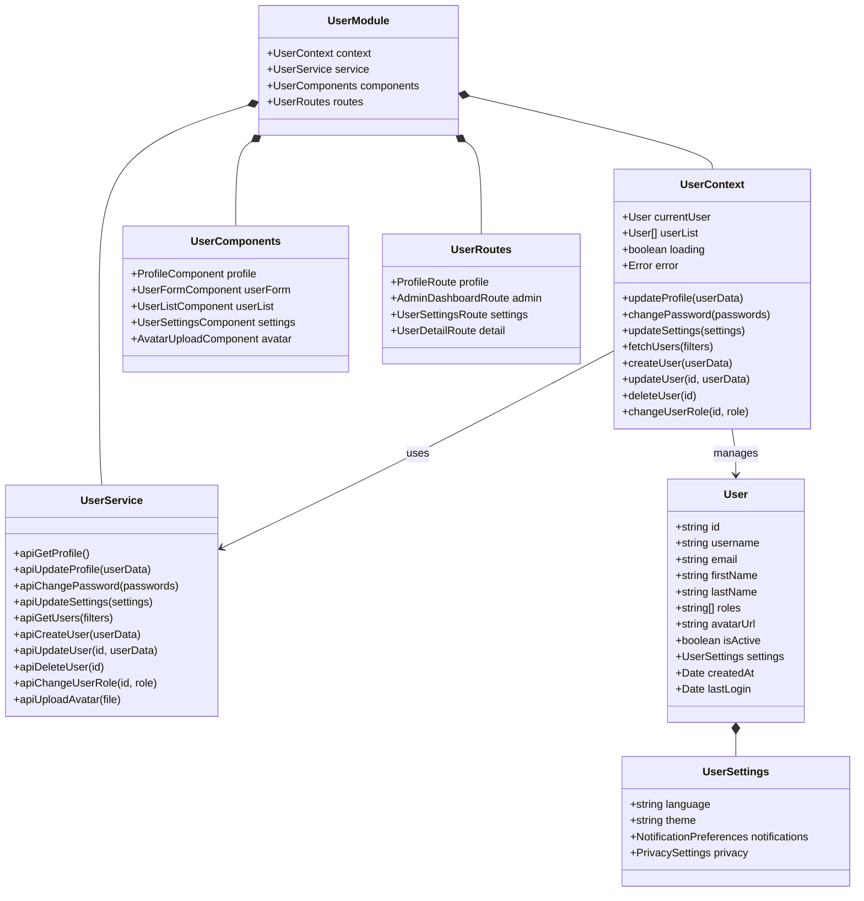
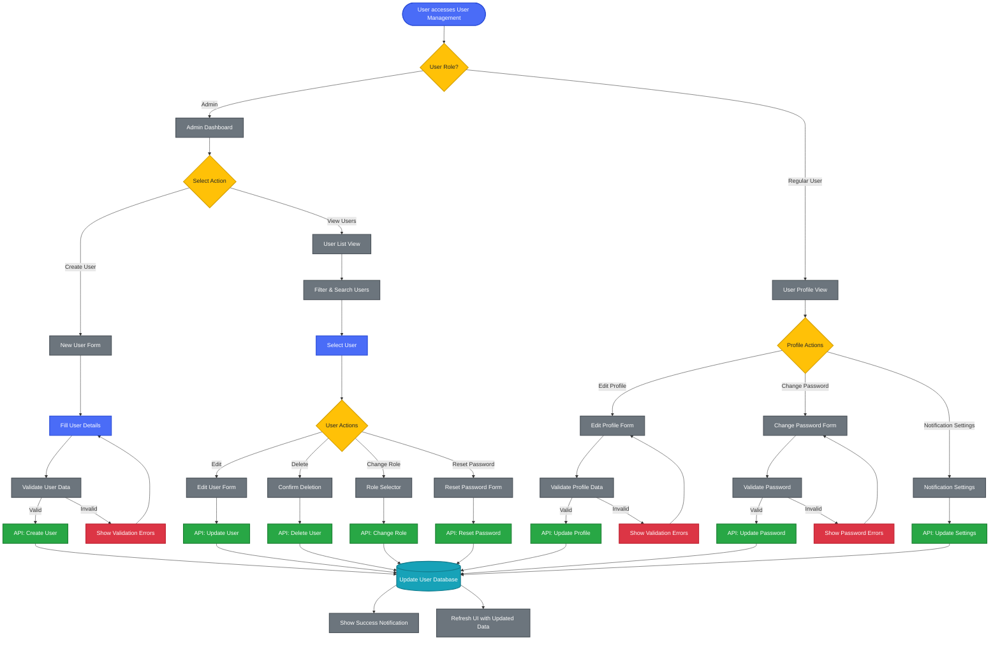
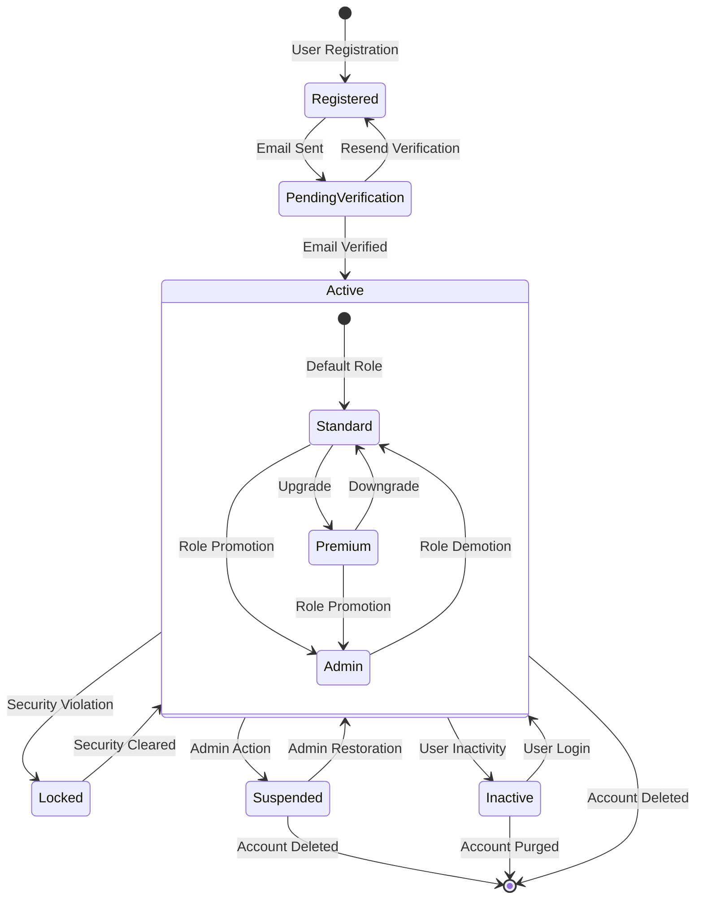
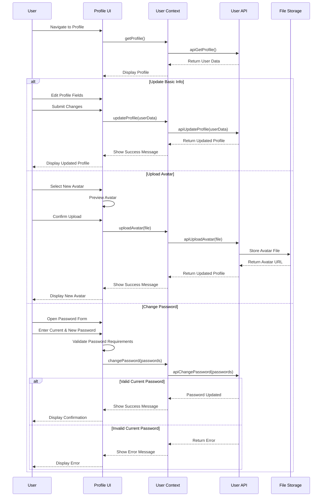
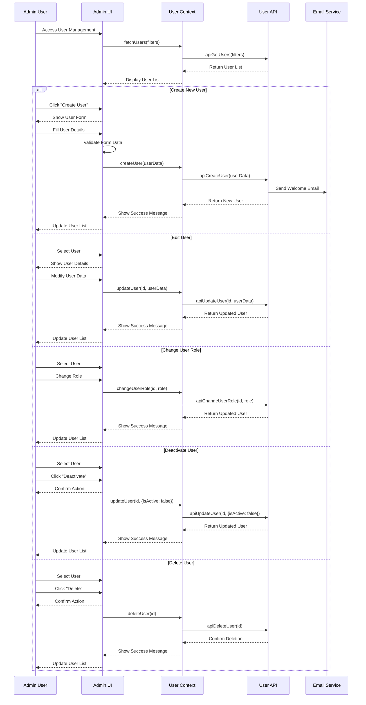
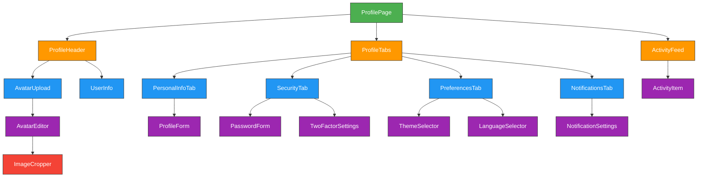
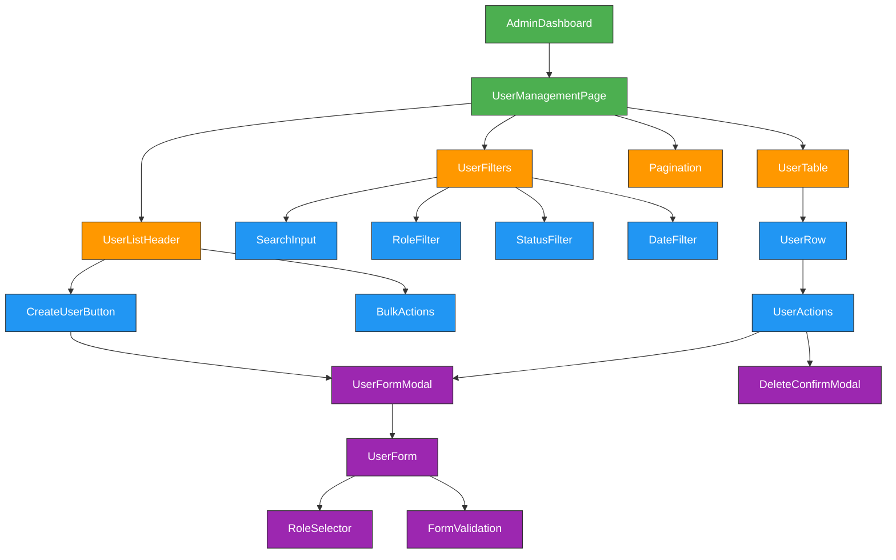

---
sidebar_position: 4
sidebar_label: "User Management"
---

import PanzoomWrapper from '@site/src/components/MermaidDiagram/PanzoomWrapper';

# User Management

## User Management Architecture and Workflows

### User Management System Architecture

<PanzoomWrapper>
<div id="user-management-system-architecture" >


</div>
</PanzoomWrapper>

### User Lifecycle Workflow

This diagram illustrates the user management processes, including profile management and administrative functions.

<PanzoomWrapper>
<div id="user-lifecycle-workflow" >



</div>
</PanzoomWrapper>

### User State Diagram

<PanzoomWrapper>
<div id="user-state-diagram" >



</div>
</PanzoomWrapper>
### Profile Update Workflow

<PanzoomWrapper>
<div id="profile-update-workflow" >


</div>
</PanzoomWrapper>

### Admin User Management Workflow

<PanzoomWrapper>
<div id="admin-user-management-workflow" >


</div>
</PanzoomWrapper>

## User Interface Components

### Profile Component Architecture

<PanzoomWrapper>
<div id="profile-component-architecture" >


</div>
</PanzoomWrapper>

| Component            | Description              | Features                                     |
| -------------------- | ------------------------ | -------------------------------------------- |
| **ProfileHeader**    | User identity section    | Avatar, name, role badges, quick stats       |
| **AvatarUpload**     | Profile image management | Image upload, cropping, and preview          |
| **ProfileTabs**      | Tab navigation system    | Organized access to profile sections         |
| **PersonalInfoTab**  | Basic user information   | Editable fields with validation              |
| **SecurityTab**      | Security settings        | Password change, 2FA configuration           |
| **PreferencesTab**   | User preferences         | Theme, language, accessibility options       |
| **NotificationsTab** | Notification settings    | Email, push, and in-app notification toggles |
| **ActivityFeed**     | User activity history    | Timeline of recent actions and events        |

### Admin User Management Interface

<PanzoomWrapper>
<div id="admin-user-management-interface" >


</div>
</PanzoomWrapper>

## Component Implementations

### Avatar Upload Component

```typescript
import React, { useState, useRef } from "react";
import { useUser } from "../contexts/UserContext";
import { ImageCropper } from "./ImageCropper";
import { ProgressRing } from "../ui/ProgressRing";
import { ShimmerEffect } from "../ui/ShimmerEffect";
import { useToast } from "../hooks/useToast";

interface AvatarUploadProps {
  currentAvatarUrl?: string;
  size?: "small" | "medium" | "large";
  onUploadComplete?: (url: string) => void;
}

export const AvatarUpload: React.FC<AvatarUploadProps> = ({
  currentAvatarUrl,
  size = "medium",
  onUploadComplete,
}) => {
  const [isUploading, setIsUploading] = useState(false);
  const [uploadProgress, setUploadProgress] = useState(0);
  const [cropperOpen, setCropperOpen] = useState(false);
  const [selectedFile, setSelectedFile] = useState<File | null>(null);
  const [previewUrl, setPreviewUrl] = useState<string | null>(null);

  const fileInputRef = useRef<HTMLInputElement>(null);
  const { uploadAvatar } = useUser();
  const { showToast } = useToast();

  const handleFileSelect = (e: React.ChangeEvent<HTMLInputElement>) => {
    if (e.target.files && e.target.files[0]) {
      const file = e.target.files[0];

      // Validate file type
      if (!file.type.match("image.*")) {
        showToast("Please select an image file", "error");
        return;
      }

      // Validate file size (max 5MB)
      if (file.size > 5 * 1024 * 1024) {
        showToast("Image must be smaller than 5MB", "error");
        return;
      }

      setSelectedFile(file);
      setCropperOpen(true);
    }
  };

  const handleCropComplete = (croppedImageBlob: Blob) => {
    const objectUrl = URL.createObjectURL(croppedImageBlob);
    setPreviewUrl(objectUrl);
    setCropperOpen(false);

    // Convert blob to file
    const croppedFile = new File(
      [croppedImageBlob],
      selectedFile?.name || "avatar.jpg",
      {
        type: croppedImageBlob.type,
      }
    );

    handleUpload(croppedFile);
  };

  const handleUpload = async (file: File) => {
    setIsUploading(true);
    setUploadProgress(0);

    try {
      // Simulated progress updates
      const progressInterval = setInterval(() => {
        setUploadProgress((prev) => {
          const newProgress = prev + 10;
          if (newProgress >= 90) {
            clearInterval(progressInterval);
            return 90;
          }
          return newProgress;
        });
      }, 300);

      // Upload the file
      const avatarUrl = await uploadAvatar(file);

      clearInterval(progressInterval);
      setUploadProgress(100);

      // Notify parent component
      if (onUploadComplete) {
        onUploadComplete(avatarUrl);
      }

      showToast("Avatar updated successfully", "success");

      // Clean up object URL
      if (previewUrl) {
        URL.revokeObjectURL(previewUrl);
      }
    } catch (error) {
      showToast("Failed to upload avatar", "error");
    } finally {
      setIsUploading(false);
      setUploadProgress(0);
    }
  };

  const triggerFileSelect = () => {
    if (fileInputRef.current) {
      fileInputRef.current.click();
    }
  };

  const sizeClasses = {
    small: "w-16 h-16",
    medium: "w-24 h-24",
    large: "w-32 h-32",
  };

  return (
    <div className="avatar-upload">
      <div
        className={`avatar-container relative rounded-full overflow-hidden ${sizeClasses[size]}`}
        onClick={triggerFileSelect}
      >
        {isUploading ? (
          <div className="absolute inset-0 flex items-center justify-center bg-gray-800 bg-opacity-50">
            <ProgressRing
              progress={uploadProgress}
              size={size === "small" ? 32 : size === "medium" ? 48 : 64}
              strokeWidth={4}
              color="#4CAF50"
            />
          </div>
        ) : (
          <>
            {previewUrl || currentAvatarUrl ? (
              
            ) : (
              <div className="w-full h-full bg-gray-200 flex items-center justify-center">
                <ShimmerEffect />
              </div>
            )}
            <div className="absolute inset-0 bg-black bg-opacity-0 hover:bg-opacity-30 flex items-center justify-center transition-all duration-200">
              <span className="text-white opacity-0 hover:opacity-100">
                Change
              </span>
            </div>
          </>
        )}
      </div>

      <input
        type="file"
        ref={fileInputRef}
        className="hidden"
        accept="image/*"
        onChange={handleFileSelect}
      />

      {cropperOpen && selectedFile && (
        <ImageCropper
          image={URL.createObjectURL(selectedFile)}
          onCropComplete={handleCropComplete}
          onCancel={() => setCropperOpen(false)}
          aspectRatio={1}
        />
      )}
    </div>
  );
};
```

### User List Component with Advanced Filtering

```typescript
import React, { useState, useEffect, useMemo } from "react";
import { useUser } from "../contexts/UserContext";
import { Table, TableColumn } from "../ui/Table";
import { SearchInput } from "../ui/SearchInput";
import { Dropdown } from "../ui/Dropdown";
import { Button } from "../ui/Button";
import { Pagination } from "../ui/Pagination";
import { UserFormModal } from "./UserFormModal";
import { ConfirmDialog } from "../ui/ConfirmDialog";
import { StatusBadge } from "../ui/StatusBadge";
import { formatDate } from "../utils/dateUtils";

export const UserList: React.FC = () => {
  const [searchTerm, setSearchTerm] = useState("");
  const [roleFilter, setRoleFilter] = useState<string | null>(null);
  const [statusFilter, setStatusFilter] = useState<boolean | null>(null);
  const [page, setPage] = useState(1);
  const [pageSize, setPageSize] = useState(10);
  const [sortField, setSortField] = useState("createdAt");
  const [sortDirection, setSortDirection] = useState<"asc" | "desc">("desc");
  const [selectedUser, setSelectedUser] = useState<User | null>(null);
  const [isFormOpen, setIsFormOpen] = useState(false);
  const [isDeleteDialogOpen, setIsDeleteDialogOpen] = useState(false);

  const { userList, loading, fetchUsers, createUser, updateUser, deleteUser } =
    useUser();

  // Fetch users on component mount and when filters change
  useEffect(() => {
    fetchUsers({
      search: searchTerm,
      role: roleFilter,
      isActive: statusFilter,
      page,
      pageSize,
      sortBy: sortField,
      sortDirection,
    });
  }, [
    fetchUsers,
    searchTerm,
    roleFilter,
    statusFilter,
    page,
    pageSize,
    sortField,
    sortDirection,
  ]);

  // Handle sort change
  const handleSort = (field: string) => {
    if (field === sortField) {
      setSortDirection(sortDirection === "asc" ? "desc" : "asc");
    } else {
      setSortField(field);
      setSortDirection("asc");
    }
  };

  // Define table columns
  const columns: TableColumn[] = useMemo(
    () => [
      {
        id: "username",
        header: "Username",
        cell: (user) => (
          <div className="flex items-center">
            
            <span>{user.username}</span>
          </div>
        ),
        sortable: true,
      },
      {
        id: "email",
        header: "Email",
        cell: (user) => user.email,
        sortable: true,
      },
      {
        id: "roles",
        header: "Role",
        cell: (user) => (
          <div className="flex flex-wrap gap-1">
            {user.roles.map((role) => (
              <span
                key={role}
                className="px-2 py-1 text-xs rounded-full bg-blue-100 text-blue-800"
              >
                {role}
              </span>
            ))}
          </div>
        ),
        sortable: false,
      },
      {
        id: "isActive",
        header: "Status",
        cell: (user) => (
          <StatusBadge
            status={user.isActive ? "active" : "inactive"}
            label={user.isActive ? "Active" : "Inactive"}
          />
        ),
        sortable: true,
      },
      {
        id: "createdAt",
        header: "Created",
        cell: (user) => formatDate(user.createdAt),
        sortable: true,
      },
      {
        id: "actions",
        header: "Actions",
        cell: (user) => (
          <div className="flex space-x-2">
            <Button
              variant="text"
              size="sm"
              onClick={() => handleEdit(user)}
              icon="edit"
            >
              Edit
            </Button>
            <Button
              variant="text"
              size="sm"
              color="danger"
              onClick={() => handleDeleteClick(user)}
              icon="delete"
            >
              Delete
            </Button>
          </div>
        ),
        sortable: false,
      },
    ],
    []
  );

  // Handle user actions
  const handleCreateUser = () => {
    setSelectedUser(null);
    setIsFormOpen(true);
  };

  const handleEdit = (user: User) => {
    setSelectedUser(user);
    setIsFormOpen(true);
  };

  const handleDeleteClick = (user: User) => {
    setSelectedUser(user);
    setIsDeleteDialogOpen(true);
  };

  const handleDeleteConfirm = async () => {
    if (selectedUser) {
      await deleteUser(selectedUser.id);
      setIsDeleteDialogOpen(false);
    }
  };

  const handleFormSubmit = async (userData: UserFormData) => {
    if (selectedUser) {
      await updateUser(selectedUser.id, userData);
    } else {
      await createUser(userData);
    }
    setIsFormOpen(false);
  };

  return (
    <div className="user-list-container">
      <div className="flex justify-between items-center mb-6">
        <h2 className="text-2xl font-bold">User Management</h2>
        <Button variant="primary" onClick={handleCreateUser} icon="add">
          Create User
        </Button>
      </div>

      <div className="filters-container grid grid-cols-1 md:grid-cols-3 gap-4 mb-6">
        <SearchInput
          placeholder="Search users..."
          value={searchTerm}
          onChange={setSearchTerm}
        />

        <Dropdown
          label="Role"
          options={[
            { value: null, label: "All Roles" },
            { value: "admin", label: "Admin" },
            { value: "manager", label: "Manager" },
            { value: "user", label: "User" },
          ]}
          value={roleFilter}
          onChange={setRoleFilter}
        />

        <Dropdown
          label="Status"
          options={[
            { value: null, label: "All Status" },
            { value: true, label: "Active" },
            { value: false, label: "Inactive" },
          ]}
          value={statusFilter}
          onChange={setStatusFilter}
        />
      </div>

      <Table
        columns={columns}
        data={userList.items}
        loading={loading}
        sortField={sortField}
        sortDirection={sortDirection}
        onSort={handleSort}
        emptyMessage="No users found"
      />

      <div className="mt-4 flex justify-between items-center">
        <div className="text-sm text-gray-500">
          Showing {userList.items.length} of {userList.total} users
        </div>

        <Pagination
          currentPage={page}
          pageSize={pageSize}
          totalItems={userList.total}
          onPageChange={setPage}
          onPageSizeChange={setPageSize}
        />
      </div>

      {isFormOpen && (
        <UserFormModal
          user={selectedUser}
          isOpen={isFormOpen}
          onClose={() => setIsFormOpen(false)}
          onSubmit={handleFormSubmit}
        />
      )}

      {isDeleteDialogOpen && selectedUser && (
        <ConfirmDialog
          title="Delete User"
          message={`Are you sure you want to delete ${selectedUser.username}? This action cannot be undone.`}
          confirmLabel="Delete"
          cancelLabel="Cancel"
          isOpen={isDeleteDialogOpen}
          onClose={() => setIsDeleteDialogOpen(false)}
          onConfirm={handleDeleteConfirm}
          confirmVariant="danger"
        />
      )}
    </div>
  );
};
```

## State Management for User Data

### User Redux Slice

```typescript
import { createSlice, createAsyncThunk, PayloadAction } from "@reduxjs/toolkit";
import { userService } from "../services/userService";
import { normalize, schema } from "normalizr";

// Define normalizr schemas
const userSchema = new schema.Entity("users");
const userListSchema = new schema.Array(userSchema);

// Define async thunks
export const fetchProfile = createAsyncThunk(
  "users/fetchProfile",
  async (_, { rejectWithValue }) => {
    try {
      const response = await userService.getProfile();
      return response.data;
    } catch (error) {
      return rejectWithValue(error.response?.data || "Failed to fetch profile");
    }
  }
);

export const fetchUsers = createAsyncThunk(
  "users/fetchUsers",
  async (filters, { rejectWithValue }) => {
    try {
      const response = await userService.getUsers(filters);
      return response.data;
    } catch (error) {
      return rejectWithValue(error.response?.data || "Failed to fetch users");
    }
  }
);

export const updateProfile = createAsyncThunk(
  "users/updateProfile",
  async (userData, { rejectWithValue }) => {
    try {
      const response = await userService.updateProfile(userData);
      return response.data;
    } catch (error) {
      return rejectWithValue(
        error.response?.data || "Failed to update profile"
      );
    }
  }
);

// Define user slice
const userSlice = createSlice({
  name: "users",
  initialState: {
    currentUser: null,
    entities: {},
    ids: [],
    pagination: {
      total: 0,
      page: 1,
      pageSize: 10,
    },
    loading: false,
    error: null,
  },
  reducers: {
    clearUserError: (state) => {
      state.error = null;
    },
    setUserFilter: (state, action) => {
      state.pagination.page = 1; // Reset to first page when filter changes
    },
  },
  extraReducers: (builder) => {
    // Handle fetchProfile
    builder.addCase(fetchProfile.pending, (state) => {
      state.loading = true;
      state.error = null;
    });
    builder.addCase(fetchProfile.fulfilled, (state, action) => {
      state.loading = false;
      state.currentUser = action.payload;
      state.entities[action.payload.id] = action.payload;
    });
    builder.addCase(fetchProfile.rejected, (state, action) => {
      state.loading = false;
      state.error = action.payload || "Failed to fetch profile";
    });

    // Handle fetchUsers
    builder.addCase(fetchUsers.pending, (state) => {
      state.loading = true;
      state.error = null;
    });
    builder.addCase(fetchUsers.fulfilled, (state, action) => {
      state.loading = false;

      // Normalize the data
      const normalizedData = normalize(action.payload.items, userListSchema);

      state.entities = { ...state.entities, ...normalizedData.entities.users };
      state.ids = normalizedData.result;
      state.pagination = {
        total: action.payload.total,
        page: action.payload.page,
        pageSize: action.payload.pageSize,
      };
    });
    builder.addCase(fetchUsers.rejected, (state, action) => {
      state.loading = false;
      state.error = action.payload || "Failed to fetch users";
    });

    // Handle updateProfile
    builder.addCase(updateProfile.pending, (state) => {
      state.loading = true;
      state.error = null;
    });
    builder.addCase(updateProfile.fulfilled, (state, action) => {
      state.loading = false;
      state.currentUser = action.payload;
      state.entities[action.payload.id] = action.payload;
    });
    builder.addCase(updateProfile.rejected, (state, action) => {
      state.loading = false;
      state.error = action.payload || "Failed to update profile";
    });
  },
});

export const { clearUserError, setUserFilter } = userSlice.actions;
export default userSlice.reducer;
```

## Performance Optimizations

The Enterprise Nexus frontend implements several performance optimizations for user management:

| Optimization            | Implementation                                  | Benefit                                        |
| ----------------------- | ----------------------------------------------- | ---------------------------------------------- |
| **Virtualized Lists**   | Windowing technique for large user lists        | Renders only visible items, reducing DOM nodes |
| **Memoized Components** | React.memo and useMemo for expensive components | Prevents unnecessary re-renders                |
| **Debounced Search**    | Delay API calls during typing                   | Reduces API load during user search            |
| **Lazy Loading**        | Dynamic imports for admin components            | Reduces initial bundle size for regular users  |
| **Optimistic Updates**  | UI updates before API confirmation              | Improves perceived performance                 |
| **Image Optimization**  | Progressive loading and WebP format             | Faster avatar loading and display              |
| **Pagination**          | Server-side pagination for user lists           | Reduces data transfer and rendering time       |

### Example: Virtualized User List Implementation

```typescript
import React, { useCallback } from "react";
import { FixedSizeList as List } from "react-window";
import AutoSizer from "react-virtualized-auto-sizer";
import { useUser } from "../contexts/UserContext";

export const VirtualizedUserList: React.FC = () => {
  const { userList } = useUser();

  const UserRow = useCallback(
    ({ index, style }) => {
      const user = userList.items[index];

      return (
        <div style={style} className="flex items-center p-4 border-b">
          
          <div className="flex-1">
            <div className="font-medium">{user.username}</div>
            <div className="text-sm text-gray-500">{user.email}</div>
          </div>
          <div className="flex space-x-2">{/* Action buttons */}</div>
        </div>
      );
    },
    [userList.items]
  );

  return (
    <div className="h-[600px] w-full">
      <AutoSizer>
        {({ height, width }) => (
          <List
            height={height}
            width={width}
            itemCount={userList.items.length}
            itemSize={72} // Height of each row
          >
            {UserRow}
          </List>
        )}
      </AutoSizer>
    </div>
  );
};
```

