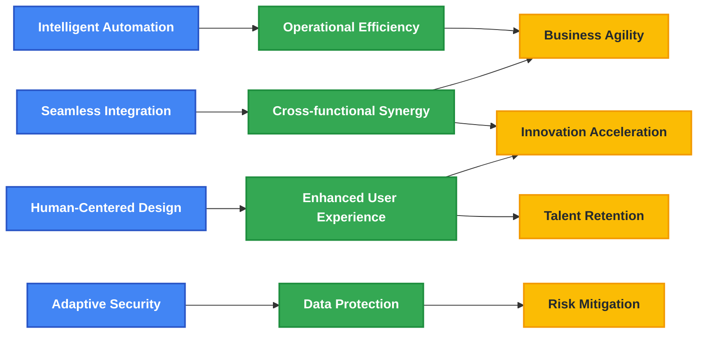
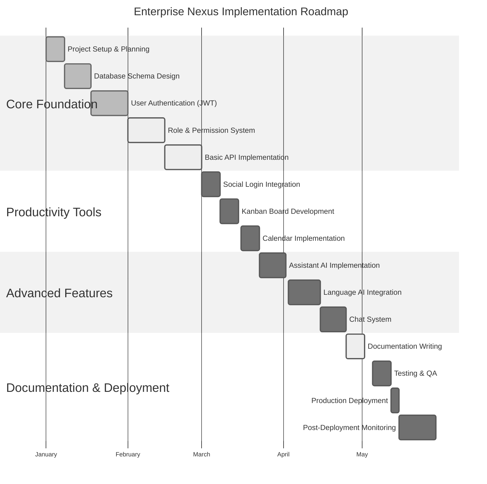

import PanzoomWrapper from '../src/components/MermaidDiagram/PanzoomWrapper';

# Enterprise Nexus

<div className="intro-banner">
  <div className="intro-tagline">
    <h2>Transforming Enterprise Management Through Innovation</h2>
  </div>
</div>

<div className="badges-container">
  <span className="badge badge-primary">React 18</span>
  <span className="badge badge-success">Spring Boot</span>
  <span className="badge badge-info">TypeScript</span>
  <span className="badge badge-warning">MySQL</span>
  <span className="badge badge-danger">AI-Powered</span>
  <span className="badge badge-secondary">Enterprise-Grade</span>
</div>

## Executive Summary

**Enterprise Nexus** is a state-of-the-art enterprise management platform that seamlessly integrates cutting-edge technologies to revolutionize workplace productivity, security, and collaboration. This comprehensive solution combines a responsive TypeScript React frontend with a robust Spring Boot backend, enhanced by advanced AI capabilities and multi-layered security protocols.

Designed for modern enterprises seeking digital transformation, Enterprise Nexus provides a unified ecosystem where teams can collaborate in real-time, automate routine tasks, and leverage AI-driven insights to make data-informed decisions. The platform's modular architecture ensures scalability and adaptability to evolving business needs, while its enterprise-grade security framework safeguards sensitive organizational data.

<div className="intro-cards">
  <div className="intro-card">
    <div className="intro-card-icon">🔒</div>
    <div className="intro-card-title">Enterprise Security</div>
    <div className="intro-card-description">Multi-layered encryption with dynamic key generation and comprehensive authentication options</div>
  </div>
  <div className="intro-card">
    <div className="intro-card-icon">🤖</div>
    <div className="intro-card-title">AI Integration</div>
    <div className="intro-card-description">Intelligent assistants and speech processing to enhance workplace productivity</div>
  </div>
  <div className="intro-card">
    <div className="intro-card-icon">⚡</div>
    <div className="intro-card-title">Real-time Collaboration</div>
    <div className="intro-card-description">WebSocket-powered communication and task management for seamless teamwork</div>
  </div>
</div>

## Platform Vision

Enterprise Nexus represents the convergence of enterprise software excellence and emerging technologies, creating a platform that not only addresses current business challenges but anticipates future needs. Our vision encompasses:



## Core Capabilities

Enterprise Nexus delivers a comprehensive suite of capabilities designed to transform enterprise operations:

<div className="feature-grid">
  <div className="feature-section">
    <h3>🔐 Advanced Security Framework</h3>
    <ul>
      <li><strong>Multi-layered Encryption</strong> - Dynamic key generation for tokens and sensitive data</li>
      <li><strong>Multi-factor Authentication</strong> - TOTP or email OTP with replay protection</li>
      <li><strong>OAuth2 Integration</strong> - Seamless authentication with Google, Facebook, and GitHub</li>
      <li><strong>Role-based Access Control</strong> - Granular permission system with precise access management</li>
      <li><strong>Secure Communication</strong> - End-to-end encryption for all data in transit</li>
    </ul>
  </div>
  
  <div className="feature-section">
    <h3>🔄 Collaborative Ecosystem</h3>
    <ul>
      <li><strong>Real-time Messaging</strong> - WebSocket-powered instant communication</li>
      <li><strong>Kanban Task Management</strong> - Visual workflow organization with drag-and-drop</li>
      <li><strong>Company Calendar</strong> - Centralized scheduling and coordination</li>
      <li><strong>Document Collaboration</strong> - Concurrent editing with version control</li>
      <li><strong>Department Coordination</strong> - Cross-functional alignment and tracking</li>
    </ul>
  </div>
  
  <div className="feature-section">
    <h3>🧠 AI-Powered Intelligence</h3>
    <ul>
      <li><strong>Virtual Assistants</strong> - Intelligent automation of routine tasks</li>
      <li><strong>Predictive Analytics</strong> - Data-driven insights for decision making</li>
      <li><strong>Language Processing</strong> - Advanced speech recognition and analysis</li>
      <li><strong>Sentiment Analysis</strong> - Understanding employee and customer feedback</li>
      <li><strong>Performance Insights</strong> - AI-driven productivity optimization</li>
    </ul>
  </div>
  
  <div className="feature-section">
    <h3>📊 Enterprise Management</h3>
    <ul>
      <li><strong>Resource Allocation</strong> - Intelligent distribution of company assets</li>
      <li><strong>Performance Dashboards</strong> - Real-time visualization of key metrics</li>
      <li><strong>Workflow Automation</strong> - Streamlined business processes</li>
      <li><strong>Compliance Management</strong> - Automated regulatory adherence</li>
      <li><strong>Integrated Reporting</strong> - Comprehensive business intelligence</li>
    </ul>
  </div>
</div>

## Technology Architecture

Enterprise Nexus is built on a modern, scalable architecture that leverages industry-leading technologies:

### System Architecture Diagram

```mermaid
flowchart TD
    %% Styling
    classDef client fill:#FF9900,stroke:#333,stroke-width:2px,color:#000,font-weight:bold
    classDef frontend fill:#61DAFB,stroke:#333,stroke-width:2px,color:#000,font-weight:bold
    classDef api fill:#6DB33F,stroke:#333,stroke-width:2px,color:#fff,font-weight:bold
    classDef backend fill:#6DB33F,stroke:#333,stroke-width:2px,color:#fff,font-weight:bold
    classDef database fill:#F8C517,stroke:#333,stroke-width:2px,color:#000,font-weight:bold
    classDef ai fill:#9C27B0,stroke:#333,stroke-width:2px,color:#fff,font-weight:bold
    classDef speech fill:#E91E63,stroke:#333,stroke-width:2px,color:#fff,font-weight:bold
    classDef auth fill:#3F51B5,stroke:#333,stroke-width:2px,color:#fff,font-weight:bold
    classDef oauth fill:#7986CB,stroke:#333,stroke-width:2px,color:#fff
    classDef totp fill:#7986CB,stroke:#333,stroke-width:2px,color:#fff
    classDef email fill:#7986CB,stroke:#333,stroke-width:2px,color:#fff

    %% Main components
    subgraph ClientLayer["Client Layer"]
        Client[Client Browser]
        Mobile[Mobile Applications]
    end

    subgraph PresentationLayer["Presentation Layer"]
        FE[Frontend<br/>React/TypeScript]
        UI[UI Components<br/>Ant Design]
        State[State Management<br/>Redux Toolkit]
    end

    subgraph CommunicationLayer["Communication Layer"]
        API[REST API<br/>Spring Boot]
        WS[WebSockets<br/>STOMP/SockJS]
        Gateway[API Gateway]
    end

    subgraph BusinessLayer["Business Logic Layer"]
        BE[Backend Services<br/>Spring Boot]
        Security[Security Services]
        Workflow[Workflow Engine]
    end

    subgraph AILayer["AI & Intelligence Layer"]
        AI[AI Services]
        Speech[Speech Processing<br/>SpeechBrain]
        Analytics[Analytics Engine]
    end

    subgraph AuthLayer["Authentication Layer"]
        Auth[Authentication<br/>Services]
        OAuth[OAuth Providers]
        TOTP[TOTP Service]
        Email[Email Service]
    end

    subgraph DataLayer["Data Layer"]
        DB[(Database<br/>MySQL)]
        Cache[(Cache<br/>Redis)]
        Storage[(Object Storage)]
    end

    %% Connections
    ClientLayer --> PresentationLayer
    PresentationLayer --> CommunicationLayer
    CommunicationLayer --> BusinessLayer
    BusinessLayer --> AILayer
    BusinessLayer --> AuthLayer
    BusinessLayer --> DataLayer

    %% Detailed connections
    Client --> FE
    Mobile --> API
    FE --> UI
    FE --> State
    UI --> State

    FE -- "HTTP/JSON" --> API
    FE <--> |"Real-time"| WS
    Mobile --> Gateway
    Gateway --> API

    API --> BE
    WS --> BE
    BE --> Security
    BE --> Workflow

    BE --> AI
    BE --> Speech
    BE --> Analytics

    BE --> Auth
    Auth --> OAuth
    Auth --> TOTP
    Auth --> Email

    BE --> DB
    BE --> Cache
    BE --> Storage

    %% Apply styles
    class Client,Mobile client
    class FE,UI,State frontend
    class API,WS,Gateway api
    class BE,Security,Workflow backend
    class DB,Cache,Storage database
    class AI,Speech,Analytics ai
    class Auth auth
    class OAuth,TOTP,Email oauth

    %% Styling for subgraphs
    style ClientLayer fill:#FFF3E0,stroke:#FFB74D,stroke-width:1px
    style PresentationLayer fill:#E3F2FD,stroke:#90CAF9,stroke-width:1px
    style CommunicationLayer fill:#E8F5E9,stroke:#A5D6A7,stroke-width:1px
    style BusinessLayer fill:#F3E5F5,stroke:#CE93D8,stroke-width:1px
    style AILayer fill:#FCE4EC,stroke:#F48FB1,stroke-width:1px
    style AuthLayer fill:#E8EAF6,stroke:#9FA8DA,stroke-width:1px
    style DataLayer fill:#FFFDE7,stroke:#FFF176,stroke-width:1px
```

<PanzoomWrapper>
<div id="system-architecture-diagram">



</div>
</PanzoomWrapper>

### Technology Stack

<div className="tech-stack-container">
  <div className="tech-stack-column">
    <h4>Frontend Technologies</h4>
    <div className="tech-item">
      <div className="tech-icon">⚛️</div>
      <div className="tech-details">
        <div className="tech-name">React 18</div>
        <div className="tech-description">Component-based UI library with concurrent rendering</div>
      </div>
    </div>
    <div className="tech-item">
      <div className="tech-icon">📘</div>
      <div className="tech-details">
        <div className="tech-name">TypeScript</div>
        <div className="tech-description">Static typing for enhanced code quality and developer experience</div>
      </div>
    </div>
    <div className="tech-item">
      <div className="tech-icon">🔄</div>
      <div className="tech-details">
        <div className="tech-name">Redux Toolkit</div>
        <div className="tech-description">State management with simplified logic and immutability</div>
      </div>
    </div>
    <div className="tech-item">
      <div className="tech-icon">🧭</div>
      <div className="tech-details">
        <div className="tech-name">React Router</div>
        <div className="tech-description">Declarative routing for single-page application</div>
      </div>
    </div>
    <div className="tech-item">
      <div className="tech-icon">🐜</div>
      <div className="tech-details">
        <div className="tech-name">Ant Design</div>
        <div className="tech-description">Enterprise-grade UI component library</div>
      </div>
    </div>
    <div className="tech-item">
      <div className="tech-icon">🎨</div>
      <div className="tech-details">
        <div className="tech-name">TailwindCSS</div>
        <div className="tech-description">Utility-first CSS framework for rapid UI development</div>
      </div>
    </div>
    <div className="tech-item">
      <div className="tech-icon">⚡</div>
      <div className="tech-details">
        <div className="tech-name">Vite</div>
        <div className="tech-description">Next-generation frontend build tool with HMR</div>
      </div>
    </div>
    <div className="tech-item">
      <div className="tech-icon">🔌</div>
      <div className="tech-details">
        <div className="tech-name">SockJS & STOMP</div>
        <div className="tech-description">WebSocket communication for real-time features</div>
      </div>
    </div>
  </div>
  
  <div className="tech-stack-column">
    <h4>Backend Technologies</h4>
    <div className="tech-item">
      <div className="tech-icon">🍃</div>
      <div className="tech-details">
        <div className="tech-name">Spring Boot</div>
        <div className="tech-description">Java-based framework for microservices and web applications</div>
      </div>
    </div>
    <div className="tech-item">
      <div className="tech-icon">🔒</div>
      <div className="tech-details">
        <div className="tech-name">Spring Security</div>
        <div className="tech-description">Authentication and authorization framework</div>
      </div>
    </div>
    <div className="tech-item">
      <div className="tech-icon">🗄️</div>
      <div className="tech-details">
        <div className="tech-name">Spring Data JPA</div>
        <div className="tech-description">Data access abstraction with Hibernate implementation</div>
      </div>
    </div>
    <div className="tech-item">
      <div className="tech-icon">🎫</div>
      <div className="tech-details">
        <div className="tech-name">JWT Authentication</div>
        <div className="tech-description">Stateless authentication with encrypted tokens</div>
      </div>
    </div>
    <div className="tech-item">
      <div className="tech-icon">📡</div>
      <div className="tech-details">
        <div className="tech-name">WebSockets</div>
        <div className="tech-description">Bidirectional communication protocol for real-time data</div>
      </div>
    </div>
    <div className="tech-item">
      <div className="tech-icon">🧠</div>
      <div className="tech-details">
        <div className="tech-name">SpeechBrain</div>
        <div className="tech-description">PyTorch-based speech processing toolkit</div>
      </div>
    </div>
    <div className="tech-item">
      <div className="tech-icon">🐬</div>
      <div className="tech-details">
        <div className="tech-name">MySQL</div>
        <div className="tech-description">Popular open-source relational database</div>
      </div>
    </div>
    <div className="tech-item">
      <div className="tech-icon">🔄</div>
      <div className="tech-details">
        <div className="tech-name">Hibernate</div>
        <div className="tech-description">Object-relational mapping for Java</div>
      </div>
    </div>
  </div>
</div>

## Security Architecture

Enterprise Nexus implements a defense-in-depth security strategy with multiple layers of protection:

```mermaid
flowchart TD
    %% Styling
    classDef perimeter fill:#FF5252,stroke:#D32F2F,color:white,stroke-width:2px
    classDef network fill:#FF9800,stroke:#F57C00,color:white,stroke-width:2px
    classDef application fill:#2196F3,stroke:#1976D2,color:white,stroke-width:2px
    classDef data fill:#4CAF50,stroke:#388E3C,color:white,stroke-width:2px
    classDef identity fill:#9C27B0,stroke:#7B1FA2,color:white,stroke-width:2px

    %% Main components
    subgraph PerimeterSecurity["Perimeter Security"]
        Firewall[Web Application Firewall]
        DDoS[DDoS Protection]
        EdgeSecurity[Edge Security]
    end

    subgraph NetworkSecurity["Network Security"]
        TLS[TLS 1.3 Encryption]
        HTTPS[HTTPS Enforcement]
        CORS[CORS Policies]
    end

    subgraph ApplicationSecurity["Application Security"]
        InputValidation[Input Validation]
        CSRF[CSRF Protection]
        XSS[XSS Prevention]
        Headers[Security Headers]
    end

    subgraph DataSecurity["Data Security"]
        Encryption[Data Encryption]
        Masking[Data Masking]
        Auditing[Audit Logging]
        Backup[Encrypted Backups]
    end

    subgraph IdentitySecurity["Identity & Access Management"]
        MFA[Multi-factor Authentication]
        RBAC[Role-based Access Control]
        OAuth[OAuth Integration]
        TokenSecurity[Token Security]
    end

    %% Connections
    PerimeterSecurity --> NetworkSecurity
    NetworkSecurity --> ApplicationSecurity
    ApplicationSecurity --> DataSecurity
    ApplicationSecurity --> IdentitySecurity
    IdentitySecurity --> DataSecurity

    %% Apply styles
    class Firewall,DDoS,EdgeSecurity perimeter
    class TLS,HTTPS,CORS network
    class InputValidation,CSRF,XSS,Headers application
    class Encryption,Masking,Auditing,Backup data
    class MFA,RBAC,OAuth,TokenSecurity identity

    %% Styling for subgraphs
    style PerimeterSecurity fill:#FFEBEE,stroke:#FFCDD2,stroke-width:1px
    style NetworkSecurity fill:#FFF3E0,stroke:#FFE0B2,stroke-width:1px
    style ApplicationSecurity fill:#E3F2FD,stroke:#BBDEFB,stroke-width:1px
    style DataSecurity fill:#E8F5E9,stroke:#C8E6C9,stroke-width:1px
    style IdentitySecurity fill:#F3E5F5,stroke:#E1BEE7,stroke-width:1px
```

<PanzoomWrapper>
<div id="security-architecture-diagram">



</div>
</PanzoomWrapper>

### Key Security Features

1. **Multi-layered Token Encryption** - Access and refresh tokens are encrypted twice with dynamically generated keys
2. **TOTP Authentication** - Time-based one-time passwords with replay protection
3. **Email OTP Verification** - Secondary authentication channel with expiration controls
4. **OAuth2 Integration** - Secure third-party authentication with verified providers
5. **Role-based Access Control** - Granular permission management with principle of least privilege
6. **HTTPS Everywhere** - All communications are encrypted in transit with modern protocols
7. **Secure Password Storage** - Passwords are hashed using Argon2id with salt and pepper
8. **Data Encryption** - Sensitive data is encrypted at rest with AES-256
9. **Audit Logging** - Comprehensive logging of security events and access attempts
10. **Regular Security Scanning** - Automated vulnerability assessment and penetration testing

## Project Structure

Enterprise Nexus follows a modular, maintainable code organization:

```
study/
├── typescript-react/         # Frontend application
│   ├── src/
│   │   ├── components/       # Reusable UI components
│   │   ├── pages/            # Main application views
│   │   ├── services/         # API interaction layers
│   │   ├── store/            # Redux state management
│   │   ├── types/            # TypeScript type definitions
│   │   ├── utils/            # Helper functions and security utilities
│   │   ├── hooks/            # Custom React hooks
│   │   └── styles/           # CSS styles
│   ├── public/               # Static assets
│   └── package.json          # Frontend dependencies
│
└── study/                    # Backend application
    ├── src/
    │   ├── main/
    │   │   ├── java/         # Java source code
    │   │   │   └── com/database/study/
    │   │   │       ├── config/           # Application configuration
    │   │   │       ├── controller/       # API endpoints
    │   │   │       ├── dto/              # Data transfer objects
    │   │   │       ├── entity/           # Database entities
    │   │   │       ├── repository/       # Data access layer
    │   │   │       ├── security/         # Security implementation
    │   │   │       └── service/          # Business logic
    │   │   └── resources/    # Configuration files
    │   └── test/             # Test files
    ├── speechbrain/          # Speech processing module
    │   ├── models/           # AI language models
    │   └── pretrained_models/ # Pre-trained speech models
    └── pom.xml               # Backend dependencies
```

## Implementation Roadmap

Enterprise Nexus follows a strategic implementation approach:

<PanzoomWrapper>
<div id="implementation-roadmap-diagram">



</div>
</PanzoomWrapper>

## Documentation Navigation

<div className="navigation-cards">
  <a href="/Haaga_Backend_Programming/docs/architecture" className="navigation-card">
    <div className="navigation-card-icon">🏗️</div>
    <div className="navigation-card-title">System Architecture</div>
    <div className="navigation-card-description">Detailed component interactions and security model</div>
  </a>
  
  <a href="/Haaga_Backend_Programming/docs/frontend/structure" className="navigation-card">
    <div className="navigation-card-icon">🖥️</div>
    <div className="navigation-card-title">Frontend Documentation</div>
    <div className="navigation-card-description">User interface and experience design</div>
  </a>
  
  <a href="/Haaga_Backend_Programming/docs/backend/structure" className="navigation-card">
    <div className="navigation-card-icon">⚙️</div>
    <div className="navigation-card-title">Backend Documentation</div>
    <div className="navigation-card-description">API design and business logic</div>
  </a>
  
  <a href="/Haaga_Backend_Programming/docs/deployment" className="navigation-card">
    <div className="navigation-card-icon">🚀</div>
    <div className="navigation-card-title">Deployment Guide</div>
    <div className="navigation-card-description">Installation and configuration instructions</div>
  </a>
  
  <a href="/Haaga_Backend_Programming/docs/backend/auth" className="navigation-card">
    <div className="navigation-card-icon">🔐</div>
    <div className="navigation-card-title">Security Features</div>
    <div className="navigation-card-description">In-depth explanation of security mechanisms</div>
  </a>
  
  <a href="/Haaga_Backend_Programming/docs/frontend/ai-assistants" className="navigation-card">
    <div className="navigation-card-icon">🧠</div>
    <div className="navigation-card-title">AI Capabilities</div>
    <div className="navigation-card-description">How AI enhances workplace productivity</div>
  </a>
</div>

<style>
{`
  /* Banner styling */
  .intro-banner {
    background: linear-gradient(135deg, #4285f4, #34a853, #fbbc04, #ea4335);
    border-radius: 8px;
    padding: 30px;
    margin-bottom: 30px;
    color: white;
    text-align: center;
  }
  
  /* Responsive adjustments for laptop screens */
  @media (min-width: 997px) and (max-width: 1200px) {
    .intro-banner {
      padding: 25px;
      margin-bottom: 25px;
    }
    
    .intro-tagline h2 {
      font-size: 1.6rem;
    }
  }
  
  .intro-tagline h2 {
    font-size: 1.8rem;
    font-weight: 600;
    margin: 0;
  }
  
  /* Badge styling */
  .badges-container {
    display: flex;
    flex-wrap: wrap;
    gap: 10px;
    margin-bottom: 30px;
    justify-content: center;
  }
  
  .badge {
    padding: 5px 12px;
    border-radius: 16px;
    font-size: 0.8rem;
    font-weight: 600;
  }
  
  .badge-primary { background-color: #4285f4; color: white; }
  .badge-success { background-color: #34a853; color: white; }
  .badge-info { background-color: #4fc3f7; color: white; }
  .badge-warning { background-color: #fbbc04; color: #333; }
  .badge-danger { background-color: #ea4335; color: white; }
  .badge-secondary { background-color: #5f6368; color: white; }
  
  /* Card styling */
  .intro-cards {
    display: grid;
    grid-template-columns: repeat(auto-fit, minmax(250px, 1fr));
    gap: 20px;
    margin: 30px 0;
  }
  
  /* Responsive adjustments for laptop screens */
  @media (min-width: 997px) and (max-width: 1200px) {
    .intro-cards {
      grid-template-columns: repeat(auto-fit, minmax(220px, 1fr));
    }
  }
  
  .intro-card {
    background-color: #f8f9fa;
    border-radius: 8px;
    padding: 20px;
    box-shadow: 0 2px 5px rgba(0,0,0,0.1);
    transition: transform 0.3s ease, box-shadow 0.3s ease;
  }
  
  /* Responsive adjustments for laptop screens */
  @media (min-width: 997px) and (max-width: 1200px) {
    .intro-card {
      padding: 16px;
    }
    
    .intro-card-title {
      font-size: 1.15rem;
    }
    
    .intro-card-description {
      font-size: 0.9rem;
    }
  }
  
  .intro-card:hover {
    transform: translateY(-5px);
    box-shadow: 0 5px 15px rgba(0,0,0,0.1);
  }
  
  .intro-card-icon {
    font-size: 2rem;
    margin-bottom: 10px;
  }
  
  .intro-card-title {
    font-size: 1.2rem;
    font-weight: 600;
    margin-bottom: 10px;
  }
  
  .intro-card-description {
    color: #5f6368;
    font-size: 0.9rem;
  }
  
  /* Feature grid styling */
  .feature-grid {
    display: grid;
    grid-template-columns: repeat(auto-fit, minmax(300px, 1fr));
    gap: 30px;
    margin: 30px 0;
  }
  
  .feature-section h3 {
    border-bottom: 2px solid #f1f3f4;
    padding-bottom: 10px;
    margin-bottom: 15px;
  }
  
  .feature-section ul {
    padding-left: 20px;
  }
  
  .feature-section li {
    margin-bottom: 10px;
  }
  
  /* Tech stack styling */
  .tech-stack-container {
    display: grid;
    grid-template-columns: repeat(auto-fit, minmax(300px, 1fr));
    gap: 30px;
    margin: 30px 0;
  }
  
  .tech-stack-column h4 {
    border-bottom: 2px solid #f1f3f4;
    padding-bottom: 10px;
    margin-bottom: 20px;
  }
  
  .tech-item {
    display: flex;
    margin-bottom: 15px;
    align-items: flex-start;
  }
  
  .tech-icon {
    font-size: 1.5rem;
    margin-right: 15px;
    min-width: 30px;
  }
  
  .tech-name {
    font-weight: 600;
    margin-bottom: 5px;
  }
  
  .tech-description {
    font-size: 0.9rem;
    color: #5f6368;
  }
  
  /* Navigation cards */
  .navigation-cards {
    display: grid;
    grid-template-columns: repeat(auto-fit, minmax(250px, 1fr));
    gap: 20px;
    margin: 30px 0;
  }
  
  .navigation-card {
    background-color: #f8f9fa;
    border-radius: 8px;
    padding: 20px;
    box-shadow: 0 2px 5px rgba(0,0,0,0.1);
    transition: transform 0.3s ease, box-shadow 0.3s ease;
    text-decoration: none;
    color: inherit;
  }
  
  .navigation-card:hover {
    transform: translateY(-5px);
    box-shadow: 0 5px 15px rgba(0,0,0,0.1);
  }
  
  .navigation-card-icon {
    font-size: 2rem;
    margin-bottom: 10px;
  }
  
  .navigation-card-title {
    font-size: 1.2rem;
    font-weight: 600;
    margin-bottom: 10px;
    color: #1a73e8;
  }
  
  .navigation-card-description {
    color: #5f6368;
    font-size: 0.9rem;
  }
  
  /* CTA section */
  .cta-container {
    background: linear-gradient(135deg, #1a73e8, #8ab4f8);
    border-radius: 8px;
    padding: 30px;
    margin: 40px 0 20px;
    color: white;
    display: flex;
    flex-wrap: wrap;
    justify-content: space-between;
    align-items: center;
    gap: 20px;
  }
  
  .cta-content {
    flex: 1;
    min-width: 250px;
  }
  
  .cta-content h3 {
    margin-top: 0;
    font-size: 1.5rem;
  }
  
  .cta-buttons {
    display: flex;
    gap: 15px;
    flex-wrap: wrap;
  }
  
  .cta-button {
    padding: 10px 20px;
    border-radius: 4px;
    font-weight: 600;
    text-decoration: none;
    transition: background-color 0.3s ease;
  }
  
  .cta-button.primary {
    background-color: white;
    color: #1a73e8;
  }
  
  .cta-button.primary:hover {
    background-color: #f1f3f4;
  }
  
  .cta-button.secondary {
    background-color: transparent;
    border: 2px solid white;
    color: white;
  }
  
  .cta-button.secondary:hover {
    background-color: rgba(255,255,255,0.1);
  }
`}
</style>

