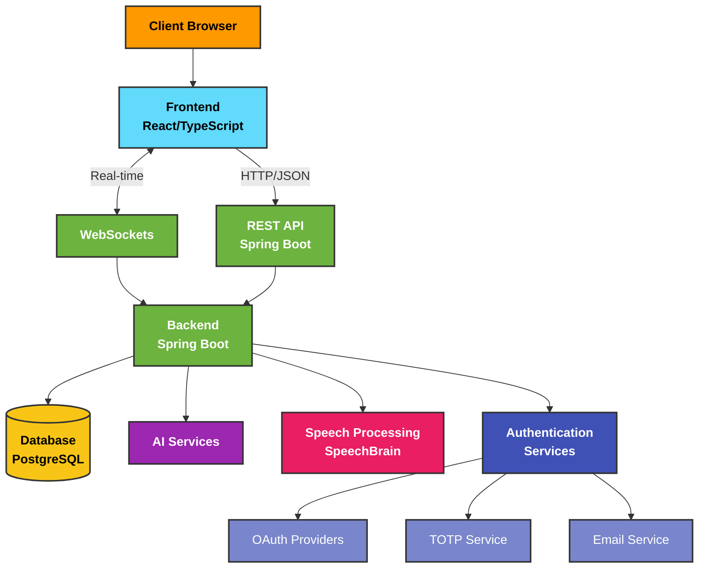

# Enterprise Nexus

Comprehensive documentation of a cutting-edge enterprise management platform featuring a TypeScript React frontend and Spring Boot backend with advanced AI capabilities, robust security, and collaborative tools to streamline workplace productivity.

## Project Overview

This documentation provides a detailed overview of Enterprise Nexus, a sophisticated full-stack application designed to revolutionize company management through intelligent automation and enhanced collaboration. Built with React and TypeScript for the frontend and Spring Boot for the backend, this platform empowers organizations to optimize workflows, improve communication, and boost productivity across departments.

Enterprise Nexus implements enterprise-grade security with multi-layered encryption for tokens and TOTP authentication, ensuring that sensitive company data remains protected at all times. The platform's role-based access control system enables precise permission management, allowing administrators to define exactly what each user can access and modify within the system.

### Key Features

- **Enterprise-Grade Security** - Multi-layered encryption with dynamically generated keys for tokens and TOTP secrets
- **Multi-factor Authentication** - Secure login with TOTP and email OTP options with replay protection
- **OAuth2 Integration** - Seamless login with Google, Facebook, and GitHub
- **Role-based Access Control** - Granular permission system for precise access management
- **Real-time Collaboration** - WebSocket-based messaging system for instant team communication
- **Kanban Task Management** - Visual workflow organization with drag-and-drop functionality
- **Company Calendar** - Centralized event scheduling and department coordination
- **AI Productivity Assistants** - Intelligent virtual assistants to automate routine tasks
- **Language AI Development** - Speech recognition and processing to help employees improve communication skills
- **Department Coordination** - Tools for cross-functional team alignment and project tracking
- **Employee Performance Insights** - Analytics to help team members track and improve their productivity

## Tech Stack

### Frontend (study/typescript-react)

- React 18
- TypeScript
- Redux Toolkit
- React Router
- Ant Design
- TailwindCSS
- Vite
- Axios
- SockJS
- STOMP

### Backend (study/study)

- Spring Boot
- Spring Security
- Spring Data JPA
- JWT Authentication
- WebSockets
- SpeechBrain
- Hibernate
- PostgreSQL

## System Architecture

**System Architecture Diagram:**



The system architecture illustrates the secure and scalable design of Enterprise Nexus. Client browsers connect to the React/TypeScript frontend, which communicates with the Spring Boot backend through both REST API (for data operations) and WebSockets (for real-time features). The backend implements a multi-layered security approach with double encryption for tokens and TOTP secrets using dynamically generated keys.

Authentication services provide multiple secure login options including TOTP with replay protection, email verification, and OAuth2 integration. The AI services layer enhances productivity through virtual assistants and language processing capabilities, while the speech processing module powered by SpeechBrain enables advanced voice recognition for employee skill development. All data is securely stored in PostgreSQL with proper access controls and encryption.

## Getting Started

To navigate this comprehensive documentation, use the sidebar on the left to explore different sections of Enterprise Nexus. Each page provides detailed information about specific components, including code examples, flowcharts, and explanations of implementation details.

For a comprehensive understanding of the platform, we recommend starting with the Architecture overview to grasp the security model and component interactions, then exploring the Frontend and Backend sections to understand how different features are implemented.

Enterprise Nexus is designed to be deployed within your organization's infrastructure, with flexible configuration options to adapt to your specific security requirements and integration needs.

## Project Structure

Our enterprise management platform is organized as follows:

```
study/
├── typescript-react/         # Frontend application
│   ├── src/
│   │   ├── components/       # Reusable UI components
│   │   ├── pages/            # Main application views
│   │   ├── services/         # API interaction layers
│   │   ├── store/            # Redux state management
│   │   ├── types/            # TypeScript type definitions
│   │   ├── utils/            # Helper functions and security utilities
│   │   ├── hooks/            # Custom React hooks
│   │   └── styles/           # CSS styles
│   ├── public/               # Static assets
│   └── package.json          # Frontend dependencies
│
└── study/                    # Backend application
    ├── src/
    │   ├── main/
    │   │   ├── java/         # Java source code
    │   │   │   └── com/database/study/
    │   │   │       ├── config/           # Application configuration
    │   │   │       ├── controller/       # API endpoints
    │   │   │       ├── dto/              # Data transfer objects
    │   │   │       ├── entity/           # Database entities
    │   │   │       ├── repository/       # Data access layer
    │   │   │       ├── security/         # Security implementation
    │   │   │       └── service/          # Business logic
    │   │   └── resources/    # Configuration files
    │   └── test/             # Test files
    ├── speechbrain/          # Speech processing module
    │   ├── models/           # AI language models
    │   └── pretrained_models/ # Pre-trained speech models
    └── pom.xml               # Backend dependencies
```

## Security Architecture

Enterprise Nexus implements a sophisticated security model:

1. **Multi-layered Token Encryption** - Access and refresh tokens are encrypted twice with dynamically generated keys
2. **TOTP Authentication** - Time-based one-time passwords with replay protection
3. **Email OTP Verification** - Secondary authentication channel
4. **OAuth2 Integration** - Secure third-party authentication
5. **Role-based Access Control** - Granular permission management
6. **HTTPS Everywhere** - All communications are encrypted in transit
7. **Secure Password Storage** - Passwords are hashed using industry-standard algorithms

## Learn More

Explore other sections of the documentation to learn more about Enterprise Nexus:

- [System Architecture](/docs/architecture) - Detailed component interactions and security model
- [Frontend Documentation](/docs/frontend/structure) - User interface and experience design
- [Backend Documentation](/docs/backend/structure) - API design and business logic
- [Deployment Guide](/docs/deployment) - Installation and configuration instructions
- [Security Features](/docs/security) - In-depth explanation of security mechanisms
- [AI Capabilities](/docs/ai-features) - How AI enhances workplace productivity

