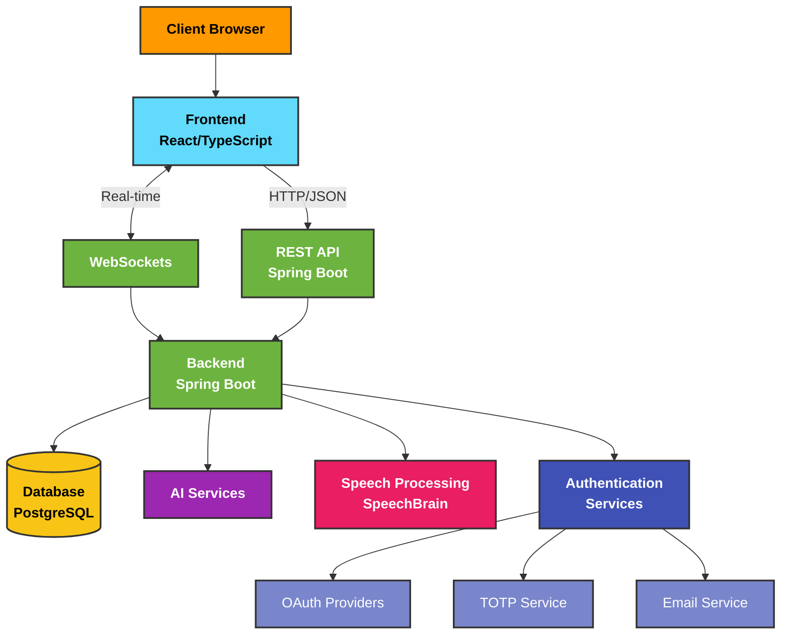

# Introduction Project

Comprehensive documentation of the full-stack application developed for Haaga-Helia University of Applied Sciences, featuring a TypeScript React frontend and Spring Boot backend with advanced speech processing capabilities.

## Project Overview

This documentation provides a detailed overview of the Haaga Backend Programming project, a sophisticated full-stack application built with React and TypeScript for the frontend and Spring Boot for the backend. The project demonstrates modern software development practices and includes various advanced features such as multi-factor authentication, role-based access control, real-time communication, task management, and AI-powered language processing.

### Key Features

- **Multi-factor Authentication** - Secure login with TOTP and email OTP options
- **OAuth2 Integration** - Login with Google, Facebook, and GitHub
- **Role-based Access Control** - Comprehensive permission system
- **Real-time Chat** - WebSocket-based messaging system
- **Kanban Board** - Task management with drag-and-drop functionality
- **Calendar** - Event scheduling and management
- **AI Assistants** - Intelligent virtual assistants for various tasks
- **Language AI** - Speech recognition and processing with SpeechBrain

## Tech Stack

### Frontend (study/typescript-react)

- React 18
- TypeScript
- Redux Toolkit
- React Router
- Ant Design
- TailwindCSS
- Vite
- Axios
- SockJS
- STOMP

### Backend (study/study)

- Spring Boot
- Spring Security
- Spring Data JPA
- JWT Authentication
- WebSockets
- SpeechBrain
- Hibernate
- PostgreSQL

## System Architecture

**System Architecture Diagram:**



The system architecture shows how different components interact. The client browser communicates with the React/TypeScript frontend, which in turn communicates with the Spring Boot backend through both REST API and WebSockets. The backend interacts with the database, AI services, speech processing, and authentication services.

## Getting Started

To navigate this documentation, use the sidebar on the left to explore different sections of the project.
Each page provides detailed information about specific components, including code examples, flowcharts,
and explanations of implementation details.

For a comprehensive understanding of the project, we recommend starting with the Architecture overview,
then exploring the Frontend and Backend sections to understand how different components interact with each other.

## Project Structure

Our project is organized as follows:

```
study/
├── typescript-react/         # Frontend application
│   ├── src/
│   │   ├── components/       # Reusable UI components
│   │   ├── pages/            # Main application views
│   │   ├── services/         # API interaction layers
│   │   ├── store/            # Redux state management
│   │   ├── types/            # TypeScript type definitions
│   │   ├── utils/            # Helper functions
│   │   ├── hooks/            # Custom React hooks
│   │   └── styles/           # CSS styles
│   ├── public/               # Static assets
│   └── package.json          # Frontend dependencies
│
└── study/                    # Backend application
    ├── src/
    │   ├── main/
    │   │   ├── java/         # Java source code
    │   │   └── resources/    # Configuration files
    │   └── test/             # Test files
    ├── speechbrain/          # Speech processing module
    │   ├── models/           # AI language models
    │   └── pretrained_models/ # Pre-trained speech models
    └── pom.xml               # Backend dependencies
```

## Learn More

Explore other sections of the documentation to learn more about the project:

- [System Architecture](/docs/architecture)
- [Frontend Documentation](/docs/frontend)
- [Backend Documentation](/docs/backend)
- [Deployment Guide](/docs/deployment)
