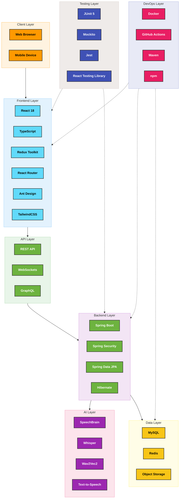

import PanzoomWrapper from '@site/src/components/MermaidDiagram/PanzoomWrapper';

<style>
{`
/* Modifying the icon size and header layout */
.tech-icon {
  margin-right: 0; /* No right margin */
  padding-top: 20px; /* Add padding to the top of the icon */
  grid-column: 1; /* Place in first column of grid */
}

/* For image icons */
img.tech-icon {
  width: 50px; /* Increased size */
  height: 50px; /* Increased size */
  object-fit: contain;
  padding: 2px; /* Add a small padding to prevent cutting off edges */
}

/* For emoji icons */
div.tech-icon {
  font-size: 40px; /* Increased size */
  line-height: 1;
}

/* Make header wrapper tighter */
.tech-card-header-wrapper {
  display: grid;
  grid-template-columns: 60px 1fr; /* Match the second style block */
  align-items: center;
  gap: 15px; /* Match the second style block */
  margin-bottom: 10px;
  padding: 0;
  width: 100%;
}

/* Ensure title is properly aligned */
.tech-card-title {
  margin: 0;
  padding: 0;
  line-height: 1.2; /* Tighter line height */
  grid-column: 2; /* Place in second column of grid */
}
`}
</style>

# Technology Stack

<div className="tech-stack-banner">
  <div className="tech-stack-banner-content">
    <h2>Enterprise-Grade Technology Ecosystem</h2>
    <p>A carefully curated selection of modern, scalable, and secure technologies powering Enterprise Nexus</p>
  </div>
</div>

<div className="tech-stack-overview">
  <div className="tech-stack-overview-item">
    <div className="tech-stack-overview-icon">⚛️</div>
    <div className="tech-stack-overview-count">25+</div>
    <div className="tech-stack-overview-label">Frontend Technologies</div>
  </div>
  <div className="tech-stack-overview-item">
    <div className="tech-stack-overview-icon">🍃</div>
    <div className="tech-stack-overview-count">30+</div>
    <div className="tech-stack-overview-label">Backend Technologies</div>
  </div>
  <div className="tech-stack-overview-item">
    <div className="tech-stack-overview-icon">🧠</div>
    <div className="tech-stack-overview-count">5+</div>
    <div className="tech-stack-overview-label">AI Components</div>
  </div>
  <div className="tech-stack-overview-item">
    <div className="tech-stack-overview-icon">🔒</div>
    <div className="tech-stack-overview-count">10+</div>
    <div className="tech-stack-overview-label">Security Features</div>
  </div>
</div>

## Technology Architecture

Enterprise Nexus implements a modern, layered architecture that ensures scalability, maintainability, and security:

<PanzoomWrapper>
<div id="tech-stack-diagram">

</div>
</PanzoomWrapper>
## Frontend Technologies

<div className="tech-category">
  <div className="tech-category-header">
    <div className="tech-category-icon">⚛️</div>
    <div className="tech-category-title">Core Framework & Language</div>
  </div>
  <div className="tech-grid">
    <div className="tech-card">
      <div className="tech-card-header-wrapper">
        
        <h3 className="tech-card-title">React 18</h3>
      </div>
      <div className="tech-card-description">
        JavaScript library for building user interfaces with component-based architecture. React 18 introduces concurrent rendering for improved performance and user experience.
      </div>
      <ul className="tech-card-features">
        <li><span className="tech-card-feature">Concurrent Mode</span></li>
        <li><span className="tech-card-feature">Server Components</span></li>
        <li><span className="tech-card-feature">Suspense</span></li>
      </ul>
    </div>

    <div className="tech-card">
      <div className="tech-card-header-wrapper">
        
        <h3 className="tech-card-title">TypeScript</h3>
      </div>
      <div className="tech-card-description">
        Strongly-typed superset of JavaScript that enhances code quality, developer experience, and enables better tooling and IDE support.
      </div>
      <ul className="tech-card-features">
        <li><span className="tech-card-feature">Static Typing</span></li>
        <li><span className="tech-card-feature">Type Inference</span></li>
        <li><span className="tech-card-feature">Interface Support</span></li>
      </ul>
    </div>

    <div className="tech-card">
      <div className="tech-card-header-wrapper">
        
        <h3 className="tech-card-title">Vite</h3>
      </div>
      <div className="tech-card-description">
        Modern, fast build tool and development server that leverages native ES modules for instant server start and lightning-fast HMR.
      </div>
      <ul className="tech-card-features">
        <li><span className="tech-card-feature">Hot Module Replacement</span></li>
        <li><span className="tech-card-feature">ES Module Based</span></li>
        <li><span className="tech-card-feature">Optimized Build</span></li>
      </ul>
    </div>
  </div>
</div>

<div className="tech-category">
  <div className="tech-category-header">
    <div className="tech-category-icon">🔄</div>
    <div className="tech-category-title">State Management</div>
  </div>
  <div className="tech-grid">
    <div className="tech-card">
      <div className="tech-card-header-wrapper">
        
        <h3 className="tech-card-title">Redux Toolkit</h3>
      </div>
      <div className="tech-card-description">
        Official, opinionated Redux toolset for efficient state management with simplified logic and reduced boilerplate code.
      </div>
      <ul className="tech-card-features">
        <li><span className="tech-card-feature">createSlice API</span></li>
        <li><span className="tech-card-feature">Immer Integration</span></li>
        <li><span className="tech-card-feature">RTK Query</span></li>
      </ul>
    </div>

    <div className="tech-card">
      <div className="tech-card-header-wrapper">
        
        <h3 className="tech-card-title">Redux Persist</h3>
      </div>
      <div className="tech-card-description">
        Persistence layer for Redux store that saves and rehydrates state between sessions, improving user experience.
      </div>
      <ul className="tech-card-features">
        <li><span className="tech-card-feature">Local Storage</span></li>
        <li><span className="tech-card-feature">Session Storage</span></li>
        <li><span className="tech-card-feature">Custom Storage</span></li>
      </ul>
    </div>
  </div>
</div>

<div className="tech-category">
  <div className="tech-category-header">
    <div className="tech-category-icon">🎨</div>
    <div className="tech-category-title">UI and Styling</div>
  </div>
  <div className="tech-grid">
    <div className="tech-card">
      <div className="tech-card-header-wrapper">
        
        <h3 className="tech-card-title">Ant Design</h3>
      </div>
      <div className="tech-card-description">
        Comprehensive UI component library with enterprise-grade features, accessibility, and internationalization support.
      </div>
      <ul className="tech-card-features">
        <li><span className="tech-card-feature">60+ Components</span></li>
        <li><span className="tech-card-feature">Customizable Themes</span></li>
        <li><span className="tech-card-feature">TypeScript Support</span></li>
      </ul>
    </div>

    <div className="tech-card">
      <div className="tech-card-header-wrapper">
        <div className="tech-icon">🎨</div>
        <h3 className="tech-card-title">TailwindCSS</h3>
      </div>
      <div className="tech-card-description">
        Utility-first CSS framework for rapid UI development with highly customizable design system and minimal CSS output.
      </div>
      <ul className="tech-card-features">
        <li><span className="tech-card-feature">Utility Classes</span></li>
        <li><span className="tech-card-feature">JIT Compiler</span></li>
        <li><span className="tech-card-feature">Design System</span></li>
      </ul>
    </div>

    <div className="tech-card">
      <div className="tech-card-header-wrapper">
        <div className="tech-icon">📦</div>
        <h3 className="tech-card-title">CSS Modules</h3>
      </div>
      <div className="tech-card-description">
        Scoped CSS for component styling that eliminates style conflicts and improves maintainability through local scope.
      </div>
      <ul className="tech-card-features">
        <li><span className="tech-card-feature">Local Scoping</span></li>
        <li><span className="tech-card-feature">Composition</span></li>
        <li><span className="tech-card-feature">TypeScript Integration</span></li>
      </ul>
    </div>
  </div>
</div>

<div className="tech-category">
  <div className="tech-category-header">
    <div className="tech-category-icon">🔌</div>
    <div className="tech-category-title">API Communication</div>
  </div>
  <div className="tech-grid">
    <div className="tech-card">
      <div className="tech-card-header-wrapper">
        
        <h3 className="tech-card-title">Axios</h3>
      </div>
      <div className="tech-card-description">
        Promise-based HTTP client for API requests with automatic transforms for JSON data, interceptors, and request cancellation.
      </div>
      <ul className="tech-card-features">
        <li><span className="tech-card-feature">Request/Response Interceptors</span></li>
        <li><span className="tech-card-feature">Automatic Transforms</span></li>
        <li><span className="tech-card-feature">Request Cancellation</span></li>
      </ul>
    </div>

    <div className="tech-card">
      <div className="tech-card-header-wrapper">
        <div className="tech-icon">🔌</div>
        <h3 className="tech-card-title">SockJS</h3>
      </div>
      <div className="tech-card-description">
        WebSocket emulation library that provides a consistent WebSocket API for browsers with fallbacks for older browsers.
      </div>
      <ul className="tech-card-features">
        <li><span className="tech-card-feature">Cross-browser Support</span></li>
        <li><span className="tech-card-feature">Fallback Transports</span></li>
        <li><span className="tech-card-feature">Reconnection Logic</span></li>
      </ul>
    </div>

    <div className="tech-card">
      <div className="tech-card-header-wrapper">
        <div className="tech-icon">📨</div>
        <h3 className="tech-card-title">STOMP</h3>
      </div>
      <div className="tech-card-description">
        Simple Text Oriented Messaging Protocol for WebSocket communication with pub/sub messaging patterns.
      </div>
      <ul className="tech-card-features">
        <li><span className="tech-card-feature">Topic Subscription</span></li>
        <li><span className="tech-card-feature">Message Headers</span></li>
        <li><span className="tech-card-feature">Acknowledgments</span></li>
      </ul>
    </div>
  </div>
</div>

## Backend Technologies

<div className="tech-category">
  <div className="tech-category-header">
    <div className="tech-category-icon">🍃</div>
    <div className="tech-category-title">Core Framework</div>
  </div>
  <div className="tech-grid">
    <div className="tech-card">
      <div className="tech-card-header-wrapper">
        <div className="tech-icon">🍃</div>
        <h3 className="tech-card-title">Spring Boot</h3>
      </div>
      <div className="tech-card-description">
        Java-based framework for building production-ready applications with minimal configuration and embedded server support.
      </div>
      <ul className="tech-card-features">
        <li><span className="tech-card-feature">Auto-configuration</span></li>
        <li><span className="tech-card-feature">Embedded Servers</span></li>
        <li><span className="tech-card-feature">Production-ready Features</span></li>
      </ul>
    </div>

    <div className="tech-card">
      <div className="tech-card-header-wrapper">
        <div className="tech-icon">🌐</div>
        <h3 className="tech-card-title">Spring MVC</h3>
      </div>
      <div className="tech-card-description">
        Model-View-Controller framework for building web applications with request mapping, validation, and content negotiation.
      </div>
      <ul className="tech-card-features">
        <li><span className="tech-card-feature">RESTful APIs</span></li>
        <li><span className="tech-card-feature">Content Negotiation</span></li>
        <li><span className="tech-card-feature">Validation</span></li>
      </ul>
    </div>

    <div className="tech-card">
      <div className="tech-card-header-wrapper">
        <div className="tech-icon">⚡</div>
        <h3 className="tech-card-title">Spring WebFlux</h3>
      </div>
      <div className="tech-card-description">
        Reactive programming model for building non-blocking, asynchronous applications with high concurrency and resource efficiency.
      </div>
      <ul className="tech-card-features">
        <li><span className="tech-card-feature">Reactive Streams</span></li>
        <li><span className="tech-card-feature">Non-blocking I/O</span></li>
        <li><span className="tech-card-feature">Backpressure Support</span></li>
      </ul>
    </div>
  </div>
</div>

<div className="tech-category">
  <div className="tech-category-header">
    <div className="tech-category-icon">🔒</div>
    <div className="tech-category-title">Security</div>
  </div>
  <div className="tech-grid">
    <div className="tech-card">
      <div className="tech-card-header-wrapper">
        <div className="tech-icon">🔒</div>
        <h3 className="tech-card-title">Spring Security</h3>
      </div>
      <div className="tech-card-description">
        Comprehensive security framework for authentication, authorization, and protection against common security vulnerabilities.
      </div>
      <ul className="tech-card-features">
        <li><span className="tech-card-feature">Authentication</span></li>
        <li><span className="tech-card-feature">Authorization</span></li>
        <li><span className="tech-card-feature">CSRF Protection</span></li>
      </ul>
    </div>

    <div className="tech-card">
      <div className="tech-card-header-wrapper">
        
        <h3 className="tech-card-title">JWT Authentication</h3>
      </div>
      <div className="tech-card-description">
        JSON Web Token-based authentication for stateless, secure API access with claims-based identity information.
      </div>
      <ul className="tech-card-features">
        <li><span className="tech-card-feature">Stateless Authentication</span></li>
        <li><span className="tech-card-feature">Signature Verification</span></li>
        <li><span className="tech-card-feature">Claims-based Identity</span></li>
      </ul>
    </div>

    <div className="tech-card">
      <div className="tech-card-header-wrapper">
        
        <h3 className="tech-card-title">OAuth2</h3>
      </div>
      <div className="tech-card-description">
        Industry-standard protocol for authorization that enables secure third-party access to resources without sharing credentials.
      </div>
      <ul className="tech-card-features">
        <li><span className="tech-card-feature">Authorization Code Flow</span></li>
        <li><span className="tech-card-feature">Resource Server</span></li>
        <li><span className="tech-card-feature">Token Management</span></li>
      </ul>
    </div>

    <div className="tech-card">
      <div className="tech-card-header-wrapper">
        <div className="tech-icon">🔑</div>
        <h3 className="tech-card-title">TOTP</h3>
      </div>
      <div className="tech-card-description">
        Time-based One-Time Password algorithm for two-factor authentication with temporary codes generated from a shared secret.
      </div>
      <ul className="tech-card-features">
        <li><span className="tech-card-feature">Two-Factor Authentication</span></li>
        <li><span className="tech-card-feature">Time-based Codes</span></li>
        <li><span className="tech-card-feature">QR Code Generation</span></li>
      </ul>
    </div>
  </div>
</div>

<div className="tech-category">
  <div className="tech-category-header">
    <div className="tech-category-icon">🗄️</div>
    <div className="tech-category-title">Data Access</div>
  </div>
  <div className="tech-grid">
    <div className="tech-card">
      <div className="tech-card-header-wrapper">
        <div className="tech-icon">🗄️</div>
        <h3 className="tech-card-title">Spring Data JPA</h3>
      </div>
      <div className="tech-card-description">
        Data access abstraction that simplifies database operations with repository interfaces and query methods.
      </div>
      <ul className="tech-card-features">
        <li><span className="tech-card-feature">Repository Pattern</span></li>
        <li><span className="tech-card-feature">Query Methods</span></li>
        <li><span className="tech-card-feature">Pagination & Sorting</span></li>
      </ul>
    </div>

    <div className="tech-card">
      <div className="tech-card-header-wrapper">
        
        <h3 className="tech-card-title">Hibernate</h3>
      </div>
      <div className="tech-card-description">
        Object-relational mapping framework that maps Java objects to database tables with lazy loading and caching.
      </div>
      <ul className="tech-card-features">
        <li><span className="tech-card-feature">ORM Mapping</span></li>
        <li><span className="tech-card-feature">Caching</span></li>
        <li><span className="tech-card-feature">Lazy Loading</span></li>
      </ul>
    </div>

    <div className="tech-card">
      <div className="tech-card-header-wrapper">
        
        <h3 className="tech-card-title">MySQL</h3>
      </div>
      <div className="tech-card-description">
        Open-source relational database management system with ACID compliance, transactions, and robust data integrity.
      </div>
      <ul className="tech-card-features">
        <li><span className="tech-card-feature">ACID Compliance</span></li>
        <li><span className="tech-card-feature">Transactions</span></li>
        <li><span className="tech-card-feature">Indexing</span></li>
      </ul>
    </div>

    <div className="tech-card">
      <div className="tech-card-header-wrapper">
        <div className="tech-icon">🔄</div>
        <h3 className="tech-card-title">Flyway</h3>
      </div>
      <div className="tech-card-description">
        Database migration tool that enables version control for database schemas with SQL-based migrations.
      </div>
      <ul className="tech-card-features">
        <li><span className="tech-card-feature">Version Control</span></li>
        <li><span className="tech-card-feature">SQL Migrations</span></li>
        <li><span className="tech-card-feature">Schema History</span></li>
      </ul>
    </div>
  </div>
</div>

## AI Technologies

<div className="tech-category">
  <div className="tech-category-header">
    <div className="tech-category-icon">🧠</div>
    <div className="tech-category-title">Speech Recognition</div>
  </div>
  <div className="tech-grid">
    <div className="tech-card">
      <div className="tech-card-header-wrapper">
        <div className="tech-icon">🧠</div>
        <h3 className="tech-card-title">SpeechBrain</h3>
      </div>
      <div className="tech-card-description">
        PyTorch-based speech toolkit for speech recognition, speaker identification, and speech enhancement with pre-trained models.
      </div>
      <div className="tech-card-features">
        <span className="tech-card-feature">ASR Models</span>
        <span className="tech-card-feature">Speaker Recognition</span>
        <span className="tech-card-feature">Speech Enhancement</span>
      </div>
    </div>

    <div className="tech-card">
      <div className="tech-card-header-wrapper">
        <div className="tech-icon">🎤</div>
        <h3 className="tech-card-title">Whisper</h3>
      </div>
      <div className="tech-card-description">
        OpenAI's automatic speech recognition system trained on diverse audio with multilingual capabilities and robust performance.
      </div>
      <div className="tech-card-features">
        <span className="tech-card-feature">Multilingual Support</span>
        <span className="tech-card-feature">Robust to Noise</span>
        <span className="tech-card-feature">Timestamp Generation</span>
      </div>
    </div>

    <div className="tech-card">
      <div className="tech-card-header-wrapper">
        
        <h3 className="tech-card-title">Wav2Vec2</h3>
      </div>
      <div className="tech-card-description">
        Self-supervised learning framework for speech recognition that learns from unlabeled audio data with fine-tuning capabilities.
      </div>
      <div className="tech-card-features">
        <span className="tech-card-feature">Self-supervised Learning</span>
        <span className="tech-card-feature">Contextual Representations</span>
        <span className="tech-card-feature">Fine-tuning</span>
      </div>
    </div>
  </div>
</div>

<div className="tech-category">
  <div className="tech-category-header">
    <div className="tech-category-icon">🔊</div>
    <div className="tech-category-title">Speech Synthesis</div>
  </div>
  <div className="tech-grid">
    <div className="tech-card">
      <div className="tech-card-header-wrapper">
        <div className="tech-icon">🔊</div>
        <h3 className="tech-card-title">Text-to-Speech</h3>
      </div>
      <div className="tech-card-description">
        Neural text-to-speech synthesis system that converts text to natural-sounding speech with prosody and emotion control.
      </div>
      <div className="tech-card-features">
        <span className="tech-card-feature">Natural Prosody</span>
        <span className="tech-card-feature">Voice Customization</span>
        <span className="tech-card-feature">SSML Support</span>
      </div>
    </div>
  </div>
</div>

## DevOps & Tooling

<div className="tech-category">
  <div className="tech-category-header">
    <div className="tech-category-icon">🛠️</div>
    <div className="tech-category-title">Containerization & CI/CD</div>
  </div>
  <div className="tech-grid">
    <div className="tech-card">
      <div className="tech-card-header-wrapper">
        
        <h3 className="tech-card-title">Docker</h3>
      </div>
      <div className="tech-card-description">
        Containerization platform that packages applications and dependencies into isolated containers for consistent deployment.
      </div>
      <div className="tech-card-features">
        <span className="tech-card-feature">Containerization</span>
        <span className="tech-card-feature">Docker Compose</span>
        <span className="tech-card-feature">Multi-stage Builds</span>
      </div>
    </div>

    <div className="tech-card">
      <div className="tech-card-header-wrapper">
        
        <h3 className="tech-card-title">GitHub Actions</h3>
      </div>
      <div className="tech-card-description">
        CI/CD platform integrated with GitHub that automates build, test, and deployment workflows with event-driven triggers.
      </div>
      <div className="tech-card-features">
        <span className="tech-card-feature">Workflow Automation</span>
        <span className="tech-card-feature">Matrix Builds</span>
        <span className="tech-card-feature">Artifact Management</span>
      </div>
    </div>

    <div className="tech-card">
      <div className="tech-card-header-wrapper">
        
        <h3 className="tech-card-title">Maven</h3>
      </div>
      <div className="tech-card-description">
        Build automation and dependency management tool for Java projects with declarative configuration and lifecycle management.
      </div>
      <div className="tech-card-features">
        <span className="tech-card-feature">Dependency Management</span>
        <span className="tech-card-feature">Build Lifecycle</span>
        <span className="tech-card-feature">Plugin Ecosystem</span>
      </div>
    </div>

    <div className="tech-card">
      <div className="tech-card-header-wrapper">
        <div className="tech-icon">📦</div>
        <h3 className="tech-card-title">npm</h3>
      </div>
      <div className="tech-card-description">
        Package manager for JavaScript that manages dependencies, runs scripts, and publishes packages with version control.
      </div>
      <div className="tech-card-features">
        <span className="tech-card-feature">Package Management</span>
        <span className="tech-card-feature">Script Running</span>
        <span className="tech-card-feature">Semantic Versioning</span>
      </div>
    </div>
  </div>
</div>

<style>
{`
  /* Banner styling */
  .tech-stack-banner {
    background: linear-gradient(135deg, #4285f4, #34a853, #fbbc04, #ea4335);
    border-radius: 8px;
    padding: 30px;
    margin-bottom: 30px;
    color: white;
    text-align: center;
  }

  .tech-stack-banner-content h2 {
    font-size: 2rem;
    margin-bottom: 10px;
    font-weight: 700;
  }

  .tech-stack-banner-content p {
    font-size: 1.1rem;
    max-width: 800px;
    margin: 0 auto;
  }

  /* Overview section */
  .tech-stack-overview {
    display: flex;
    justify-content: space-between;
    flex-wrap: wrap;
    gap: 20px;
    margin-bottom: 40px;
  }

  .tech-stack-overview-item {
    flex: 1;
    min-width: 200px;
    background-color: #f8f9fa;
    border-radius: 8px;
    padding: 20px;
    text-align: center;
    box-shadow: 0 2px 4px rgba(0,0,0,0.05);
    transition: transform 0.2s, box-shadow 0.2s;
  }

  .tech-stack-overview-item:hover {
    transform: translateY(-5px);
    box-shadow: 0 4px 8px rgba(0,0,0,0.1);
  }

  .tech-stack-overview-icon {
    font-size: 2.5rem;
    margin-bottom: 10px;
  }

  .tech-stack-overview-count {
    font-size: 1.8rem;
    font-weight: 700;
    margin-bottom: 5px;
    color: #4285f4;
  }

  .tech-stack-overview-label {
    font-size: 1rem;
    color: #5f6368;
  }

  /* Category styling */
  .tech-category {
    margin-bottom: 40px;
  }

  .tech-category-header {
    display: flex;
    align-items: center;
    margin-bottom: 20px;
    padding-bottom: 10px;
    border-bottom: 2px solid #f0f0f0;
  }

  .tech-category-icon {
    font-size: 1.8rem;
    margin-right: 15px;
  }

  .tech-category-title {
    font-size: 1.5rem;
    font-weight: 600;
    color: #202124;
  }

  /* Grid layout for cards */
  .tech-grid {
    display: grid;
    grid-template-columns: repeat(auto-fill, minmax(300px, 1fr));
    gap: 20px;
  }

  /* Card styling */
  .tech-card {
    background-color: #ffffff;
    background-image: linear-gradient(135deg, #ffffff 0%, #f8f9fa 100%);
    border-radius: 16px; /* More rounded corners */
    padding: 28px; /* More generous padding */
    box-shadow: 0 4px 12px rgba(0,0,0,0.05), 0 1px 3px rgba(0,0,0,0.02); /* Enhanced shadow */
    transition: all 0.4s cubic-bezier(0.165, 0.84, 0.44, 1); /* Smooth, professional animation */
    display: flex;
    flex-direction: column;
    height: 100%;
    border: 1px solid rgba(0,0,0,0.06); /* Subtle border */
    position: relative; /* For decorative elements */
    overflow: hidden; /* Ensure nothing spills out */
  }

  /* Add subtle decorative corner accent */
  .tech-card:before {
    content: "";
    position: absolute;
    top: 0;
    right: 0;
    width: 60px;
    height: 60px;
    background: linear-gradient(135deg, transparent 50%, rgba(66, 133, 244, 0.08) 50%);
    border-radius: 0 0 0 60px;
    opacity: 0;
    transition: opacity 0.4s ease;
  }

  .tech-card:hover {
    transform: translateY(-8px);
    box-shadow: 0 16px 24px rgba(0,0,0,0.1), 0 6px 12px rgba(0,0,0,0.08);
    border-color: rgba(66, 133, 244, 0.3); /* More visible blue border on hover */
  }

  .tech-card:hover:before {
    opacity: 1;
  }

  .tech-card-header-wrapper {
    display: grid;
    grid-template-columns: 70px 1fr; /* More space for icon */
    align-items: center;
    gap: 16px; /* Consistent with design systems */
    margin-bottom: 20px;
    padding-bottom: 16px;
    width: 100%;
    position: relative; /* For the pseudo-element */
    overflow: visible;
    border-bottom: none; /* Remove border, we'll use pseudo-element instead */
  }

  /* Replace border with gradient line */
  .tech-card-header-wrapper:after {
    content: "";
    position: absolute;
    bottom: 0;
    left: 0;
    width: 100%;
    height: 3px; /* Thicker for more presence */
    background: linear-gradient(to right, #4285f4, #34a853, #fbbc04, #ea4335);
    opacity: 0.7; /* Subtle gradient */
    border-radius: 3px;
    transition: all 0.3s ease;
  }

  .tech-card:hover .tech-card-header-wrapper:after {
    opacity: 0.9;
    transform: scaleX(1.02); /* Subtle grow effect */
    box-shadow: 0 1px 3px rgba(0,0,0,0.1);
  }

  html[data-theme='dark'] .tech-card-header-wrapper:after {
    opacity: 0.5; /* More subtle in dark mode */
    background: linear-gradient(to right, #8ab4f8, #81c995, #fde293, #f28b82);
  }

  html[data-theme='dark'] .tech-card:hover .tech-card-header-wrapper:after {
    opacity: 0.7;
  }

  .tech-icon {
    background-color: #f8f9fa;
    background-image: linear-gradient(135deg, #ffffff 0%, #f1f3f4 100%);
    border-radius: 14px; /* Match card radius */
    padding: 14px; /* More padding for better visual */
    grid-column: 1;
    display: flex;
    align-items: center;
    justify-content: center;
    box-shadow: 0 4px 8px rgba(0,0,0,0.06); /* Enhanced shadow for depth */
    transition: all 0.4s cubic-bezier(0.175, 0.885, 0.32, 1.275); /* Bouncy animation */
    border: 1px solid rgba(0,0,0,0.03);
  }

  .tech-card:hover .tech-icon {
    transform: scale(1.08) rotate(3deg); /* More dynamic hover effect */
    box-shadow: 0 6px 12px rgba(0,0,0,0.1);
    border-color: rgba(66, 133, 244, 0.2);
  }

  img.tech-icon {
    width: 52px;
    height: 52px;
    object-fit: contain;
    padding: 0; /* Remove padding from image itself */
    filter: drop-shadow(0 2px 3px rgba(0,0,0,0.1)); /* Subtle shadow for icons */
  }

  div.tech-icon {
    font-size: 40px; /* Slightly larger for better visibility */
    filter: drop-shadow(0 2px 3px rgba(0,0,0,0.1)); /* Matching shadow for emoji icons */
  }

  .tech-card-title {
    font-size: 1.4rem; /* Larger */
    font-weight: 600;
    color: #202124;
    line-height: 1.3;
    margin: 0;
    padding: 0;
    grid-column: 2;
    letter-spacing: -0.01em; /* Tighter letter spacing for headings */
    position: relative;
    transition: all 0.3s ease;
    text-shadow: 0 1px 2px rgba(0,0,0,0.05);
  }

  .tech-card:hover .tech-card-title {
    color: #1a73e8; /* Highlight color on hover */
    transform: translateX(3px); /* Subtle shift on hover */
  }

  .tech-card-description {
    font-size: 0.95rem;
    color: #5f6368;
    margin-bottom: 28px; /* More space before features */
    flex-grow: 1;
    width: 100%;
    line-height: 1.7; /* Better readability */
    letter-spacing: 0.01em;
    position: relative;
    transition: all 0.3s ease;
  }

  .tech-card:hover .tech-card-description {
    color: #3c4043; /* Slightly darker on hover for better contrast */
  }

  /* Dark mode styles for card */
  html[data-theme='dark'] .tech-card {
    background-color: #1e1e1e;
    background-image: linear-gradient(135deg, #1e1e1e 0%, #2d2d2d 100%);
    border-color: rgba(255,255,255,0.1);
  }

  html[data-theme='dark'] .tech-card:before {
    background: linear-gradient(135deg, transparent 50%, rgba(138, 180, 248, 0.12) 50%);
  }

  html[data-theme='dark'] .tech-icon {
    background-color: #2d2d2d;
    background-image: linear-gradient(135deg, #2d2d2d 0%, #383838 100%);
    border-color: rgba(255,255,255,0.08);
  }

  html[data-theme='dark'] .tech-card-title {
    color: #e3e3e3;
    text-shadow: 0 1px 3px rgba(0,0,0,0.2);
  }

  html[data-theme='dark'] .tech-card:hover .tech-card-title {
    color: #8ab4f8; /* Blue highlight in dark mode */
  }

  html[data-theme='dark'] .tech-card-description {
    color: #b0b0b0;
  }

  html[data-theme='dark'] .tech-card:hover .tech-card-description {
    color: #d2d2d2; /* Lighter on hover for better contrast in dark mode */
  }

  .tech-card-features {
    display: flex;
    flex-wrap: wrap;
    width: 100%;
    margin-top: auto; /* Push to bottom of card */
    padding-top: 16px;
    position: relative;
    border-top: none; /* Remove border, we'll use pseudo-element instead */
    list-style-type: none; /* Remove default list bullets */
    padding-left: 0; /* Remove default list padding */
    margin-bottom: 0; /* Remove default list margin */
    justify-content: center; /* Center align the list items */
  }

  /* Replace dashed border with subtle gradient background */
  .tech-card-features:before {
    content: "";
    position: absolute;
    top: 0;
    left: 0;
    right: 0;
    height: 2px;
    background: linear-gradient(to right, rgba(66, 133, 244, 0.2) 0%, rgba(52, 168, 83, 0.2) 33%, rgba(251, 188, 4, 0.2) 66%, rgba(234, 67, 53, 0.2) 100%);
    border-radius: 2px;
  }

  html[data-theme='dark'] .tech-card-features:before {
    background: linear-gradient(to right, rgba(138, 180, 248, 0.2) 0%, rgba(129, 201, 149, 0.2) 33%, rgba(253, 214, 99, 0.2) 66%, rgba(242, 139, 130, 0.2) 100%);
    opacity: 0.7;
  }

  .tech-card-features li {
    display: inline-flex;
    margin: 5px; /* Equal margin on all sides for better centering */
    justify-content: center; /* Center the content of each list item */
    animation: fadeIn 0.5s ease-out forwards;
    opacity: 0;
  }

  /* Staggered animation for list items */
  .tech-card-features li:nth-child(1) { animation-delay: 0.1s; }
  .tech-card-features li:nth-child(2) { animation-delay: 0.2s; }
  .tech-card-features li:nth-child(3) { animation-delay: 0.3s; }

  @keyframes fadeIn {
    from { opacity: 0; transform: translateY(5px); }
    to { opacity: 1; transform: translateY(0); }
  }

  .tech-card-feature {
    display: inline-flex;
    align-items: center;
    background-color: #f1f3f4;
    background-image: linear-gradient(135deg, #f1f3f4 0%, #e8eaed 100%);
    color: #202124;
    font-size: 0.85rem;
    padding: 8px 14px;
    border-radius: 20px; /* More rounded pill shape */
    font-weight: 500;
    transition: all 0.3s cubic-bezier(0.175, 0.885, 0.32, 1.275);
    box-shadow: 0 2px 4px rgba(0,0,0,0.04);
    border: 1px solid rgba(0,0,0,0.03);
  }

  .tech-card-feature:hover {
    background-color: #e8f0fe;
    background-image: linear-gradient(135deg, #e8f0fe 0%, #d2e3fc 100%);
    color: #1a73e8;
    transform: translateY(-3px) scale(1.05);
    box-shadow: 0 4px 8px rgba(26, 115, 232, 0.15);
    border-color: rgba(66, 133, 244, 0.3);
  }

  html[data-theme='dark'] .tech-card-feature {
    background-color: #333;
    background-image: linear-gradient(135deg, #333 0%, #2d2d2d 100%);
    color: #e3e3e3;
    border-color: rgba(255,255,255,0.08);
  }

  html[data-theme='dark'] .tech-card-feature:hover {
    background-color: #444;
    background-image: linear-gradient(135deg, #444 0%, #3d3d3d 100%);
    color: #8ab4f8;
    box-shadow: 0 4px 8px rgba(138, 180, 248, 0.2);
    border-color: rgba(138, 180, 248, 0.3);
  }

  /* Mermaid diagram styling */
  #tech-stack-diagram {
    width: 100%;
    overflow-x: auto;
    margin-bottom: 30px;
  }

  /* Responsive adjustments */
  @media (max-width: 768px) {
    .tech-stack-banner-content h2 {
      font-size: 1.5rem;
    }

    .tech-stack-banner-content p {
      font-size: 1rem;
    }

    .tech-stack-overview-item {
      min-width: 150px;
    }

    .tech-grid {
      grid-template-columns: 1fr;
    }

    .tech-category-title {
      font-size: 1.3rem;
    }
  }

  /* Rationale section styling */
  .tech-rationale {
    background-color: #f8f9fa;
    border-radius: 8px;
    padding: 25px;
    margin-top: 40px;
    margin-bottom: 40px;
  }

  .tech-rationale-header {
    font-size: 1.5rem;
    font-weight: 600;
    margin-bottom: 15px;
    color: #202124;
  }

  .tech-rationale-text {
    font-size: 1rem;
    line-height: 1.6;
    color: #5f6368;
  }

  .tech-rationale-points {
    margin-top: 20px;
  }

  .tech-rationale-point {
    display: flex;
    margin-bottom: 15px;
  }

  .tech-rationale-point-icon {
    font-size: 1.2rem;
    margin-right: 10px;
    color: #4285f4;
  }

  .tech-rationale-point-text {
    flex: 1;
  }

  /* Dark mode styles for rationale section */
  html[data-theme='dark'] .tech-rationale {
    background-color: #2d2d2d;
  }

  html[data-theme='dark'] .tech-rationale-header {
    color: #e3e3e3;
  }

  html[data-theme='dark'] .tech-rationale-text {
    color: #b0b0b0;
  }

  html[data-theme='dark'] .tech-rationale-point-icon {
    color: #8ab4f8;
  }
`}
</style>
```
