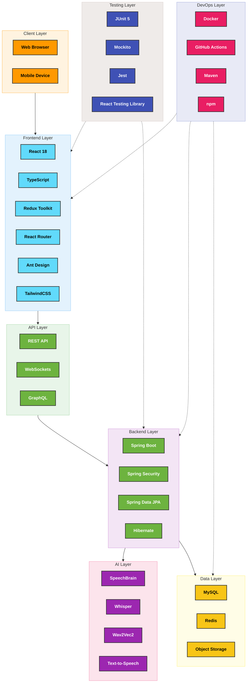

# Technology Stack

  

    <h2>Enterprise-Grade Technology Ecosystem</h2>
    
A carefully curated selection of modern, scalable, and secure technologies powering Enterprise Nexus

  

  

    
⚛️

    
25+

    
Frontend Technologies

  

  

    
🍃

    
30+

    
Backend Technologies

  

  

    
🧠

    
5+

    
AI Components

  

  

    
🔒

    
10+

    
Security Features

  

## Technology Architecture

Enterprise Nexus implements a modern, layered architecture that ensures scalability, maintainability, and security:

## Frontend Technologies

  

    
⚛️

    
Core Framework & Language

  

  

    

      

        
        <h3 className="tech-card-title">React 18</h3>
      

      

        JavaScript library for building user interfaces with component-based architecture. React 18 introduces concurrent rendering for improved performance and user experience.
      

      

        Concurrent Mode
        Server Components
        Suspense
      

    

    
    

      

        
        <h3 className="tech-card-title">TypeScript</h3>
      

      

        Strongly-typed superset of JavaScript that enhances code quality, developer experience, and enables better tooling and IDE support.
      

      

        Static Typing
        Type Inference
        Interface Support
      

    

    
    

      

        
        <h3 className="tech-card-title">Vite</h3>
      

      

        Modern, fast build tool and development server that leverages native ES modules for instant server start and lightning-fast HMR.
      

      

        Hot Module Replacement
        ES Module Based
        Optimized Build
      

    

  

  

    
🔄

    
State Management

  

  

    

      

        
        <h3 className="tech-card-title">Redux Toolkit</h3>
      

      

        Official, opinionated Redux toolset for efficient state management with simplified logic and reduced boilerplate code.
      

      

        createSlice API
        Immer Integration
        RTK Query
      

    

    
    

      

        
        <h3 className="tech-card-title">Redux Persist</h3>
      

      

        Persistence layer for Redux store that saves and rehydrates state between sessions, improving user experience.
      

      

        Local Storage
        Session Storage
        Custom Storage
      

    

  

  

    
🎨

    
UI and Styling

  

  

    

      

        
        <h3 className="tech-card-title">Ant Design</h3>
      

      

        Comprehensive UI component library with enterprise-grade features, accessibility, and internationalization support.
      

      

        
60+ Components

        
Customizable Themes

        
TypeScript Support

      

    

    
    

      

        
🎨

        <h3 className="tech-card-title">TailwindCSS</h3>
      

      

        Utility-first CSS framework for rapid UI development with highly customizable design system and minimal CSS output.
      

      

        
Utility Classes

        
JIT Compiler

        
Design System

      

    

    
    

      

        
📦

        <h3 className="tech-card-title">CSS Modules</h3>
      

      

        Scoped CSS for component styling that eliminates style conflicts and improves maintainability through local scope.
      

      

        Local Scoping
        Composition
        TypeScript Integration
      

    

  

  

    
🔌

    
API Communication

  

  

    

      

        
        <h3 className="tech-card-title">Axios</h3>
      

      

        Promise-based HTTP client for API requests with automatic transforms for JSON data, interceptors, and request cancellation.
      

      

        Request/Response Interceptors
        Automatic Transforms
        Request Cancellation
      

    

    
    

      

        
🔌

        <h3 className="tech-card-title">SockJS</h3>
      

      

        WebSocket emulation for browsers without WebSocket support, providing fallback transport mechanisms for real-time communication.
      

      

        WebSocket Emulation
        Fallback Transports
        Cross-Browser Support
      

    

    
    

      

        
📨

        <h3 className="tech-card-title">STOMP</h3>
      

      

        Simple Text Oriented Messaging Protocol for WebSocket communication, providing a messaging pattern for real-time features.
      

      

        Message Patterns
        Topic Subscription
        Message Headers
      

    

  

## Backend Technologies

  

    
🍃

    
Core Framework

  

  

    

      

        
🍃

        <h3 className="tech-card-title">Spring Boot</h3>
      

      

        Java-based framework for creating stand-alone, production-grade applications with minimal configuration and maximum productivity.
      

      

        Auto-configuration
        Embedded Servers
        Production-ready Features
      

    

    
    

      

        
🌐

        <h3 className="tech-card-title">Spring MVC</h3>
      

      

        Web framework for building RESTful APIs with a model-view-controller architecture and comprehensive request handling.
      

      

        RESTful Controllers
        Request Mapping
        Content Negotiation
      

    

    
    

      

        
⚡

        <h3 className="tech-card-title">Spring WebFlux</h3>
      

      

        Reactive programming support for specific components, enabling non-blocking, event-driven applications with backpressure.
      

      

        Reactive Streams
        Non-blocking I/O
        Functional Endpoints
      

    

  

  

    
🔒

    
Security

  

  

    

      

        
🔒

        <h3 className="tech-card-title">Spring Security</h3>
      

      

        Authentication and authorization framework with comprehensive security features for enterprise applications.
      

      

        Authentication Providers
        Method Security
        CSRF Protection
      

    

    
    

      

        
        <h3 className="tech-card-title">JWT Authentication</h3>
      

      

        Stateless authentication mechanism using JSON Web Tokens for secure transmission of information between parties.
      

      

        Stateless Authentication
        Signature Verification
        Claim-based Authorization
      

    

    
    

      

        
        <h3 className="tech-card-title">OAuth2</h3>
      

      

        Protocol for authorization that enables third-party applications to obtain limited access to a user's account.
      

      

        Authorization Code Flow
        Resource Owner Password Flow
        Client Credentials Flow
      

    

    
    

      

        
🔑

        <h3 className="tech-card-title">TOTP</h3>
      

      

        Time-based One-Time Password for multi-factor authentication, generating temporary codes based on a shared secret.
      

      

        Time-based Codes
        Replay Protection
        HMAC-based Algorithm
      

    

  

  

    
🗄️

    
Data Access

  

  

    

      

        
🗄️

        <h3 className="tech-card-title">Spring Data JPA</h3>
      

      

        Data access abstraction that simplifies the implementation of data access layers by reducing boilerplate code.
      

      

        Repository Pattern
        Query Methods
        Pagination & Sorting
      

    

    
    

      

        
        <h3 className="tech-card-title">Hibernate</h3>
      

      

        Object-relational mapping framework that provides a framework for mapping an object-oriented domain model to a relational database.
      

      

        ORM Mapping
        Lazy Loading
        Caching
      

    

    
    

      

        
        <h3 className="tech-card-title">MySQL</h3>
      

      

        Popular open-source relational database management system known for its reliability, scalability, and ease of use in web applications.
      

      

        ACID Compliance
        InnoDB Engine
        Full-Text Search
      

    

    
    

      

        
🔄

        <h3 className="tech-card-title">Flyway</h3>
      

      

        Database migration tool that enables version control for database schemas and seamless evolution of database structure.
      

      

        Version Control
        Migration Scripts
        Repeatable Migrations
      

    

  

## AI and Speech Processing

  

    
🧠

    
AI Technologies

  

  

    

      

        
🧠

        <h3 className="tech-card-title">SpeechBrain</h3>
      

      

        PyTorch-based speech toolkit for speech processing, including speech recognition, speaker recognition, and speech enhancement.
      

      

        Speech Recognition
        Speaker Identification
        Speech Enhancement
      

    

    
    

      

        
🎤

        <h3 className="tech-card-title">Whisper</h3>
      

      

        Speech recognition model developed by OpenAI that approaches human-level robustness and accuracy in speech recognition.
      

      

        Multilingual Support
        Noise Robustness
        Transcription & Translation
      

    

    
    

      

        
        <h3 className="tech-card-title">Wav2Vec2</h3>
      

      

        Speech-to-text model for Finnish language, leveraging self-supervised learning to improve speech recognition accuracy.
      

      

        Finnish Language Support
        Self-supervised Learning
        Contextual Representations
      

    

    
    

      

        
🔊

        <h3 className="tech-card-title">Text-to-Speech</h3>
      

      

        Voice synthesis capabilities that convert text into natural-sounding speech with control over voice characteristics.
      

      

        Natural Voice Synthesis
        Multiple Voice Options
        Prosody Control
      

    

  

## Development and Deployment

  

    
🚀

    
DevOps Tools

  

  

    

      

        
        <h3 className="tech-card-title">Docker</h3>
      

      

        Platform for developing, shipping, and running applications in containers, ensuring consistency across environments.
      

      

        Containerization
        Environment Isolation
        Reproducible Builds
      

    

    
    

      

        
        <h3 className="tech-card-title">GitHub Actions</h3>
      

      

        Continuous integration and deployment platform that automates build, test, and deployment workflows directly from GitHub.
      

      

        CI/CD Pipelines
        Workflow Automation
        Matrix Builds
      

    

    
    

      

        
        <h3 className="tech-card-title">Maven</h3>
      

      

        Build automation and dependency management tool for Java projects that simplifies the build process.
      

      

        Dependency Management
        Build Lifecycle
        Project Object Model
      

    

    
    

      

        
📦

        <h3 className="tech-card-title">npm</h3>
      

      

        Package manager for JavaScript that automates the process of installing, upgrading, configuring, and removing packages.
      

      

        Package Management
        Dependency Resolution
        Script Running
      

    

  

## Technology Selection Rationale

  

    
⚖️

    

      <h3>Enterprise-Grade Stability</h3>
      
Our technology stack prioritizes battle-tested frameworks and libraries with proven track records in enterprise environments. Spring Boot and React provide robust foundations with extensive community support and regular security updates.

    

  

  
  

    
🔍

    

      <h3>Developer Experience</h3>
      
TypeScript and modern tooling like Vite enhance developer productivity through static typing, fast feedback loops, and comprehensive IDE support. This leads to fewer bugs, better code quality, and faster development cycles.

    

  

  
  

    
📈

    

      <h3>Scalability & Performance</h3>
      
Our architecture is designed for horizontal scalability with stateless components, efficient caching strategies, and optimized database access patterns. Technologies like WebSockets enable real-time features without sacrificing performance.

    

  

  
  

    
🔒

    

      <h3>Security First Approach</h3>
      
Security is integrated at every layer with Spring Security, multi-factor authentication, and encrypted communication channels. Our token-based authentication system implements industry best practices for secure user sessions.

    

  

  
  

    
🧩

    

      <h3>Modular Architecture</h3>
      
Component-based design principles are applied throughout the stack, enabling independent development, testing, and deployment of features. This modularity supports team collaboration and simplifies maintenance.

    

  

  
  

    
🔮

    

      <h3>Future-Proof Innovation</h3>
      
Integration of cutting-edge AI capabilities and speech processing technologies positions the platform to evolve with emerging business needs and technological advancements, ensuring long-term relevance.

    

  

