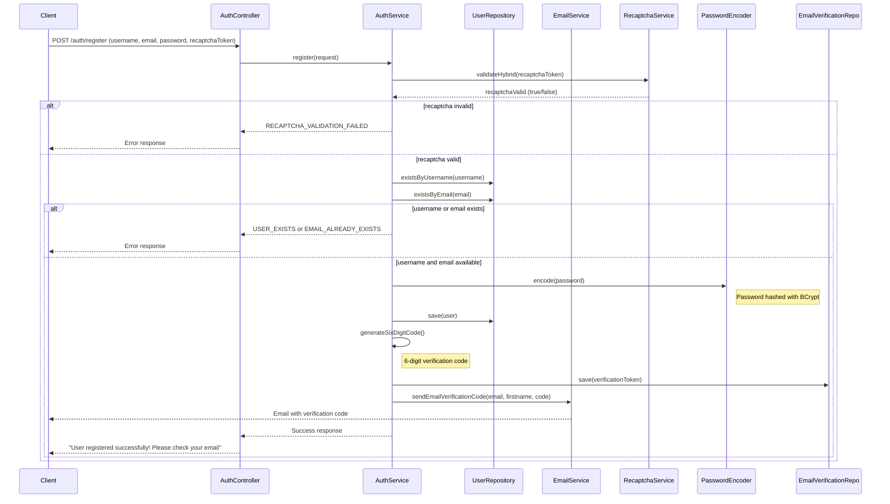
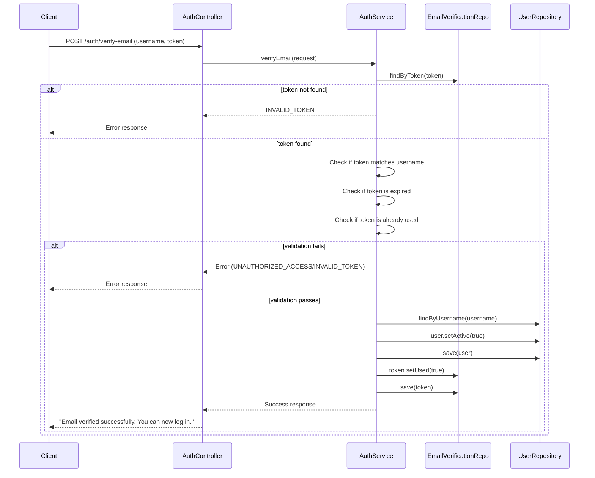
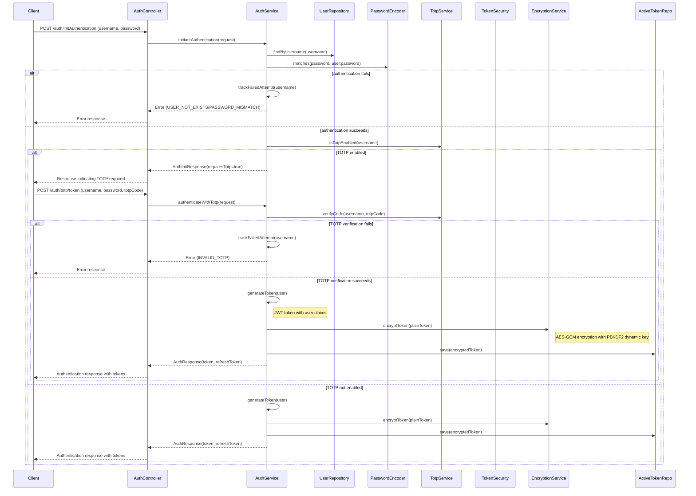
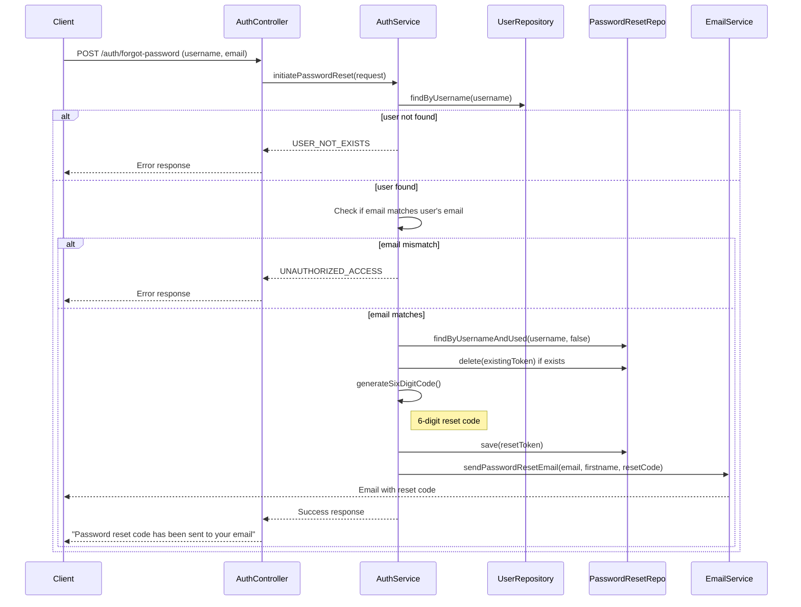
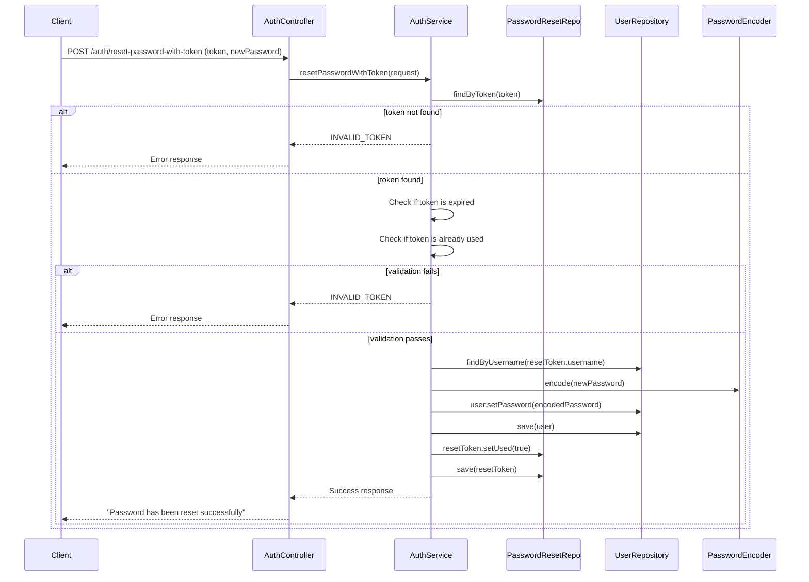
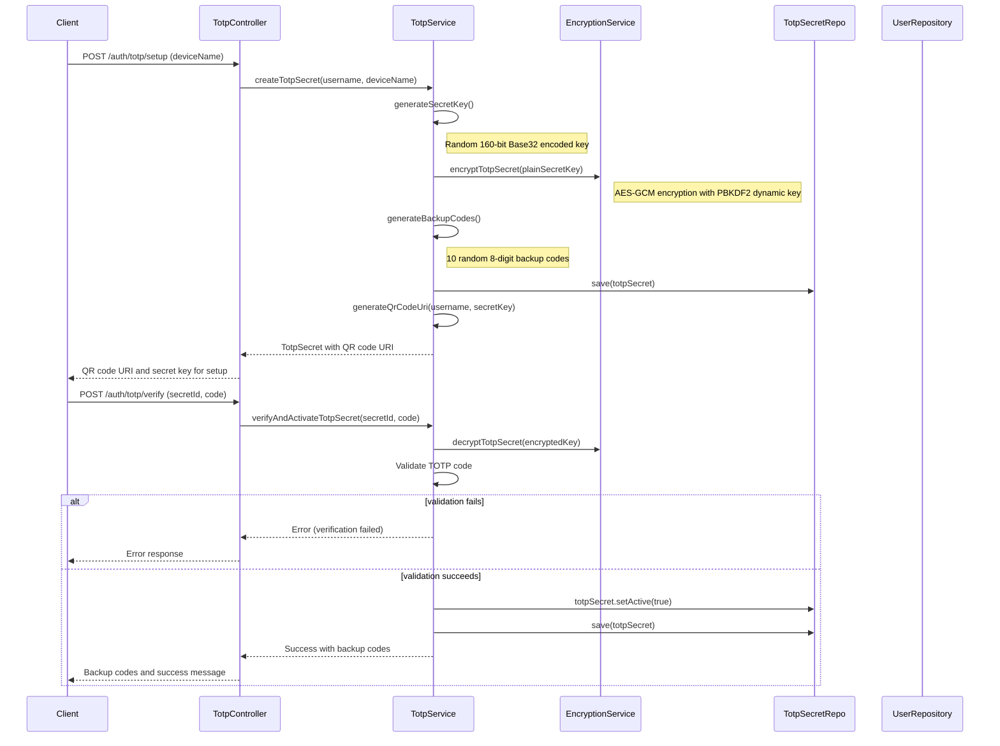
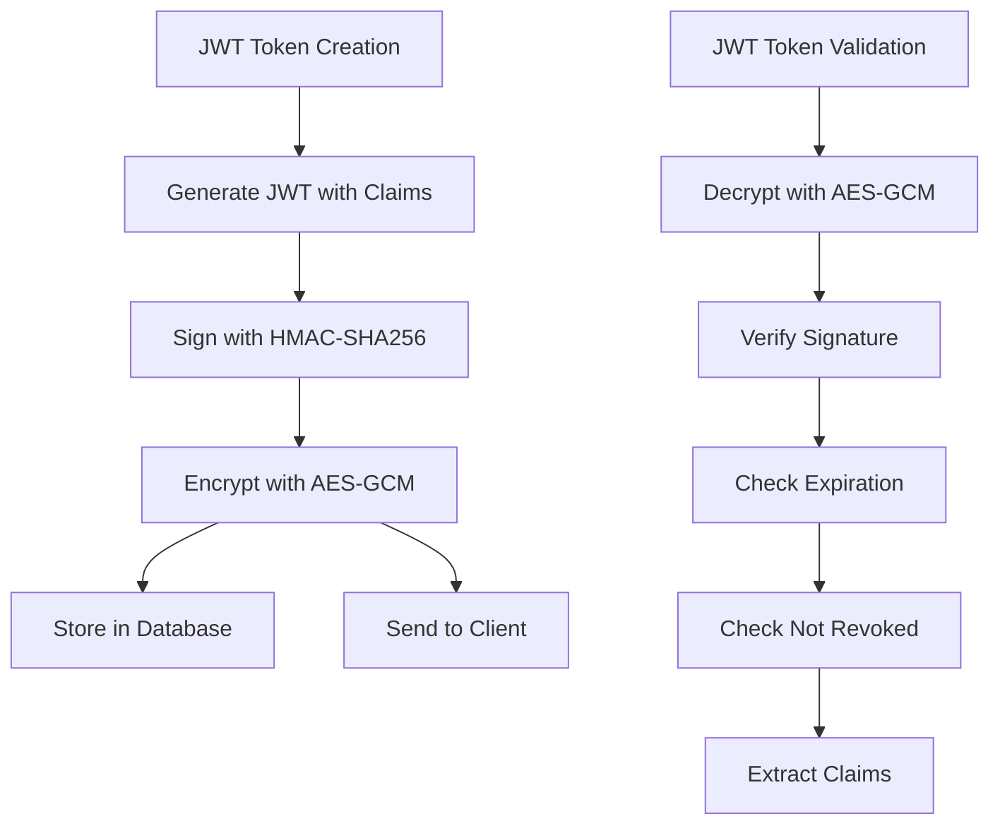
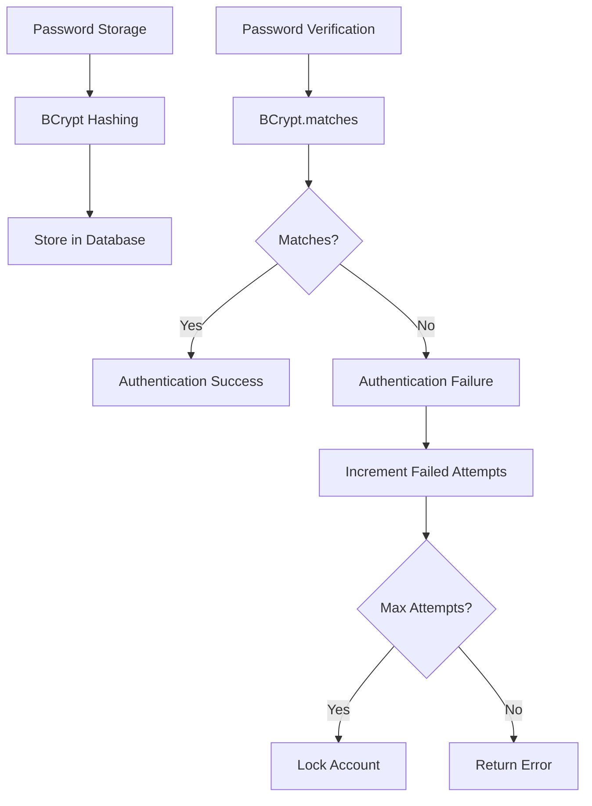
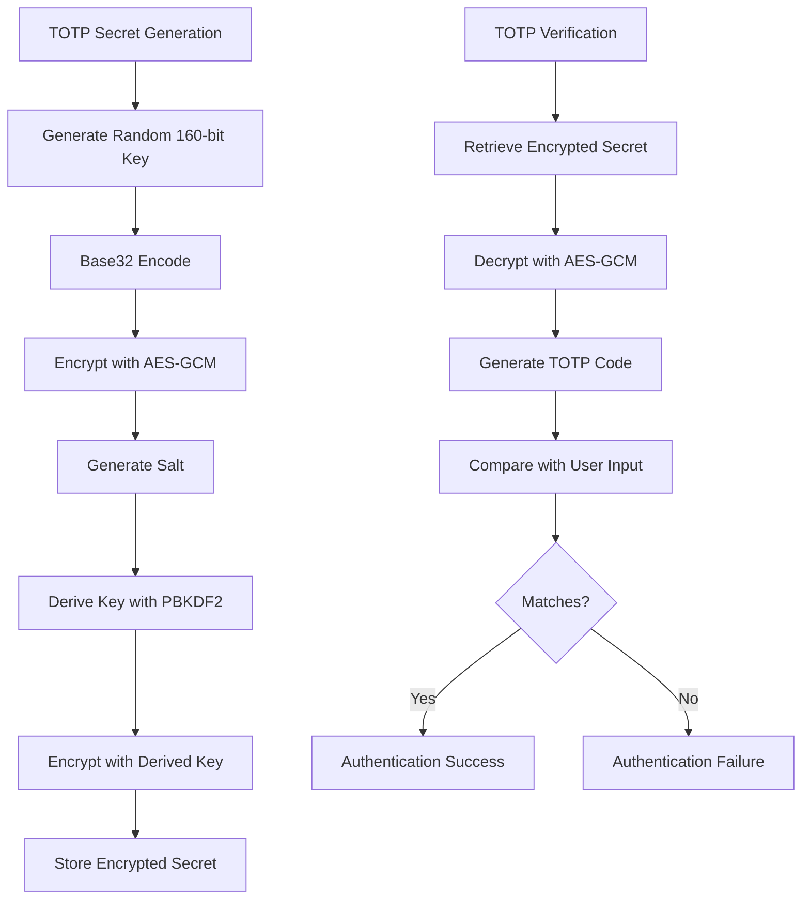

# Authentication System Workflows

This document visualizes the complex authentication workflows implemented in this project, highlighting the security features and encryption mechanisms used.

## Registration Workflow

## Email Verification Workflow

## Login Workflow with TOTP

## Forgot Password Workflow

## Reset Password Workflow

## TOTP Setup Workflow

## Security Features

### JWT Token Security

### Password Security

### TOTP Secret Encryption

## Key Security Components

1. **Dynamic Key Derivation (PBKDF2)**

   - Master key from environment variables
   - Salt generated per encryption operation
   - High iteration count (456,789 for TOTP, 123,456 for tokens)
   - SHA-256 hash function
   - 256-bit output key

2. **AES-GCM Encryption**

   - 256-bit encryption key
   - 96-bit initialization vector (IV)
   - 128-bit authentication tag
   - Authenticated encryption providing confidentiality and integrity

3. **JWT Token Security**

   - Signed with HMAC-HS512
   - Encrypted before storage and transmission with AES-GCM
   - Contains user claims and expiration
   - Refresh token mechanism with longer validity
   - Dynamic key generation based on user ID and expiration time
   - Token revocation through database tracking

4. **TOTP Implementation**

   - RFC 4226 compliant
   - 6-digit codes
   - 30-second time window
   - Backup codes for recovery
   - Encrypted secret storage

5. **Password Security**
   - BCrypt hashing
   - Account lockout after failed attempts
   - Password complexity requirements
   - Secure reset mechanism

This comprehensive security architecture provides multiple layers of protection for user authentication and sensitive data.

