# Project Workflows

This document outlines the various workflows and processes within the application, including authorization, page navigation, and feature-specific flows.

## General Application Workflow

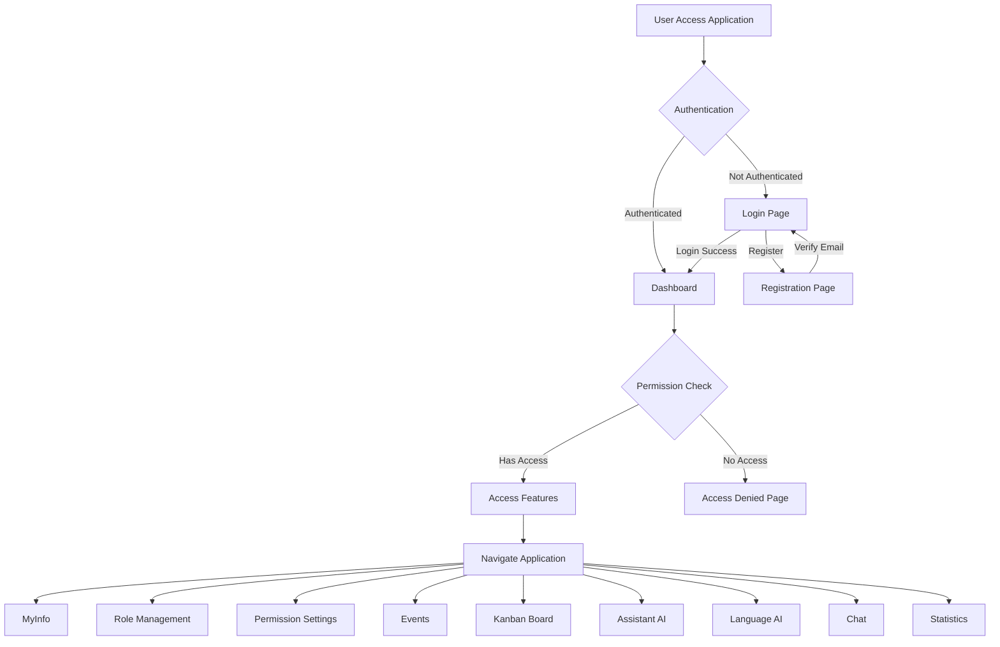

## Authorization and Permission Workflow

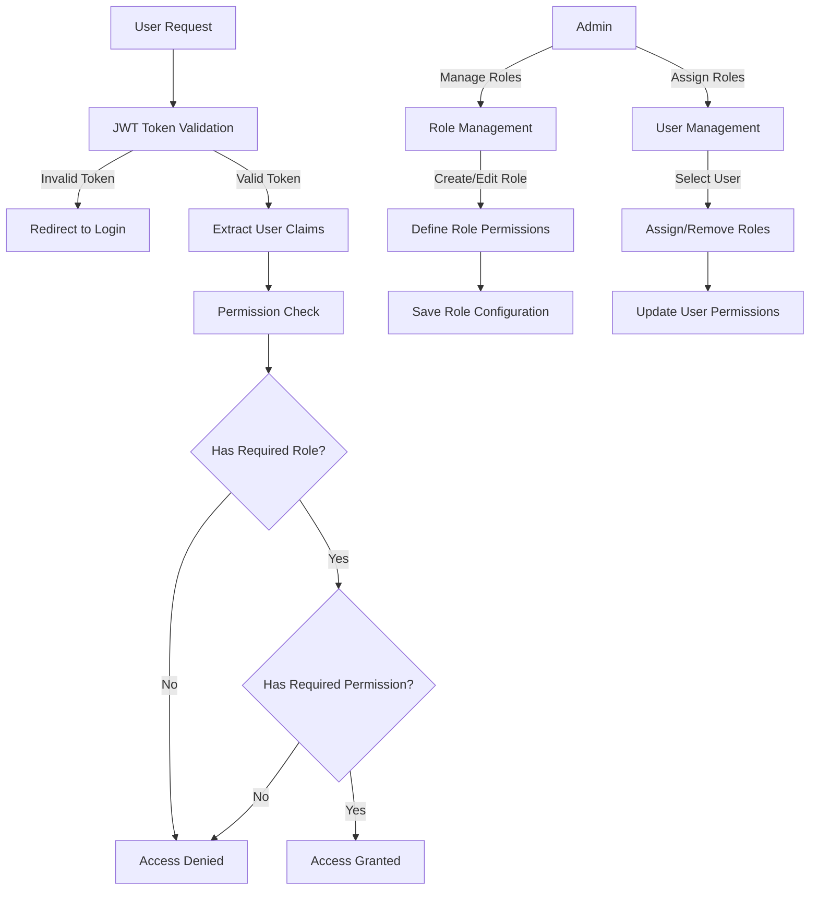

## MyInfo Workflow

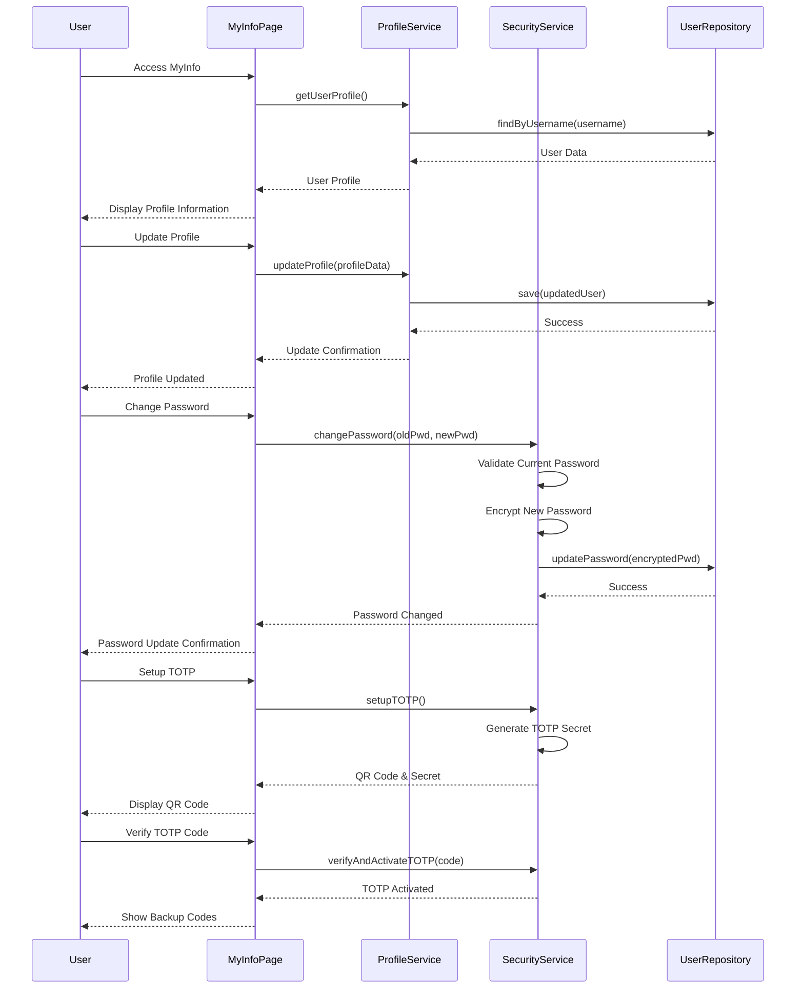

## Role Management Workflow

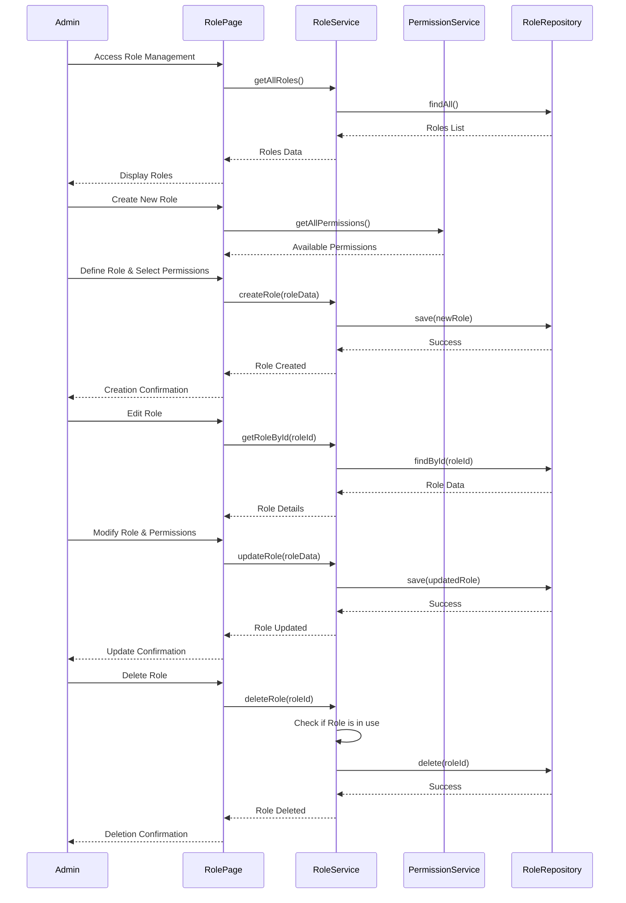

## Permission Management Workflow

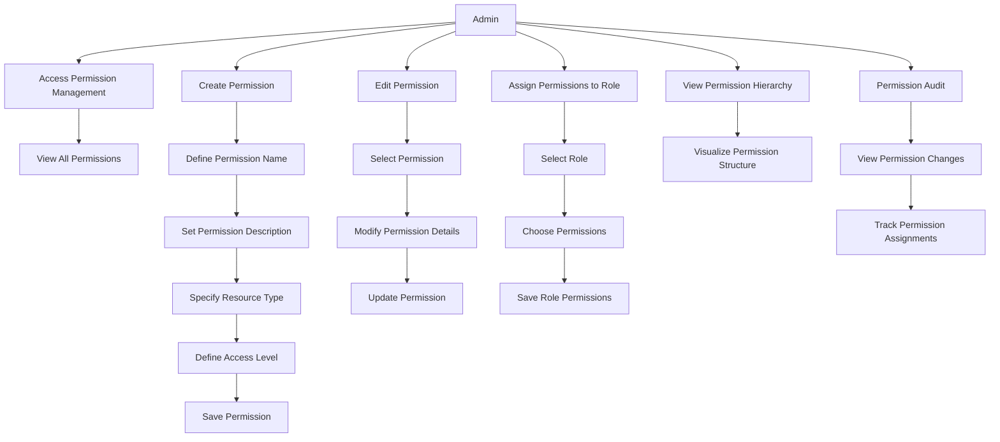

## Events Workflow

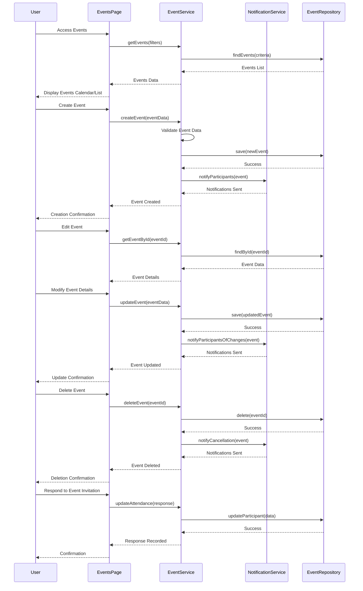

## Kanban Board Workflow

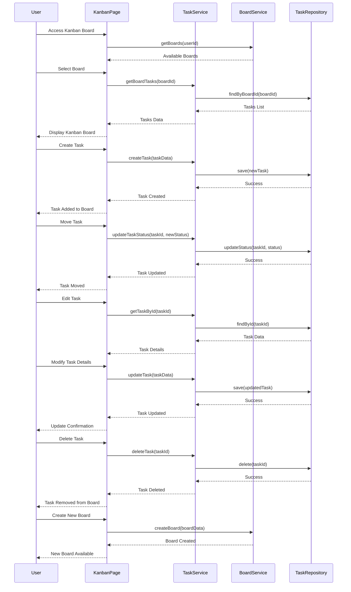

## Assistant AI Workflow

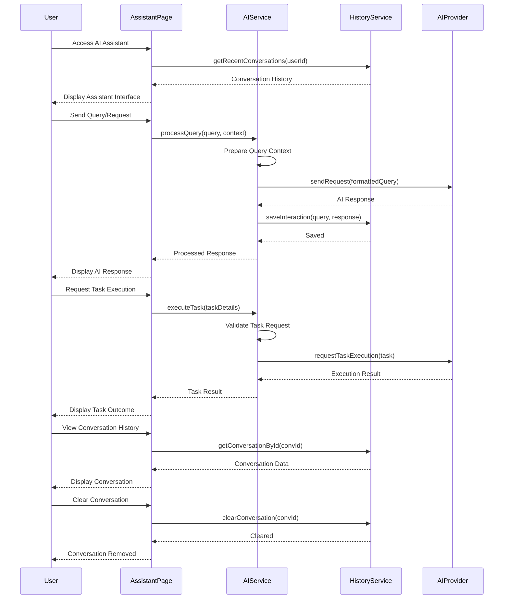

## Language AI Workflow

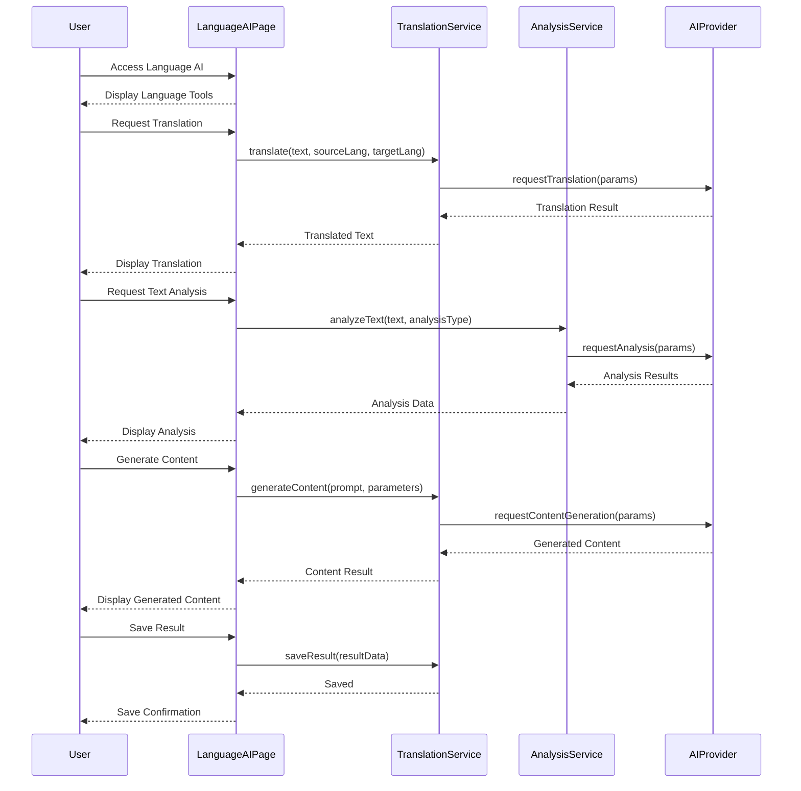

## Chat Workflow

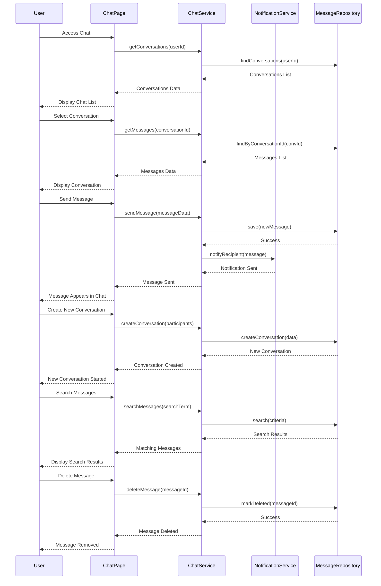

## Statistics Workflow

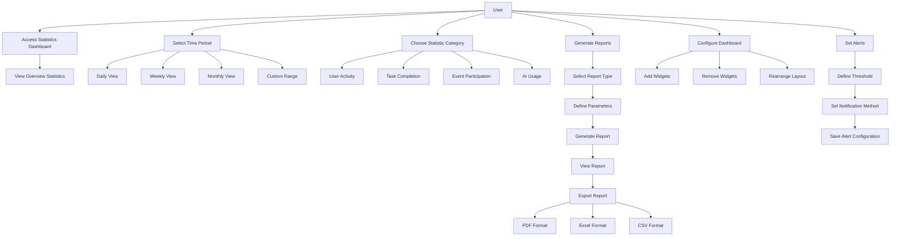

## Data Flow Between Components

```mermaid
flowchart TD
    A[User Interface] <--> B[Authentication Service]
    A <--> C[Authorization Service]

    A <--> D[Profile Management]
    D <--> E[User Repository]

    A <--> F[Role Management]
    F <--> G[Role Repository]
    F <--> H[Permission Repository]

    A <--> I[Event Management]
    I <--> J[Event Repository]
    I <--> K[Notification Service]

    A <--> L[Kanban Board]
    L <--> M[Task Repository]
    L <--> N[Board Repository]

    A <--> O[AI Services]
    O <--> P[External AI Providers]
    O <--> Q[Conversation History]

    A <--> R[Chat System]
    R <--> S[Message Repository]
    R <--> K

    A <--> T[Statistics Engine]
    T <--> U[Analytics Repository]
    T <--> V[Reporting Service]

    B <--> E
    C <--> G
    C <--> H

    W[Email Service] <--> B
    W <--> K

    X[File Storage] <--> D
    X <--> I
    X <--> L
    X <--> R
```

This document provides a comprehensive overview of the various workflows within the application, demonstrating the complex interactions between different components and the sophisticated features available to users.
