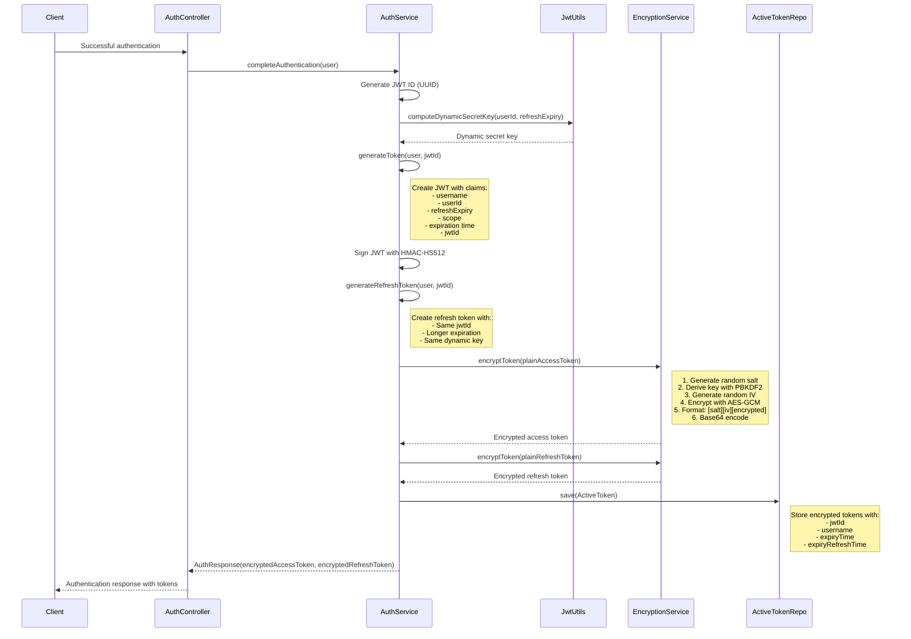
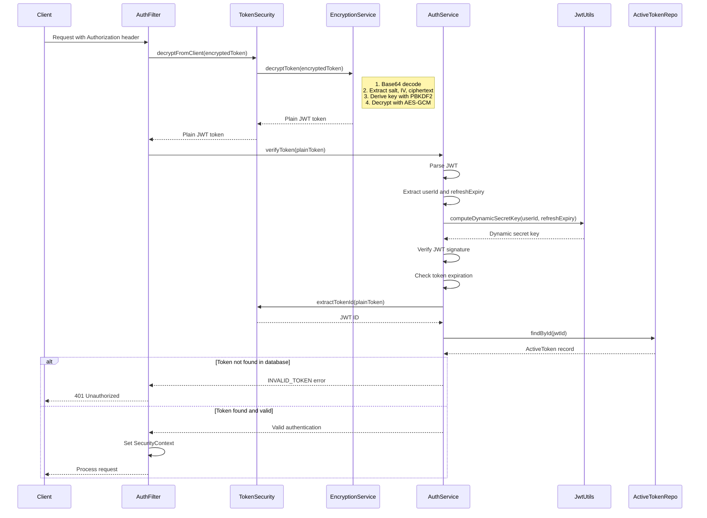
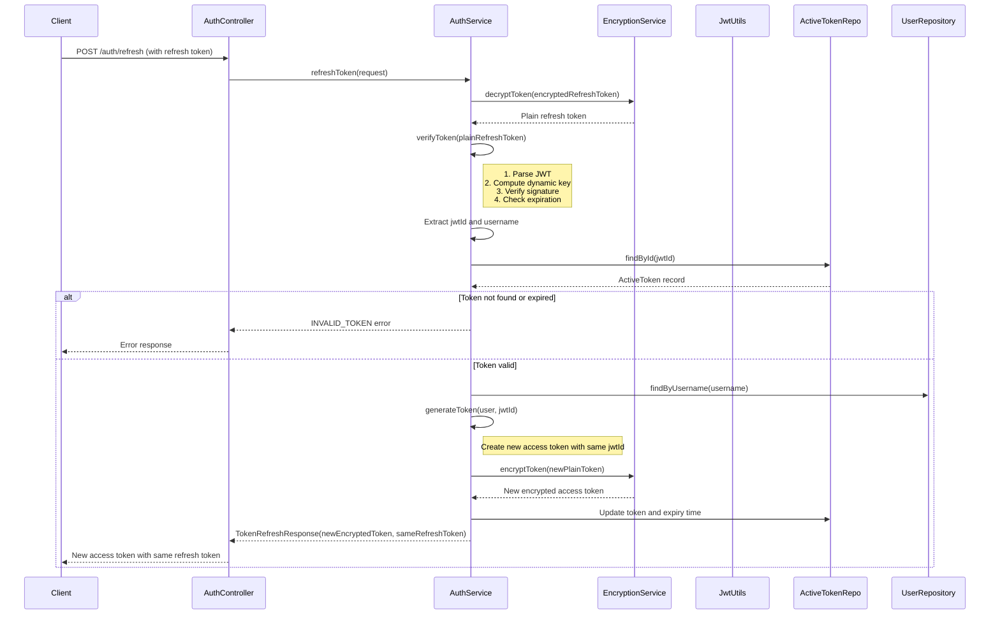

# Token Generation and Validation Workflows

This document details the processes of token creation, validation, and refresh in the authentication system.

## Token Generation Process

## Token Validation Process

## Token Refresh Process

## Technical Details

### Token Generation (generateToken)

1. **JWT ID Creation**: Each pair of access token and refresh token shares a unique JWT ID (UUID)
2. **Dynamic Key Computation**: Using userId and refresh token expiration time to create a dynamic key
3. **JWT Claims Creation**:
   - subject: username
   - userId: User ID
   - refreshExpiry: Refresh token expiration time
   - issuer: "tommem.com"
   - issueTime: Current time
   - expirationTime: Expiration time (60 minutes for access token)
   - jwtId: Unique token ID
   - scope: User permissions
4. **JWT Signing**: Using HMAC-HS512 algorithm with the dynamic key
5. **Token Encryption**: Using AES-GCM with a key derived from PBKDF2

### Token Encryption (encryptToken)

1. **Random IV Generation**: 96-bit initialization vector for AES-GCM
2. **Random Salt Generation**: 128-bit salt for PBKDF2
3. **Key Derivation with PBKDF2**: Using ENCRYPTION_KEY, salt, and 123,456 iterations
4. **AES-GCM Encryption**: Encrypting the token with a 256-bit key and IV
5. **Result Formatting**: [salt_length(1)][salt(16)][iv(12)][encrypted_data]
6. **Base64 Encoding**: For secure transmission over HTTP

### Token Decryption (decryptToken)

1. **Base64 Decoding**: Converting Base64 string to binary data
2. **Component Extraction**: Separating salt, IV, and encrypted data
3. **Key Reconstruction with PBKDF2**: Using the same salt embedded in the token
4. **AES-GCM Decryption**: Using the derived key and extracted IV
5. **Integrity Verification**: AES-GCM automatically verifies data integrity

### Token Validation (verifyToken)

1. **JWT Parsing**: Extracting claims from the token
2. **Dynamic Key Information Extraction**: userId and refreshExpiry
3. **Dynamic Key Recomputation**: Using the same algorithm as during token creation
4. **Signature Verification**: Using the dynamic key and HMAC-HS512 algorithm
5. **Expiration Check**: Ensuring the token has not expired
6. **Database Check**: Ensuring the token is still active and has not been revoked

### Token Refresh (refreshToken)

1. **Refresh Token Decryption**: Converting from encrypted form to plain JWT
2. **Refresh Token Validation**: Checking signature and expiration
3. **Database Check**: Ensuring the refresh token is still active
4. **New Access Token Creation**: Using the same JWT ID but with a new expiration
5. **New Access Token Encryption**: Using AES-GCM and PBKDF2
6. **Database Update**: Updating the token and expiration time
7. **Client Response**: Sending the new access token while keeping the same refresh token

## Benefits of this Architecture

1. **Multi-layer Security**:

   - JWT is signed to ensure integrity
   - Token is encrypted to protect content
   - Dynamic key for each user
   - Database validation to detect revoked tokens

2. **Efficiency**:

   - Refresh tokens reduce the number of logins
   - AES-GCM encryption is fast and secure
   - Dynamic keys are computed from existing information

3. **Revocation Capability**:

   - Tokens can be revoked by removing them from the database
   - Secure token refresh mechanism

4. **Protection Against Common Attacks**:
   - Protection against replay attacks through database checks
   - Protection against brute force attacks with dynamic keys and strong encryption
   - Protection against XSS attacks by encrypting tokens

